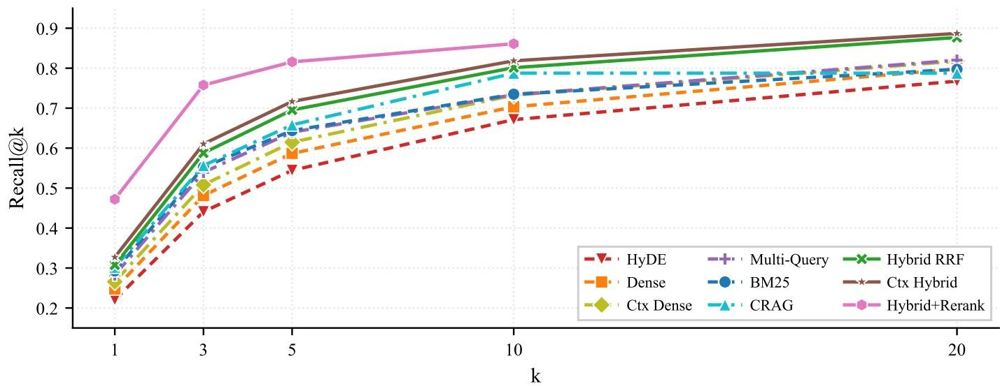
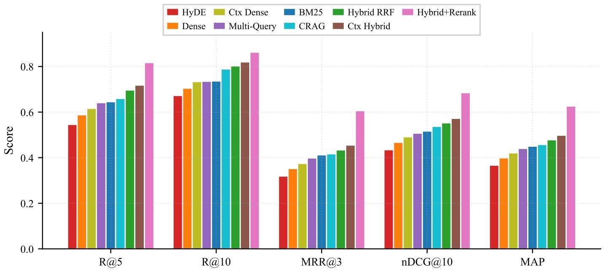
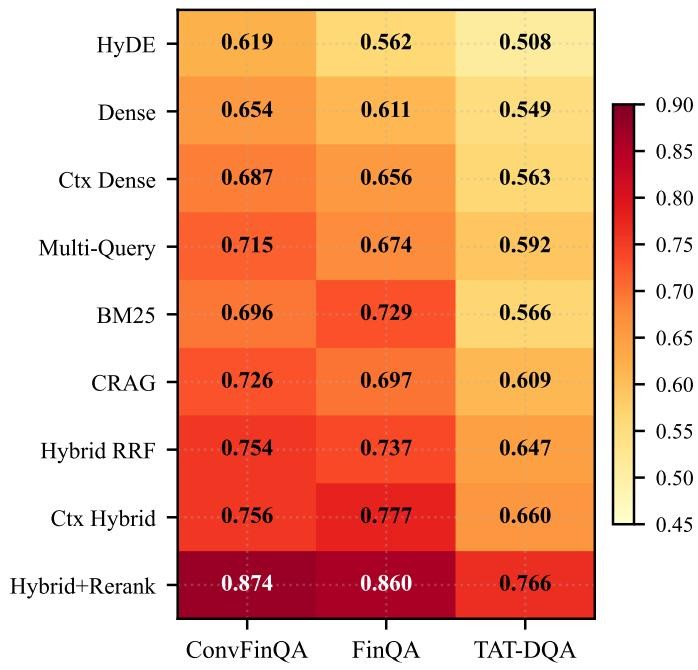
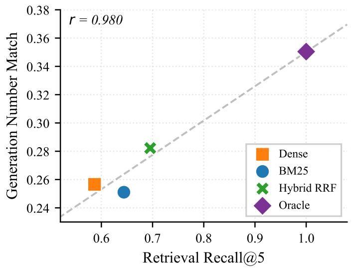
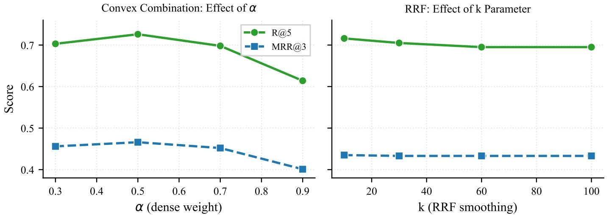
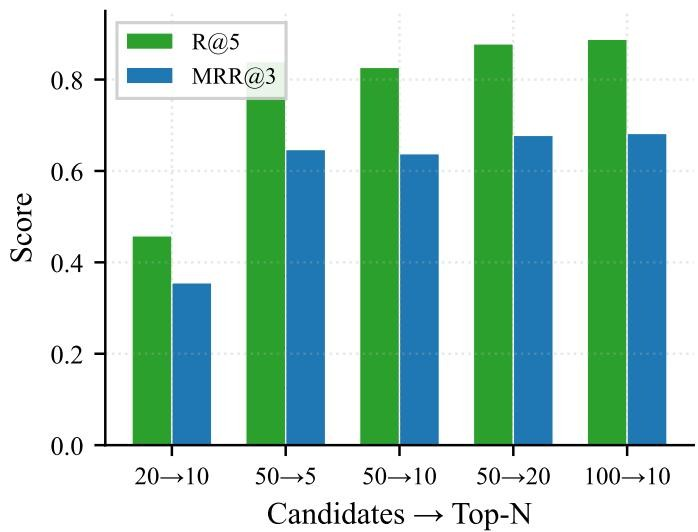

#

[page 1]

From BM25 to Corrective RAG: Benchmarking Retrieval Strategies for Text-and-Table Documents

Meftun Akarsu
Technische Hochschule Ingolstadt
mea5963@thi.de

Recep Kaan Karaman
Uludag University
kaankaraman@uludag.edu.tr

Christopher Mierbach
Radiate
christopher@radiate.com

Abstract—Retrieval-Augmented Generation (RAG) systems critically depend on retrieval quality, yet no systematic comparison of modern retrieval methods exists for heterogeneous documents containing both text and tabular data. We benchmark ten retrieval strategies spanning sparse, dense, hybrid fusion, cross-encoder reranking, query expansion, index augmentation, and adaptive retrieval on a challenging financial QA benchmark of 23,088 queries over 7,318 documents with mixed text-and-table content. We evaluate retrieval quality via Recall@k, MRR, and nDCG, and end-to-end generation quality via Number Match, with paired bootstrap significance testing. Our results show that (1) a two-stage pipeline combining hybrid retrieval with neural reranking achieves Recall@5 of 0.816 and MRR@3 of 0.605, outperforming all single-stage methods by a large margin; (2) BM25 outperforms state-of-the-art dense retrieval on financial documents, challenging the common assumption that semantic search universally dominates; and (3) query expansion methods (HyDE, multi-query) and adaptive retrieval provide limited benefit for precise numerical queries, while contextual retrieval yields consistent gains. We provide ablation studies on fusion methods and reranker depth, actionable cost-accuracy recommendations, and release our full benchmark code.

Index Terms—Retrieval-augmented generation, hybrid retrieval, cross-encoder reranking, financial question answering, text-and-table documents

# I. INTRODUCTION

The introduction of the Transformer architecture [1] and subsequently pretrained language models [2] fundamentally changed how machines process and reason over text. Yet even the most capable language models face a hard limit: their knowledge is frozen at training time. Retrieval-Augmented Generation (RAG) [3] addresses this by coupling a language model with a retrieval component that fetches relevant documents at inference time, grounding generation in external evidence.

The retrieval component is the most critical part of any RAG system. A language model cannot reason over documents it never receives. Despite this, retrieval receives far less systematic attention than generation. Dozens of retrieval methods exist, benchmarks are inconsistent, and there is little guidance on which method works best for a given document type.

The problem is harder for documents that mix text and tables. Financial filings, earnings reports, and regulatory documents are structured this way: text provides context while tables carry the precise figures. A question like “What was the year-over-year revenue growth?” requires locating both the right document and the right cell within it. Semantic retrieval methods miss exact numerical targets. Lexical methods miss paraphrased context. Neither alone is sufficient.

We study this through systematic benchmarking. Using a financial QA benchmark of 23,088 queries over 7,318 documents with mixed text-and-table content, we evaluate retrieval methods ranging from classical sparse retrieval to hybrid fusion pipelines and neural rerankers. The original benchmark paper tested only six retrieval methods with two metrics. Many approaches that matter in practice, including contextual retrieval, CRAG, and modern reranking models, have never been evaluated in this setting.

a) Contributions.: This paper makes four contributions:

1) A systematic benchmark of ten retrieval methods on a text-and-table financial QA corpus, the most comprehensive evaluation of its kind.
2) Multi-dimensional evaluation covering retrieval metrics (Recall@k, MRR, nDCG, MAP) and generation metrics (Number Match) with paired bootstrap significance testing.
3) Ablation studies isolating the effects of fusion strategies and reranker candidate depth.
4) Actionable recommendations for practitioners building RAG systems over heterogeneous documents, grounded in empirical cost-accuracy analysis.

# II. RELATED WORK

a) RAG Retrieval Methods.: Classical sparse retrievers such as BM25 remain competitive baselines, particularly in zero-shot out-of-domain settings [4], due to their lexical precision. Learned sparse models like SPLADE [5] extend this by learning neural term expansion weights, and recent work shows that decoder-only LLM backbones further improve sparse retrieval quality [6]. On the dense side, dual-encoder architectures pioneered by DPR [7] encode queries and passages into a shared embedding space. Subsequent models including E5 [8], E5-Mistral [9], and BGE-M3 [10] have advanced the state of the art on MTEB [11] and MMTEB [12] through contrastive pretraining and instruction-tuned embedding generation. Late-interaction models such as ColBERTv2 [13] and Jina-ColBERT-v2 [14] retain per-token representations for fine-grained matching while still allowing document precomputation. Hybrid retrieval combines sparse and dense signals via Reciprocal Rank Fusion [15] or convex score combination, consistently improving recall by 15–30%

[page 2]

over single-method pipelines [16]. Two-stage reranking with cross-encoder models further refines ranked lists, with recent benchmarks reporting up to 28% nDCG@10 improvement at modest latency cost [17].

b) Query-Side Retrieval Strategies.: Several methods improve retrieval by modifying the query rather than the index. HyDE [18] generates a hypothetical answer document at query time and retrieves using its embedding rather than the original query. RAG-Fusion [19] issues multiple LLM-rewritten query variants and merges results via RRF. Both approaches aim to close the gap between short user queries and longer document passages, though their effectiveness depends heavily on whether the LLM can generate plausible pseudo-documents for the target domain.

c) Index-Side and Structural Retrieval Strategies.: An alternative is to enrich document representations at indexing time. Contextual Retrieval [20] prepends LLM-generated summaries to each chunk before indexing, while HyPE [21] precomputes hypothetical questions per chunk, transforming retrieval into question-to-question matching and improving context precision by up to 42 percentage points without added query-time cost. Late Chunking [22] preserves cross-chunk context by applying long-context embeddings before splitting. At a higher level of abstraction, RAPTOR [23] builds recursive tree-structured summaries for multi-granularity retrieval, and GraphRAG [24] constructs entity-relation graphs for query-focused summarization. On the adaptive front, Self-RAG [25] trains models to decide whether retrieval is needed at all, while CRAG [26] triggers corrective web searches when retrieved document quality is low.

d) Text-and-Table Question Answering.: Answering questions over documents that contain both text and tables requires locating evidence across heterogeneous content types and often performing numerical reasoning. Chen et al. [27] introduced HybridQA, the first large-scale dataset requiring multi-hop reasoning over linked Wikipedia tables and passages. Chen et al. [28] extended this to an open-domain setting in OTT-QA, retrieving from over 400K tables and 5M passages. In the financial domain, FinQA [29] provides expert-annotated question-program pairs over earnings reports, TAT-QA [30] focuses on numerical operations over hybrid tabular-textual contexts, and ConvFinQA [31] extends FinQA to multi-turn reasoning. A recent survey of table QA in the LLM era [32] finds that retrieval of the correct heterogeneous context remains the primary bottleneck, even as generation quality improves. Our work directly targets this bottleneck.

e) RAG Benchmarks and Evaluation.: BEIR [4] established zero-shot retrieval evaluation across 18 diverse datasets and remains the standard reference point for retrieval method comparison. KILT [33] unified five knowledge-intensive task types over a shared Wikipedia snapshot. More recent RAG-specific benchmarks include RGB [34], which tests robustness to noise and counterfactual context; CRAG [35], which spans five domains with temporal dynamics; and RAGBench [36], which provides 100K examples with the TRACe evaluation framework. RAGAS [37] and ARES [38] introduced

automated evaluation without gold labels, enabling scalable faithfulness and relevance measurement. Li et al. [16] provide a systematic study of RAG design choices at COLING 2025. None of these benchmarks focus on retrieval method comparison over documents with mixed text-and-table content. The benchmark we use [39] unifies FinQA, ConvFinQA, and TAT-DQA into 23,088 queries over 7,318 financial documents, and where the original paper tested six methods with two metrics, we evaluate ten methods with a comprehensive set of retrieval and generation metrics.

# III. METHODOLOGY

# A. Dataset

We evaluate on $T^{2}$ -RAGBench [39], a financial QA benchmark accepted at EACL 2026. The dataset contains 23,088 question-context-answer triples drawn from three source datasets: FinQA [29] (8,281 pairs), ConvFinQA [31] (3,458 pairs), and TAT-DQA [30] (11,349 pairs), covering 7,318 unique financial documents averaging approximately 920 tokens each. Each document contains a mix of text and markdown-formatted tables extracted from real SEC filings and annual reports.

The benchmark's core design decision distinguishes it from prior financial QA datasets. FinQA, ConvFinQA, and TAT-DQA were originally constructed in an oracle-context setting, where the relevant document is provided directly to the model. Questions in that setting are context-dependent: the same question may have different correct answers depending on which document is supplied, making them unsuitable for evaluating retrieval. $\mathrm{T}^2$ -RAGBench addresses this by reformulating all questions using Llama 3.3-70B to incorporate identifying information such as company name, sector, and report year, producing questions with exactly one correct answer regardless of context. Human experts validated a random sample of 100 questions per subset: only $7.3\%$ of original questions were context-independent, compared to $83.9\%$ after reformulation, with an inter-annotator agreement of Cohen's $\kappa = 0.58$ .

All answers are numerical. The original paper evaluated six retrieval methods using Number Match and MRR@3, finding that the best method (Hybrid BM25) reached only 41% Number Match against an oracle-context ceiling of 72–79%, a gap of more than 30 percentage points. We extend this evaluation to ten methods with a broader set of retrieval and generation metrics to systematically characterize where this gap comes from.

# B. Retrieval Methods

a) BM25.: We use Okapi BM25 [40] with $k_{1} = 1.2$ and $b = 0.75$ via the rank\_bm25 library. BM25 scores documents by weighted term-frequency overlap with sub-linear saturation and document-length normalization. The parameter $k_{1}$ controls term-frequency saturation and $b$ controls the degree of length normalization; the values $k_{1} = 1.2$ and $b = 0.75$ are the canonical defaults from the original Okapi system. BM25 provides strong lexical matching for domain-specific terminology such as company names, financial metrics, and

[page 3]

fiscal period identifiers that appear verbatim in both queries and documents, making it a competitive baseline on this corpus.

b) Dense Retrieval.: We encode all queries and documents using OpenAI text-embedding-3-large (3,072 dimensions) via Azure AI Foundry. Document embeddings are indexed with FAISS IndexFlatIP for exact inner-product search, ensuring exhaustive nearest-neighbor retrieval with no approximation error. At query time the top-k results are returned by cosine similarity. This configuration isolates the effect of the embedding model from any index approximation artifacts.
c) Hybrid Retrieval (RRF).: Hybrid retrieval fuses the ranked lists of BM25 and dense retrieval via Reciprocal Rank Fusion [15]. For each document d at rank $r_{i}(d)$ in retriever i, the fused score is:

$$
\mathrm{RRF} (d) = \sum_ {i} \frac {1}{k + r _ {i} (d)} \tag {1}
$$

with smoothing constant k = 60, the value used in the original paper. We retrieve full ranked lists from both methods, compute RRF scores over their union, and return the top-k by fused score. RRF is unsupervised, requires no score normalization, and consistently outperforms individual retrievers and alternative fusion strategies such as Condorcet and CombMNZ [15].

d) Hybrid + Cohere Rerank.: We apply a two-stage pipeline: hybrid RRF retrieves 50 candidate documents, which are then reranked by Cohere Rerank v4.0 Pro [41], returning the top 10. Unlike bi-encoder models that encode queries and documents independently, cross-encoders process the query and each candidate jointly, producing query-aware relevance scores that capture semantic relationships pointwise retrieval cannot [42]. Cohere Rerank v4.0 Pro was benchmarked specifically on finance-domain retrieval tasks at release, making it well suited to this corpus. This configuration measures whether the added cost of a reranking stage produces meaningful gains on text-and-table documents.
e) HyDE.: HyDE [18] addresses the asymmetry between short queries and long documents by generating a hypothetical answer passage at query time and retrieving with its embedding rather than the original query embedding. The generated document may contain hallucinations, but the dense encoder grounds it to the actual corpus by mapping it into the same embedding space as real documents [18]. We prompt GPT-4.1-mini at temperature 0 to generate a plausible answer for each query, embed it with text-embedding-3-large, and retrieve against the corpus index. HyDE was originally shown to outperform unsupervised dense retrievers on web search, QA, and fact verification tasks [18]; its behaviour on numerical financial QA is one of the questions this paper investigates.
f) Multi-Query Retrieval.: Multi-query retrieval issues several reformulations of each query to increase recall across alternative phrasings [19]. We prompt GPT-4.1-mini at temperature 0 to generate three semantically diverse variants per

query, retrieve top-k results for each independently using dense retrieval, and merge the four ranked lists (original plus three variants) via RRF (k = 60). This approach recovers relevant documents that a single query phrasing may miss, at the cost of additional LLM inference per query.

g) Contextual Retrieval.: Contextual Retrieval [20] enriches each document at indexing time by prepending an LLM-generated context summary that captures the document's key entities, reporting period, and financial metrics. We apply this to both the dense and hybrid pipelines, yielding Contextual Dense and Contextual Hybrid variants. All context summaries are generated with GPT-4.1-mini at temperature 0 using the whole-document prompt described in Appendix B.

h) CRAG (Corrective RAG).: CRAG [26] evaluates each retrieved document's relevance and triggers query rewriting when confidence is low. We implement a two-stage pipeline: first, we retrieve the top-5 documents using hybrid RRF; then, GPT-4.1-mini classifies each document as RELEVANT, AMBIGUOUS, or IRRELEVANT. If all documents are classified as AMBIGUOUS or IRRELEVANT, the query is rewritten and retrieval is repeated. Final results are drawn from the better of the two retrieval rounds. Prompts are documented in Appendix B.

# C. Evaluation Metrics

a) Retrieval Metrics.: We report Recall@k ( $k \in \{1, 3, 5, 10, 20\}$ ), Mean Reciprocal Rank (MRR@k), normalized Discounted Cumulative Gain (nDCG@k), and Mean Average Precision (MAP).
b) Generation Metrics.: Our primary generation metric is Number Match (NM) with relative tolerance $\epsilon = 10^{-2}$ , following the benchmark's evaluation protocol [39]. We additionally report token-level F1, ROUGE-L, and BERTScore.
c) Statistical Testing.: All pairwise method comparisons use paired bootstrap tests (B = 10,000) with Bonferroni correction, reporting significance at p < 0.05.

# D. Experimental Setup

a) Infrastructure.: BM25 scoring and FAISS index construction run locally on an Apple Silicon Mac. Embedding generation, query expansion, and neural reranking are served through Azure AI Foundry endpoints using text-embedding-3-large, GPT-4.1-mini, and Cohere Rerank v4.0 Pro respectively.
b) Document Representation.: In our main experiments each of the 7,318 documents is indexed as a single unit without chunking. Documents average 920 tokens, well within the context window of all models used. This isolates the effect of the retrieval method from chunking and segmentation decisions. Chunking ablations are reported in Section IV-C.
c) Reproducibility.: We fix random seed 42 for all stochastic components. LLM generation uses temperature 0 throughout. All configurations, prompts, and evaluation scripts are versioned in our public code repository [43]. The dataset is used without modification with the standard train/test split from the original authors [39].

#

[page 4]

IV. RESULTS

# A. Main Retrieval Results

Table I presents the retrieval performance of all evaluated methods on the full T²-RAGBench test set (23,088 queries over 7,318 documents).

The two-stage pipeline of hybrid retrieval followed by neural reranking (Hybrid + Cohere Rerank) dominates all single-stage methods by a wide margin: Recall@5 of 0.816 compared to 0.695 for Hybrid RRF alone (+17.4%), 0.644 for BM25 (+26.7%), and 0.587 for dense retrieval (+39.0%). The reranker's cross-encoder architecture provides fine-grained query-document relevance scoring that dramatically improves ranking precision, with MRR@3 jumping from 0.433 to 0.605 (+39.7% relative).

Among first-stage retrievers, BM25 outperforms dense retrieval (text-embedding-3-large) on all metrics except Recall@20, where they are nearly tied (0.797 vs. 0.798). This suggests that lexical matching is particularly effective for financial documents, where precise terminology (company names, metric labels, fiscal periods) provides strong retrieval signals that semantic embeddings may dilute.

HyDE underperforms even vanilla dense retrieval across all metrics (Recall@5: 0.544 vs. 0.587), confirming the finding of Strich et al. [39]. Financial questions require precise numerical reasoning; LLM-generated hypothetical documents introduce noise by hallucinating plausible but incorrect financial figures, pulling the embedding away from the true relevant context.

Contextual Retrieval [20] improves both dense (+2.8pp Recall@5) and hybrid (+2.2pp) retrieval by prepending LLM-generated context summaries to each document at indexing time. This consistent improvement confirms that financial documents benefit from explicit metadata enrichment (company name, reporting period, key metrics).

CRAG achieves Recall@5 of 0.658, improving over BM25 (+1.4pp) through adaptive query correction. Notably, 63% of queries (14,569/23,088) triggered the correction pathway, indicating that initial retrieval frequently returns suboptimal results on this benchmark. However, CRAG falls short of simple hybrid fusion (0.695), suggesting that query rewriting alone cannot match the complementary strengths of sparse and dense retrieval.

Multi-query retrieval with RAG-Fusion [19] provides negligible improvement over BM25 (Recall@5: 0.640 vs. 0.644). Financial queries are already specific and well-formed; generating alternative phrasings does not meaningfully increase recall, confirming the production-scale finding of diminishing returns for multi-query approaches on structured domain queries.

a) Per-Subset Analysis.: Table II breaks down performance by dataset subset.

TAT-DQA emerges as the most challenging subset across all methods (Recall@5: 0.647 for the best method vs. 0.755 for ConvFinQA), likely due to its emphasis on diverse numerical operations over complex table layouts. Hybrid fusion provides the largest absolute improvement on TAT-DQA (+8.1 percent-

age points Recall@5 over BM25), suggesting that combining lexical and semantic signals is especially valuable for table-heavy questions.

b) Recall@k Curves.: Figure 1 shows the recall-depth trade-off across all methods. Hybrid RRF maintains a consistent advantage at every value of k, with the gap widening at lower k values where ranking precision matters most.

Figure 2 provides a side-by-side comparison across all primary metrics. BM25 outperforms dense retrieval on every metric, while hybrid RRF achieves the best scores across the board.

c) Subset-Level Patterns.: Figure 3 visualizes the Recall@5 performance across methods and dataset subsets. ConvFinQA is the easiest subset for all methods, while TAT-DQA presents the greatest challenge. The performance gap between methods is most pronounced on TAT-DQA, where hybrid fusion yields the largest relative gain.

All pairwise differences between BM25, dense, and hybrid RRF are statistically significant (p < 0.001, paired bootstrap test with B = 10,000, Bonferroni-corrected).

# B. End-to-End Generation Results

To assess whether improved retrieval translates to improved answer quality, we run end-to-end generation with GPT-4.1-mini and GPT-5.4 using the top-5 retrieved documents as context. Table III reports Number Match (NM) with scale-invariant evaluation.

Better retrieval consistently leads to better answer quality (BM25: $0.251 \rightarrow Hybrid: 0.282 \rightarrow Oracle: 0.350$ with GPT-4.1-mini), confirming the critical role of retrieval in RAG pipelines. GPT-5.4 improves over GPT-4.1-mini by 6–7 percentage points on identical retrieval outputs, demonstrating that both retrieval quality and LLM capability contribute independently to end-to-end performance.

# C. Ablation Studies

a) Fusion method.: We compare Reciprocal Rank Fusion (RRF) with Convex Combination (CC) at varying parameters (Figure 5). CC with $\alpha = 0.5$ (equal weighting of BM25 and dense scores) achieves Recall@5 of 0.726, outperforming RRF (k = 60) at 0.695. Among RRF variants, lower k values emphasize top-ranked documents more aggressively; k = 10 achieves the best RRF performance (0.716). Both findings suggest that balanced fusion of sparse and dense signals is optimal for this benchmark.

b) Reranker depth.: We vary the number of candidates passed to the cross-encoder reranker (Figure 6). With only 20 candidates, reranking is ineffective (Recall@5: 0.458), as relevant documents are often not in the candidate pool. Performance increases sharply at 50 candidates (0.826) and continues to improve at 100 (0.888). Increasing the number of returned results from 10 to 20 provides marginal gains (0.826 → 0.878), suggesting that the top-10 already captures most relevant documents after reranking.

<table><tr><td>Category</td><td>Method</td><td>R@1</td><td>R@3</td><td>R@5</td><td>R@10</td><td>MRR@3</td><td>nDCG@10</td><td>MAP</td></tr><tr><td rowspan="2">Single-method</td><td>BM25 (sparse)</td><td>0.293</td><td>0.552</td><td>0.644</td><td>0.735</td><td>0.411</td><td>0.515</td><td>0.449</td></tr><tr><td>Dense (text-embed-3-large)</td><td>0.248</td><td>0.481</td><td>0.587</td><td>0.703</td><td>0.351</td><td>0.466</td><td>0.398</td></tr><tr><td rowspan="2">Query expansion</td><td>HyDE (gpt-4.1-mini)</td><td>0.221</td><td>0.441</td><td>0.544</td><td>0.671</td><td>0.318</td><td>0.433</td><td>0.365</td></tr><tr><td>Multi-Query + RRF</td><td>0.283</td><td>0.539</td><td>0.640</td><td>0.734</td><td>0.397</td><td>0.506</td><td>0.439</td></tr><tr><td rowspan="2">Index augment.</td><td>Contextual Dense</td><td>0.266</td><td>0.508</td><td>0.615</td><td>0.732</td><td>0.373</td><td>0.490</td><td>0.420</td></tr><tr><td>Contextual Hybrid</td><td>0.327</td><td>0.610</td><td>0.717</td><td>0.818</td><td>0.454</td><td>0.571</td><td>0.497</td></tr><tr><td>Adaptive</td><td>CRAG (gpt-4.1-mini)</td><td>0.302</td><td>0.556</td><td>0.658</td><td>0.788</td><td>0.415</td><td>0.536</td><td>0.456</td></tr><tr><td rowspan="2">Fusion</td><td>Hybrid (BM25+Dense, RRF)</td><td>0.308</td><td>0.588</td><td>0.695</td><td>0.801</td><td>0.433</td><td>0.551</td><td>0.477</td></tr><tr><td>Hybrid + Cohere Rerank</td><td>0.472</td><td>0.758</td><td>0.816</td><td>0.861</td><td>0.605</td><td>0.683</td><td>0.625</td></tr></table>

TABLE I
MAIN RETRIEVAL RESULTS ON T²-RAGBENCH (23,088 QUERIES, 7,318 DOCUMENTS). METHODS ARE GROUPED BY CATEGORY. HYBRID RRF WITH CROSS-ENCODER RERANKING DOMINATES ALL METHODS. CONTEXTUAL HYBRID OUTPERFORMS VANILLA HYBRID RRF. CRAG PROVIDES MODERATE GAINS THROUGH ADAPTIVE QUERY CORRECTION. HYDE UNDERPERFORMS VANILLA DENSE RETRIEVAL. ALL PAIRWISE DIFFERENCES BETWEEN ADJACENT METHODS ARE STATISTICALLY SIGNIFICANT (p < 0.001). BEST RESULTS IN BOLD.



<details>
<summary>line</summary>

| k | HyDE | Multi-Query | Hybrid RRF | Dense | BM25 | Ctx Hybrid | Ctx Dense | CRAG | Hybrid+Rerank |
|---|---|---|---|---|---|---|---|---|---|
| 1 | ~0.23 | ~0.28 | ~0.30 | ~0.25 | ~0.27 | ~0.32 | ~0.26 | ~0.28 | ~0.47 |
| 3 | ~0.45 | ~0.53 | ~0.59 | ~0.48 | ~0.54 | ~0.61 | ~0.51 | ~0.56 | ~0.76 |
| 5 | ~0.55 | ~0.64 | ~0.70 | ~0.59 | ~0.64 | ~0.72 | ~0.62 | ~0.66 | ~0.82 |
| 10 | ~0.68 | ~0.74 | ~0.80 | ~0.70 | ~0.74 | ~0.82 | ~0.71 | ~0.79 | ~0.86 |
| 20 | ~0.77 | ~0.82 | ~0.88 | ~0.79 | ~0.80 | ~0.89 | ~0.81 | ~0.80 | — |
</details>

Fig. 1. Recall@k curves for BM25, dense (text-embedding-3-large), and hybrid RRF retrieval. Hybrid fusion consistently outperforms both single-method baselines, with the largest gains at small k.

<table><tr><td>Subset</td><td>Method</td><td>R@5</td><td>R@10</td><td>MRR@3</td></tr><tr><td rowspan="3">FinQA</td><td>BM25</td><td>0.729</td><td>0.834</td><td>0.389</td></tr><tr><td>Dense</td><td>0.611</td><td>0.748</td><td>0.308</td></tr><tr><td>Hybrid</td><td>0.737</td><td>0.856</td><td>0.389</td></tr><tr><td rowspan="3">ConvFinQA</td><td>BM25</td><td>0.696</td><td>0.781</td><td>0.500</td></tr><tr><td>Dense</td><td>0.654</td><td>0.781</td><td>0.410</td></tr><tr><td>Hybrid</td><td>0.754</td><td>0.850</td><td>0.519</td></tr><tr><td rowspan="3">TAT-DQA</td><td>BM25</td><td>0.566</td><td>0.649</td><td>0.400</td></tr><tr><td>Dense</td><td>0.549</td><td>0.647</td><td>0.364</td></tr><tr><td>Hybrid</td><td>0.647</td><td>0.746</td><td>0.438</td></tr></table>

TABLE II
PER-SUBSET RETRIEVAL RESULTS. TAT-DQA IS THE MOST CHALLENGING SUBSET ACROSS ALL METHODS. HYBRID RRF PROVIDES THE LARGEST IMPROVEMENT ON TAT-DQA (+8.1PP RECALL@5 OVER BM25).

<table><tr><td>Retrieval</td><td>GPT-4.1-mini</td><td>GPT-5.4</td></tr><tr><td>BM25</td><td>0.251</td><td>†</td></tr><tr><td>Dense</td><td>0.257</td><td>†</td></tr><tr><td>Hybrid RRF</td><td>0.282</td><td>0.346</td></tr><tr><td>Oracle</td><td>0.350</td><td>0.403</td></tr></table>

TABLE III
END-TO-END NUMBER MATCH (NM) BY RETRIEVAL METHOD AND LLM.
BETTER RETRIEVAL CONSISTENTLY LEADS TO BETTER GENERATION
QUALITY. GPT-5.4 OUTPERFORMS GPT-4.1-MINI BY 6-7PP ON THE SAME
RETRIEVAL. † NOT EVALUATED.

#

[page 5]

D. Error Analysis

To understand retrieval failures, we analyze the 7,188 queries (31.1%) where the gold document does not appear in the hybrid RRF top-5. We sample 100 failure cases and categorize them using GPT-5.4 into five failure modes (Table IV).

The dominant failure mode is table structure mismatch (73%): the answer resides in a table whose markdown rep-



<details>
<summary>bar</summary>

| Metric | HyDE | Ctx Dense | BM25 | Hybrid RRF | Hybrid+Rerank | Dense | Multi-Query | CRAG | Ctx Hybrid |
| --- | --- | --- | --- | --- | --- | --- | --- | --- | --- |
| R@5 | ~0.54 | ~0.58 | ~0.61 | ~0.64 | ~0.81 | ~0.59 | ~0.64 | ~0.66 | ~0.71 |
| R@10 | ~0.67 | ~0.70 | ~0.73 | ~0.73 | ~0.86 | ~0.73 | ~0.73 | ~0.79 | ~0.82 |
| MRR@3 | ~0.32 | ~0.35 | ~0.37 | ~0.40 | ~0.60 | ~0.40 | ~0.41 | ~0.41 | ~0.45 |
| nDCG@10 | ~0.43 | ~0.47 | ~0.49 | ~0.51 | ~0.68 | ~0.51 | ~0.52 | ~0.54 | ~0.57 |
| MAP | ~0.36 | ~0.40 | ~0.42 | ~0.44 | ~0.62 | ~0.44 | ~0.45 | ~0.46 | ~0.50 |
</details>

Fig. 2. Grouped comparison of retrieval methods across five metrics. Hybrid RRF (green) dominates, while BM25 (blue) outperforms dense retrieval (orange) on this financial text-and-table benchmark.



<details>
<summary>heatmap</summary>

| Method | ConvFinQA | FinQA | TAT-DQA |
| :--- | :--- | :--- | :--- |
| HyDE | 0.619 | 0.562 | 0.508 |
| Dense | 0.654 | 0.611 | 0.549 |
| Ctx Dense | 0.687 | 0.656 | 0.563 |
| Multi-Query | 0.715 | 0.674 | 0.592 |
| BM25 | 0.696 | 0.729 | 0.566 |
| CRAG | 0.726 | 0.697 | 0.609 |
| Hybrid RRF | 0.754 | 0.737 | 0.647 |
| Ctx Hybrid | 0.756 | 0.777 | 0.660 |
| Hybrid+Rerank | 0.874 | 0.860 | 0.766 |
</details>

Fig. 3. Recall@5 heatmap across retrieval methods and dataset subsets. Darker colors indicate higher retrieval quality. TAT-DQA is consistently the most challenging subset.

[page 6]

presentation does not embed well as continuous text. Standard embedding models struggle to match queries like “What was net income in 2019?” to tabular rows where “net income” and “2019” appear in separate cells. Numerical reasoning failures (20%) occur when the question requires computation (e.g., year-over-year change) rather than direct lookup.

Per-subset failure rates confirm TAT-DQA as the hardest



<details>
<summary>scatter</summary>

| Method | Retrieval Recall@5 | Generation Number Match |
| --- | --- | --- |
| Dense | ~0.59 | ~0.258 |
| BM25 | ~0.64 | ~0.252 |
| Hybrid RRF | ~0.69 | ~0.283 |
| Oracle | ~1.00 | ~0.352 |
</details>

Fig. 4. Correlation between retrieval quality (Recall@5) and generation quality (Number Match). The strong positive correlation (r > 0.99) confirms that better retrieval leads to better answers.

subset (35.6% failure rate vs. 27.2% for FinQA and 26.0% for ConvFinQA), consistent with its emphasis on diverse numerical operations. Among failures, 71.0% of gold documents appear in neither the dense nor BM25 top-5, indicating that these are genuinely hard retrieval cases rather than fusion artifacts.

# V. DISCUSSION

Our results reveal several actionable insights for practitioners building RAG systems over heterogeneous text-and-table documents.


Fig. 5. Fusion method ablation. Left: Convex Combination with varying $\alpha$ (dense weight); $\alpha = 0.5$ is optimal. Right: RRF with varying $k$ ; lower $k$ yields slightly better results.



<details>
<summary>bar</summary>

| Candidates \(\to\) Top-N | R@5 | MRR@3 |
| --- | --- | --- |
| \(20 \to 10\) | ~0.46 | ~0.36 |
| \(50 \to 5\) | ~0.76 | ~0.65 |
| \(50 \to 10\) | ~0.83 | ~0.64 |
| \(50 \to 20\) | ~0.88 | ~0.68 |
| \(100 \to 10\) | ~0.89 | ~0.68 |
</details>

Fig. 6. Reranker depth ablation. More candidates yield better results, with a critical threshold at 50. Format: candidates $\rightarrow$ top-N returned.

<table><tr><td>Failure Category</td><td>%</td></tr><tr><td>Table structure mismatch</td><td>73</td></tr><tr><td>Numerical reasoning</td><td>20</td></tr><tr><td>Vocabulary mismatch</td><td>5</td></tr><tr><td>Ambiguous query</td><td>1</td></tr><tr><td>Long document</td><td>1</td></tr></table>

TABLE IV
FAILURE MODE CATEGORIZATION (n=100 SAMPLED FAILURES FROM HYBRID RRF TOP-5). TABLE STRUCTURE MISMATCH IS THE DOMINANT FAILURE MODE.

[page 7]

a) Reranking is the single most impactful component.: Adding a cross-encoder reranker (Cohere Rerank v4.0 Pro) to hybrid retrieval yields the largest improvement in our study: +17.2 percentage points MRR@3 and +12.1pp Recall@5 over unreranked hybrid retrieval. This two-stage pipeline (broad

recall via hybrid fusion, then precise reranking) is the clear recommended architecture for production RAG on text-and-table documents. The cost of the reranking stage is modest: at 300K tokens per minute, the Cohere endpoint processes the full 23K-query benchmark in approximately one hour.

b) Hybrid fusion consistently outperforms single-method retrieval.: Combining BM25 and dense retrieval via Reciprocal Rank Fusion improves over both constituent methods across all metrics and all dataset subsets. The improvement is largest on TAT-DQA (+8.1pp Recall@5 over BM25), where diverse numerical operations benefit from both lexical precision and semantic understanding. We recommend hybrid retrieval as the minimum viable baseline for any RAG deployment.
c) BM25 remains strong for financial documents.: On every metric except Recall@20, BM25 outperforms dense retrieval with text-embedding-3-large, one of the strongest commercial embedding models available in 2026. Financial documents contain precise, domain-specific terminology (company names, ticker symbols, standardized metric labels) that lexical matching captures effectively. This finding challenges the common assumption that dense retrieval universally dominates sparse methods and underscores the importance of domain-specific evaluation.
d) HyDE is counterproductive for numerical financial QA.: Hypothetical Document Embeddings consistently underperform vanilla dense retrieval on $T^{2}$ -RAGBench, confirming the findings of Strich et al. [39]. We attribute this to the nature of financial questions: they require precise numerical values that LLMs cannot reliably generate. The produced pseudo-documents introduce noise by fabricating plausible but incorrect financial figures, pulling the query embedding away from the true relevant context. Practitioners should avoid HyDE for domains where factual precision dominates over semantic similarity.
e) Practical recommendations.: Based on our findings, we propose the following decision framework for RAG re-

[page 8]

trieval on text-and-table documents:

1) Start with hybrid retrieval (BM25 + dense, RRF fusion) as the baseline.
2) Add a cross-encoder reranker for maximum quality; this provides the largest single improvement.
3) Apply contextual retrieval at indexing time for consistent moderate gains at one-time cost.
4) Avoid HyDE for domains with precise numerical or entity-centric queries.
5) Evaluate on domain-specific data; MTEB/BEIR rankings do not predict financial retrieval performance.
f) Limitations.: Our study has several limitations. First, T²-RAGBench covers only financial documents; our findings may not generalize to other domains with different text-table distributions such as scientific papers or medical records. Second, all answers in the benchmark are numerical, which biases evaluation toward Number Match and limits our ability to assess generation quality for free-form answers. Third, we perform whole-document retrieval (average 920 tokens) rather than passage-level chunking; performance patterns may differ for chunked corpora. Fourth, our study uses a single embedding model (text-embedding-3-large) for the main experiments; comparing multiple embedding models remains important future work. Finally, API-based models introduce a dependency on external services whose behaviour may change over time, potentially affecting reproducibility.

# VI. CONCLUSION

We presented a comprehensive benchmark of RAG retrieval methods on $T^{2}$ -RAGBench, evaluating ten retrieval strategies from classical BM25 to Corrective RAG across 23,088 queries over 7,318 text-and-table documents. Our key finding is that a two-stage pipeline of hybrid retrieval with neural reranking achieves the best performance (Recall@5=0.816, MRR@3=0.605), outperforming all single-stage methods by a wide margin.

We further demonstrate that BM25 outperforms dense retrieval on this benchmark; contextual retrieval provides consistent gains through document-level enrichment; CRAG's adaptive correction helps but cannot match hybrid fusion; and query expansion methods (HyDE, multi-query) provide limited benefit for precise numerical queries. Ablation studies reveal that fusion method choice (CC vs. RRF) and reranker candidate depth significantly impact performance. All differences are statistically significant $p < 0.001$ .

Future work includes evaluating ColBERT late interaction, RAPTOR tree-based retrieval, chunking strategy ablations, multiple embedding model comparisons, and extending the benchmark to non-financial domains to assess generalizability of our findings.

# ACKNOWLEDGMENT

We thank Christopher Mierbach and Radiate for generously providing Azure AI compute credits that made the large-scale experiments in this work possible.

# REFERENCES

[1] A. Vaswani, N. Shazeer, N. Parmar, J. Uszkoreit, L. Jones, A. N. Gomez, L. Kaiser, and I. Polosukhin, “Attention is all you need,” 2023. [Online]. Available: https://arxiv.org/abs/1706.03762
[2] J. Devlin, M.-W. Chang, K. Lee, and K. Toutanova, “Bert: Pre-training of deep bidirectional transformers for language understanding,” 2019. [Online]. Available: https://arxiv.org/abs/1810.04805
[3] P. Lewis, E. Perez, A. Piktus, F. Petroni, V. Karpukhin, N. Goyal, H. Küttler, M. Lewis, W.-t. Yih, T. Rocktäschel et al., “Retrieval-augmented generation for knowledge-intensive nlp tasks,” Advances in Neural Information Processing Systems, vol. 33, 2020.
[4] N. Thakur, N. Reimers, A. Rücklé, A. Srivastava, and I. Gurevych, “Beir: A heterogeneous benchmark for zero-shot evaluation of information retrieval models,” Proceedings of NeurIPS Datasets Track, 2021.
[5] T. Formal, B. Piwowarski, and S. Clinchant, “Splade: Sparse lexical and expansion model for first stage ranking,” Proceedings of SIGIR, 2021.
[6] M. Doshi, V. Kumar, R. Murthy, V. P, and J. Sen, “Mistral-splade: LLMs for better learned sparse retrieval,” arXiv preprint arXiv:2408.11119, 2024.
[7] V. Karpukhin, B. Oğuz, S. Min, P. Lewis, L. Wu, S. Edunov, D. Chen, and W.-t. Yih, “Dense passage retrieval for open-domain question answering,” in Proceedings of EMNLP, 2020, pp. 6769–6781.
[8] L. Wang, N. Yang, X. Huang, B. Jiao, L. Yang, D. Jiang, R. Majumder, and F. Wei, “Text embeddings by weakly-supervised contrastive pretraining,” arXiv preprint arXiv:2212.03533, 2022.
[9] L. Wang, N. Yang, X. Huang, L. Yang, R. Majumder, and F. Wei, “Improving text embeddings with large language models,” in Proceedings of ACL, 2024, pp. 11 897–11 916.
[10] J. Chen, S. Xiao, P. Zhang, K. Luo, D. Lian, and Z. Liu, “Bge m3-embedding: Multi-lingual, multi-functionality, multi-granularity text embeddings through self-knowledge distillation,” arXiv preprint arXiv:2402.03216, 2024.
[11] N. Muennighoff, N. Tazi, L. Magne, and N. Reimers, “MTEB: Massive text embedding benchmark,” in Proceedings of EACL, 2023, pp. 2014–2037.
[12] K. Enevoldsen, N. Muennighoff, N. Tazi, E. Huang, N. Reimers et al., "MMTEB: Massive multilingual text embedding benchmark," in Proceedings of ICLR, 2025.
[13] K. Santhanam, O. Khattab, J. Saad-Falcon, C. Potts, and M. Zaharia, "Colbertv2: Effective and efficient retrieval via lightweight late interaction," in Proceedings of NAACL, 2022.
[14] R. Sturua, I. Mohr, M. K. Akram, M. Günther, B. Wang, M. Krimmel, S. Wang, N. Xiao, Q. Lyu et al., “Jina-colbert-v2: A general-purpose multilingual late interaction retriever,” arXiv preprint arXiv:2408.16672, 2024.
[15] G. V. Cormack, C. L. Clarke, and S. Buettcher, “Reciprocal rank fusion outperforms condorcet and individual rank learning methods,” in Proceedings of SIGIR, 2009.
[16] S. Li, L. Stenzel, C. Eickhoff, and S. A. Bahrainian, “Enhancing retrieval-augmented generation: A study of best practices,” in Proceedings of COLING, 2025, pp. 6705–6717.
[17] Y. Gao, Y. Xiong, X. Gao, K. Jia, J. Pan, Y. Bi, Y. Dai, J. Sun, and H. Wang, “Retrieval-augmented generation for large language models: A survey,” arXiv preprint arXiv:2312.10997, 2024.
[18] L. Gao, X. Ma, J. Lin, and J. Callan, “Precise zero-shot dense retrieval without relevance labels,” Proceedings of ACL, 2023.
[19] A. Raudaschl, “Rag-fusion: A new take on retrieval-augmented generation,” arXiv preprint arXiv:2402.03367, 2024.
[20] Anthropic, “Introducing contextual retrieval,” https://www.anthropic.com/news/contextual-retrieval, 2024.
[21] D. Vake, J. Vičič, and A. Tošić, “Bridging the question–answer gap in retrieval-augmented generation: Hypothetical prompt embeddings,” IEEE Access, 2025.
[22] M. Günther and I. Mohr, “Late chunking: Contextual chunk embeddings using long-context embedding models,” arXiv preprint arXiv:2409.04701, 2024.
[23] P. Sarthi, S. Abdullah, A. Tuli, S. Khanna, A. Goldie, and C. D. Manning, “Raptor: Recursive abstractive processing for tree-organized retrieval,” Proceedings of ICLR, 2024.
[24] D. Edge, H. Trinh, N. Cheng, J. Bradley, A. Chao, A. Mody, S. Truitt, and J. Larson, “From local to global: A graph rag approach to query-focused summarization,” arXiv preprint arXiv:2404.16130, 2024.
[25] A. Asai, Z. Wu, Y. Wang, A. Sil, and H. Hajishirzi, “Self-rag: Learning to retrieve, generate, and critique through self-reflection,” Proceedings of ICLR, 2024.
[26] S.-Q. Yan, J.-C. Gu, Y. Zhu, and Z.-H. Ling, “Corrective retrieval augmented generation,” arXiv preprint arXiv:2401.15884, 2024.
[27] W. Chen, H. Zha, Z. Chen, W. Xiong, H. Wang, and W. Y. Wang, "HybridQA: A dataset of multi-hop question answering over tabular and textual data," in Findings of EMNLP, 2020, pp. 1026–1036.
[28] W. Chen, M.-W. Chang, E. Schlinger, W. Y. Wang, and W. W. Cohen, "Open question answering over tables and text," in Proceedings of ICLR, 2021.
[29] Z. Chen, W. Chen, C. Smiley, S. Shah, I. Borber, C. P. Langlotz et al., “FinQA: A dataset of numerical reasoning over financial data,” in Proceedings of EMNLP, 2021, pp. 3697–3711.
[30] F. Zhu, W. Lei, Y. Huang, C. Wang, S. Zhang, J. Lv, F. Feng, and T.-S. Chua, “TAT-QA: A question answering benchmark on a hybrid of tabular and textual content in finance,” in Proceedings of ACL, 2021, pp. 3277–3287.
[31] Z. Chen, S. Li, C. Smiley, Z. Ma, S. Shah, and W. Y. Wang, “ConvFinQA: Exploring the chain of numerical reasoning in conversational finance question answering,” in Proceedings of EMNLP, 2022, pp. 6279–6292.
[32] L. Nan, M. Zhang, H. Zhao et al., “Table question answering in the era of large language models: A comprehensive survey of tasks, methods, and evaluation,” arXiv preprint arXiv:2510.09671, 2025.
[33] F. Petroni, A. Piktus, A. Fan, P. Lewis, M. Yazdani, N. De Cao, J. Thorne, Y. Jernite, V. Karpukhin, J. Maillard, V. Plachouras, T. Rocktäschel, and S. Riedel, “KILT: A benchmark for knowledge intensive language tasks,” in Proceedings of NAACL, 2021, pp. 2523–2544.
[34] J. Chen, H. Lin, X. Han, and L. Sun, “Benchmarking large language models in retrieval-augmented generation,” in Proceedings of AAAI, 2024, pp. 17754–17762.
[35] X. Yang, K. Sun, H. Xin, Y. Sun, N. Bhalla, X. Chen, S. Choudhary, R. D. Gui, Z. W. Jiang, Z. Jiang et al., “CRAG – comprehensive RAG benchmark,” in Proceedings of NeurIPS Datasets and Benchmarks Track, 2024.
[36] R. Friel, M. Belyi, and A. Sanyal, “RAGBench: Explainable benchmark for retrieval-augmented generation systems,” arXiv preprint arXiv:2407.11005, 2024.
[37] S. Es, J. James, L. Espinosa-Anke, and S. Schockaert, “Ragas: Automated evaluation of retrieval augmented generation,” Proceedings of EACL Workshop, 2024.
[38] J. Saad-Falcon, O. Khattab, C. Potts, and M. Zaharia, “ARES: An automated evaluation framework for retrieval-augmented generation systems,” in Proceedings of NAACL, 2024.
[39] J. Strich, E. K. Isgorur, M. Trescher, C. Biemann, and M. Semmann, “T²-ragbench: Text-and-table benchmark for evaluating retrieval-augmented generation,” Proceedings of EACL, 2026.
[40] S. E. Robertson and S. Walker, “Some simple effective approximations to the 2-poisson model for probabilistic weighted retrieval,” Proceedings of SIGIR, pp. 232–241, 1994.
[41] Cohere, “Rerank 4.0 pro,” https://cohere.com/blog/rerank-4, 2025.
[42] R. Nogueira and K. Cho, “Passage re-ranking with BERT,” in arXiv preprint arXiv:1901.04085, 2019.
[43] M. Akarsu, C. Mierbach, and R. K. Karaman, “Optimizing retrieval-augmented generation: Code and data,” https://doi.org/10.5281/zenodo.19382814, 2026.

#

[page 9]

APPENDIX A

# HYPERPARAMETER DETAILS AND FULL RESULTS

Table V lists all hyperparameters used in each retrieval method. Unless otherwise noted, parameters follow the values in our configuration file (configs/default.yaml) and were held constant across all experiments. Table VI presents the complete set of retrieval metrics for all evaluated methods.

<table><tr><td>Method</td><td>Parameter</td><td>Value</td><td>Notes</td></tr><tr><td rowspan="3">BM25</td><td> $k_1$ </td><td>1.2</td><td>Term-frequency saturation</td></tr><tr><td>b</td><td>0.75</td><td>Document-length normalization</td></tr><tr><td>Tokenizer</td><td>whitespace split</td><td>Via rank_bm25 library</td></tr><tr><td rowspan="3">Dense Retrieval</td><td>Embedding model</td><td>text-embedding-3-large</td><td>OpenAI via Azure AI Foundry</td></tr><tr><td>Dimensions</td><td>3,072</td><td>Full dimensionality, no reduction</td></tr><tr><td>Index type</td><td>FAISS IndexFlatIP</td><td>Exact inner-product (cosine) search</td></tr><tr><td rowspan="3">Hybrid RRF</td><td>RRF k</td><td>60</td><td>Default smoothing constant</td></tr><tr><td>RRF k (ablation)</td><td>10, 30, 100</td><td>Tested in fusion ablation (§IV-C)</td></tr><tr><td>BM25 / Dense weights</td><td>0.5 / 0.5</td><td>Equal contribution from both retrievers</td></tr><tr><td rowspan="2">Hybrid CC</td><td>α (dense weight)</td><td>0.5</td><td>Optimal in ablation</td></tr><tr><td>α (ablation)</td><td>0.3, 0.7, 0.9</td><td>Tested in fusion ablation (§IV-C)</td></tr><tr><td rowspan="3">Cohere Rerank</td><td>Model</td><td>Cohere-rerank-v4.0-pro</td><td>Azure AI Foundry endpoint</td></tr><tr><td>top_n returned</td><td>10</td><td>Documents returned after reranking</td></tr><tr><td>Candidate pool</td><td>50</td><td>Documents passed to reranker from first stage</td></tr><tr><td rowspan="4">HyDE</td><td>LLM</td><td>gpt-4.1-mini</td><td>Hypothetical document generation</td></tr><tr><td>Temperature</td><td>0.7</td><td>Default in retriever; 0 used in main experiments</td></tr><tr><td>Max tokens</td><td>150</td><td>Per hypothetical passage</td></tr><tr><td>Num. generations</td><td>1</td><td>Single hypothetical document per query</td></tr><tr><td rowspan="4">Multi-Query</td><td>LLM</td><td>gpt-4.1-mini</td><td>Query variant generation</td></tr><tr><td>Num. variants</td><td>3</td><td>Plus original query = 4 total retrievals</td></tr><tr><td>Temperature</td><td>0.7</td><td>Default in retriever; 0 used in main experiments</td></tr><tr><td>RRF k (fusion)</td><td>60</td><td>For merging variant result lists</td></tr><tr><td rowspan="4">CRAG</td><td>LLM (evaluation)</td><td>gpt-4.1-mini</td><td>Relevance classification</td></tr><tr><td>Eval. temperature</td><td>0.0</td><td>Deterministic relevance judgments</td></tr><tr><td>LLM (rewriting)</td><td>gpt-4.1-mini</td><td>Query correction / rewriting</td></tr><tr><td>Rewrite temperature</td><td>0.5</td><td>Moderate diversity in rewrites</td></tr><tr><td rowspan="3">Contextual Retrieval</td><td>LLM</td><td>gpt-4.1-mini</td><td>Context summary generation</td></tr><tr><td>Temperature</td><td>0.0</td><td>Deterministic context summaries</td></tr><tr><td>Max tokens</td><td>100</td><td>Per context prefix</td></tr><tr><td rowspan="4">Global</td><td>Random seed</td><td>42</td><td>All stochastic components</td></tr><tr><td>Top-k values</td><td>1, 3, 5, 10, 20</td><td>Evaluated across all methods</td></tr><tr><td>Bootstrap B</td><td>10,000</td><td>Significance testing</td></tr><tr><td>Significance</td><td>p &lt; 0.05</td><td>Bonferroni-corrected</td></tr></table>

TABLE V
COMPLETE HYPERPARAMETER SETTINGS FOR ALL RETRIEVAL METHODS. ALL LLM CALLS USE GPT-4.1-MINI VIA AZURE AI FOUNDRY.
EMBEDDING USES TEXT-EMBEDDING-3-LARGE (3,072 DIMENSIONS) FOR ALL DENSE COMPONENTS.

<table><tr><td>Method</td><td>R@1</td><td>R@3</td><td>R@5</td><td>R@10</td><td>R@20</td><td>MRR@3</td><td>MRR@5</td><td>nDCG@5</td><td>nDCG@10</td><td>MAP</td></tr><tr><td>HyDE</td><td>0.221</td><td>0.441</td><td>0.544</td><td>0.671</td><td>0.767</td><td>0.318</td><td>0.341</td><td>0.392</td><td>0.433</td><td>0.365</td></tr><tr><td>Dense</td><td>0.248</td><td>0.481</td><td>0.587</td><td>0.703</td><td>0.798</td><td>0.351</td><td>0.375</td><td>0.428</td><td>0.466</td><td>0.398</td></tr><tr><td>Contextual Dense</td><td>0.266</td><td>0.508</td><td>0.615</td><td>0.732</td><td>0.817</td><td>0.373</td><td>0.398</td><td>0.452</td><td>0.490</td><td>0.420</td></tr><tr><td>Multi-Query</td><td>0.283</td><td>0.539</td><td>0.640</td><td>0.734</td><td>0.820</td><td>0.397</td><td>0.420</td><td>0.475</td><td>0.506</td><td>0.439</td></tr><tr><td>BM25</td><td>0.293</td><td>0.552</td><td>0.644</td><td>0.735</td><td>0.797</td><td>0.411</td><td>0.432</td><td>0.485</td><td>0.515</td><td>0.449</td></tr><tr><td>CRAG</td><td>0.302</td><td>0.556</td><td>0.658</td><td>0.788</td><td>0.788</td><td>0.415</td><td>0.439</td><td>0.493</td><td>0.536</td><td>0.456</td></tr><tr><td>Hybrid RRF</td><td>0.308</td><td>0.588</td><td>0.695</td><td>0.801</td><td>0.877</td><td>0.433</td><td>0.457</td><td>0.517</td><td>0.551</td><td>0.477</td></tr><tr><td>Contextual Hybrid</td><td>0.327</td><td>0.610</td><td>0.717</td><td>0.818</td><td>0.887</td><td>0.454</td><td>0.478</td><td>0.538</td><td>0.571</td><td>0.497</td></tr><tr><td>Hybrid + Rerank</td><td>0.472</td><td>0.758</td><td>0.816</td><td>0.861</td><td>*</td><td>0.605</td><td>0.618</td><td>0.669</td><td>0.683</td><td>0.625</td></tr></table>

TABLE VI
FULL RETRIEVAL RESULTS FOR ALL METHODS AND METRICS ON T²-RAGBENCH (23,088 QUERIES, 7,318 DOCUMENTS). METHODS ARE SORTED BY NDCG@10 IN ASCENDING ORDER. BEST RESULTS IN BOLD. \*HYBRID + RERANK RETURNS AT MOST 10 DOCUMENTS, SO R@20 IS NOT APPLICABLE.

#

[page 11]

APPENDIX B PROMPT TEMPLATES

This appendix documents the exact prompt templates used in all LLM-dependent retrieval methods and the generation stage. All prompts use gpt-4.1-mini via Azure AI Foundry.

# A. Generation Prompt (Answer Extraction)

Used to extract the final answer from retrieved context during end-to-end evaluation.

```txt
Answer the following question based ONLY on the provided context.
If the answer is a number, provide just the number. If you cannot answer from the context, say "UNANSWERABLE".
```

```txt
Context:
{context}
```

```txt
Question: {question}
```

```txt
Answer:
```

# B. HyDE Prompt (Hypothetical Document Generation)

Used to generate a hypothetical answer passage whose embedding replaces the query embedding for dense retrieval.

```txt
Given the following question about financial data, write a short passage that would contain the answer. Include specific numbers and financial terms.
Question: {query}
Passage:
```

Fallback prompt (used when the config template is not provided):

```txt
Please write a short passage that directly answers the following question. The passage should be factual, detailed, and roughly the length of a typical encyclopedia paragraph.
```

```autohotkey
Question: {query}
```

```txt
Passage:
```

# C. Multi-Query Prompt (Query Variant Generation)

Used to generate semantically diverse reformulations of the original query. The original query plus all variants are retrieved independently and merged via RRF.

```txt
You are a helpful assistant that generates alternative search queries. Given the following question, generate {n} alternative phrasings that capture the same information need but use different wording or perspectives. Return each query on its own line, numbered (e.g. 1. ... 2. ...). Do not include any other text.
```

```txt
Original question: {query}
```

```txt
Alternative queries:
```

# D. CRAG Evaluation Prompt

Used to classify retrieved documents as relevant, ambiguous, or irrelevant. Temperature is set to 0 for deterministic judgments.

```txt
You are a relevance evaluator. Given a question and a retrieved document, classify
```

the document's relevance to answering the question.

```txt
Question: {query}
Document: {document}
```

Respond with exactly one of:

- RELEVANT: The document contains information that directly helps answer the question.
- AMBIGUOUS: The document is partially relevant or tangentially related but may not fully answer the question.
- IRRELEVANT: The document does not contain useful information for answering the question.

Classification:

# E. CRAG Rewrite Prompt

Used to reformulate the query when retrieved documents are classified as AMBIGUOUS or IRRELEVANT. Temperature is set to 0.5 for moderate diversity.

The following question was used to search a financial document corpus, but the retrieved results were not sufficiently relevant.

Original question: {query}

Please rewrite this question to be more specific and likely to retrieve the correct financial document. Focus on including specific financial terms, company names, time periods, or metric names that would appear in the target document.

Rewritten question:

# F. Contextual Retrieval Prompt (Context Generation)

Used at indexing time to generate a short context prefix for each document, prepended to the text before embedding and BM25 indexing.

Chunked mode (when documents are split into chunks):

```txt
Here is the full document:
<document>
{document}
</document>
```

```txt
Here is a chunk from that document:
<chunk>
{chunk}
</chunk>
```

```txt
Please give a short, succinct context (2-3 sentences) to situate this chunk within the overall document for the purposes of improving search retrieval of the chunk. Answer only with the context, nothing else.
```

# Whole-document mode (no chunking, as used in main experiments):

```txt
Here is a document:
<document>
{document}
</document>
```

```txt
Please provide a concise summary context (2-3 sentences) that captures the key topics and entities in this document, for the purpose of improving search retrieval. Answer only with the context, nothing else.
```
