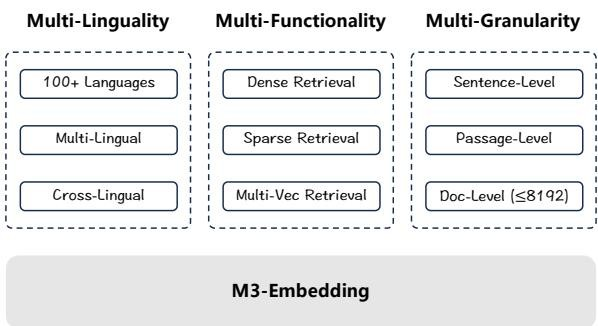
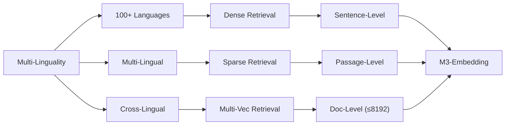
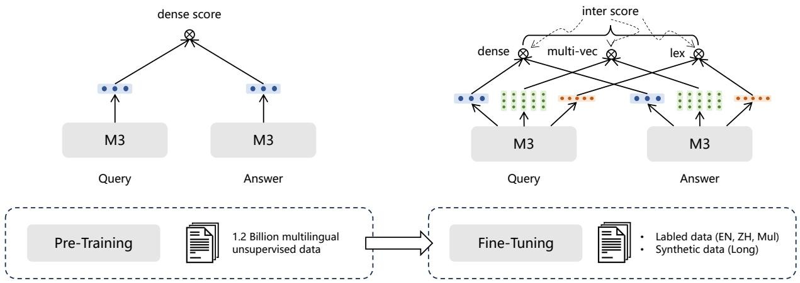
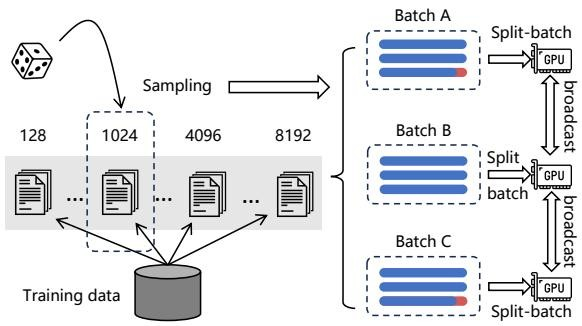
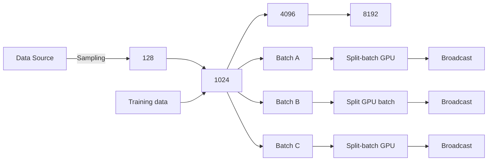
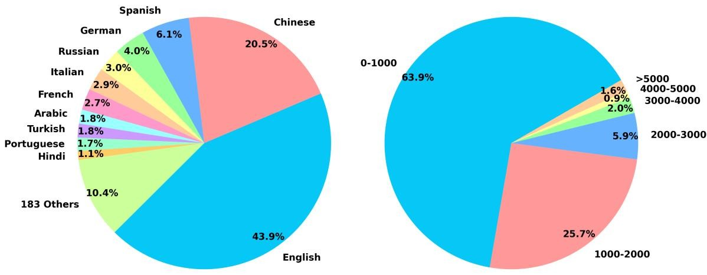
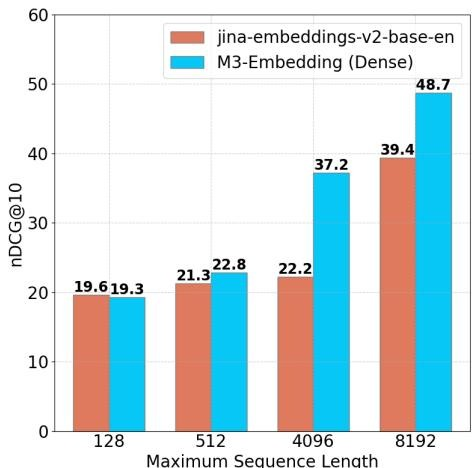

#

[page 1]

M3-Embedding: Multi-Linguality, Multi-Functionality, Multi-Granularity Text Embeddings Through Self-Knowledge Distillation

Jianlv Chen♣ Shitao Xiao♠† Peitian Zhang♠ Kun Luo♠ Defu Lian♣\* Zheng Liu♠\*

♣ University of Science and Technology of China ♠ BAAI

stxiao@baai.ac.cn {namespace.pt,luokun695,zhengliu1026}@gmail.com

chenjianlv@mail.ustc.edu.cn liandefu@ustc.edu.cn

# Abstract

In this paper, we introduce a new embedding model called M3-Embedding, which is distinguished for its versatility in Multi-Linguality, Multi-Functionality, and Multi-Granularity. It provides a uniform support for the semantic retrieval of more than 100 working languages. It can simultaneously accomplish the three common retrieval functionalities: dense retrieval, multi-vector retrieval, and sparse retrieval. Besides, it is also capable of processing inputs of different granularities, spanning from short sentences to long documents of up to 8,192 tokens. The effective training of M3-Embedding presents a series of technical contributions. Notably, we propose a novel self-knowledge distillation approach, where the relevance scores from different retrieval functionalities can be integrated as the teacher signal to enhance the training quality. We also optimize the batching strategy, which enables a large batch size and high training throughput to improve the discriminativeness of embeddings. M3-Embedding exhibits a superior performance in our experiment, leading to new state-of-the-art results on multilingual, cross-lingual, and long-document retrieval benchmarks. $^{1}$

# 1 Introduction

Embedding models are a critical form of DNN application in natural language processing. They encode the textual data in the latent space, where the underlying semantics of the data can be expressed by the output embeddings (Reimers and Gurevych, 2019; Ni et al., 2022). With the advent of pre-trained language models, the quality of text embeddings have been substantially improved, making them imperative components for the information retrieval (IR) system. One common form of embedding-based IR application is



<details>
<summary>flowchart</summary>


</details>

Figure 1: Characters of M3-Embedding.

dense retrieval, where relevant answers to the query can be retrieved based on the embedding similarity (Karpukhin et al., 2020; Xiong et al., 2020; Neelakantan et al., 2022; Wang et al., 2022; Xiao et al., 2023). Besides, the embedding model can also be applied to other IR tasks, such as multi-vector retrieval where the fine-grained relevance between query and document is computed based on the interaction score of multiple embeddings (Khattab and Zaharia, 2020), and sparse or lexical retrieval where the importance of each term is estimated by its output embedding (Gao et al., 2021a; Lin and Ma, 2021; Dai and Callan, 2020).

Despite the widespread popularity of text embeddings, the existing methods are still limited in versatility. First of all, most of the embedding models are tailored only for English, leaving few viable options for the other languages. Secondly, the existing embedding models are usually trained for one single retrieval functionality. However, typical IR systems call for the compound workflow of multiple retrieval methods. Thirdly, it is challenging to train a competitive long-document retriever due to the overwhelming training cost, where most of the embedding models can only support short inputs.

To address the above challenges, we introduce M3-Embedding, which is pronounced for its breakthrough of versatility in working languages, retrieval functionalities, and input granularities. Particularly, M3-Embedding is proficient in multi-

[page 2]

linguality, which is able to support more than 100 world languages. By learning a common semantic space for different languages, enables both multilingual retrieval within each language and cross-lingual retrieval between different languages. Besides, it is able to generate versatile embeddings to support different retrieval functionalities, not just dense retrieval, but also sparse retrieval and multivector retrieval. Finally, M3-Embedding is learned to process different input granularities, spanning from short inputs like sentences and passages, to long documents of up to 8,192 input tokens.

The training of M3-Embedding poses a significant challenge. In our work, the following technical contributions are made to optimize the embedding quality. Firstly, we propose a novel self knowledge distillation framework, where the multiple retrieval functionalities can be jointly learned and mutually reinforced. In M3-Embedding, the [CLS] embedding is used for dense retrieval, while embeddings from other tokens are used for sparse retrieval and multi-vector retrieval. Based on the principle of ensemble learning (Bühlmann, 2012), such heterogeneous predictors can be combined as a stronger predictor. Thus, we integrate the relevance scores from different retrieval functions as the teacher signal, which is used to enhance the learning process via knowledge distillation. Secondly, we optimize the batching strategy to achieve a large batch size and high training throughput, which substantially contributes to the discriminativeness of embeddings. Last but not least, we perform extensive and high-quality data curation. Our dataset includes three sources: 1) the extraction of unsupervised data from massive multi-lingual corpora, 2) the integration of closely related supervised data, 3) the synthesis of scarce training data. The three data sources are complement to each other and applied to different training stages, which lays a solid foundation for the versatile text embeddings.

M3-Embedding exhibits a remarkable versatility in our experiments. It achieves superior retrieval quality for a variety of languages, leading to state-of-the-art performances on popular multilingual and cross-lingual benchmarks like MIR-ACL (Zhang et al., 2023c) and MKQA (Longpre et al., 2021). It effectively learns the three retrieval functionalities, which can not only work individually but also work together for an even stronger retrieval quality. It also well maintains its superior capability across different input granularities within 8192 tokens, which outperforms the existing methods by a notable advantage.

Our contributions are summarized as follows. 1) We present M3-Embedding, which achieves unprecedented versatility in multi-linguality, multifunctionality, and multi-granularity. 2) We propose a novel training framework of self-knowledge distillation and optimize the batching strategy for efficient training. We also create high-quality training resource based on comprehensive data curation. 3) Our model, code, and data is publicly available, offering critical resources for both direct usage and future development of text embeddings.

# 2 Related Work

The related works are reviewed from three aspects: general text embeddings, embedding models for neural retrieval, embeddings of multi-linguality.

In the past few years, substantial progress has been achieved in the field of text embedding. One major driving force is the popularity of pre-trained language models, where the underlying semantic of the data can be effectively encoded by such powerful text encoders (Reimers and Gurevych, 2019; Karpukhin et al., 2020; Ni et al., 2022). In addition, the progress of contrastive learning is another critical factor, especially the improvement of negative sampling (Xiong et al., 2020; Qu et al., 2021) and the exploitation of knowledge distillation (Hofstätter et al., 2021; Ren et al., 2021; Zhang et al., 2021a). On top of these well-established techniques, it becomes increasingly popular to learn versatile embedding models, which are able to uniformly support a variety of application scenarios. So far, there have been many impactful methods in the direction, like Contriever (Izacard et al., 2022), LLM-Embedder (Zhang et al., 2023a), E5 (Wang et al., 2022), BGE (Xiao et al., 2023), SGPT (Muen-nighoff, 2022), and Open Text Embedding (Neelakantan et al., 2022), which significantly advance the usage of text embeddings for general tasks.

One major application of embedding models is neural retrieval (Lin et al., 2022). By measuring the semantic relationship with the text embeddings, the relevant answers to the input query can be retrieved based on the embedding similarity. The most common form of embedding-based retrieval method is dense retrieval (Karpukhin et al., 2020), where the text encoder's outputs are aggregated (e.g., via [CLS] or mean-pooling) to compute the embedding similarity. Another common alternative is known as multi-Vector retrieval (Khattab and Za

[page 3]

haria, 2020; Humeau et al., 2020), which applies fine-grained interactions for the text encoder's outputs to compute the embedding similarity. Finally, the text embeddings can also be transformed into term weights, which facilitates sparse or lexical retrieval (Luan et al., 2021; Dai and Callan, 2020; Lin and Ma, 2021). Typically, the above retrieval methods are realized by different embedding models. To the best of our knowledge, no existing method is able to unify all these functionalities.

Despite the substantial technical advancement, most of the existing text embeddings are developed only for English, where other languages are lagging behind. To mitigate this problem, continual efforts are presented from multiple directions. One is the development of pre-trained multi-lingual text encoders, such as mBERT (Pires et al., 2019), mT5 (Xue et al., 2021), XLM-R (Conneau et al., 2020a). Another one is the curation of training and evaluation data for multi-lingual text embeddings, e.g., MIRACL (Zhang et al., 2023c), mMARCO (Bonifacio et al., 2021), Mr. TyDi (Zhang et al., 2021b), MKQA (Longpre et al., 2021). At the same time, the multi-lingual text embeddings are continually developed from the community, e.g., mDPR (Zhang et al., 2023b), mContriever (Izacard et al., 2022), mE5 (Wang et al., 2022), etc. However, the current progress is still far from enough given the notable gap with English models and the huge imbalance between different languages.

# 3 M3-Embedding

M3-Embedding realizes three-fold versatility. It supports a wide variety of languages and handles input data of different granularities. Besides, it unifies the common retrieval functionalities of text embeddings. Formally, given a query q in an arbitrary language x, it is able to retrieve document d in language y from the corpus $D^{y}: d^{y} \leftarrow \mathrm{fn}^{*}(q^{x}, D^{y})$ . In this place, $\mathrm{fn}^{*}(\cdot)$ belongs to any of the functions: dense, lexical, or multi-vector retrieval; y can be another language or the same language as x.

# 3.1 Data Curation

M3-Embedding calls for a large-scale and diverse multi-lingual dataset. In this work, we perform comprehensive data collection from three sources: the unsupervised data from unlabeled corpora, the fine-tuning data from labeled corpora, and the fine-tuning data via synthesis (shown as Table 8). The three data sources complement to each other, which are applied to different stages of the training process. Particularly, the unsupervised data is curated by extracting the rich-semantic structures, e.g., title-body, title-abstract, instruction-output, etc., within a wide variety of multi-lingual corpora, including Wikipedia, S2ORC (Lo et al., 2020), xP3 (Muennighoff et al., 2023), mC4 (Raffel et al., 2019), CC-News (Hamborg et al., 2017) and the well-curated data from MTP (Xiao et al., 2023). To learn the unified embedding space for cross-lingual semantic matching, the parallel sentences are introduced from two translation datasets, NLLB (NLLB Team et al., 2022) and CCMatrix (Schwenk et al., 2021). The raw data is filtered to remove potential bad contents and low-relevance samples. In total, it brings in 1.2 billion text pairs of 194 languages and 2655 cross-lingual correspondences.

Besides, we collect relatively small but diverse and high-quality fine-tuning data from labeled corpora. For English, we incorporate 8 datasets, including HotpotQA (Yang et al., 2018), TriviaQA (Joshi et al., 2017), NQ (Kwiatkowski et al., 2019), MS MARCO (Nguyen et al., 2016), COL-IEE (Kim et al., 2022), PubMedQA (Jin et al., 2019), SQuAD (Rajpurkar et al., 2016), and NLI data from SimCSE (Gao et al., 2021b). For Chinese, we integrate 7 datasets, including DuReader (He et al., 2018), mMARCO-ZH (Bonifacio et al., 2021), T²-Ranking (Xie et al., 2023), LawGPT(?), CMedQAv2 (Zhang et al., 2018), NLI-zh², and LeCaRDv2 (Li et al., 2023). For other languages, we leverage the training data from Mr. Tydi (Zhang et al., 2021b) and MIRACL (Zhang et al., 2023c).

Finally, we generate synthetic data to mitigate the shortage of long document retrieval tasks and introduce extra multi-lingual fine-tuning data (denoted as MultiLongDoc). Specifically, we sample lengthy articles from Wikipedia, Wudao (Yuan et al., 2021) and mC4 datasets and randomly choose paragraphs from them. Then we use GPT-3.5 to generate questions based on these paragraphs. The generated question and the sampled article constitute a new text pair to the fine-tuning data. Detailed specifications are presented in Appendix A.2.

# 3.2 Hybrid Retrieval

M3-Embedding unifies the common retrieval functionalities of the embedding model, i.e. dense retrieval, lexical (sparse) retrieval, and multi-vector retrieval. The formulation is presented as follows.



<details>
<summary>flowchart</summary>

This flowchart illustrates a data processing pipeline for pre-training and fine-tuning, showing how dense scores are processed through query and answer layers to generate labeled data and synthetic data.
</details>

Figure 2: Multi-stage training process of M3-Embedding with self-knowledge distillation.

[page 4]

\- Dense retrieval. The input query $q$ is transformed into the hidden states $\mathbf{H}_{\mathbf{q}}$ based on a text encoder. We use the normalized hidden state of the special token “[CLS]” for the representation of the query: $e_q = norm(\mathbf{H}_{\mathbf{q}}[0])$ . Similarly, we can get the embedding of passage $p$ as $e_p = norm(\mathbf{H}_{\mathbf{p}}[0])$ . Thus, the relevance score between query and passage is measured by the inner product between the two embeddings $e_q$ and $e_p$ : $s_{dense} \leftarrow \langle e_p, e_q \rangle$ .

\- Lexical Retrieval. The output embeddings are also used to estimate the importance of each term to facilitate lexical retrieval. For each term $t$ within the query (a term is corresponding to a token in our work), the term weight is computed as $w_{qt} \leftarrow \text{Relu}(\mathbf{W}_{lex}^T \mathbf{H}_{\mathbf{q}}[i]))$ , where $\mathbf{W}_{lex} \in \mathcal{R}^{d \times 1}$ is the matrix mapping the hidden state to a float number. If a term $t$ appears multiple times in the query, we only retain its max weight. We use the same way to compute the weight of each term in the passage. Based on the estimation term weights, the relevance score between query and passage is computed by the joint importance of the co-existed terms (denoted as $q \cap p$ ) within the query and passage: $s_{lex} \leftarrow \sum_{t \in q \cap p} (w_{qt} * w_{pt})$ .

\- Multi-Vector Retrieval. As an extension of dense retrieval, the multi-vector method utilizes the entire output embeddings for the representation of query and passage: $E_q = norm(\mathbf{W}_{mul}^T \mathbf{H}_{\mathbf{q}})$ , $E_p = norm(\mathbf{W}_{mul}^T \mathbf{H}_{\mathbf{p}})$ , where $\mathbf{W}_{mul} \in \mathbb{R}^{d \times d}$ is the learnable projection matrix. Following Colbert (Khattab and Zaharia, 2020), we use late-interaction to compute the fine-grained relevance score: $s_{mul} \leftarrow \frac{1}{N} \sum_{i=1}^{N} \max_{j=1}^{M} E_q[i] \cdot E_p^T[j]$ ; $N$ and $M$ are the lengths of query and passage.

Thanks to the multi-functionality of the embedding model, the retrieval process can be conducted in a hybrid process. First of all, the candidate re-

sults can be individually retrieved by each of the methods (the multi-vector method can be exempted from this step due to its heavy cost). Then, the final retrieval result is re-ranked based on the integrated relevance score:

$$
s _ {r a n k} \leftarrow w _ {1} \cdot s _ {d e n s e} + w _ {2} \cdot s _ {l e x} + w _ {3} \cdot s _ {m u l} \tag {1}
$$

where the values of $w_{1}, w_{2}$ and $w_{3}$ depend on the downstream scenario.

# 3.3 Self-Knowledge Distillation

The embedding model is trained to discriminate the positive samples from the negative ones. For each of the retrieval methods, it is expected to assign a higher score for the query's positive samples compared with the negative ones. Therefore, the training process is conducted to minimize the InfoNCE loss, whose general form is presented by the following loss function:

$$
\mathcal {L} _ {s (\cdot)} = - \log \frac {\exp (s (q , p ^ {*}) / \tau)}{\sum_ {p \in \{p ^ {*} , P ^ {\prime} \}} \exp (s (q , p) / \tau)}. \tag {2}
$$

Here, $p^{*}$ and $P'$ stand for the positive and negative samples to the query $q$ ; $s(\cdot)$ is any of the functions within $\{s_{dense}(\cdot), s_{lex}(\cdot), s_{mul}(\cdot)\}$ .

The training objectives of different retrieval methods can be mutually conflicting with each their. Therefore, the native multi-objective training can be unfavorable to the embedding's quality. To facilitate the optimization of multiple retrieval functions, we propose to unify the training process on top of self-knowledge distillation. Particularly, based on the principle of ensemble learning (Bühlmann, 2012), the predictions from different retrieval methods can be integrated as a more accurate relevance score given their heterogeneous nature. In the simplest form, the integration can

[page 5]

just be the weighted sum of different prediction scores:

$$
s _ {i n t e r} \leftarrow w _ {1} \cdot s _ {d e n s e} + w _ {2} \cdot s _ {l e x} + w _ {3} \cdot s _ {m u l}. \tag {3}
$$

Then we compute the weighted sum of $L_{dense}$ , $L_{lex}$ , $L_{mul}$ and $L_{inter}$ as the loss without self-knowledge distillation:

$$
\mathcal {L} \leftarrow \left(\lambda_ {1} \cdot \mathcal {L} _ {\text {dense}} + \lambda_ {2} \cdot \mathcal {L} _ {\text {lex}} + \lambda_ {3} \cdot \mathcal {L} _ {\text {mul}} + \mathcal {L} _ {\text {inter}}\right) / 4. \tag {4}
$$

In previous studies, the training quality of embedding model can benefit from knowledge distillation, which takes advantage of fine-grained soft labels from another ranking model (Hofstätter et al., 2021). In this place, we simply employ the integration score $s_{inter}$ as the teacher, where the loss function of each retrieval method is modified as:

$$
\mathcal {L} _ {*} ^ {\prime} \leftarrow - p (s _ {i n t e r}) * \log p (s _ {*}). \tag {5}
$$

Here, $p(\cdot)$ is the softmax activation; $s_{*}$ is any of the members within $s_{dense}$ , $s_{lex}$ , and $s_{mul}$ . We further integrate and normalize the modified loss function:

$$
\mathcal {L} ^ {\prime} \leftarrow \left(\lambda_ {1} \cdot \mathcal {L} _ {d e n s e} ^ {\prime} + \lambda_ {2} \cdot \mathcal {L} _ {l e x} ^ {\prime} + \lambda_ {3} \cdot \mathcal {L} _ {m u l} ^ {\prime}\right) / 3. \tag {6}
$$

Finally, we derive the final loss function for self-knowledge distillation with the linear combination of $\mathcal{L}$ and $\mathcal{L}'$ : $\mathcal{L}_{final} \leftarrow (\mathcal{L} + \mathcal{L}') / 2$ .

The training process constitutes a multi-stage workflow (Figure 2). In the first place, the text encoder (an XLM-RoBERTa (Conneau et al., 2020a) model adapted by RetroMAE (Xiao et al., 2022) method) is pre-trained with the massive unsupervised data, where only the dense retrieval is trained in the basic form of contrastive learning. The self-knowledge distillation is applied to the second stage, where the embedding model is fine-tuned to establish the three retrieval functionalities. The random initialization of $W_{lex}$ led to poor $s_{lex}$ accuracy and high $L_{lex}$ at the beginning of the training. In order to reduce the impact of this, we set $w_{1}=1$ , $w_{2}=0.3$ , $w_{3}=1$ , $\lambda_{1}=1$ , $\lambda_{2}=0.1$ and $\lambda_{3}=1$ during the training process. Both labeled and synthetic data are used in this stage, where hard negative samples are introduced for each query following the ANCE method (Xiong et al., 2020). (See Appendix B.1 for more details.)

# 3.4 Efficient Batching

The embedding model needs to learn from diverse and massive multi-lingual data to fully capture the general semantic of different languages. It also



<details>
<summary>flowchart</summary>


</details>

Figure 3: Efficient Batching. (Data is grouped and sampled by length. Gradient-checkpointing and cross-GPU broadcasting are enabled to save memory.)

needs to keep the batch size as large as possible (introducing a huge amount of in-batch negatives) to ensure the discriminativeness of text embeddings. Given the limitations on GPU's memory and computation power, people usually truncate the input data into short sequences for high throughput of training and a large batch size. However, the common practice is not a feasible option for M3-Embedding because it needs to learn from both short and long-sequence data to effectively handle the input of different granularities. In our work, we improve the training efficiency by optimizing the batching strategy, which enables high training throughput and large batch sizes.

Particularly, the training data is pre-processed by being grouped by sequence length. When producing a mini-batch, the training instances are sampled from the same group. Due to the similar sequence lengths, it significantly reduces sequence padding (Figure 3, marked in red) and facilitates a more effective utilization of GPUs. Besides, when sampling the training data for different GPUs, the random seed is always fixed, which ensures the load balance and minimizes the waiting time in each training step. Besides, when handling long-sequence training data, the mini-batch is further divided into sub-batches, which takes less memory footprint. We iteratively encode each sub-batch using gradient checkpointing (Chen et al., 2016) and gather all generated embeddings. This method can significantly increase the batch size. For example, when processing text with a length of 8192, the batch size can be increased by more than 20 times. (see Appendix B.3 for more details.) Finally, the embeddings from different GPUs are broadcasted, allowing each device to obtain all embeddings in the distributed environment, which notably expands the scale of in-bath negative samples.

For users who are severely limited in computa-

<table><tr><td>Model</td><td>Avg</td><td>ar</td><td>bn</td><td>en</td><td>es</td><td>fa</td><td>fi</td><td>fr</td><td>hi</td><td>id</td><td>ja</td><td>ko</td><td>ru</td><td>sw</td><td>te</td><td>th</td><td>zh</td><td>de</td><td>yo</td></tr><tr><td colspan="20">Baselines (Prior Work)</td></tr><tr><td>BM25</td><td>31.9</td><td>39.5</td><td>48.2</td><td>26.7</td><td>7.7</td><td>28.7</td><td>45.8</td><td>11.5</td><td>35.0</td><td>29.7</td><td>31.2</td><td>37.1</td><td>25.6</td><td>35.1</td><td>38.3</td><td>49.1</td><td>17.5</td><td>12.0</td><td>56.1</td></tr><tr><td>mDPR</td><td>41.8</td><td>49.9</td><td>44.3</td><td>39.4</td><td>47.8</td><td>48.0</td><td>47.2</td><td>43.5</td><td>38.3</td><td>27.2</td><td>43.9</td><td>41.9</td><td>40.7</td><td>29.9</td><td>35.6</td><td>35.8</td><td>51.2</td><td>49.0</td><td>39.6</td></tr><tr><td>mContriever</td><td>43.1</td><td>52.5</td><td>50.1</td><td>36.4</td><td>41.8</td><td>21.5</td><td>60.2</td><td>31.4</td><td>28.6</td><td>39.2</td><td>42.4</td><td>48.3</td><td>39.1</td><td>56.0</td><td>52.8</td><td>51.7</td><td>41.0</td><td>40.8</td><td>41.5</td></tr><tr><td> $\mathrm{mE5}_{\text{large}}$ </td><td>66.6</td><td>76.0</td><td>75.9</td><td>52.9</td><td>52.9</td><td>59.0</td><td>77.8</td><td>54.5</td><td>62.0</td><td>52.9</td><td>70.6</td><td>66.5</td><td>67.4</td><td>74.9</td><td>84.6</td><td>80.2</td><td>56.0</td><td>56.4</td><td>78.3</td></tr><tr><td> $\mathrm{E5}_{\text{mistral-7b}}$ </td><td>63.4</td><td>73.3</td><td>70.3</td><td>57.3</td><td>52.2</td><td>52.1</td><td>74.7</td><td>55.2</td><td>52.1</td><td>52.7</td><td>66.8</td><td>61.8</td><td>67.7</td><td>68.4</td><td>73.9</td><td>74.0</td><td>54.0</td><td>54.1</td><td>79.7</td></tr><tr><td>OpenAI-3</td><td>54.9</td><td>-</td><td>-</td><td>-</td><td>-</td><td>-</td><td>-</td><td>-</td><td>-</td><td>-</td><td>-</td><td>-</td><td>-</td><td>-</td><td>-</td><td>-</td><td>-</td><td>-</td><td>-</td></tr><tr><td colspan="20">M3-Embedding (Our Work)</td></tr><tr><td>Dense</td><td>69.2</td><td>78.4</td><td>80.0</td><td>56.9</td><td>56.1</td><td>60.9</td><td>78.6</td><td>58.3</td><td>59.5</td><td>56.1</td><td>72.8</td><td>69.9</td><td>70.1</td><td>78.7</td><td>86.2</td><td>82.6</td><td>62.7</td><td>56.7</td><td>81.8</td></tr><tr><td>Sparse</td><td>53.9</td><td>67.1</td><td>68.9</td><td>43.8</td><td>38.6</td><td>45.1</td><td>65.4</td><td>35.3</td><td>48.2</td><td>48.9</td><td>56.1</td><td>61.5</td><td>44.5</td><td>57.9</td><td>79.1</td><td>70.9</td><td>36.1</td><td>32.5</td><td>70.0</td></tr><tr><td>Multi-vec</td><td>70.5</td><td>79.6</td><td>81.0</td><td>59.3</td><td>57.8</td><td>62.0</td><td>80.1</td><td>59.4</td><td>61.5</td><td>58.3</td><td>74.5</td><td>71.2</td><td>71.2</td><td>79.1</td><td>87.9</td><td>83.0</td><td>63.7</td><td>58.0</td><td>82.4</td></tr><tr><td>Dense+Sparse</td><td>70.4</td><td>79.6</td><td>80.7</td><td>58.8</td><td>58.1</td><td>62.3</td><td>79.7</td><td>58.0</td><td>62.9</td><td>58.3</td><td>73.9</td><td>71.2</td><td>69.8</td><td>78.5</td><td>87.2</td><td>83.1</td><td>63.5</td><td>57.7</td><td>83.3</td></tr><tr><td>All</td><td>71.5</td><td>80.2</td><td>81.5</td><td>59.6</td><td>59.7</td><td>63.4</td><td>80.4</td><td>61.2</td><td>63.3</td><td>59.0</td><td>75.2</td><td>72.1</td><td>71.7</td><td>79.6</td><td>88.1</td><td>83.7</td><td>64.9</td><td>59.8</td><td>83.5</td></tr></table>

Table 1: Multi-lingual retrieval performance on the MIRACL dev set (measured by nDCG@10).

[page 6]

tion or data resource, we present an even simpler method called MCLS (Multi-CLS), which simply inserts multiple CLS tokens to the long document during inference, and takes the average of all CLS embeddings as the ultimate embedding of the document. Despite simplicity, it is surprisingly effective in practice. (See Appendix B.2 for more details.)

# 4 Experiment

In this section, we investigate M3-Embedding's performance in terms of multi-lingual retrieval, cross-lingual retrieval, and long-doc retrieval. We also explore the impact of its technical factors.

# 4.1 Multi-Lingual Retrieval

We evaluate the multi-lingual retrieval performance with MIRACL (Zhang et al., 2023c), which consists of ad-hoc retrieval tasks in 18 languages. Each task is made up of query and passage presented in the same language. Following the official benchmark, we evaluate our method using Pyserini (Lin et al., 2021), and use nDCG@10 as the primary evaluation metric (Recall@100 is also measured and reported in Appendix C.1). Specifically, for the dense method (denoted as Dense), we first use it to generate the embeddings of the corpus and then build the dense index for searching top-1000 candidates with Faiss. For the sparse method (denoted as Sparse), we first use it to generate the weights of the corpus and then build the sparse index for searching top-1000 candidates with Lucene. For the multi-vector method (denoted as Multi-vec), considering its heavy cost, we use it as reranker to re-rank the top-200 candidates from dense method. For the hybrid retrieval of dense method and sparse method (denoted as Dense+Sparse), we set $w_{1} = 1$ , $w_{2} = 0.3$ and $w_{3} = 0$ in equation(1) to re-rank the union set of top-1000 candidates from Dense and top-1000 candidate from Sparse. For the hybrid retrieval of all three methods (denoted as All), we set $w_{1} = 1$ , $w_{2} = 0.3$ and $w_{3} = 1$ in equation(1) to re-rank the top-200 candidates from Dense.

We incorporate the following baselines in our experiment: the lexical retrieval method: BM25 (Robertson and Zaragoza, 2009); the dense retrieval methods: mDPR $^{3}$ (Zhang et al., 2023b), mContriever $^{4}$ (Izacard et al., 2022), mE5 $_{large}$ (Wang et al., 2022) and E5 $_{mistral-7b}$ (Wang et al., 2023). To make the BM25 and M3 more comparable, in the experiment, we use the same tokenizer as M3 (i.e., the tokenizer of XLM-Roberta) for BM25. Using the same vocabulary from XLM-Roberta can also ensure that both approaches have the same retrieval latency. The results of BM25 with different tokenizers are shown in Appendix C.2. We also make a comparison with Text-Embedding-3-Large(abbreviated as OpenAI-3), which was recently released by OpenAI $^{5}$ .

We can make the following observations according to the experiment result in Table 1. Firstly, M3-Embedding already achieves a superior retrieval performance with only its dense retrieval functionality (Dense). It not only outperforms other baseline methods in the average performance, but also maintains a consistent empirical advantage in most of individual languages. Even compared with $E5_{mistral-7b}$ , which leverages a much larger Mistral-7B model as the text encoder and specifically trained with English data, our method is able to produce a similar result in English and notably higher results in the other languages. Besides, the sparse retrieval functionality (Sparse) is also effectively trained by M3-Embedding, as it outper-

3. https://huggingface.co/castorini/mdpr-tied-pft-msmarco
4. https://huggingface.co/facebook/mcontriever-msmarco
5. https://platform.openai.com/docs/guides/embeddings

<table><tr><td colspan="7">Baselines (Prior Work)</td><td colspan="5">M3-Embedding (Our Work)</td></tr><tr><td></td><td>BM25</td><td>mDPR</td><td>mContriever</td><td> $\mathrm {mE5}_{\text {large}}$ </td><td> $\mathrm {E5}_{\text {mistral-7b}}$ </td><td>OpenAI-3</td><td>Dense</td><td>Sparse</td><td>Multi-vec</td><td>Dense+Sparse</td><td>All</td></tr><tr><td>ar</td><td>18.9</td><td>48.2</td><td>58.2</td><td>68.7</td><td>59.6</td><td>65.6</td><td>71.1</td><td>23.5</td><td>71.4</td><td>71.1</td><td>71.5</td></tr><tr><td>da</td><td>49.3</td><td>67.4</td><td>73.9</td><td>77.4</td><td>77.8</td><td>73.6</td><td>77.2</td><td>55.4</td><td>77.5</td><td>77.4</td><td>77.6</td></tr><tr><td>de</td><td>35.4</td><td>65.8</td><td>71.7</td><td>76.9</td><td>77.0</td><td>73.6</td><td>76.2</td><td>43.3</td><td>76.3</td><td>76.4</td><td>76.3</td></tr><tr><td>es</td><td>43.4</td><td>66.8</td><td>72.6</td><td>76.4</td><td>77.4</td><td>73.9</td><td>76.4</td><td>50.6</td><td>76.6</td><td>76.7</td><td>76.9</td></tr><tr><td>fi</td><td>46.3</td><td>56.2</td><td>70.2</td><td>74.0</td><td>72.0</td><td>72.7</td><td>75.1</td><td>51.1</td><td>75.3</td><td>75.3</td><td>75.5</td></tr><tr><td>fr</td><td>45.3</td><td>68.2</td><td>72.8</td><td>75.5</td><td>78.0</td><td>74.1</td><td>76.2</td><td>53.9</td><td>76.4</td><td>76.6</td><td>76.6</td></tr><tr><td>he</td><td>26.9</td><td>49.7</td><td>63.8</td><td>69.6</td><td>47.2</td><td>58.1</td><td>72.4</td><td>31.1</td><td>72.9</td><td>72.5</td><td>73.0</td></tr><tr><td>hu</td><td>38.2</td><td>60.4</td><td>69.7</td><td>74.7</td><td>75.0</td><td>71.2</td><td>74.7</td><td>44.6</td><td>74.6</td><td>74.9</td><td>75.0</td></tr><tr><td>it</td><td>45.2</td><td>66.0</td><td>72.3</td><td>76.8</td><td>77.1</td><td>73.6</td><td>76.0</td><td>52.5</td><td>76.4</td><td>76.3</td><td>76.5</td></tr><tr><td>ja</td><td>24.5</td><td>60.3</td><td>64.8</td><td>71.5</td><td>65.1</td><td>71.9</td><td>75.0</td><td>31.3</td><td>75.1</td><td>75.0</td><td>75.2</td></tr><tr><td>km</td><td>27.8</td><td>29.5</td><td>26.8</td><td>28.1</td><td>34.3</td><td>33.9</td><td>68.6</td><td>30.1</td><td>69.1</td><td>68.8</td><td>69.2</td></tr><tr><td>ko</td><td>27.9</td><td>50.9</td><td>59.7</td><td>68.1</td><td>59.4</td><td>63.9</td><td>71.6</td><td>31.4</td><td>71.7</td><td>71.6</td><td>71.8</td></tr><tr><td>ms</td><td>55.9</td><td>65.5</td><td>74.1</td><td>76.3</td><td>77.2</td><td>73.3</td><td>77.2</td><td>62.4</td><td>77.4</td><td>77.4</td><td>77.4</td></tr><tr><td>nl</td><td>56.2</td><td>68.2</td><td>73.7</td><td>77.8</td><td>79.1</td><td>74.2</td><td>77.4</td><td>62.4</td><td>77.6</td><td>77.7</td><td>77.6</td></tr><tr><td>no</td><td>52.1</td><td>66.7</td><td>73.5</td><td>77.3</td><td>76.6</td><td>73.3</td><td>77.1</td><td>57.9</td><td>77.2</td><td>77.4</td><td>77.3</td></tr><tr><td>pl</td><td>40.8</td><td>63.3</td><td>71.6</td><td>76.7</td><td>77.1</td><td>72.7</td><td>76.3</td><td>46.1</td><td>76.5</td><td>76.3</td><td>76.6</td></tr><tr><td>pt</td><td>44.9</td><td>65.5</td><td>72.0</td><td>73.5</td><td>77.5</td><td>73.7</td><td>76.3</td><td>50.9</td><td>76.4</td><td>76.5</td><td>76.4</td></tr><tr><td>ru</td><td>33.2</td><td>62.7</td><td>69.8</td><td>76.8</td><td>75.5</td><td>72.0</td><td>76.2</td><td>36.9</td><td>76.4</td><td>76.2</td><td>76.5</td></tr><tr><td>sv</td><td>54.6</td><td>66.9</td><td>73.2</td><td>77.6</td><td>78.3</td><td>74.0</td><td>76.9</td><td>59.6</td><td>77.2</td><td>77.4</td><td>77.4</td></tr><tr><td>th</td><td>37.8</td><td>53.8</td><td>66.9</td><td>76.0</td><td>67.4</td><td>65.2</td><td>76.4</td><td>42.0</td><td>76.5</td><td>76.5</td><td>76.6</td></tr><tr><td>tr</td><td>45.8</td><td>59.1</td><td>71.1</td><td>74.3</td><td>73.0</td><td>71.8</td><td>75.6</td><td>51.8</td><td>75.9</td><td>76.0</td><td>76.0</td></tr><tr><td>vi</td><td>46.6</td><td>63.4</td><td>70.9</td><td>75.4</td><td>70.9</td><td>71.1</td><td>76.6</td><td>51.8</td><td>76.7</td><td>76.8</td><td>76.9</td></tr><tr><td>zh_cn</td><td>31.0</td><td>63.7</td><td>68.1</td><td>56.6</td><td>69.3</td><td>70.7</td><td>74.6</td><td>35.4</td><td>74.9</td><td>74.7</td><td>75.0</td></tr><tr><td>zh_hk</td><td>35.0</td><td>62.8</td><td>68.0</td><td>58.1</td><td>65.1</td><td>69.6</td><td>73.8</td><td>39.8</td><td>74.1</td><td>74.0</td><td>74.3</td></tr><tr><td>zh_tw</td><td>33.5</td><td>64.0</td><td>67.9</td><td>58.1</td><td>65.8</td><td>69.7</td><td>73.5</td><td>37.7</td><td>73.5</td><td>73.6</td><td>73.6</td></tr><tr><td>Avg</td><td>39.9</td><td>60.6</td><td>67.9</td><td>70.9</td><td>70.1</td><td>69.5</td><td>75.1</td><td>45.3</td><td>75.3</td><td>75.3</td><td>75.5</td></tr></table>

Table 2: Cross-lingual retrieval performance on MKQA (measured by Recall@100).

[page 7]

forms the typical BM25 methods in all languages. We can also observe the additional improvement from multi-vector retrieval, which relies on fine-grained interactions between query and passage's embeddings to compute the relevance score. Finally, the collaboration of dense and sparse method (Dense+Sparse) leads to a further improvement over each individual method, and the collaboration of all three methods (All) brings forth the best performance.

# 4.2 Cross-Lingual Retrieval

We make evaluation for the cross-lingual retrieval performance with the MKQA benchmark (Longpre et al., 2021), which includes queries in 25 non-English languages. For each query, it needs to retrieve the passages containing answers from the English Wikipedia corpus. In our experiment, we make use of the well-processed corpus offered by the BEIR $^{6}$ (?). Following the previous study (Izacard et al., 2022), we report Recall@100 as the primary metric (Recall@20 is reported as an auxiliary metric in the Appendix C.1). For Dense+Sparse method and All method, we set the same weights as in MIRACL dataset.

The experiment result is shown in Table 2. Similar to our observation in multi-lingual retrieval,

M3-Embedding continues to produce a superior performance, where it notably outperforms other baseline methods purely with its dense retrieval functionality (Dense). The collaboration of different retrieval methods brings in further improvements, leading to the best empirical performance of cross-lingual retrieval. Besides, we can also observe the following interesting results which are unique to this benchmark. Firstly, the performance gaps are not as significant as MIRACL, where competitive baselines like $E5_{mistral-7b}$ is able to produce similar or even better results on some of the testing languages. However, the baselines are prone to bad performances in many other languages, especially the low-resource languages, such as ar, km, he, etc. In contrast, M3-Embedding maintains relatively stable performances in all languages, which can largely be attributed to its pre-training over comprehensive unsupervised data. Secondly, although M3-Embedding (Sparse) is still better than BM25, it performs badly compared with other methods. This is because there are only very limited co-existed terms for cross-lingual retrieval as the query and passage are presented in different languages.

# 4.3 Multilingual Long-Doc Retrieval

We evaluate the retrieval performance with longer sequences with two benchmarks: MLDR (Multilingual Long-Doc Retrieval), which is curated by

<table><tr><td></td><td>Max Length</td><td>Avg</td><td>ar</td><td>de</td><td>en</td><td>es</td><td>fr</td><td>hi</td><td>it</td><td>ja</td><td>ko</td><td>pt</td><td>ru</td><td>th</td><td>zh</td></tr><tr><td colspan="16">Baselines (Prior Work)</td></tr><tr><td>BM25</td><td>8192</td><td>53.6</td><td>45.1</td><td>52.6</td><td>57.0</td><td>78.0</td><td>75.7</td><td>43.7</td><td>70.9</td><td>36.2</td><td>25.7</td><td>82.6</td><td>61.3</td><td>33.6</td><td>34.6</td></tr><tr><td>mDPR</td><td>512</td><td>23.5</td><td>15.6</td><td>17.1</td><td>23.9</td><td>34.1</td><td>39.6</td><td>14.6</td><td>35.4</td><td>23.7</td><td>16.5</td><td>43.3</td><td>28.8</td><td>3.4</td><td>9.5</td></tr><tr><td>mContriever</td><td>512</td><td>31.0</td><td>25.4</td><td>24.2</td><td>28.7</td><td>44.6</td><td>50.3</td><td>17.2</td><td>43.2</td><td>27.3</td><td>23.6</td><td>56.6</td><td>37.7</td><td>9.0</td><td>15.3</td></tr><tr><td>mE5large</td><td>512</td><td>34.2</td><td>33.0</td><td>26.9</td><td>33.0</td><td>51.1</td><td>49.5</td><td>21.0</td><td>43.1</td><td>29.9</td><td>27.1</td><td>58.7</td><td>42.4</td><td>15.9</td><td>13.2</td></tr><tr><td>E5mistral-7b</td><td>8192</td><td>42.6</td><td>29.6</td><td>40.6</td><td>43.3</td><td>70.2</td><td>60.5</td><td>23.2</td><td>55.3</td><td>41.6</td><td>32.7</td><td>69.5</td><td>52.4</td><td>18.2</td><td>16.8</td></tr><tr><td>text-embedding-ada-002</td><td>8191</td><td>32.5</td><td>16.3</td><td>34.4</td><td>38.7</td><td>59.8</td><td>53.9</td><td>8.0</td><td>46.5</td><td>28.6</td><td>20.7</td><td>60.6</td><td>34.8</td><td>9.0</td><td>11.2</td></tr><tr><td>jina-embeddings-v2-base-en</td><td>8192</td><td>-</td><td>-</td><td>-</td><td>37.0</td><td>-</td><td>-</td><td>-</td><td>-</td><td>-</td><td>-</td><td>-</td><td>-</td><td>-</td><td>-</td></tr><tr><td colspan="16">M3-Embedding (Our Work)</td></tr><tr><td>Dense</td><td>8192</td><td>52.5</td><td>47.6</td><td>46.1</td><td>48.9</td><td>74.8</td><td>73.8</td><td>40.7</td><td>62.7</td><td>50.9</td><td>42.9</td><td>74.4</td><td>59.5</td><td>33.6</td><td>26.0</td></tr><tr><td>Sparse</td><td>8192</td><td>62.2</td><td>58.7</td><td>53.0</td><td>62.1</td><td>87.4</td><td>82.7</td><td>49.6</td><td>74.7</td><td>53.9</td><td>47.9</td><td>85.2</td><td>72.9</td><td>40.3</td><td>40.5</td></tr><tr><td>Multi-vec</td><td>8192</td><td>57.6</td><td>56.6</td><td>50.4</td><td>55.8</td><td>79.5</td><td>77.2</td><td>46.6</td><td>66.8</td><td>52.8</td><td>48.8</td><td>77.5</td><td>64.2</td><td>39.4</td><td>32.7</td></tr><tr><td>Dense+Sparse</td><td>8192</td><td>64.8</td><td>63.0</td><td>56.4</td><td>64.2</td><td>88.7</td><td>84.2</td><td>52.3</td><td>75.8</td><td>58.5</td><td>53.1</td><td>86.0</td><td>75.6</td><td>42.9</td><td>42.0</td></tr><tr><td>All</td><td>8192</td><td>65.0</td><td>64.7</td><td>57.9</td><td>63.8</td><td>86.8</td><td>83.9</td><td>52.2</td><td>75.5</td><td>60.1</td><td>55.7</td><td>85.4</td><td>73.8</td><td>44.7</td><td>40.0</td></tr><tr><td colspan="16">M3-w.o.long</td></tr><tr><td>Dense-w.o.long</td><td>8192</td><td>41.2</td><td>35.4</td><td>35.2</td><td>37.5</td><td>64.0</td><td>59.3</td><td>28.8</td><td>53.1</td><td>41.7</td><td>29.8</td><td>63.5</td><td>51.1</td><td>19.5</td><td>16.5</td></tr><tr><td>Dense-w.o.long (MCLS)</td><td>8192</td><td>45.0</td><td>37.9</td><td>43.3</td><td>41.2</td><td>67.7</td><td>64.6</td><td>32.0</td><td>55.8</td><td>43.4</td><td>33.1</td><td>67.8</td><td>52.8</td><td>27.2</td><td>18.2</td></tr></table>

Table 3: Evaluation of multilingual long-doc retrieval on the MLDR test set (measured by nDCG@10).

[page 8]

the multilingual articles from Wikipedia, Wudao and mC4 (see Table 7), and NarrativeQA (Kočiský et al., 2018; Günther et al., 2024), which is only for English. In addition to the previous baselines, we further introduce JinaEmbeddingv2 (Günther et al., 2024), text-embedding-ada-002 and text-embedding-3-large from OpenAI given their outstanding long-doc retrieval capability. For Dense+Sparse method, we set $w_{1}=0.2$ , $w_{2}=0.8$ and $w_{3}=0$ in equation(1). For All method, we set $w_{1}=0.15$ , $w_{2}=0.5$ and $w_{3}=0.35$ in equation(1).

The evaluation result on MLDR is presented in Table 3. Interestingly, M3 (Sparse) turns out to be a more effective method for long document retrieval, which achieves another about 10 points improvement over the dense method. Besides, the multivector retrieval is also impressive, which brings 5.1+ points improvement over M3 (Dense). Finally, the combination of different retrieval methods leads to a remarkable average performance of 65.0.

To explore the reason for M3-Embedding's competitiveness in long-document retrieval, we perform the ablation study by removing the long document data from the fine-tuning stage (denoted as w.o. long). After this modification, the dense method, i.e. Dense-w.o.long, can still outperform the majority of baselines, which indicates that its empirical advantage has been well established during the pre-training stage. We also propose a simple strategy, MCLS, to address this situation (no data or no GPU resource for document-retrieval fine-tuning). Experimental results indicate that MCLS can significantly improve the performance of document retrieval without training (41.2 → 45.0).

We make further analysis with NarrativeQA (Ta-

<table><tr><td>Model</td><td>Max Length</td><td>nDCG@10</td></tr><tr><td colspan="3">Baselines (Prior Work)</td></tr><tr><td>mDPR</td><td>512</td><td>16.3</td></tr><tr><td>mContriever</td><td>512</td><td>23.3</td></tr><tr><td>mE5large</td><td>512</td><td>24.2</td></tr><tr><td>E5mistral-7b</td><td>8192</td><td>49.9</td></tr><tr><td>text-embedding-ada-002</td><td>8191</td><td>41.1</td></tr><tr><td>text-embedding-3-large</td><td>8191</td><td>51.6</td></tr><tr><td>jina-embeddings-v2-base-en</td><td>8192</td><td>39.4</td></tr><tr><td colspan="3">M3-Embedding (Our Work)</td></tr><tr><td>Dense</td><td>8192</td><td>48.7</td></tr><tr><td>Sparse</td><td>8192</td><td>57.5</td></tr><tr><td>Multi-vec</td><td>8192</td><td>55.4</td></tr><tr><td>Dense+Sparse</td><td>8192</td><td>60.1</td></tr><tr><td>All</td><td>8192</td><td>61.7</td></tr></table>

Table 4: Evaluation on NarrativeQA (nDCG@10).

ble 4), where we can make a similar observation as MLDR. Besides, with the growth of sequence length, our method gradually expands its advantage over baseline methods (Figure 5), which reflects its proficiency in handling long inputs.

# 4.4 Ablation study

Self-knowledge distillation. The ablation study is performed to analyze the impact of self-knowledge distillation (skd). Particularly, we disable the distillation processing and have each retrieval method trained independently (denoted as M3-w.o.skd). According to our evaluation on MIRACL (Table 5), the original method, i.e. M3-w.skd, is able to achieve better performances than the ablation method in all settings, i.e., Dense, Sparse, Multivec. Notably, the impact is more pronounced for sparse retrieval. Such a result also reflects the incompatibility between dense and sparse retrieval methods. With skd, the incompatibility can be largely overcome. (More detailed results are available in Appendix C.1.)

<table><tr><td colspan="2">Model</td><td>MIRACL</td></tr><tr><td rowspan="3">M3-w.skd</td><td>Dense</td><td>69.2</td></tr><tr><td>Sparse</td><td>53.9</td></tr><tr><td>Multi-vec</td><td>70.5</td></tr><tr><td rowspan="3">M3-w.o.skd</td><td>Dense</td><td>68.7</td></tr><tr><td>Sparse</td><td>36.7</td></tr><tr><td>Multi-vec</td><td>69.3</td></tr></table>

Table 5: Ablation study of self-knowledge distillation on the MIRACL dev set (nDCG@10).

<table><tr><td>Model (Dense)</td><td>MIRACL</td></tr><tr><td>Fine-tune</td><td>60.5</td></tr><tr><td>RetroMAE + Fine-tune</td><td>66.1</td></tr><tr><td>RetroMAE + Unsup + Fine-tune</td><td>69.2</td></tr></table>

Table 6: Ablation study of multi-stage training on the MIRACL dev set (nDCG@10).

[page 9]

Impact of multi-stage training. We also make explorations for the impacts from different training stages. Fine-tuning indicates the direct fine-tuning from XLM-RoBERTA (Conneau et al., 2020b); RetroMAE+Fine-tuning refers to the fine-tuning on the pre-trained model from RetroMAE (Xiao et al., 2022). Meanwhile, RetroMAE+Unsup+Fine-tuning involves fine-tuning on a model that is trained with RetroMAE and then pre-trained on unsupervised data. The results are presented in Table 6. We can observe that RetroMAE can significantly improve the retrieval performance, and pre-training on unsupervised data can further enhance the retrieval quality of the embedding model. (More detailed results are available in Appendix C.1.)

# 5 Conclusion

In this paper, we introduce M3-Embedding, which substantially advances the versatility of text embeddings in terms of supporting multi-lingual retrieval, handling input of diverse granularities, and unifying different retrieval functionalities. M3-Embedding presents three technical contributions: self-knowledge distillation, efficient batching, and high-quality curation of data. The effectiveness of M3-Embedding is empirically verified, where it leads to superior performances on multi-lingual retrieval, cross-lingual retrieval, and multi-lingual long-document retrieval tasks.

# Limitations

First of all, while our proposed M3-Embedding model achieves state-of-the-art performance on popular multi-lingual and cross-lingual benchmarks such as MIRACL and MKQA, it is important to acknowledge that the generalizability of our approach to diverse datasets and real-world scenarios needs to be further investigated. Different datasets may have varying characteristics and challenges that could affect the performance of our model. Secondly, while M3-Embedding is designed to process inputs of different granularities, including long documents of up to 8192 tokens, we acknowledge that processing extremely long documents could pose challenges in terms of computational resources and model efficiency. The performance of our model on very long documents or documents exceeding the specified token limit needs to be further investigated. Furthermore, we claim support for more than 100 working languages in M3-Embedding. However, the potential variations in performance across different languages are not thoroughly discussed. Further analysis and evaluation on a broader range of languages are necessary to understand the robustness and effectiveness of our model across different language families and linguistic characteristics.

# Ethics Consideration

Our work proposes a new embedding model called M3-Embedding, which is distinguished for its versatility in multi-linguality, multi-functionality and multi-granularity. Because our model will be publicly available, it is influenced by the inherent impacts of open-source model. Moreover, we use the multilingual data including all kinds of languages in the training of M3-Embedding. However, due to the uneven distribution of training data for different languages, the model's performance may vary across languages, which could potentially be seen as discriminatory or unfair. We ensure that our work is conformant to the ACL Ethics Policy $^{7}$ .

# Acknowledgements

We would like to thank anonymous reviewers for their helpful feedback, and ACL 2024 and ACL Rolling Review organizers for their efforts. This research is supported by National Science and Technology Major Project (2023ZD0121504).

# References

Luiz Bonifacio, Vitor Jeronymo, Hugo Queiroz Abonizio, Israel Campiotti, Marzieh Fadaee, Roberto Lotufo, and Rodrigo Nogueira. 2021. mmarco: A

multilingual version of the ms marco passage ranking dataset. arXiv preprint arXiv:2108.13897.
Peter Bühlmann. 2012. Bagging, boosting and ensemble methods. Handbook of computational statistics: Concepts and methods, pages 985–1022.
Tianqi Chen, Bing Xu, Chiyuan Zhang, and Carlos Guestrin. 2016. Training deep nets with sublinear memory cost. arXiv preprint arXiv:1604.06174.
Alexis Conneau, Kartikay Khandelwal, Naman Goyal, Vishrav Chaudhary, Guillaume Wenzek, Francisco Guzmán, Edouard Grave, Myle Ott, Luke Zettlemoyer, and Veselin Stoyanov. 2020a. Unsupervised cross-lingual representation learning at scale. In Proceedings of the 58th Annual Meeting of the Association for Computational Linguistics, pages 8440–8451, Online. Association for Computational Linguistics.
Alexis Conneau, Kartikay Khandelwal, Naman Goyal, Vishrav Chaudhary, Guillaume Wenzek, Francisco Guzmán, Edouard Grave, Myle Ott, Luke Zettlemoyer, and Veselin Stoyanov. 2020b. Unsupervised cross-lingual representation learning at scale. In Proceedings of the 58th Annual Meeting of the Association for Computational Linguistics, pages 8440–8451, Online. Association for Computational Linguistics.
Zhuyun Dai and Jamie Callan. 2020. Context-aware term weighting for first stage passage retrieval. In Proceedings of the 43rd International ACM SIGIR conference on research and development in Information Retrieval, pages 1533–1536.
Leo Gao, Stella Biderman, Sid Black, Laurence Golding, Travis Hoppe, Charles Foster, Jason Phang, Horace He, Anish Thite, Noa Nabeshima, Shawn Presser, and Connor Leahy. 2020. The Pile: An 800gb dataset of diverse text for language modeling. arXiv preprint arXiv:2101.00027.
Luyu Gao, Zhuyun Dai, and Jamie Callan. 2021a. COIL: Revisit exact lexical match in information retrieval with contextualized inverted list. In Proceedings of the 2021 Conference of the North American Chapter of the Association for Computational Linguistics: Human Language Technologies, pages 3030–3042, Online. Association for Computational Linguistics.
Tianyu Gao, Xingcheng Yao, and Danqi Chen. 2021b. SimCSE: Simple contrastive learning of sentence embeddings. In Proceedings of the 2021 Conference on Empirical Methods in Natural Language Processing, pages 6894–6910, Online and Punta Cana, Dominican Republic. Association for Computational Linguistics.
Michael Günther, Jackmin Ong, Isabelle Mohr, Alaeddine Abdessalem, Tanguy Abel, Mohammad Kalim Akram, Susana Guzman, Georgios Mastrapas, Saba Sturua, Bo Wang, Maximilian Werk, Nan Wang,
and Han Xiao. 2024. Jina embeddings 2: 8192-token general-purpose text embeddings for long documents.
Felix Hamborg, Norman Meuschke, Corinna Breitinger, and Bela Gipp. 2017. news-please: A generic news crawler and extractor. In Proceedings of the 15th International Symposium of Information Science, pages 218–223.
Wei He, Kai Liu, Jing Liu, Yajuan Lyu, Shiqi Zhao, Xinyan Xiao, Yuan Liu, Yizhong Wang, Hua Wu, Qiaoqiao She, Xuan Liu, Tian Wu, and Haifeng Wang. 2018. DuReader: a Chinese machine reading comprehension dataset from real-world applications. In Proceedings of the Workshop on Machine Reading for Question Answering, pages 37–46, Melbourne, Australia. Association for Computational Linguistics.
Sebastian Hofstätter, Sheng-Chieh Lin, Jheng-Hong Yang, Jimmy Lin, and Allan Hanbury. 2021. Efficiently teaching an effective dense retriever with balanced topic aware sampling. In Proceedings of the 44th International ACM SIGIR Conference on Research and Development in Information Retrieval, pages 113–122.
Samuel Humeau, Kurt Shuster, Marie-Anne Lachaux, and Jason Weston. 2020. Poly-encoders: Architectures and pre-training strategies for fast and accurate multi-sentence scoring. In 8th International Conference on Learning Representations, ICLR 2020, Addis Ababa, Ethiopia, April 26-30, 2020. OpenReview.net.
Gautier Izacard, Mathilde Caron, Lucas Hosseini, Sebastian Riedel, Piotr Bojanowski, Armand Joulin, and Edouard Grave. 2022. Unsupervised dense information retrieval with contrastive learning. Trans. Mach. Learn. Res., 2022.
Qiao Jin, Bhuwan Dhingra, Zhengping Liu, William Cohen, and Xinghua Lu. 2019. PubMedQA: A dataset for biomedical research question answering. In Proceedings of the 2019 Conference on Empirical Methods in Natural Language Processing and the 9th International Joint Conference on Natural Language Processing (EMNLP-IJCNLP), pages 2567–2577, Hong Kong, China. Association for Computational Linguistics.
Mandar Joshi, Eunsol Choi, Daniel Weld, and Luke Zettlemoyer. 2017. TriviaQA: A large scale distantly supervised challenge dataset for reading comprehension. In Proceedings of the 55th Annual Meeting of the Association for Computational Linguistics (Volume 1: Long Papers), pages 1601–1611, Vancouver, Canada. Association for Computational Linguistics.
Vladimir Karpukhin, Barlas Oguz, Sewon Min, Patrick Lewis, Ledell Wu, Sergey Edunov, Danqi Chen, and Wen-tau Yih. 2020. Dense passage retrieval for open-domain question answering. In Proceedings of the 2020 Conference on Empirical Methods in Natural Language Processing (EMNLP), pages 6769–6781, Online. Association for Computational Linguistics.
Omar Khattab and Matei Zaharia. 2020. Colbert: Efficient and effective passage search via contextualized late interaction over bert. In Proceedings of the 43rd International ACM SIGIR conference on research and development in Information Retrieval, pages 39–48.
Mi-Young Kim, Juliano Rabelo, Randy Goebel, Masaharu Yoshioka, Yoshinobu Kano, and Ken Satoh. 2022. Coliee 2022 summary: Methods for legal document retrieval and entailment. In JSAI International Symposium on Artificial Intelligence, pages 51–67. Springer.
Tomáš Kočiský, Jonathan Schwarz, Phil Blunsom, Chris Dyer, Karl Moritz Hermann, Gábor Melis, and Edward Grefenstette. 2018. The NarrativeQA reading comprehension challenge. Transactions of the Association for Computational Linguistics, 6:317–328.
Tom Kwiatkowski, Jennimaria Palomaki, Olivia Redfield, Michael Collins, Ankur Parikh, Chris Alberti, Danielle Epstein, Illia Polosukhin, Jacob Devlin, Kenton Lee, Kristina Toutanova, Llion Jones, Matthew Kelcey, Ming-Wei Chang, Andrew M. Dai, Jakob Uszkoreit, Quoc Le, and Slav Petrov. 2019. Natural questions: A benchmark for question answering research. Transactions of the Association for Computational Linguistics, 7:452–466.
Haitao Li, Yunqiu Shao, Yueyue Wu, Qingyao Ai, Yixiao Ma, and Yiqun Liu. 2023. Lecardv2: A large-scale chinese legal case retrieval dataset. arXiv preprint arXiv:2310.17609.
Jimmy Lin and Xueguang Ma. 2021. A few brief notes on deepimpact, coil, and a conceptual framework for information retrieval techniques. arXiv preprint arXiv:2106.14807.
Jimmy Lin, Xueguang Ma, Sheng-Chieh Lin, Jheng-Hong Yang, Ronak Pradeep, and Rodrigo Nogueira. 2021. Pyserini: A Python toolkit for reproducible information retrieval research with sparse and dense representations. In Proceedings of the 44th Annual International ACM SIGIR Conference on Research and Development in Information Retrieval (SIGIR 2021), pages 2356–2362.
Jimmy Lin, Rodrigo Nogueira, and Andrew Yates. 2022. Pretrained transformers for text ranking: Bert and beyond. Springer Nature.
Kyle Lo, Lucy Lu Wang, Mark Neumann, Rodney Kinney, and Daniel Weld. 2020. S2ORC: The semantic scholar open research corpus. In Proceedings of the 58th Annual Meeting of the Association for Computational Linguistics, pages 4969–4983, Online. Association for Computational Linguistics.
Shayne Longpre, Yi Lu, and Joachim Daiber. 2021. MKQA: A linguistically diverse benchmark for multilingual open domain question answering. Transactions of the Association for Computational Linguistics, 9:1389–1406.
Yi Luan, Jacob Eisenstein, Kristina Toutanova, and Michael Collins. 2021. Sparse, dense, and attentional representations for text retrieval. Transactions of the Association for Computational Linguistics, 9:329–345.
Niklas Muennighoff. 2022. Sgpt: Gpt sentence embeddings for semantic search. arXiv preprint arXiv:2202.08904.
Niklas Muennighoff, Thomas Wang, Lintang Sutawika, Adam Roberts, Stella Biderman, Teven Le Scao, M Saiful Bari, Sheng Shen, Zheng Xin Yong, Hailey Schoelkopf, Xiangru Tang, Dragomir Radev, Alham Fikri Aji, Khalid Almubarak, Samuel Albanie, Zaid Alyafeai, Albert Webson, Edward Raff, and Colin Raffel. 2023. Crosslingual generalization through multitask finetuning. In Proceedings of the 61st Annual Meeting of the Association for Computational Linguistics (Volume 1: Long Papers), pages 15991–16111, Toronto, Canada. Association for Computational Linguistics.
Arvind Neelakantan, Tao Xu, Raul Puri, Alec Radford, Jesse Michael Han, Jerry Tworek, Qiming Yuan, Nikolas Tezak, Jong Wook Kim, Chris Hallacy, et al. 2022. Text and code embeddings by contrastive pretraining. arXiv preprint arXiv:2201.10005.
Tri Nguyen, Mir Rosenberg, Xia Song, Jianfeng Gao, Saurabh Tiwary, Rangan Majumder, and Li Deng. 2016. Ms marco: A human generated machine reading comprehension dataset. choice, 2640:660.
Jianmo Ni, Gustavo Hernandez Abrego, Noah Constant, Ji Ma, Keith Hall, Daniel Cer, and Yinfei Yang. 2022. Sentence-t5: Scalable sentence encoders from pretrained text-to-text models. In Findings of the Association for Computational Linguistics: ACL 2022, pages 1864–1874, Dublin, Ireland. Association for Computational Linguistics.
NLLB Team, Marta R. Costa-jussà, James Cross, Onur Çelebi, Maha Elbayad, Kenneth Heafield, Kevin Heffernan, Elahe Kalbassi, Janice Lam, Daniel Licht, Jean Maillard, Anna Sun, Skyler Wang, Guillaume Wenzek, Al Youngblood, Bapi Akula, Loic Barrault, Gabriel Mejia-Gonzalez, Prangthip Hansanti, John Hoffman, Semarley Jarrett, Kaushik Ram Sadagopan, Dirk Rowe, Shannon Spruit, Chau Tran, Pierre Andrews, Necip Fazil Ayan, Shruti Bhosale, Sergey Edunov, Angela Fan, Cynthia Gao, Vedanuj Goswami, Francisco Guzmán, Philipp Koehn, Alexandre Mourachko, Christophe Ropers, Safiyyah Saleem, Holger Schwenk, and Jeff Wang. 2022. No language left behind: Scaling human-centered machine translation.
Telmo Pires, Eva Schlinger, and Dan Garrette. 2019. How multilingual is multilingual BERT? In Proceedings of the 57th Annual Meeting of the Association for Computational Linguistics, pages 4996–5001, Florence, Italy. Association for Computational Linguistics.
Yingqi Qu, Yuchen Ding, Jing Liu, Kai Liu, Ruiyang Ren, Wayne Xin Zhao, Daxiang Dong, Hua Wu, and Haifeng Wang. 2021. RocketQA: An optimized training approach to dense passage retrieval for open-domain question answering. In Proceedings of the 2021 Conference of the North American Chapter of the Association for Computational Linguistics: Human Language Technologies, pages 5835–5847, Online. Association for Computational Linguistics.
Colin Raffel, Noam Shazeer, Adam Roberts, Katherine Lee, Sharan Narang, Michael Matena, Yanqi Zhou, Wei Li, and Peter J. Liu. 2019. Exploring the limits of transfer learning with a unified text-to-text transformer. arXiv e-prints.
Pranav Rajpurkar, Jian Zhang, Konstantin Lopyrev, and Percy Liang. 2016. SQuAD: 100,000+ questions for machine comprehension of text. In Proceedings of the 2016 Conference on Empirical Methods in Natural Language Processing, pages 2383–2392, Austin, Texas. Association for Computational Linguistics.
Nils Reimers and Iryna Gurevych. 2019. Sentence-BERT: Sentence embeddings using Siamese BERT-networks. In Proceedings of the 2019 Conference on Empirical Methods in Natural Language Processing and the 9th International Joint Conference on Natural Language Processing (EMNLP-IJCNLP), pages 3982–3992, Hong Kong, China. Association for Computational Linguistics.
Ruiyang Ren, Yingqi Qu, Jing Liu, Wayne Xin Zhao, QiaoQiao She, Hua Wu, Haifeng Wang, and Ji-Rong Wen. 2021. RocketQAv2: A joint training method for dense passage retrieval and passage re-ranking. In Proceedings of the 2021 Conference on Empirical Methods in Natural Language Processing, pages 2825–2835, Online and Punta Cana, Dominican Republic. Association for Computational Linguistics.
Stephen Robertson and Hugo Zaragoza. 2009. The probabilistic relevance framework: Bm25 and beyond. Found. Trends Inf. Retr., 3(4):333–389.
Holger Schwenk, Guillaume Wenzek, Sergey Edunov, Edouard Grave, Armand Joulin, and Angela Fan. 2021. CCMatrix: Mining billions of high-quality parallel sentences on the web. In Proceedings of the 59th Annual Meeting of the Association for Computational Linguistics and the 11th International Joint Conference on Natural Language Processing (Volume 1: Long Papers), pages 6490–6500, Online. Association for Computational Linguistics.
Liang Wang, Nan Yang, Xiaolong Huang, Binxing Jiao, Linjun Yang, Daxin Jiang, Rangan Majumder, and Furu Wei. 2022. Text embeddings by weakly-supervised contrastive pre-training. arXiv preprint arXiv:2212.03533.
Liang Wang, Nan Yang, Xiaolong Huang, Linjun Yang, Rangan Majumder, and Furu Wei. 2023. Improving text embeddings with large language models. arXiv preprint arXiv:2401.00368.
Shitao Xiao, Zheng Liu, Yingxia Shao, and Zhao Cao. 2022. RetroMAE: Pre-training retrieval-oriented language models via masked auto-encoder. In Proceedings of the 2022 Conference on Empirical Methods in Natural Language Processing, pages 538–548, Abu Dhabi, United Arab Emirates. Association for Computational Linguistics.
Shitao Xiao, Zheng Liu, Peitian Zhang, and Niklas Muennighoff. 2023. C-pack: Packaged resources to advance general chinese embedding.
Xiaohui Xie, Qian Dong, Bingning Wang, Feiyang Lv, Ting Yao, Weinan Gan, Zhijing Wu, Xiangsheng Li, Haitao Li, Yiqun Liu, et al. 2023. T2ranking: A large-scale chinese benchmark for passage ranking. arXiv preprint arXiv:2304.03679.
Lee Xiong, Chenyan Xiong, Ye Li, Kwok-Fung Tang, Jialin Liu, Paul Bennett, Junaid Ahmed, and Arnold Overwijk. 2020. Approximate nearest neighbor negative contrastive learning for dense text retrieval. arXiv preprint arXiv:2007.00808.
Linting Xue, Noah Constant, Adam Roberts, Mihir Kale, Rami Al-Rfou, Aditya Siddhant, Aditya Barua, and Colin Raffel. 2021. mT5: A massively multilingual pre-trained text-to-text transformer. In Proceedings of the 2021 Conference of the North American Chapter of the Association for Computational Linguistics: Human Language Technologies, pages 483–498, Online. Association for Computational Linguistics.
Zhilin Yang, Peng Qi, Saizheng Zhang, Yoshua Bengio, William Cohen, Ruslan Salakhutdinov, and Christopher D. Manning. 2018. HotpotQA: A dataset for diverse, explainable multi-hop question answering. In Proceedings of the 2018 Conference on Empirical Methods in Natural Language Processing, pages 2369–2380, Brussels, Belgium. Association for Computational Linguistics.
Sha Yuan, Hanyu Zhao, Zhengxiao Du, Ming Ding, Xiao Liu, Yukuo Cen, Xu Zou, Zhilin Yang, and Jie Tang. 2021. Wudaocorpora: A super large-scale chinese corpora for pre-training language models. AI Open, 2:65–68.
Hang Zhang, Yeyun Gong, Yelong Shen, Jiancheng Lv, Nan Duan, and Weizhu Chen. 2021a. Adversarial retriever-ranker for dense text retrieval. arXiv preprint arXiv:2110.03611.
Peitian Zhang, Shitao Xiao, Zheng Liu, Zhicheng Dou, and Jian-Yun Nie. 2023a. Retrieve anything to augment large language models.
S. Zhang, X. Zhang, H. Wang, L. Guo, and S. Liu. 2018. Multi-scale attentive interaction networks for chinese medical question answer selection. IEEE Access, 6:74061–74071.
Xinyu Zhang, Xueguang Ma, Peng Shi, and Jimmy Lin. 2021b. Mr. TyDi: A multi-lingual benchmark for dense retrieval. In Proceedings of the 1st Workshop
on Multilingual Representation Learning, pages 127-137, Punta Cana, Dominican Republic. Association for Computational Linguistics.
Xinyu Zhang, Kelechi Ogueji, Xueguang Ma, and Jimmy Lin. 2023b. Toward best practices for training multilingual dense retrieval models. ACM Transactions on Information Systems, 42(2):1–33.
Xinyu Zhang, Nandan Thakur, Odunayo Ogundepo, Ehsan Kamalloo, David Alfonso-Hermelo, Xiaoguang Li, Qun Liu, Mehdi Rezagholizadeh, and Jimmy Lin. 2023c. MIRACL: A multilingual retrieval dataset covering 18 diverse languages. Transactions of the Association for Computational Linguistics, 11:1114–1131.

#

[page 14]

A Details of Datasets

# A.1 Collected Data

The language and length distribution (the number of tokens) of the unsupervised data are illustrated in Figure 4.

We observed that for long texts (e.g., the news in cc-news), the initial sentences tend to be summarizing statements, and the model can rely solely on the information presented in these initial sentences to establish relevant relationships. To prevent the model from focusing solely on these starting sentences, we implemented a strategy of randomly shuffling the order of segments within entire texts. Specifically, we divided the text into three segments, shuffled their order randomly, and recombined them. This approach allows relevant text segments to appear randomly at any position within the long sequence. During training, we applied this operation to passages with a probability of 0.2%.

# A.2 Synthetic Data

The prompt for GPT3.5 is “You are a curious AI assistant, please generate one specific and valuable question based on the following text. The generated question should revolve around the core content of this text, and avoid using pronouns (e.g., ”this”). Note that you should generate only one question, without including additional content:”. The details of generated dataset are shown in Table 7.

# B Implementation Details

# B.1 Experimental Hyperparameters

We adopt a further pre-trained XLM-RoBERTa $^{8}$ as the foundational model. We extend the max position to 8192 and update the model via the Retro-MAE (Xiao et al., 2022) method. The data comprises Pile (Gao et al., 2020), Wudao (Yuan et al., 2021), and mC4 (Raffel et al., 2019) datasets. We sampled a total of 184 million text samples from these sources, covering 105 languages. The maximum sequence length is 8192 and the learning rate is $7 \times 10^{-5}$ . The batch size is set to 32 and we accumulate the gradient over 16 steps. Pre-training is conducted on 32 A100(40GB) GPUs for 20,000 steps.

For the pre-training with the massive unsupervised data, the max length of query and passage is set to 512 and 8192, respectively. The learning rate is $5 \times 10^{-5}$ , the warmup ratio is 0.1 and the weight

decay is 0.01. This training process takes 25,000 steps. For training data with different sequence length ranges (e.g., 0-500, 500-1000, etc.), we use different batch sizes. The details are represented in Table 9. The second stage is conducted on 96 A800(80GB) GPUs.

In the fine-tuning stage, we sample 7 negatives for each query. Refer to Table 9 for the batch size. In the initial phase, we employed approximately 6000 steps to perform warm-up on dense embedding, sparse embedding and multi-vectors. Subsequently, we conducted unified training with self-knowledge distillation. These experiments were carried out on 24 A800(80GB) GPUs.

# B.2 MCLS Method

The fine-tuning using long text can be constrained due to the absence of long text data or computation resources. In this situation, we propose a simple but effective method: MCLS(Multiple CLS) to enhance the model's ability without fine-tuning on long text. The MCLS method aims to utilize multiple CLS tokens to jointly capture the semantics of long texts. Specifically, we insert a CLS token for every fixed number of tokens (in our experiments, we insert a “[CLS]” for each 256 tokens), and each CLS token can capture semantic information from its neighboring tokens. Ultimately, the final text embedding is obtained by averaging the last hidden states of all CLS tokens.

# B.3 Split-batch Method

Algorithm 1 Pseudocode of split-batch.
```python
# enable gradient-checkpointing
M3.gradient_checkpointing_enable()

embs = []
for batch_data in loader:
    # split the large batch into multiple sub-batch
    for sub_batch_data in batch_data:
        sub_emb = M3(sub_batch_data)
        # only collect the embs
        embs.append(sub_emb)

# concatenate the outputs to get final embeddings
embs = cat(embs)
```

Algorithm 1 provides the pseudo-code of the split-batch strategy. For the current batch, we partition it into multiple smaller sub-batches. For each sub-batch we utilize the model to generate embeddings, discarding all intermediate activations via gradient checkpointing during the forward pass. Finally, we gather the encoded results from all sub-batch, and obtain the embeddings for the current batch. It is crucial to enable the gradient-checkpointing

<table><tr><td>Language</td><td>Source</td><td>#train</td><td>#dev</td><td>#test</td><td>#cropus</td><td>Avg. Length of Docs</td></tr><tr><td>ar</td><td>Wikipedia</td><td>1,817</td><td>200</td><td>200</td><td>7,607</td><td>9,428</td></tr><tr><td>de</td><td>Wikipedia, mC4</td><td>1,847</td><td>200</td><td>200</td><td>10,000</td><td>9,039</td></tr><tr><td>en</td><td>Wikipedia</td><td>10,000</td><td>200</td><td>800</td><td>200,000</td><td>3,308</td></tr><tr><td>es</td><td>Wikipedia, mC4</td><td>2,254</td><td>200</td><td>200</td><td>9,551</td><td>8,771</td></tr><tr><td>fr</td><td>Wikipedia</td><td>1,608</td><td>200</td><td>200</td><td>10,000</td><td>9,659</td></tr><tr><td>hi</td><td>Wikipedia</td><td>1,618</td><td>200</td><td>200</td><td>3,806</td><td>5,555</td></tr><tr><td>it</td><td>Wikipedia</td><td>2,151</td><td>200</td><td>200</td><td>10,000</td><td>9,195</td></tr><tr><td>ja</td><td>Wikipedia</td><td>2,262</td><td>200</td><td>200</td><td>10,000</td><td>9,297</td></tr><tr><td>ko</td><td>Wikipedia</td><td>2,198</td><td>200</td><td>200</td><td>6,176</td><td>7,832</td></tr><tr><td>pt</td><td>Wikipedia</td><td>1,845</td><td>200</td><td>200</td><td>6,569</td><td>7,922</td></tr><tr><td>ru</td><td>Wikipedia</td><td>1,864</td><td>200</td><td>200</td><td>10,000</td><td>9,723</td></tr><tr><td>th</td><td>mC4</td><td>1,970</td><td>200</td><td>200</td><td>10,000</td><td>8,089</td></tr><tr><td>zh</td><td>Wikipedia, Wudao</td><td>10,000</td><td>200</td><td>800</td><td>200,000</td><td>4,249</td></tr><tr><td>Total</td><td>-</td><td>41,434</td><td>2,600</td><td>3,800</td><td>493,709</td><td>4,737</td></tr></table>

Table 7: Specifications of MultiLongDoc dataset.

<table><tr><td>Data Source</td><td>Language</td><td>Size</td></tr><tr><td colspan="3">Unsupervised Data</td></tr><tr><td>MTP</td><td>EN, ZH</td><td>291.1M</td></tr><tr><td>S2ORC, Wikiida</td><td>EN</td><td>48.3M</td></tr><tr><td>xP3, mC4, CC-News</td><td>Multi-Lingual</td><td>488.4M</td></tr><tr><td>NLLB, CCMatrix</td><td>Cross-Lingual</td><td>391.3M</td></tr><tr><td>CodeSearchNet</td><td>Text-Code</td><td>344.1K</td></tr><tr><td>Total</td><td>-</td><td>1.2B</td></tr><tr><td colspan="3">Fine-tuning Data</td></tr><tr><td>MS MARCO, HotpotQA, NQ, NLI, etc.</td><td>EN</td><td>1.1M</td></tr><tr><td>DuReader, T2-Ranking, NLI-zh, etc.</td><td>ZH</td><td>386.6K</td></tr><tr><td>MIRACL, Mr.TyDi</td><td>Multi-Lingual</td><td>88.9K</td></tr><tr><td>MultiLongDoc</td><td>Multi-Lingual</td><td>41.4K</td></tr></table>

Table 8: Specification of training data.

[page 15]

strategy; otherwise, the intermediate activations for each sub-batch will continuously accumulate, ultimately occupying the same amount of GPU memory as traditional methods.

In Table 10, we investigate the impact of split-batch on batch size. It can be observed that, with the split-batch enabled, there is a significant increase in batch size. Simultaneously, the increase becomes more pronounced with longer text lengths, and in the case of a length of 8192, enabling split-batch results in a growth of batch size by over 20 times.

<table><tr><td rowspan="2">Length Range</td><td colspan="2">Batch Size</td></tr><tr><td>Unsupervised</td><td>Fine-tuning</td></tr><tr><td>0-500</td><td>67,200</td><td>1,152</td></tr><tr><td>500-1000</td><td>54,720</td><td>768</td></tr><tr><td>1000-2000</td><td>37,248</td><td>480</td></tr><tr><td>2000-3000</td><td>27,648</td><td>432</td></tr><tr><td>3000-4000</td><td>21,504</td><td>336</td></tr><tr><td>4000-5000</td><td>17,280</td><td>336</td></tr><tr><td>5000-6000</td><td>15,072</td><td>288</td></tr><tr><td>6000-7000</td><td>12,288</td><td>240</td></tr><tr><td>7000-8192</td><td>9,984</td><td>192</td></tr></table>

Table 9: Detailed total batch size used in training for data with different sequence length ranges.

# C More Results

# C.1 Additional Results

In this section, we present additional evaluation results on the MIRACL and MKQA benchmarks. As shown in Table 12 and 13, M3-Embedding outperforms all baselines on average.

The detailed results of ablation studies of self-knowledge distillation and multi-stage training on the MIRACL dev set are shown in Table 14 and Table 15.

# C.2 Different Tokenizer for BM25

We investigate the impact of different tokenizers on the BM25 method, and the results are shown in Table 11. We can observe that:


Figure 4: Language and sequence length distribution of unsupervised data

<table><tr><td rowspan="2">Use Split-batch</td><td colspan="3">Max Length</td></tr><tr><td>1024</td><td>4096</td><td>8192</td></tr><tr><td>×</td><td>262</td><td>25</td><td>6</td></tr><tr><td>√</td><td>855</td><td>258</td><td>130</td></tr></table>

Table 10: Maximum batch size per device under different experimental settings.



<details>
<summary>bar</summary>

| Maximum Sequence Length | jina-embeddings-v2-base-en | M3-Embedding (Dense) |
| --- | --- | --- |
| 128 | 19.6 | 19.3 |
| 512 | 21.3 | 22.8 |
| 4096 | 22.2 | 37.2 |
| 8192 | 39.4 | 48.7 |
</details>

Figure 5: NarrativeQA with variant sequence length.

[page 16]

\- Using the Analyzer from Lucene $^{9}$ can significantly enhance the effectiveness of BM25. Lucene analyzer includes multiple steps typically including tokenization, stemming, stop-word removal, etc, achieving better results than directly using the tokenizer of XLM-RoBERTa. Additionally, it's worth noting that the vocabulary size of the tokenizer from XLM-RoBERTa is limited, resulting in fewer

<table><tr><td>Method</td><td>Tokenizer</td><td>MIRACL</td><td>MKQA</td><td>MLDR</td></tr><tr><td>BM25</td><td>Analyzer</td><td>38.5</td><td>40.9</td><td>64.1</td></tr><tr><td>BM25</td><td>XLM-R</td><td>31.9</td><td>39.9</td><td>53.6</td></tr><tr><td>M3(Sparse)</td><td>XLM-R</td><td>53.9</td><td>45.3</td><td>62.2</td></tr><tr><td>M3(All)</td><td>XLM-R</td><td>71.5</td><td>75.5</td><td>65.0</td></tr></table>

Table 11: Comparison with the BM25 methods using different tokenizers.

unique tokens after encoding documents (for example, on the MLDR dataset, the tokenizer of XLM-RoBERTa produces 1056 unique terms per article, while Lucene's analyzer generates 1451 unique terms, which is over $37\%$ more and will increase retrieval latency).

- M3 outperforms BM25 models using the same tokenizer on all datasets, indicating that the learned weights are significantly better than the weights calculated by BM25.
- The sparse retrieval of M3 outperforms BM25 on MIRACL and MKQA datasets. In long document retrieval (MLDR), M3's sparse doesn't surpass BM25 but achieves competitive performance. This suggests that BM25 remains a highly competitive baseline model. Exploring tokenizers that perform better for sparse representation is a worthwhile topic for future research.

<table><tr><td>Model</td><td>Avg</td><td>ar</td><td>bn</td><td>en</td><td>es</td><td>fa</td><td>fi</td><td>fr</td><td>hi</td><td>id</td><td>ja</td><td>ko</td><td>ru</td><td>sw</td><td>te</td><td>th</td><td>zh</td><td>de</td><td>yo</td></tr><tr><td colspan="20">Baselines (Prior Work)</td></tr><tr><td>BM25</td><td>67.3</td><td>78.7</td><td>90.0</td><td>63.6</td><td>25.4</td><td>68.1</td><td>81.2</td><td>50.2</td><td>73.8</td><td>71.8</td><td>73.6</td><td>70.1</td><td>56.4</td><td>69.9</td><td>73.3</td><td>87.5</td><td>55.1</td><td>42.8</td><td>80.1</td></tr><tr><td>mDPR</td><td>79.0</td><td>84.1</td><td>81.9</td><td>76.8</td><td>86.4</td><td>89.8</td><td>78.8</td><td>91.5</td><td>77.6</td><td>57.3</td><td>82.5</td><td>73.7</td><td>79.7</td><td>61.6</td><td>76.2</td><td>67.8</td><td>94.4</td><td>89.8</td><td>71.5</td></tr><tr><td>mContriever</td><td>84.9</td><td>92.5</td><td>92.1</td><td>79.7</td><td>84.1</td><td>65.4</td><td>95.3</td><td>82.4</td><td>64.6</td><td>80.2</td><td>87.8</td><td>87.5</td><td>85.0</td><td>91.1</td><td>96.1</td><td>93.6</td><td>90.3</td><td>84.1</td><td>77.0</td></tr><tr><td>mE5large</td><td>94.1</td><td>97.3</td><td>98.2</td><td>87.6</td><td>89.1</td><td>92.9</td><td>98.1</td><td>90.6</td><td>93.9</td><td>87.9</td><td>97.1</td><td>93.4</td><td>95.5</td><td>96.7</td><td>99.2</td><td>98.9</td><td>93.3</td><td>90.7</td><td>93.1</td></tr><tr><td>E5mistral-7b</td><td>92.7</td><td>96.0</td><td>96.0</td><td>90.2</td><td>87.5</td><td>88.0</td><td>96.7</td><td>92.8</td><td>89.9</td><td>88.4</td><td>95.1</td><td>89.4</td><td>95.0</td><td>95.5</td><td>95.1</td><td>96.5</td><td>90.1</td><td>88.7</td><td>97.9</td></tr><tr><td colspan="20">M3-Embedding (Our Work)</td></tr><tr><td>Dense</td><td>95.5</td><td>97.6</td><td>98.7</td><td>90.7</td><td>91.1</td><td>94.0</td><td>97.9</td><td>93.8</td><td>94.4</td><td>90.5</td><td>97.5</td><td>95.5</td><td>95.9</td><td>97.2</td><td>99.4</td><td>99.1</td><td>96.9</td><td>90.9</td><td>98.7</td></tr><tr><td>Sparse</td><td>85.6</td><td>92.0</td><td>96.7</td><td>81.5</td><td>72.1</td><td>87.0</td><td>91.5</td><td>73.3</td><td>87.1</td><td>84.8</td><td>92.4</td><td>91.7</td><td>76.9</td><td>85.1</td><td>98.1</td><td>95.2</td><td>72.9</td><td>69.1</td><td>92.9</td></tr><tr><td>Multi-vec</td><td>96.3</td><td>97.8</td><td>98.9</td><td>91.7</td><td>92.4</td><td>94.9</td><td>98.2</td><td>96.1</td><td>95.1</td><td>92.5</td><td>98.0</td><td>95.9</td><td>96.6</td><td>97.3</td><td>99.4</td><td>99.2</td><td>97.3</td><td>92.4</td><td>99.2</td></tr><tr><td>Dense+Sparse</td><td>96.2</td><td>98.0</td><td>98.9</td><td>92.4</td><td>92.5</td><td>95.6</td><td>98.3</td><td>94.6</td><td>95.6</td><td>92.6</td><td>97.5</td><td>95.6</td><td>96.6</td><td>97.4</td><td>99.1</td><td>99.0</td><td>96.8</td><td>91.0</td><td>100.0</td></tr><tr><td>All</td><td>96.4</td><td>98.0</td><td>98.9</td><td>92.1</td><td>92.9</td><td>95.6</td><td>98.4</td><td>95.6</td><td>95.2</td><td>92.5</td><td>98.0</td><td>96.0</td><td>96.7</td><td>97.2</td><td>99.4</td><td>99.2</td><td>97.6</td><td>92.3</td><td>99.2</td></tr></table>

Table 12: Recall@100 on the dev set of the MIRACL dataset for multilingual retrieval in all 18 languages.

<table><tr><td colspan="7">Baselines (Prior Work)</td><td colspan="5">M3-Embedding (Our Work)</td></tr><tr><td></td><td>BM25</td><td>mDPR</td><td>mContriever</td><td> $mE5_{large}$ </td><td> $E5_{mistral-7b}$ </td><td>OpenAI-3</td><td>Dense</td><td>Sparse</td><td>Multi-vec</td><td>Dense+Sparse</td><td>All</td></tr><tr><td>ar</td><td>13.4</td><td>33.8</td><td>43.8</td><td>59.7</td><td>47.6</td><td>55.1</td><td>61.9</td><td>19.5</td><td>62.6</td><td>61.9</td><td>63.0</td></tr><tr><td>da</td><td>36.2</td><td>55.7</td><td>63.3</td><td>71.7</td><td>72.3</td><td>67.6</td><td>71.2</td><td>45.1</td><td>71.7</td><td>71.3</td><td>72.0</td></tr><tr><td>de</td><td>23.3</td><td>53.2</td><td>60.2</td><td>71.2</td><td>70.8</td><td>67.6</td><td>69.8</td><td>33.2</td><td>69.6</td><td>70.2</td><td>70.4</td></tr><tr><td>es</td><td>29.8</td><td>55.4</td><td>62.3</td><td>70.8</td><td>71.6</td><td>68.0</td><td>69.8</td><td>40.3</td><td>70.3</td><td>70.2</td><td>70.7</td></tr><tr><td>fi</td><td>33.2</td><td>42.8</td><td>58.7</td><td>67.7</td><td>63.6</td><td>65.5</td><td>67.8</td><td>41.2</td><td>68.3</td><td>68.4</td><td>68.9</td></tr><tr><td>fr</td><td>30.3</td><td>56.5</td><td>62.6</td><td>69.5</td><td>72.7</td><td>68.2</td><td>69.6</td><td>43.2</td><td>70.1</td><td>70.1</td><td>70.8</td></tr><tr><td>he</td><td>16.1</td><td>34.0</td><td>50.5</td><td>61.4</td><td>32.4</td><td>46.3</td><td>63.4</td><td>24.5</td><td>64.4</td><td>63.5</td><td>64.6</td></tr><tr><td>hu</td><td>26.1</td><td>46.1</td><td>57.1</td><td>68.0</td><td>68.3</td><td>64.0</td><td>67.1</td><td>34.5</td><td>67.3</td><td>67.7</td><td>67.9</td></tr><tr><td>it</td><td>31.5</td><td>53.8</td><td>62.0</td><td>71.2</td><td>71.3</td><td>67.6</td><td>69.7</td><td>41.5</td><td>69.9</td><td>69.9</td><td>70.3</td></tr><tr><td>ja</td><td>14.5</td><td>46.3</td><td>50.7</td><td>63.1</td><td>57.6</td><td>64.2</td><td>67.0</td><td>23.3</td><td>67.8</td><td>67.1</td><td>67.9</td></tr><tr><td>km</td><td>20.7</td><td>20.6</td><td>18.7</td><td>18.3</td><td>23.3</td><td>25.7</td><td>58.5</td><td>24.4</td><td>59.2</td><td>58.9</td><td>59.5</td></tr><tr><td>ko</td><td>18.3</td><td>36.8</td><td>44.9</td><td>58.9</td><td>49.4</td><td>53.9</td><td>61.9</td><td>24.3</td><td>63.2</td><td>62.1</td><td>63.3</td></tr><tr><td>ms</td><td>42.3</td><td>53.8</td><td>63.7</td><td>70.2</td><td>71.1</td><td>66.1</td><td>71.6</td><td>52.5</td><td>72.1</td><td>71.8</td><td>72.3</td></tr><tr><td>nl</td><td>42.5</td><td>56.9</td><td>63.9</td><td>73.0</td><td>74.5</td><td>68.8</td><td>71.3</td><td>52.9</td><td>71.8</td><td>71.7</td><td>72.3</td></tr><tr><td>no</td><td>38.5</td><td>55.2</td><td>63.0</td><td>71.1</td><td>70.8</td><td>67.0</td><td>70.7</td><td>47.0</td><td>71.4</td><td>71.1</td><td>71.6</td></tr><tr><td>pl</td><td>28.7</td><td>50.4</td><td>60.9</td><td>70.5</td><td>71.5</td><td>66.1</td><td>69.4</td><td>36.4</td><td>70.0</td><td>69.9</td><td>70.4</td></tr><tr><td>pt</td><td>31.8</td><td>52.5</td><td>61.0</td><td>66.8</td><td>71.6</td><td>67.7</td><td>69.3</td><td>40.2</td><td>70.0</td><td>69.8</td><td>70.6</td></tr><tr><td>ru</td><td>21.8</td><td>49.8</td><td>57.9</td><td>70.6</td><td>68.7</td><td>65.1</td><td>69.4</td><td>29.2</td><td>70.0</td><td>69.4</td><td>70.0</td></tr><tr><td>sv</td><td>41.1</td><td>54.9</td><td>62.7</td><td>72.0</td><td>73.3</td><td>67.8</td><td>70.5</td><td>49.8</td><td>71.3</td><td>71.5</td><td>71.5</td></tr><tr><td>th</td><td>28.4</td><td>40.9</td><td>54.4</td><td>69.7</td><td>57.1</td><td>55.2</td><td>69.6</td><td>34.7</td><td>70.5</td><td>69.8</td><td>70.8</td></tr><tr><td>tr</td><td>33.5</td><td>45.5</td><td>59.9</td><td>67.3</td><td>65.5</td><td>64.9</td><td>68.2</td><td>40.9</td><td>69.0</td><td>69.1</td><td>69.6</td></tr><tr><td>vi</td><td>33.6</td><td>51.3</td><td>59.9</td><td>68.7</td><td>62.3</td><td>63.5</td><td>69.6</td><td>42.2</td><td>70.5</td><td>70.2</td><td>70.9</td></tr><tr><td>zh_cn</td><td>19.4</td><td>50.1</td><td>55.9</td><td>44.3</td><td>61.2</td><td>62.7</td><td>66.4</td><td>26.9</td><td>66.7</td><td>66.6</td><td>67.3</td></tr><tr><td>zh_hk</td><td>23.9</td><td>50.2</td><td>55.5</td><td>46.4</td><td>55.9</td><td>61.4</td><td>65.8</td><td>31.2</td><td>66.4</td><td>65.9</td><td>66.7</td></tr><tr><td>zh_tw</td><td>22.5</td><td>50.6</td><td>55.2</td><td>45.9</td><td>56.5</td><td>61.6</td><td>64.8</td><td>29.8</td><td>65.3</td><td>64.9</td><td>65.6</td></tr><tr><td>Avg</td><td>28.1</td><td>47.9</td><td>56.3</td><td>63.5</td><td>62.4</td><td>62.1</td><td>67.8</td><td>36.3</td><td>68.4</td><td>68.1</td><td>68.8</td></tr></table>

Table 13: Recall@20 on MKQA dataset for cross-lingual retrieval in all 25 languages.

<table><tr><td>Model</td><td>Avg</td><td>ar</td><td>bn</td><td>en</td><td>es</td><td>fa</td><td>fi</td><td>fr</td><td>hi</td><td>id</td><td>ja</td><td>ko</td><td>ru</td><td>sw</td><td>te</td><td>th</td><td>zh</td><td>de</td><td>yo</td></tr><tr><td colspan="20">M3-w.skd</td></tr><tr><td>Dense</td><td>69.2</td><td>78.4</td><td>80.0</td><td>56.9</td><td>56.1</td><td>60.9</td><td>78.6</td><td>58.3</td><td>59.5</td><td>56.1</td><td>72.8</td><td>69.9</td><td>70.1</td><td>78.7</td><td>86.2</td><td>82.6</td><td>62.7</td><td>56.7</td><td>81.8</td></tr><tr><td>Sparse</td><td>53.9</td><td>67.1</td><td>68.9</td><td>43.8</td><td>38.6</td><td>45.1</td><td>65.4</td><td>35.3</td><td>48.2</td><td>48.9</td><td>56.1</td><td>61.5</td><td>44.5</td><td>57.9</td><td>79.1</td><td>70.9</td><td>36.1</td><td>32.5</td><td>70.0</td></tr><tr><td>Multi-vec</td><td>70.5</td><td>79.6</td><td>81.0</td><td>59.3</td><td>57.8</td><td>62.0</td><td>80.1</td><td>59.4</td><td>61.5</td><td>58.3</td><td>74.5</td><td>71.2</td><td>71.2</td><td>79.1</td><td>87.9</td><td>83.0</td><td>63.7</td><td>58.0</td><td>82.4</td></tr><tr><td colspan="20">M3-w.o.skd</td></tr><tr><td>Dense</td><td>68.7</td><td>78.0</td><td>79.1</td><td>56.4</td><td>55.4</td><td>60.3</td><td>78.3</td><td>58.2</td><td>59.0</td><td>55.1</td><td>72.4</td><td>68.8</td><td>69.5</td><td>77.8</td><td>85.8</td><td>82.5</td><td>63.0</td><td>56.0</td><td>80.6</td></tr><tr><td>Sparse</td><td>36.7</td><td>48.2</td><td>51.9</td><td>24.3</td><td>20.3</td><td>26.0</td><td>48.6</td><td>16.8</td><td>30.1</td><td>32.0</td><td>33.0</td><td>43.1</td><td>27.2</td><td>45.2</td><td>63.6</td><td>52.2</td><td>22.6</td><td>16.5</td><td>59.2</td></tr><tr><td>Multi-vec</td><td>69.3</td><td>78.7</td><td>80.2</td><td>57.6</td><td>56.7</td><td>60.5</td><td>79.0</td><td>58.4</td><td>59.3</td><td>57.5</td><td>74.0</td><td>70.3</td><td>70.2</td><td>78.6</td><td>86.9</td><td>82.1</td><td>61.9</td><td>56.7</td><td>78.2</td></tr></table>

Table 14: Ablation study of self-knowledge distillation on the MIRACL dev set (nDCG@10).

<table><tr><td>Model</td><td>Avg</td><td>ar</td><td>bn</td><td>en</td><td>es</td><td>fa</td><td>fi</td><td>fr</td><td>hi</td><td>id</td><td>ja</td><td>ko</td><td>ru</td><td>sw</td><td>te</td><td>th</td><td>zh</td><td>de</td><td>yo</td></tr><tr><td colspan="20">Fine-tune</td></tr><tr><td>Dense</td><td>60.5</td><td>71.0</td><td>72.5</td><td>47.6</td><td>46.7</td><td>51.8</td><td>72.3</td><td>50.9</td><td>48.9</td><td>48.9</td><td>65.7</td><td>60.5</td><td>60.9</td><td>71.9</td><td>81.3</td><td>74.7</td><td>54.4</td><td>48.7</td><td>60.6</td></tr><tr><td colspan="20">RetroMAE + Fine-tune</td></tr><tr><td>Dense</td><td>66.1</td><td>75.9</td><td>77.9</td><td>54.5</td><td>54.0</td><td>58.3</td><td>76.6</td><td>55.1</td><td>57.0</td><td>53.9</td><td>70.1</td><td>66.9</td><td>66.9</td><td>74.8</td><td>86.1</td><td>79.5</td><td>61.9</td><td>52.7</td><td>67.5</td></tr><tr><td colspan="20">RetroMAE + Unsup + Fine-tune</td></tr><tr><td>Dense</td><td>69.2</td><td>78.4</td><td>80.0</td><td>56.9</td><td>56.1</td><td>60.9</td><td>78.6</td><td>58.3</td><td>59.5</td><td>56.1</td><td>72.8</td><td>69.9</td><td>70.1</td><td>78.7</td><td>86.2</td><td>82.6</td><td>62.7</td><td>56.7</td><td>81.8</td></tr></table>

Table 15: Ablation study of multi-stage training on the MIRACL dev set (nDCG@10).
