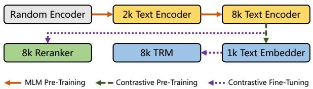
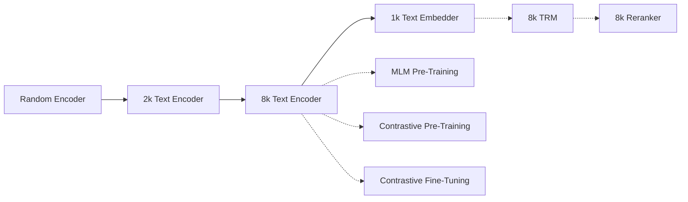
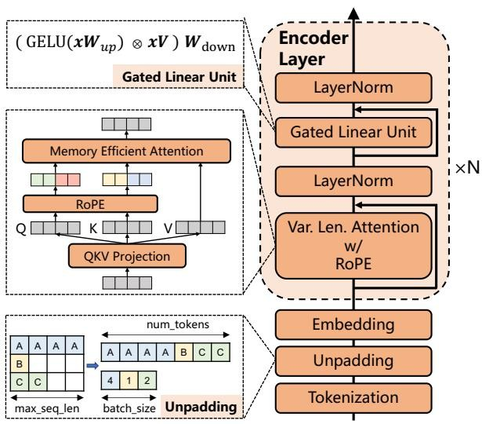
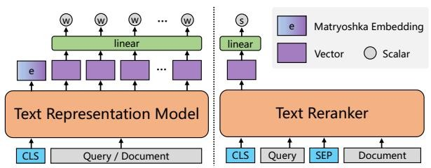
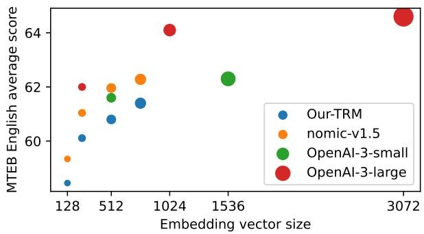
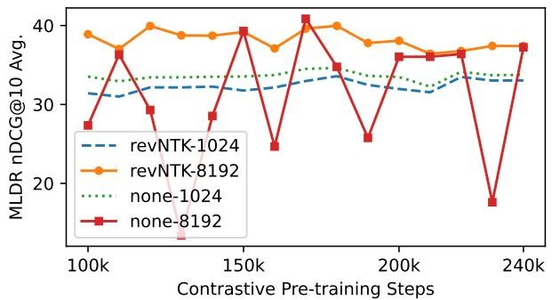

#

[page 1]

mGTE: Generalized Long-Context Text Representation and Reranking Models for Multilingual Text Retrieval

Xin Zhang $^{1,2}$ , Yanzhao Zhang $^{1}$ , Dingkun Long $^{1}$ , Wen Xie $^{1}$ , Ziqi Dai $^{1}$ , Jialong Tang $^{1}$ , Huan Lin $^{1}$ Baosong Yang $^{1}$ , Pengjun Xie $^{1}$ , Fei Huang $^{1}$ , Meishan Zhang $^{*}$ , Wenjie Li $^{2}$ , Min Zhang

$^{1}$ Tongyi Lab, Alibaba Group, $^{2}$ The Hong Kong Polytechnic University {linzhang.zx, zhangyanzhao.zyz, dingkun.ldk}@alibaba-inc.com

# Abstract

We present systematic efforts in building long-context multilingual text representation model (TRM) and reranker from scratch for text retrieval. We first introduce a text encoder (base size) enhanced with RoPE and unpadding, pretrained in a native 8192-token context (longer than 512 of previous multilingual encoders). Then we construct a hybrid TRM and a cross-encoder reranker by contrastive learning. Evaluations show that our text encoder outperforms the same-sized previous state-of-the-art XLM-R. Meanwhile, our TRM and reranker match the performance of large-sized state-of-the-art BGE-M3 models and achieve better results on long-context retrieval benchmarks. Further analysis demonstrate that our proposed models exhibit higher efficiency during both training and inference. We believe their efficiency and effectiveness could benefit various researches and industrial applications. $^{1}$

# 1 Introduction

Text retrieval aims to find relevant passages or documents from a large corpus given a query (Manning, 2008). It is often implemented as a multi-stage process, consisting of two main components: a retriever and a reranker (Gao et al., 2021a; Zhang et al., 2022; Zhao et al., 2024). The retriever identifies a set of candidate documents that are potentially relevant to the query based on the similarity between their sparse (lexical term weights) or/and dense representations from a text representation model (TRM). While the reranker reorders these retrieved candidates to refine the results based on the relevance score generated by a more precise yet computationally demanding model that processes both the query and a candidate document together.

Recent advances in large language models (LLMs) and retrieval augmented generation (RAG)



<details>
<summary>flowchart</summary>


</details>

Figure 1: Training pipeline. We first build an 8k long-context multilingual encoder. Then based on it, we train text representation and reranking models for retrieval.

(Gao et al., 2023) systems have led to an unprecedented surge in demand for versatile, plug-and-play TRMs and rerankers. These new applications heavily involve processing long and multilingual texts, which could not be addressed by conventional encoder-based models and urgently require upgraded ones. To this end, some resort to enhancing existing multilingual encoders, e.g., XLM-R (Conneau et al., 2020), with extended context window up to 8192 (Chen et al., 2024). Others turn to use multilingual LLMs which already have the required capabilities (Zhang et al., 2023a), but their models might be computationally expensive for self-hosted search services.

In the English community, it has been proven that training long-context encoders from scratch is promising for text retrieval (Günther et al., 2023; Nussbaum et al., 2024). In this work, we continue this journey, presenting systematic efforts in building the long-context multilingual text encoder, TRM, and reranker. We suggest a holistic pipeline (Figure 1) as well as several techniques in modeling and training for multilingual long-context retrieval.

Concretely, we first introduce a text encoder enhanced with Rotary Position Embedding (RoPE, Su et al., 2024) and unpadding (Portes et al., 2023), pre-trained by masked language modeling (MLM) (Devlin et al., 2019) via a two-stage curriculum for the native 8,192 tokens context. Based on our encoder, we propose a hybrid TRM capable of generating both elastic dense (Kusupati et al., 2022)



<details>
<summary>flowchart</summary>

```mermaid
graph TD
  subgraph Encoder Layer
    LayerNorm["LayerNorm"]
    GatedLinearUnit["Gated Linear Unit"]
    LayerNorm2["LayerNorm"]
    VarLenAttention["Var. Len. Attention w/ RoPE"]
  end

  subgraph Memory Efficient Attention
    QKVProjection["QKV Projection"]
    RoPE["RoPE"]
    MemoryEff["Memory Efficient Attention"]
  Q --> MemoryEff
  MemoryEff --> MemoryEff
  MemoryEff --> RoPE
  RoPE --> MemoryEff
  MemoryEff --> Q
  Q --> MemoryEff
  MemoryEff --> QKVProjection
  end

  subgraph Embedding
    Embedding["Embedding"]
    Unpadding["Unpadding"]
    Tokenization["Tokenization"]
  end

  subgraph Unpadding
  Unpadding --> Tokenization
  end

  subgraph Max_seq_len
    max_seq_len["max_seq_len"]
    batch_size["batch_size"]
    num_tokens["num_tokens"]
    A["A A A A"]
    B["B C C"]
    C["C C"]
  end

  subgraph GELU_xW_up_xV_W_down_GELU_xW_up_xV_W_down["(GELU(xW_up) ⊗ xV) W_down[\"(GELU(xW_up) ⊗ xV) W_down\"]"]
  end

  subgraph Gated Linear Unit
    GatedLinearUnit["Gated Linear Unit"]
  end

  subgraph QKVProjection
  QKVProjection --> MemoryEff
  QKVProjection --> MemoryEff
  QKVProjection --> RoPE
  QKVProjection --> MemoryEff
  QKVProjection --> QKVProjection
  QKVProjection --> QKVProjection
  end

  subgraph xN["(xN)"]
  EncoderLayer --> LayerNorm
  EncoderLayer --> GatedLinearUnit
  EncoderLayer --> LayerNorm2
  EncoderLayer --> VarLenAttention
  VarLenAttention --> VarLenAttention
  end
```
</details>

Figure 2: Our text encoder architecture.

[page 2]

and sparse vectors for efficient first-stage retrieval, as well as a cross-encoder reranker. We construct them via the contrastive learning objective (Wang et al., 2022; Li et al., 2023) with large-scale meticulously curated datasets, providing robust off-the-shelf retrieval models.

We conduct extensive experiments to verify our method. For the text encoder, we evaluate on two natural language understanding (NLU) benchmarks, i.e., XTREME-R (Ruder et al., 2021) and GLUE (Wang et al., 2018), and show that our encoder outperforms the same-sized previous state-of-the-art XLM-R. For the TRM and reranker, we evaluate on multiple retrieval benchmarks with multilingual and long-context settings, e.g., MIR-ACL (Zhang et al., 2023b) and MLDR (Chen et al., 2024), where our models match the performance of state-of-the-art BGE-M3 (Chen et al., 2024) and achieve better long-context performance by a smaller size. We open-source our models and code to facilitate further research and applications.

# 2 Method

# 2.1 Text Encoder

To construct powerful long-context multilingual text encoder models, we implement several enhancements to BERT (Devlin et al., 2019) architecture and train it from scratch using the vocabulary of XLM-R $^{2}$ (Conneau et al., 2020) series.

Specifically, we replace the absolute positional embeddings with RoPE (Su et al., 2024), and upgrade the feedforward network (FFN) to gated linear unit (GLU) (Shazeer, 2020). To ensure compat-

ibility with libraries like FlashAttention (Dao, 2023), we remove the dropout applied to attention scores. In addition, we pad the token embedding size to be a multiple of 64, which could speedup the model throughput (Portes et al., 2023).

Unpadding Mode Inspired by Portes et al. (2023), we unpad the input batch to reduce redundant computations associated with padding tokens (Figure 2). We use xFormers (Lefaudeux et al., 2022) to implement the variable length attention. It dispatch the attention forward and backward to different kernels $^{3}$ based on the numerical precision, attention head size and device type. We unpad the MLM labels as well to reduce the computation cost of predicting non-masked tokens.

Data We assemble our multilingual pre-training data from a combination of the following sources: C4 (Raffel et al., 2020), Skypile (Wei et al., 2023) (2021-2023 subsets), mC4 (Xue et al., 2021), CulturaX (Nguyen et al., 2024), Wikipedia (Foundation) and books (proprietary). We filter them and curate a dataset covering 75 Languages. Appendix Table 7 presents the statistics of our dataset.

Training Curriculum We pre-train the model via masked language modeling (MLM) (Devlin et al., 2019) $^{4}$ . The MLM probability is set to $30\%$ (Portes et al., 2023). Following Conneau and Lample (2019) and Conneau et al. (2020), the data from different languages is sampled by a multinomial distribution with probabilities $\{q_i\}_{i=1...N}$ , where

$$
q _ {i} = \frac {p _ {i} ^ {\alpha}}{\sum_ {j = 1} ^ {N} p _ {j} ^ {\alpha}} \text {with} p _ {i} = \frac {n _ {i}}{\sum_ {j = 1} ^ {N} n _ {j}}, \tag {1}
$$

and $n_{i}$ is the number of texts in language i. We set $\alpha = 0.5$ . This sampling strategy could increase texts from low-resource languages. To train the native 8192-context model more efficiently, we adopt a phased training curriculum (Xiong et al., 2024):

- MLM-2048: we chunk the input into 2048 tokens and set RoPE base to 10,000.
- MLM-8192: we chunk the input into 8192 tokens and set RoPE base to 160,000.

Through this method, we could train the model with a large context length in limited resources $^{5}$ .



<details>
<summary>flowchart</summary>

This diagram illustrates the architecture of a Text Representation Model and a Text Reranker, showing the data flow from input sources through processing layers (e, linear, vector) to final output outputs.
</details>

Figure 3: Our TRM and reranker.

[page 3]

Training Setup Following Portes et al. (2023), we use the learning rate decoupled $^{6}$ AdamW (Loshchilov and Hutter, 2018) with weight decay 1e-5. We disable gradient clipping (set to 0) (Liu et al., 2019). All models are trained on A100 GPU servers by BF16 PyTorch native automatic mixed precision via transformers (Wolf et al., 2020). We list the detailed hyper-parameters of each training stage in Appendix A.2 and Table 8. We denote the resulting models as mGTE-MLM-2048/8192.

# 2.2 Text Representation Model

Based on our encoder, we construct the TRM for the first-stage text retrieval in two steps: contrastive pre-training and fine-tuning (Wang et al., 2022; Li et al., 2023). Both steps share the same InfoNCE (Oord et al., 2018) learning objective:

$$
\mathcal {L} = - \log \frac {\exp (s (q , d ^ {+}) / \tau)}{\sum_ {i = 1} ^ {N} \exp (s (q , d ^ {i}) / \tau)}, \tag {2}
$$

where $\tau$ , q, and d denote the temperature parameter, query and document. The positive $d^{+}$ is the relevant document to q, and other irrelevant documents are negatives. These negatives can be either hard-negatives or in-batch negatives (documents of other instances in the same batch). $s(q, d)$ is the relevance score of q and d, measured by the dot product or cosine similarity between their respective representations.

Contrastive Pre-Training We take the encoder output hidden state of the [CLS] token as the dense representation (i.e., embedding) and compute the relevance score by cosine similarity. Our pre-training data (Appendix Table 9) comprise naturally occurring text pairs (e.g., question-answer pairs from Quora and StackExchange, title-content pairs of CommonCrawl), translation pairs (Team et al., 2024), and crosslingual instruction tuning data (Muennighoff et al., 2023b). We train the

model with a batch size of 16,384 and a learning rate of 5e-4 for 240k steps. Each batch is sampled from a single data source by the same distribution of Eq.1. The queries (resp. documents) are truncated to the max tokens of 512 (resp. 1024). We reverse scale the RoPE base from 160,000 to 20,000 to fit the 1024 context length and acquire the long-context retrieval ability (denotes revNTK, ablation in §3.4). We set $\tau$ of InfoNCE to 0.01 and only use in-batch negatives. More details refer to Appendix B.3. We denote this contrastive pretrained model as mGTE-CPT, which is actually an unsupervised embedding model.

Matryoshka Embedding Many of recently released models and APIs offer elastic embeddings by Matryoshka representation learning (MRL) (Kusupati et al., 2022), providing competitive sub-vectors of embeddings to save index storage and speedup search. Let $e \in R^{H}$ denotes an embedding and $e_{:d}$ is the sliced sub-vector from dimension 0 to d < H. MRL $^{7}$ optimizes the weighted sum of multiple losses from different d dimensional sub-vectors, i.e., compute InfoNCE by $s_{d}(\boldsymbol{e}_{:d}^{q}, \boldsymbol{e}_{:d}^{d})$ . We add this objective to our TRM fine-tuning stage.

Sparse Representation Chen et al. (2024) show that neural sparse representations (term/token weights predicted by TRM) could greatly improve the long-context retrieval performance. We follow this design, computing the term weight $w_{t}$ of each token of the input by $w_{t} = \mathrm{ReLU}(\boldsymbol{W}\boldsymbol{h}_{t})$ , where $\boldsymbol{h}_{t}$ is the encoder hidden state of token $t$ with dimension size $H$ and $\boldsymbol{W} \in \mathbb{R}^{H \times 1}$ is randomly initialized. If a token appears multiple times in the text, we keep the max weight. The relevance score is computed by the joint importance of the co-occurring terms (denoted as $q \cap d$ ) within the query and document pair: $s_{\mathrm{sparse}}(q, d) = \sum_{t \in q \cap d} (w_{t}^{q} \cdot w_{t}^{d})$ . This is then used to derive the InfoNCE loss for training.

Contrastive Fine-Tuning Now we construct the TRM by multi-task learning of matryoshka embedding and sparse representation:

$$
\mathcal {L} _ {\mathrm{TRM}} = \lambda \mathcal {L} _ {\text {sparse}} + \sum_ {d \in D} w _ {d} \mathcal {L} _ {: d}, \tag {3}
$$

where $D = \{32k \mid k \in N, k \geq 1, 32k \leq H\}$ is MRL dimension set, $w_{d}$ is the weight of dimension d, and $\lambda$ is the weight of sparse representation loss.

<table><tr><td rowspan="2">Model</td><td rowspan="2">Avg.</td><td rowspan="2">Pair Class. XNLI</td><td rowspan="2">M.C. XCOPA</td><td colspan="2">Structure Prediction</td><td colspan="3">Question Answering</td><td colspan="3">Cross-lingual Retrieval</td></tr><tr><td>UDPOS</td><td>WikiANN</td><td>XQuAD</td><td>MLQA</td><td>TyDiQA-GoldP</td><td>Mewsli-X</td><td>LAReQA</td><td>Tatoeba</td></tr><tr><td colspan="2">#Languages (Total 50)</td><td>15</td><td>11</td><td>38</td><td>47</td><td>11</td><td>7</td><td>9</td><td>38</td><td>11</td><td>38</td></tr><tr><td colspan="2">Metrics</td><td>Acc.</td><td>Acc.</td><td>F1</td><td>F1</td><td>F1/EM</td><td>F1/EM</td><td>F1/EM</td><td>mAP@20</td><td>mAP@20</td><td>Acc.</td></tr><tr><td>mBERT-base</td><td>59.43</td><td>66.63</td><td>55.49</td><td>71.80</td><td>62.34</td><td>66.23 / 51.03</td><td>57.37 / 42.44</td><td>55.01 / 38.05</td><td>44.65</td><td>75.26</td><td>39.49</td></tr><tr><td>XLM-R-base</td><td>62.02</td><td>74.50</td><td>50.45</td><td>73.84</td><td>61.23</td><td>72.83 / 58.01</td><td>61.54 / 46.45</td><td>53.09 / 37.11</td><td>42.09</td><td>63.43</td><td>67.20</td></tr><tr><td>mGTE-MLM-2048</td><td>65.24</td><td>73.17</td><td>63.62</td><td>73.25</td><td>60.87</td><td>75.33 / 60.00</td><td>64.02 / 48.57</td><td>53.58 / 36.68</td><td>44.41</td><td>72.13</td><td>72.02</td></tr><tr><td>mGTE-MLM-8192</td><td>64.44</td><td>73.37</td><td>61.98</td><td>73.14</td><td>59.83</td><td>74.81 / 59.37</td><td>64.24 / 48.80</td><td>49.85 / 33.27</td><td>44.52</td><td>71.54</td><td>71.10</td></tr></table>

Table 1: XTREME-R (Ruder et al., 2021) results in the cross-lingual zero-shot transfer (models are trained on English data) setting. M.C. stands for Multiple Choice. The EM scores are not included in the average.

<table><tr><td>Model</td><td>Params</td><td>Pos.</td><td>Seq. Len.</td><td>GLUE Avg.</td></tr><tr><td>RoBERTa-base $^{\alpha}$ </td><td>125M</td><td>Abs.</td><td>512</td><td>86.4</td></tr><tr><td>XLM-R-base</td><td>279M</td><td>Abs.</td><td>512</td><td>80.44</td></tr><tr><td>mGTE-MLM-2048</td><td rowspan="2">305M</td><td rowspan="2">RoPE</td><td>2048</td><td>83.42</td></tr><tr><td>mGTE-MLM-8192</td><td>8192</td><td>83.47</td></tr></table>

Table 2: GLUE (Wang et al., 2018) devset averages (w/o WNLI). The detailed scores for each subset are shown in Table 13. $\alpha$ Taken from Table 8 of Liu et al. (2019). The rest are from our runs, refer to Appendix C.2.

[page 4]

We fine-tune our contrastive pre-trained embedding model on diverse high-quality datasets with hard-negatives (e.g., MS MARCO (Nguyen et al., 2016), MIRACL (Zhang et al., 2023b), listed in Table 11). We adopt a dynamic batching strategy (Chen et al., 2024) to fine-tune 8192-context data. The batch sampling strategy is the same as the pre-training stage. The $\tau$ of MRL and sparse is set to 0.05 and 0.01 respectively. Other details refer to Appendix B.3. We denote this fine-tuned model as mGTE-TRM.

# 2.3 Text Reranking Model

We also build a reranker using the cross-encoder architecture. It takes the query q and document d together as input: [CLS] q [SEP] d, and directly predicts their relevance score by the [CLS] output state: $s_{rerank} = Wh_{[CLS]}$ . In our experiment, $W \in R^{H \times 1}$ is randomly initialized.

The model is fine-tuned by InfoNCE in one step $^{8}$ based on our pre-trained 8k-context text encoder model. Unless otherwise specified, we employ identical data and training settings as our TRM fine-tuning stage ( $§2.2$ ). The difference lies in our adjustment of the hard-negatives. We describe the detailed settings in Appendix B.4. We denote this model as mGTE-reranker.

<table><tr><td>Model</td><td>Seq.</td><td>en</td><td>zh</td><td>fr</td><td>pl</td></tr><tr><td>BGE-M3-unsupervised $^{\dagger}$ </td><td>8192</td><td>56.48</td><td>57.53</td><td>57.95</td><td>55.98</td></tr><tr><td rowspan="2">mGTE-CPT</td><td>512*</td><td>60.16</td><td>58.67</td><td>59.72</td><td>57.66</td></tr><tr><td>8192</td><td>60.04</td><td>58.63</td><td>59.74</td><td>57.11</td></tr><tr><td>mE5-base</td><td>514</td><td>59.45</td><td>56.21</td><td>56.19</td><td>55.62</td></tr><tr><td>mE5-large</td><td>514</td><td>61.50</td><td>58.81</td><td>56.07</td><td>60.08</td></tr><tr><td>BGE-M3 (Dense) $^{\dagger}$ </td><td>8192</td><td>59.84</td><td>60.80</td><td>58.79</td><td>60.35</td></tr><tr><td>mGTE-TRM (Dense)</td><td>8192</td><td>61.40</td><td>62.72</td><td>59.79</td><td>58.22</td></tr><tr><td>E5-mistral-7b</td><td>32768</td><td>66.63</td><td>60.81</td><td>48.33</td><td>-</td></tr><tr><td>voyage-multilingual-2</td><td>32000</td><td>-</td><td>-</td><td>61.65</td><td>-</td></tr><tr><td>Cohere-multilingual-v3.0</td><td>512</td><td>64.01</td><td>-</td><td>56.02</td><td>-</td></tr><tr><td>OpenAI-3-large</td><td>8191</td><td>64.59</td><td>-</td><td>-</td><td>-</td></tr><tr><td>OpenAI-3-small</td><td>8191</td><td>62.26</td><td>-</td><td>-</td><td>-</td></tr></table>

Table 3: Embedding model performance on MTEB English (Muennighoff et al., 2023a), Chinese (Xiao et al., 2024), French (Ciancone et al., 2024) and Polish (Poświata et al., 2024). The scores of other models are retrieved from the MTEB online leaderboard. \*To be consistent with the setting in contrastive pre-training, in retrieval tasks, the max sequence length of the document side is set to 1024. †Denote our runs.

# 3 Evaluation

We separately evaluate our text encoder in §3.1, TRM and reranker in §3.2 and §3.3.

# 3.1 Natural Language Understanding

We evaluate the encoder on the cross-lingual natural language understanding (NLU) benchmark XTREME-R $^{9}$ (Ruder et al., 2021) and the English NLU benchmark GLUE (Wang et al., 2018). Results show that our encoder outperforms the same-sized previous state-of-the-art XLM-R (Conneau et al., 2020) on all benchmarks.

XTREME-R We focus on the zero-shot cross-lingual transfer setting where models are fine-tuned on English trainset and tested on multi- and cross-lingual data. The fine-tuning setup is described in Appendix C.1. We run mBERT-base,

<table><tr><td>Metric#languages (Total 33)</td><td>Params</td><td>Seq. Len.</td><td>Avg.</td><td>MLDRnDCG@1013</td><td>MIRACLnDCG@1018</td><td>MKQArecall@2025</td><td>BEIRnDCG@101</td><td>LoCnDCG@101</td></tr><tr><td>BM25</td><td>-</td><td>-</td><td>47.0</td><td>53.6</td><td>31.9</td><td>28.1</td><td>41.7</td><td>79.9</td></tr><tr><td>mE5-base</td><td>279M</td><td>514</td><td>53.5</td><td>30.5</td><td>62.3</td><td>53.7</td><td>48.9</td><td>72.2</td></tr><tr><td>mE5-large</td><td>560M</td><td>514</td><td>57.7</td><td>34.2</td><td>65.4</td><td>63.5</td><td>51.4</td><td>74.3</td></tr><tr><td>E5-mistral-7b</td><td>7111M</td><td>32768</td><td>62.4</td><td>42.6</td><td>62.2</td><td>62.4</td><td>56.9</td><td>87.8</td></tr><tr><td>OpenAI-3-large</td><td>-</td><td>8191</td><td>-</td><td>-</td><td>54.9</td><td>62.1</td><td>55.4</td><td>79.4</td></tr><tr><td>BGE-M3 Dense</td><td></td><td></td><td>64.3</td><td>52.5</td><td>67.7</td><td>67.8</td><td>48.7</td><td>84.9</td></tr><tr><td>BGE-M3 Sparse</td><td>568M</td><td>8192</td><td>55.1</td><td>62.2</td><td>53.9</td><td>36.3</td><td>38.3</td><td>84.9</td></tr><tr><td>BGE-M3 Dense + Sparse</td><td></td><td></td><td>67.7</td><td>64.8</td><td>68.9</td><td>68.1</td><td>49.4</td><td>87.4</td></tr><tr><td>mGTE-TRM Dense</td><td></td><td></td><td>66.7</td><td>56.6</td><td>62.1</td><td>65.8</td><td>51.1</td><td>88.9</td></tr><tr><td>mGTE-TRM Sparse</td><td>304M</td><td>8192</td><td>57.2</td><td>71.0</td><td>55.9</td><td>31.6</td><td>39.2</td><td>88.1</td></tr><tr><td>mGTE-TRM Dense + Sparse</td><td></td><td></td><td>68.9</td><td>71.3</td><td>64.5</td><td>66.0</td><td>51.4</td><td>91.3</td></tr></table>

Table 4: Retrieval results on MIRACL (Zhang et al., 2023b) and MLDR (Chen et al., 2024) (multilingual), MKQA (Longpre et al., 2021) (crosslingual), BEIR (Thakur et al., 2021) and LoCo (Saad-Falcon et al., 2024) (English).



<details>
<summary>bubble</summary>

| Model | Embedding vector size | MTEB English average score |
| --- | --- | --- |
| Our-TRM | 128 | ~58.5 |
| Our-TRM | 240 | ~60.1 |
| Our-TRM | 512 | ~60.8 |
| Our-TRM | 800 | ~61.4 |
| nomic-v1.5 | 128 | ~59.4 |
| nomic-v1.5 | 240 | ~61.0 |
| nomic-v1.5 | 512 | ~62.0 |
| nomic-v1.5 | 800 | ~62.3 |
| OpenAI-3-small | 512 | ~61.6 |
| OpenAI-3-small | 1536 | ~62.3 |
| OpenAI-3-large | 1024 | ~64.1 |
| OpenAI-3-large | 3072 | ~64.6 |
</details>

Figure 4: Elastic embedding results on MTEB English.

[page 5]

XLM-R-base, and our encoder, as shown in Table 1. Our 2048 and 8192 encoder models achieve average scores that are higher than those of XLM-R by 3.22 and 2.42 points, respectively.

GLUE We also report the performance on the devset of GLUE benchmark (Wang et al., 2018). The fine-tuning details refer to Appendix C.2. Table 2 presents the average scores (Table 13 provides the full results). Our models consistently outperform XLM-R-base and reasonably lag behind the English RoBERTa-base (Liu et al., 2019).

# 3.2 Text Embedding

Our contrastive pre-training actually yields a text embedding model. To understand the pre-training and fine-tuning of TRM, and to compare with other models, we first run the most popular text embedding benchmark MTEB (Muennighoff et al., 2023a) as well as its Chinese, French and Polish versions.

Multilingual MTEB The results in Table 3 also present the scores of LLM-based models and commercial APIs for reference. For contrastive pre-trained models, our model outper-

forms BGE-M3-unsupervised (Chen et al., 2024) on all four subsets, through our backbone has fewer params than XLM-R-large. Comparing with BGE-M3 and mE5 (Wang et al., 2024b), our final TRM achieves best scores on Chinese and French, and is competitive on English.

Elastic Embedding We compare our TRM (only elastic embeddings) with open-source model and commercial APIs on MTEB English (Figure 4). Our model presents close scores to the same-sized English-only nomic-v1.5, which is promising for a multilingual model. However, it is still behind OpenAI APIs, which is reasonable since they are guessed to be much larger models.

# 3.3 Text Retrieval

We conduct evaluations to our TRM and reranker on retrieval benchmarks in multilingual (Miracl (Zhang et al., 2023b) and MLDR (Chen et al., 2024)), crosslingual (MKQA (Longpre et al., 2021)) setting, and the commonly used English BEIR (Thakur et al., 2021) and LoCo (Saad-Falcon et al., 2024). Our models are close to the state-of-the-art large models on Miracl, MKQA and BEIR, while achieve better scores on long-context datasets MLDR and LoCo. Details are in Appendix E.

First-Stage Retrieval We compare our TRM to the hybrid model BGE-M3 (Chen et al., 2024), dense models like mE5 (Wang et al., 2024b) and E5-mistral-7b (Wang et al., 2024a), and BM25. As shown in Table 4, our TRM consistently outperforms mE5 and OpenAI APIs, better than BGE-M3 on MLDR, and close to it on the rest parts.

<table><tr><td>Metric#languages (Total 33)</td><td>Params</td><td>Seq. Len.</td><td>Avg.</td><td>MLDRnDCG@1013</td><td>MIRACLnDCG@1018</td><td>MKQArecall@2025</td><td>BEIRnDCG@101</td></tr><tr><td>Retrieval (mGTE-TRM Dense)</td><td>304M</td><td>8192</td><td>58.9</td><td>56.6</td><td>62.1</td><td>65.8</td><td>50.9</td></tr><tr><td>jina-reranker-v2-multilingual</td><td>278M</td><td>8192</td><td>59.4</td><td>53.2</td><td>65.8</td><td>68.8</td><td>49.7</td></tr><tr><td>bge-reranker-v2-m3</td><td>568M</td><td>8192</td><td>65.7</td><td>66.8</td><td>72.6</td><td>68.7</td><td>54.6</td></tr><tr><td>mGTE-reranker</td><td>304M</td><td>8192</td><td>67.4</td><td>78.7</td><td>68.5</td><td>67.2</td><td>55.4</td></tr></table>

Table 5: Results of reranking based on the candidates retrieved by our TRM dense model (refer to Table 4).

<table><tr><td>Model</td><td>Attn.</td><td>Unpad.</td><td>Encoding Time</td><td>Search Latency</td></tr><tr><td>BGE-M3</td><td>eagerSDPA-MEA</td><td>×</td><td>1800s744s</td><td>20.35ms</td></tr><tr><td rowspan="3">mGTE-TRM</td><td>eagerSDPA-MEA</td><td>×</td><td>695s298s</td><td rowspan="3">15.07ms</td></tr><tr><td>eagerSDPA-MEA</td><td>√</td><td>675s279s</td></tr><tr><td>MEA</td><td>√</td><td>52s</td></tr></table>

Table 6: Dense retrieval efficiency. Encoding time is running MLDR-hi corpus (3806 texts with average 4456 tokens after truncating to maximum 8192) on one A100 GPU with FP16. Search latency is measured on a faiss index with 8.8M texts. MEA is the memory-efficient attention in xFormers. SDPA-MEA denotes MEA dispatched by scaled dot-product attention of PyTorch.

[page 6]

Reranking In Table 5, we evaluate rerankers based on the candidates retrieved by Our-TRM dense model. Our model outperforms the powerful bge-reranker-v2-m3 (Chen et al., 2024) with a smaller size. Moreover, it greatly surpasses the same-sized jina-reranker-v2-multilingual.

# 3.4 Analysis

Efficiency We compare the efficiency of our TRM with BGE-M3 on dense retrieval in Table 6. To simulate the real-world scenario, the encoding time is the duration of encoding texts without length grouping. Our TRM is up to 14 times faster than BGE-M3 (52s v.s. 744s). The end-to-end unpadding with xFormers is crucial for encoding, which reduces the time by 5 times (52s v.s. 279s).

Scaled Contrastive Pre-Training We utilize the reversed NTK scaling in contrastive pre-training to reduce required text length, where we set the RoPE base to 1/8 of the original and train the 8k encoder with 1k max length. To evaluate the effectiveness, we run the same training without the reversed NTK, comparing the MLDR scores in Figure 5. With revNTK, models exhibit slightly lower



<details>
<summary>line</summary>

| Contrastive Pre-training Steps | revNTK-1024 | revNTK-8192 | none-1024 | none-8192 |
| --- | --- | --- | --- | --- |
| 100k | ~31.5 | ~39 | ~33.5 | ~27.5 |
| 110k | ~31 | ~37 | ~33 | ~36.5 |
| 120k | ~32 | ~40 | ~33.5 | ~29.5 |
| 130k | ~32.5 | ~39 | ~33.5 | ~13 |
| 140k | ~32.5 | ~39 | ~33.5 | ~28.5 |
| 150k | ~32 | ~39.5 | ~33.5 | ~39.5 |
| 160k | ~32.5 | ~37 | ~33.5 | ~25 |
| 170k | ~33 | ~40 | ~34.5 | ~41 |
| 180k | ~33.5 | ~40 | ~34.5 | ~35 |
| 190k | ~32.5 | ~38 | ~33.5 | ~26 |
| 200k | ~32 | ~38.5 | ~33 | ~36 |
| 210k | ~31.5 | ~36.5 | ~32.5 | ~36 |
| 220k | ~33.5 | ~36.5 | ~33.5 | ~36.5 |
| 230k | ~33 | ~37.5 | ~33.5 | ~18 |
| 240k | ~33 | ~37.5 | ~33.5 | ~37.5 |
</details>

Figure 5: MLDR scores in contrastive pre-training. none keeps the RoPE untouched in pre-training. 1024 and 8192 are the max sequence length in evaluations. revNTK-8912 recovers the 8k context by NTK scaling.

performance on 1k context but achieve more stable 8k performance across different training steps.

# 4 Related Work

Training long-context TRMs has become a hot topic recently. OpenAI released 8191 context APIs (Neelakantan et al., 2022) have set the target for open-source community. Portes et al. (2023) and Günther et al. (2023) replace position embedding of BERT with Alibi (Press et al., 2022) attention bias and pre-train from scratch, which is shown to be effective in build 8k TRMs. Nussbaum et al. (2024) explore the more powerful RoPE (Su et al., 2024) in BERT pre-training and their 2048-context pre-trained encoder achieve better retrieval performance on English. Zhu et al. (2024) suggest patch E5 (Wang et al., 2022) with RoPE. We also use RoPE and provide multi-stage training for native 8192-context text encoder, TRM, and reranker.

Chen et al. (2024) propose long-context multilingual TRM and reranker based on XLM-RoBERTa-large (Conneau et al., 2020) by extending position embedding to 8192 via continue training. We pretrain native 8k multilingual models from scratch for better long-context performance and efficiency.

#

[page 7]

5 Conclusion

We present the holistic practice of building native 8192-context multilingual retrieval models. We first suggest a text encoder with RoPE and unpadding, which is pre-trained by a two-stage MLM curriculum for 8k context. Evaluations on NLU benchmarks show that our encoder outperforms XLM-RoBERTa in the same size. Based on our encoder, we construct a hybrid TRM and a cross-encoder reranker by contrastive learning. The TRM is pre-trained with reversed RoPE NTK scaling and fine-tuned to generate both Matryoshka embeddings and sparse representations. Results on monolingual and crosslingual retrieval benchmarks show that our TRM and reranker are close to larger ones on regular datasets, and achieve better performance on long-context datasets. This means our models are more efficient for industrial applications.

# Acknowledgements

This work was supported by Alibaba Research Intern Program.

# References

Mikel Artetxe, Sebastian Ruder, and Dani Yogatama. 2020. On the cross-lingual transferability of monolingual representations. In Proc. of the ACL, pages 4623–4637, Online.
Luiz Bonifacio, Vitor Jeronymo, Hugo Queiroz Abonizio, Israel Campiotti, Marzieh Fadaee, Roberto Lotufo, and Rodrigo Nogueira. 2021. mMARCO: A multilingual version of the ms marco passage ranking dataset. arXiv preprint arXiv:2108.13897.
Daniel Cer, Mona Diab, Eneko Agirre, Iñigo Lopez-Gazpio, and Lucia Specia. 2017. SemEval-2017 task 1: Semantic textual similarity multilingual and crosslingual focused evaluation. In Proc. of the 11th International Workshop on Semantic Evaluation (SemEval-2017), pages 1–14, Vancouver, Canada.
Jianlyu Chen, Shitao Xiao, Peitian Zhang, Kun Luo, Defu Lian, and Zheng Liu. 2024. M3-embedding: Multi-linguality, multi-functionality, multi-granularity text embeddings through self-knowledge distillation. In Findings of the ACL, pages 2318–2335, Bangkok, Thailand and virtual meeting.
Tianqi Chen, Bing Xu, Chiyuan Zhang, and Carlos Guestrin. 2016. Training deep nets with sublinear memory cost. arXiv preprint arXiv:1604.06174.
Mathieu Ciancone, Imene Kerboua, Marion Schaeffer, and Wissam Siblini. 2024. MTEB-French: Resources for french sentence embedding evaluation and analysis. arXiv preprint arXiv:2405.20468.
Jonathan H. Clark, Eunsol Choi, Michael Collins, Dan Garrette, Tom Kwiatkowski, Vitaly Nikolaev, and Jennimaria Palomaki. 2020. TyDi QA: A benchmark for information-seeking question answering in typologically diverse languages. Transactions of the Association for Computational Linguistics, 8:454–470.
Alexis Conneau, Kartikay Khandelwal, Naman Goyal, Vishrav Chaudhary, Guillaume Wenzek, Francisco Guzmán, Edouard Grave, Myle Ott, Luke Zettlemoyer, and Veselin Stoyanov. 2020. Unsupervised cross-lingual representation learning at scale. In Proc. of the ACL, pages 8440–8451, Online.
Alexis Conneau and Guillaume Lample. 2019. Cross-lingual language model pretraining. In Proc. of the 33rd NeurIPS, pages 7057–7067.
Alexis Conneau, Ruty Rinott, Guillaume Lample, Adina Williams, Samuel Bowman, Holger Schwenk, and Veselin Stoyanov. 2018. XNLI: Evaluating cross-lingual sentence representations. In Proc. of the EMNLP, pages 2475–2485, Brussels, Belgium.
Slawomir Dadas, Michał Perełkiewicz, and Rafał Poświata. 2024. PIRB: A comprehensive benchmark of Polish dense and hybrid text retrieval methods. In Proc. of the LREC-COLING, pages 12761–12774, Torino, Italia. ELRA and ICCL.
Tri Dao. 2023. Flashattention-2: Faster attention with better parallelism and work partitioning. In The Twelfth International Conference on Learning Representations.
Marie-Catherine de Marneffe, Christopher D. Manning, Joakim Nivre, and Daniel Zeman. 2021. Universal Dependencies. Computational Linguistics, 47(2):255–308.
Jacob Devlin, Ming-Wei Chang, Kenton Lee, and Kristina Toutanova. 2019. BERT: Pre-training of deep bidirectional transformers for language understanding. In Proc. of the NAACL-HTL, pages 4171–4186, Minneapolis, Minnesota.
William B. Dolan and Chris Brockett. 2005. Automatically constructing a corpus of sentential paraphrases. In Proc. of the Third International Workshop on Paraphrasing (IWP2005).
Facebook. 2019. Tatoeba test set. https://github.com/facebookresearch/LASER/tree/main/data/tatoeba/v1.
Wikimedia Foundation. Wikimedia downloads.
Luyu Gao, Zhuyun Dai, and Jamie Callan. 2021a. Rethink training of bert rerankers in multi-stage retrieval pipeline. In Proc. of the 43rd European Conference on IR Research, page 280–286, Berlin, Heidelberg.
Tianyu Gao, Xingcheng Yao, and Danqi Chen. 2021b. SimCSE: Simple contrastive learning of sentence embeddings. In Proc. of the EMNLP, pages 6894–6910, Online and Punta Cana, Dominican Republic.
Yunfan Gao, Yun Xiong, Xinyu Gao, Kangxiang Jia, Jinliu Pan, Yuxi Bi, Yi Dai, Jiawei Sun, and Haofen Wang. 2023. Retrieval-augmented generation for large language models: A survey. arXiv preprint arXiv:2312.10997.
Michael Günther, Jackmin Ong, Isabelle Mohr, Alaed-dine Abdessalem, Tanguy Abel, Mohammad Kalim Akram, Susana Guzman, Georgios Mastrapas, Saba Sturua, Bo Wang, et al. 2023. Jina embeddings 2:8192-token general-purpose text embeddings for long documents. arXiv preprint arXiv:2310.19923.
Junjie Hu, Sebastian Ruder, Aditya Siddhant, Graham Neubig, Orhan Firat, and Melvin Johnson. 2020. XTREME: A massively multilingual multitask benchmark for evaluating cross-lingual generalisation. In International Conference on Machine Learning, pages 4411–4421. PMLR.
Junqin Huang, Zhongjie Hu, Zihao Jing, Mengya Gao, and Yichao Wu. 2024. Piccolo2: General text embedding with multi-task hybrid loss training. arXiv preprint arXiv:2405.06932.
Mandar Joshi, Eunsol Choi, Daniel Weld, and Luke Zettlemoyer. 2017. TriviaQA: A large scale distantly supervised challenge dataset for reading comprehension. In Proc. of the ACL, pages 1601–1611, Vancouver, Canada.
Aditya Kusupati, Gantavya Bhatt, Aniket Rege, Matthew Wallingford, Aditya Sinha, Vivek Ramanujan, William Howard-Snyder, Kaifeng Chen, Sham Kakade, Prateek Jain, et al. 2022. Matryoshka representation learning. In Proc. of the 36th NeurIPS, pages 30233–30249.
Tom Kwiatkowski, Jennimaria Palomaki, Olivia Redfield, Michael Collins, Ankur Parikh, Chris Alberti, Danielle Epstein, Illia Polosukhin, Jacob Devlin, Kenton Lee, Kristina Toutanova, Llion Jones, Matthew Kelcey, Ming-Wei Chang, Andrew M. Dai, Jakob Uszkoreit, Quoc Le, and Slav Petrov. 2019. Natural questions: A benchmark for question answering research. Transactions of the Association for Computational Linguistics, 7:452–466.
Chankyu Lee, Rajarshi Roy, Mengyao Xu, Jonathan Raiman, Mohammad Shoeybi, Bryan Catanzaro, and Wei Ping. 2024a. Nv-embed: Improved techniques for training llms as generalist embedding models. arXiv preprint arXiv:2405.17428.
Jinhyuk Lee, Zhuyun Dai, Xiaoqi Ren, Blair Chen, Daniel Cer, Jeremy R Cole, Kai Hui, Michael Boratko, Rajvi Kapadia, Wen Ding, et al. 2024b. Gecko: Versatile text embeddings distilled from large language models. arXiv preprint arXiv:2403.20327.
Sean Lee, Aamir Shakir, Darius Koenig, and Julius Lipp. 2024c. Open source strikes bread - new fluffy embeddings model.
Benjamin Lefaudeux, Francisco Massa, Diana Liskovich, Wenhan Xiong, Vittorio Caggiano,
Sean Naren, Min Xu, Jieru Hu, Marta Tintore, Susan Zhang, Patrick Labatut, and Daniel Haziza. 2022. xformers: A modular and hackable transformer modelling library. https://github.com/facebookresearch/xformers.
Patrick Lewis, Barlas Oguz, Ruty Rinott, Sebastian Riedel, and Holger Schwenk. 2020. MLQA: Evaluating cross-lingual extractive question answering. In Proc. of ACL, pages 7315–7330, Online.
Zehan Li, Xin Zhang, Yanzhao Zhang, Dingkun Long, Pengjun Xie, and Meishan Zhang. 2023. Towards general text embeddings with multi-stage contrastive learning. arXiv preprint arXiv:2308.03281.
Xiaoran Liu, Hang Yan, Chenxin An, Xipeng Qiu, and Dahua Lin. 2024. Scaling laws of rope-based extrapolation. In The Twelfth International Conference on Learning Representations.
Yinhan Liu, Myle Ott, Naman Goyal, Jingfei Du, Mandar Joshi, Danqi Chen, Omer Levy, Mike Lewis, Luke Zettlemoyer, and Veselin Stoyanov. 2019. Roberta: A robustly optimized bert pretraining approach. arXiv preprint arXiv:1907.11692.
Dingkun Long, Qiong Gao, Kuan Zou, Guangwei Xu, Pengjun Xie, Ruijie Guo, Jian Xu, Guanjun Jiang, Luxi Xing, and Ping Yang. 2022. Multi-cpr: A multi domain chinese dataset for passage retrieval. In Proc. of the 45th SIGIR, page 3046–3056, New York, NY, USA. Association for Computing Machinery.
Shayne Longpre, Yi Lu, and Joachim Daiber. 2021. MKQA: A linguistically diverse benchmark for multilingual open domain question answering. Transactions of the Association for Computational Linguistics, 9:1389–1406.
Ilya Loshchilov and Frank Hutter. 2018. Decoupled weight decay regularization. In International Conference on Learning Representations.
Christopher D Manning. 2008. Introduction to information retrieval. Syngress Publishing,.
Xin Men, Mingyu Xu, Bingning Wang, Qingyu Zhang, Hongyu Lin, Xianpei Han, and Weipeng Chen. 2024. Base of rope bounds context length. arXiv preprint arXiv:2405.14591.
Niklas Muennighoff, SU Hongjin, Liang Wang, Nan Yang, Furu Wei, Tao Yu, Amanpreet Singh, and Douwe Kiela. 2024. Generative representational instruction tuning. In ICLR 2024 Workshop: How Far Are We From AGI.
Niklas Muennighoff, Nouamane Tazi, Loic Magne, and Nils Reimers. 2023a. MTEB: Massive text embedding benchmark. In Proc. of the EACL, pages 2014–2037, Dubrovnik, Croatia.
Niklas Muennighoff, Thomas Wang, Lintang Sutawika, Adam Roberts, Stella Biderman, Teven Le Scao,
M Saiful Bari, Sheng Shen, Zheng Xin Yong, Hailey Schoelkopf, Xiangru Tang, Dragomir Radev, Alham Fikri Aji, Khalid Almubarak, Samuel Albanie, Zaid Alyafeai, Albert Webson, Edward Raff, and Colin Raffel. 2023b. Crosslingual generalization through multitask finetuning. In Proc. of the 61st ACL, pages 15991–16111, Toronto, Canada.
Arvind Neelakantan, Tao Xu, Raul Puri, Alec Radford, Jesse Michael Han, Jerry Tworek, Qiming Yuan, Nikolas Tezak, Jong Wook Kim, Chris Hallacy, et al. 2022. Text and code embeddings by contrastive pretraining. arXiv preprint arXiv:2201.10005.
Thuat Nguyen, Chien Van Nguyen, Viet Dac Lai, Hieu Man, Nghia Trung Ngo, Franck Dernoncourt, Ryan A. Rossi, and Thien Huu Nguyen. 2024. CulturaX: A cleaned, enormous, and multilingual dataset for large language models in 167 languages. In Proc. of the 2024 LREC-COLING, pages 4226–4237, Torino, Italia. ELRA and ICCL.
Tri Nguyen, Mir Rosenberg, Xia Song, Jianfeng Gao, Saurabh Tiwary, Rangan Majumder, and Li Deng. 2016. MS MARCO: A human generated machine reading comprehension dataset. In Proc. of the Workshop on Cognitive Computation: Integrating neural and symbolic approaches 2016, volume 1773 of CEUR Workshop Proceedings.
Zach Nussbaum, John X Morris, Brandon Duderstadt, and Andriy Mulyar. 2024. Nomic embed: Training a reproducible long context text embedder. arXiv preprint arXiv:2402.01613.
Aaron van den Oord, Yazhe Li, and Oriol Vinyals. 2018. Representation learning with contrastive predictive coding. arXiv preprint arXiv:1807.03748.
Edoardo Maria Ponti, Goran Glavaš, Olga Majewska, Qianchu Liu, Ivan Vulić, and Anna Korhonen. 2020. XCOPA: A multilingual dataset for causal commonsense reasoning. In Proc. of the EMNLP, pages 2362–2376, Online.
Jacob Portes, Alexander R Trott, Sam Havens, Daniel King, Abhinav Venigalla, Moin Nadeem, Nikhil Sardana, Daya Khudia, and Jonathan Frankle. 2023. MosaicBERT: A bidirectional encoder optimized for fast pretraining. In Thirty-seventh Conference on Neural Information Processing Systems.
Rafał Poświata, Sławomir Dadas, and Michał Perełkiewicz. 2024. Pl-mteb: Polish massive text embedding benchmark. arXiv preprint arXiv:2405.10138.
Ofir Press, Noah Smith, and Mike Lewis. 2022. Train short, test long: Attention with linear biases enables input length extrapolation. In International Conference on Learning Representations.
Yifu Qiu, Hongyu Li, Yingqi Qu, Ying Chen, Qiao-Qiao She, Jing Liu, Hua Wu, and Haifeng Wang. 2022. DuReader-retrieval: A large-scale Chinese
benchmark for passage retrieval from web search engine. In Proc. of the EMNLP, pages 5326–5338, Abu Dhabi, United Arab Emirates.
Markus N Rabe and Charles Staats. 2021. Self-attention does not need o(n2) memory. arXiv preprint arXiv:2112.05682.
Colin Raffel, Noam Shazeer, Adam Roberts, Katherine Lee, Sharan Narang, Michael Matena, Yanqi Zhou, Wei Li, and Peter J Liu. 2020. Exploring the limits of transfer learning with a unified text-to-text transformer. Journal of machine learning research, 21(140):1–67.
Afshin Rahimi, Yuan Li, and Trevor Cohn. 2019. Massively multilingual transfer for NER. In Proc. of the ACL, pages 151–164, Florence, Italy.
Samyam Rajbhandari, Jeff Rasley, Olatunji Ruwase, and Yuxiong He. 2020. Zero: Memory optimizations toward training trillion parameter models. In SC20: International Conference for High Performance Computing, Networking, Storage and Analysis, pages 1–16. IEEE.
Pranav Rajpurkar, Jian Zhang, Konstantin Lopyrev, and Percy Liang. 2016. SQuAD: 100,000+ questions for machine comprehension of text. In Proc. of the EMNLP, pages 2383–2392, Austin, Texas.
Melissa Roemmele, Cosmin Adrian Bejan, and Andrew S Gordon. 2011. Choice of plausible alternatives: An evaluation of commonsense causal reasoning. In 2011 AAAI spring symposium series.
Uma Roy, Noah Constant, Rami Al-Rfou, Aditya Barua, Aaron Phillips, and Yinfei Yang. 2020. LAReQA: Language-agnostic answer retrieval from a multilingual pool. In Proc. of the EMNLP 2020, pages 5919–5930, Online.
Sebastian Ruder, Noah Constant, Jan Botha, Aditya Siddhant, Orhan Firat, Jinlan Fu, Pengfei Liu, Junjie Hu, Dan Garrette, Graham Neubig, and Melvin Johnson. 2021. XTREME-R: Towards more challenging and nuanced multilingual evaluation. In Proc. of the EMNLP 2021, pages 10215–10245, Online and Punta Cana, Dominican Republic.
Jon Saad-Falcon, Daniel Y. Fu, Simran Arora, Neel Guha, and Christopher Ré. 2024. Benchmarking and building long-context retrieval models with loco and M2-BERT. In Forty-first International Conference on Machine Learning.
Noam Shazeer. 2020. Glu variants improve transformer. arXiv preprint arXiv:2002.05202.
Richard Socher, Alex Perelygin, Jean Wu, Jason Chuang, Christopher D. Manning, Andrew Ng, and Christopher Potts. 2013. Recursive deep models for semantic compositionality over a sentiment treebank. In Proc. of the EMNLP, pages 1631–1642, Seattle, Washington, USA.
Jianlin Su, Murtadha Ahmed, Yu Lu, Shengfeng Pan, Wen Bo, and Yunfeng Liu. 2024. Roformer: Enhanced transformer with rotary position embedding. Neurocomputing, 568:127063.
NLLB Team et al. 2024. Scaling neural machine translation to 200 languages. Nature, 630(8018):841.
Nandan Thakur, Nils Reimers, Andreas Rücklé, Abhishek Srivastava, and Iryna Gurevych. 2021. Beir: A heterogeneous benchmark for zero-shot evaluation of information retrieval models. In Thirty-fifth Conference on Neural Information Processing Systems Datasets and Benchmarks Track (Round 2).
James Thorne, Andreas Vlachos, Christos Christodoulopoulos, and Arpit Mittal. 2018. FEVER: a large-scale dataset for fact extraction and VERification. In Proc. of the NAACL-HLT, pages 809–819, New Orleans, Louisiana.
Hugo Touvron, Louis Martin, Kevin Stone, Peter Albert, Amjad Almahairi, Yasmine Babaei, Nikolay Bashlykov, Soumya Batra, Prajjwal Bhargava, Shruti Bhosale, et al. 2023. Llama 2: Open foundation and fine-tuned chat models. arXiv preprint arXiv:2307.09288.
Alex Wang, Amanpreet Singh, Julian Michael, Felix Hill, Omer Levy, and Samuel R Bowman. 2018. Glue: A multi-task benchmark and analysis platform for natural language understanding. In International Conference on Learning Representations.
Liang Wang, Nan Yang, Xiaolong Huang, Binxing Jiao, Linjun Yang, Daxin Jiang, Rangan Majumder, and Furu Wei. 2022. Text embeddings by weakly-supervised contrastive pre-training. arXiv preprint arXiv:2212.03533.
Liang Wang, Nan Yang, Xiaolong Huang, Linjun Yang, Rangan Majumder, and Furu Wei. 2024a. Improving text embeddings with large language models. In Proc. of the 62nd ACL, pages 11897–11916, Bangkok, Thailand. Association for Computational Linguistics.
Liang Wang, Nan Yang, Xiaolong Huang, Linjun Yang, Rangan Majumder, and Furu Wei. 2024b. Multilingual e5 text embeddings: A technical report. arXiv preprint arXiv:2402.05672.
Alex Warstadt, Amanpreet Singh, and Samuel R. Bowman. 2019. Neural network acceptability judgments. Transactions of the Association for Computational Linguistics, 7:625–641.
Tianwen Wei, Liang Zhao, Lichang Zhang, Bo Zhu, Lijie Wang, Haihua Yang, Biye Li, Cheng Cheng, Weiwei Lü, Rui Hu, et al. 2023. Skywork: A more open bilingual foundation model. arXiv preprint arXiv:2310.19341.
Adina Williams, Nikita Nangia, and Samuel Bowman. 2018. A broad-coverage challenge corpus for sentence understanding through inference. In Proc. of the NAACL-HLT, pages 1112–1122, New Orleans, Louisiana.
Thomas Wolf, Lysandre Debut, Victor Sanh, Julien Chaumond, Clement Delangue, Anthony Moi, Pierric Cistac, Tim Rault, Rémi Louf, Morgan Funtowicz, Joe Davison, Sam Shleifer, Patrick von Platen, Clara Ma, Yacine Jernite, Julien Plu, Canwen Xu, Teven Le Scao, Sylvain Gugger, Mariama Drame, Quentin Lhoest, and Alexander M. Rush. 2020. Transformers: State-of-the-art natural language processing. In Proc. of the EMNLP 2020: System Demonstrations, pages 38–45, Online.
Shitao Xiao, Zheng Liu, Yingxia Shao, and Zhao Cao. 2022. RetroMAE: Pre-training retrieval-oriented language models via masked auto-encoder. In Proc. of the EMNLP, pages 538–548, Abu Dhabi, United Arab Emirates.
Shitao Xiao, Zheng Liu, Peitian Zhang, Niklas Muennighoff, Defu Lian, and Jian-Yun Nie. 2024. C-pack: Packed resources for general chinese embeddings. In Proc. of the 47th SIGIR, page 641–649, New York, NY, USA. Association for Computing Machinery.
Xiaohui Xie, Qian Dong, Bingning Wang, Feiyang Lv, Ting Yao, Weinan Gan, Zhijing Wu, Xiangsheng Li, Haitao Li, Yiqun Liu, and Jin Ma. 2023a. T2ranking: A large-scale chinese benchmark for passage ranking. In Proceedings of the 46th SIGIR, page 2681–2690, New York, NY, USA.
Zeke Xie, Jingzhao Zhang, Issei Sato, Masashi Sugiyama, et al. 2023b. On the overlooked pitfalls of weight decay and how to mitigate them: A gradient-norm perspective. In Thirty-seventh Conference on Neural Information Processing Systems.
Wenhan Xiong, Jingyu Liu, Igor Molybog, Hejia Zhang, Prajjwal Bhargava, Rui Hou, Louis Martin, Rashi Rungta, Karthik Abinav Sankararaman, Barlas Oguz, Madian Khabsa, Han Fang, Yashar Mehdad, Sharan Narang, Kshitiz Malik, Angela Fan, Shruti Bhosale, Sergey Edunov, Mike Lewis, Sinong Wang, and Hao Ma. 2024. Effective long-context scaling of foundation models. In Proc. of the NAACL-HLT, pages 4643–4663, Mexico City, Mexico.
Linting Xue, Noah Constant, Adam Roberts, Mihir Kale, Rami Al-Rfou, Aditya Siddhant, Aditya Barua, and Colin Raffel. 2021. mT5: A massively multilingual pre-trained text-to-text transformer. In Proc. of the NAACL-HLT, pages 483–498, Online.
Zhilin Yang, Peng Qi, Saizheng Zhang, Yoshua Bengio, William Cohen, Ruslan Salakhutdinov, and Christopher D. Manning. 2018. HotpotQA: A dataset for diverse, explainable multi-hop question answering. In Proc. of the EMNLP, pages 2369–2380, Brussels, Belgium.
Sheng Zhang, Xin Zhang, Hui Wang, Lixiang Guo, and Shanshan Liu. 2018. Multi-scale attentive interaction networks for chinese medical question answer selection. IEEE Access, 6:74061–74071.
Xin Zhang, Zehan Li, Yanzhao Zhang, Dingkun Long, Pengjun Xie, Meishan Zhang, and Min Zhang. 2023a.

[page 11]

Language models are universal embedders. arXiv preprint arXiv:2310.08232.

Xinyu Zhang, Xueguang Ma, Peng Shi, and Jimmy Lin. 2021. Mr. TyDi: A multi-lingual benchmark for dense retrieval. In Proceedings of the 1st Workshop on Multilingual Representation Learning, pages 127–137, Punta Cana, Dominican Republic.

Xinyu Zhang, Nandan Thakur, Odunayo Ogundepo, Ehsan Kamalloo, David Alfonso-Hermelo, Xiaoguang Li, Qun Liu, Mehdi Rezagholizadeh, and Jimmy Lin. 2023b. MIRACL: A Multilingual Retrieval Dataset Covering 18 Diverse Languages. Transactions of the Association for Computational Linguistics, 11:1114–1131.

Yanzhao Zhang, Dingkun Long, Guangwei Xu, and Pengjun Xie. 2022. Hlatr: enhance multi-stage text retrieval with hybrid list aware transformer reranking. arXiv preprint arXiv:2205.10569.

Wayne Xin Zhao, Jing Liu, Ruiyang Ren, and Ji-Rong Wen. 2024. Dense text retrieval based on pretrained language models: A survey. ACM Trans. Inf. Syst., 42(4).

Dawei Zhu, Liang Wang, Nan Yang, Yifan Song, Wenhao Wu, Furu Wei, and Sujian Li. 2024. Longembed: Extending embedding models for long context retrieval. arXiv preprint arXiv:2404.12096.

# Appendix

# A MLM Pre-Training

In this section, we describe the data and training configurations of the MLM pre-training of our suggested text encoder.

# A.1 Data

Our multilingual pre-training data are composed from following sources:

• C4 (Raffel et al., 2020),
- Skypile (Wei et al., 2023) (2021-2023 subsets),
• mC4 (Xue et al., 2021) (excluded English),
• CulturaX (Nguyen et al., 2024),
- Wikipedia (Foundation),
- books (proprietary).

We filter them and curate a dataset with 1,028B tokens (by XLM-R tokenizer), covering 75 languages (Chinese Simplified and Traditional are counted as one). Table 7 presents the statistics of our final dataset.

# A.2 Training Details

We pre-train out text encoder with a two-stage curriculum by masked language model (MLM) objective. The first stage model is trained on maximum

length 2048 with batch size 8192 for roughly 0.6 epoch (250k steps) on sampled data (by XLM sampling Eq.1). In the second stage, we down sample texts shorter than 2048 and continue train the model for 30k steps with maximum length 8192 and batch size 2048. The RoPE base is set to 10,000 and 160,000 for the first and second stage, respectively (Xiong et al., 2024; Liu et al., 2024; Men et al., 2024).

The text encoder is initialized in base size (12 layers of hidden state size 768) by PyTorch default initialization. We train the model by transformers library (Wolf et al., 2020) in BF16 precision. Following Portes et al. (2023), we use the learning rate decoupled AdamW optimizer with weight decay 1e-5. The other hyper-parameters are in Table 8. During training, we split texts that exceed the max sequence length into chunks, but we do not modify shorter texts.

The 250k steps of first stage, MLM-2048, took 10.75 days on 32 A100 80G GPUs. The 30k steps of second stage, MLM-8192, took 20.5 hours on 32 A100 80G GPUs. We acknowledge that this is not the optimal setting and recommend further explorations to optimize the pre-training.

# A.3 Additional Discussion on RoPE

We chose RoPE (Su et al., 2024) (to replace absolute position embedding) due to its advantageous properties. RoPE offers excellent context extension capabilities, allowing models to be trained on shorter context windows and then run inference on longer ones. Additionally, it implements asymmetric relative distance encoding, meaning $D(i,j) \neq D(j,i)$ , which appears to be particularly important for the training of BERT-like encoder-only models that rely on bidirectional attention. Furthermore, the effectiveness of RoPE has been empirically validated by numerous models, such as RoFormer (Su et al., 2024) and LLaMA (Touvron et al., 2023).

# B Contrastive Learning

In this section, we describe the data and training configurations of the contrastive learning of our TRM and reranker.

# B.1 Pre-Training Data

Following previous studies, we create large-scale weakly correlated text pairs from diverse sources. The data are primarily consisted of four parts: English pairs (Wang et al., 2022; Li et al., 2023),

<table><tr><td>ISO code</td><td>Language</td><td>Tokens (M)</td><td>Size (GiB)</td><td>ISO code</td><td>Language</td><td>Tokens (M)</td><td>Size (GiB)</td></tr><tr><td>af</td><td>Afrikaans</td><td>1,489.19</td><td>5.30</td><td>ky</td><td>Kyrgyz</td><td>500.40</td><td>3.27</td></tr><tr><td>ar</td><td>Arabic</td><td>14,549.36</td><td>79.53</td><td>lo</td><td>Lao</td><td>2.43</td><td>0.01</td></tr><tr><td>az</td><td>Azerbaijani</td><td>688.72</td><td>3.13</td><td>lt</td><td>Lithuanian</td><td>1,824.46</td><td>6.38</td></tr><tr><td>be</td><td>Belarusian</td><td>1,090.61</td><td>6.17</td><td>lv</td><td>Latvian</td><td>1,823.43</td><td>6.38</td></tr><tr><td>bg</td><td>Bulgarian</td><td>1,454.57</td><td>8.94</td><td>mk</td><td>Macedonian</td><td>735.46</td><td>4.89</td></tr><tr><td>bn</td><td>Bengali</td><td>1,291.58</td><td>9.21</td><td>ml</td><td>Malayalam</td><td>778.66</td><td>7.27</td></tr><tr><td>ca</td><td>Catalan</td><td>1,294.05</td><td>4.65</td><td>mn</td><td>Mongolian</td><td>958.83</td><td>5.91</td></tr><tr><td>ceb</td><td>Cebuano</td><td>633.06</td><td>2.02</td><td>mr</td><td>Marathi</td><td>861.05</td><td>7.48</td></tr><tr><td>cs</td><td>Czech</td><td>1,465.00</td><td>5.27</td><td>ms</td><td>Malay</td><td>96.37</td><td>0.39</td></tr><tr><td>cy</td><td>Welsh</td><td>582.49</td><td>1.84</td><td>my</td><td>Burmese</td><td>902.46</td><td>7.26</td></tr><tr><td>da</td><td>Danish</td><td>1,030.30</td><td>4.01</td><td>ne</td><td>Nepali</td><td>657.65</td><td>6.32</td></tr><tr><td>de</td><td>German</td><td>18,097.31</td><td>67.90</td><td>nl</td><td>Dutch</td><td>5,137.98</td><td>18.65</td></tr><tr><td>el</td><td>Greek</td><td>874.87</td><td>5.09</td><td>no</td><td>Norwegian</td><td>992.51</td><td>3.91</td></tr><tr><td>en</td><td>English</td><td>187,110.31</td><td>771.79</td><td>pa</td><td>Punjabi</td><td>726.41</td><td>4.96</td></tr><tr><td>es</td><td>Spanish</td><td>148,713.06</td><td>601.04</td><td>pl</td><td>Polish</td><td>2,949.88</td><td>10.42</td></tr><tr><td>et</td><td>Estonian</td><td>1,111.31</td><td>4.10</td><td>pt</td><td>Portuguese</td><td>49,594.59</td><td>198.64</td></tr><tr><td>eu</td><td>Basque</td><td>787.46</td><td>2.99</td><td>qu</td><td>Quechua</td><td>0.07</td><td>0.00</td></tr><tr><td>fa</td><td>Persian</td><td>1,203.16</td><td>7.22</td><td>ro</td><td>Romanian</td><td>2,215.05</td><td>7.98</td></tr><tr><td>fi</td><td>Finnish</td><td>949.88</td><td>3.73</td><td>ru</td><td>Russian</td><td>93,966.28</td><td>597.92</td></tr><tr><td>fr</td><td>French</td><td>136,785.00</td><td>512.28</td><td>si</td><td>Sinhala</td><td>878.65</td><td>7.03</td></tr><tr><td>gl</td><td>Galician</td><td>772.47</td><td>3.22</td><td>sk</td><td>Slovak</td><td>884.38</td><td>3.31</td></tr><tr><td>gu</td><td>Gujarati</td><td>973.27</td><td>6.95</td><td>sl</td><td>Slovenian</td><td>1,100.81</td><td>4.05</td></tr><tr><td>he</td><td>Hebrew</td><td>1,842.74</td><td>8.36</td><td>so</td><td>Somali</td><td>0.82</td><td>0.00</td></tr><tr><td>hi</td><td>Hindi</td><td>1,032.67</td><td>8.27</td><td>sq</td><td>Albanian</td><td>700.78</td><td>2.73</td></tr><tr><td>hr</td><td>Croatian</td><td>480.19</td><td>1.54</td><td>sr</td><td>Serbian</td><td>1,139.38</td><td>6.84</td></tr><tr><td>ht</td><td>Haitian</td><td>0.03</td><td>0.00</td><td>sv</td><td>Swedish</td><td>840.00</td><td>3.37</td></tr><tr><td>hu</td><td>Hungarian</td><td>1,341.23</td><td>5.10</td><td>sw</td><td>Swahili</td><td>31.58</td><td>0.13</td></tr><tr><td>hy</td><td>Armenian</td><td>805.98</td><td>4.88</td><td>ta</td><td>Tamil</td><td>926.84</td><td>8.54</td></tr><tr><td>id</td><td>Indonesian</td><td>25,564.33</td><td>119.84</td><td>te</td><td>Telugu</td><td>857.91</td><td>7.01</td></tr><tr><td>is</td><td>Icelandic</td><td>987.89</td><td>3.63</td><td>th</td><td>Thai</td><td>12,782.08</td><td>119.52</td></tr><tr><td>it</td><td>Italian</td><td>11,068.23</td><td>40.50</td><td>tl</td><td>Filipino</td><td>275.16</td><td>1.01</td></tr><tr><td>ja</td><td>Japanese</td><td>135,684.28</td><td>601.19</td><td>tr</td><td>Turkish</td><td>1,065.05</td><td>4.42</td></tr><tr><td>jv</td><td>Javanese</td><td>0.62</td><td>0.00</td><td>uk</td><td>Ukrainian</td><td>893.70</td><td>5.68</td></tr><tr><td>ka</td><td>Georgian</td><td>834.90</td><td>7.25</td><td>ur</td><td>Urdu</td><td>1,051.83</td><td>6.19</td></tr><tr><td>kk</td><td>Kazakh</td><td>1,020.27</td><td>6.57</td><td>vi</td><td>Vietnamese</td><td>67,850.87</td><td>305.51</td></tr><tr><td>km</td><td>Khmer</td><td>746.15</td><td>6.54</td><td>yo</td><td>Yoruba</td><td>0.04</td><td>0.00</td></tr><tr><td>kn</td><td>Kannada</td><td>919.83</td><td>7.15</td><td>zh-cn</td><td>Chinese (Simplified)</td><td>43,727.30</td><td>167.23</td></tr><tr><td>ko</td><td>Korean</td><td>22,865.85</td><td>91.78</td><td>zh-tw</td><td>Chinese (Traditional)</td><td>73.39</td><td>0.26</td></tr></table>

Table 7: MLM pre-training data, where we have a total of 1,028B tokens (by XLM-RoBERTa tokenizer). The raw texts are stored in 4.47 TiB arrow files. We report the list of 75 languages (Chinese Simplified and Traditional are counted as one) and include the number of tokens and the size of the data (arrow files, in GiB) for each language.

<table><tr><td>Hyper-param</td><td>MLM-2048</td><td>MLM-8192</td></tr><tr><td>Number of Params</td><td colspan="2">304M</td></tr><tr><td>Number of Layers</td><td colspan="2">12</td></tr><tr><td>Hidden Size</td><td colspan="2">768</td></tr><tr><td>FFN Inner Size</td><td colspan="2">3072</td></tr><tr><td>Number of Attention Heads</td><td colspan="2">12</td></tr><tr><td>Attention Head Size</td><td colspan="2">64</td></tr><tr><td>Dropout</td><td colspan="2">0.1</td></tr><tr><td>Attention Dropout</td><td colspan="2">0</td></tr><tr><td>Learning Rate Decay</td><td colspan="2">Linear</td></tr><tr><td>Adam  $\epsilon$ </td><td colspan="2">1e-6</td></tr><tr><td>Adam  $\beta_1$ </td><td colspan="2">0.9</td></tr><tr><td>Adam  $\beta_2$ </td><td colspan="2">0.98</td></tr><tr><td>Gradient Clipping</td><td colspan="2">0.0</td></tr><tr><td>Precision</td><td colspan="2">PyTorch BF16 AMP</td></tr><tr><td>Weight Decay</td><td colspan="2">1e-5</td></tr><tr><td>Max Length</td><td>2048</td><td>8192</td></tr><tr><td>Batch Size</td><td>8192</td><td>2048</td></tr><tr><td>Peak Learning Rate</td><td>5e-4</td><td>5e-5</td></tr><tr><td>Warm-up Ratio</td><td>0.06</td><td>0.06</td></tr><tr><td>Max Steps</td><td>250000</td><td>30000</td></tr><tr><td>RoPE base</td><td>10000</td><td>160000</td></tr></table>

Table 8: MLM pre-training hyper-parameters.

[page 13]

Chinese pairs (Li et al., 2023; Xiao et al., 2024), multilingual pairs (cc-news $^{10}$ ), and crosslingual instruction and translation pairs (Muennighoff et al., 2023b; Team et al., 2024). We filter the data by removing duplicates and low-quality pairs, resulting in a total of 2,938.8M pairs. Table 9 lists the statistics of our contrastive pre-training data (cc-news is separately presented by languages in Table 10).

# B.2 Fine-Tuning Data

We collect publicly available high-quality dataset as our fine-tune data as detailed in Table 11. For English, we utilize seven datasets: MS MARCO (Nguyen et al., 2016), Natural Questions (NQ) (Kwiatkowski et al., 2019), TriviaQA (Joshi et al., 2017), HotpotQA (Yang et al., 2018), SQuAD (Rajpurkar et al., 2016), FEVER (Thorne et al., 2018), AllNLI from SimCSE (Gao et al., 2021b). For Chinese, we compile six datasets: DuReader (Qiu et al., 2022), mMARCO-zh (Bonifacio et al., 2021), T2-Ranking (Xie et al., 2023a), CmedQAv2 (Zhang et al., 2018), SimCLUE $^{11}$ , Multi-CPR (Long et al., 2022). Additionally, we incorporate three multilingual datasets: Mr.TyDi (Zhang et al., 2021), MIRACL (Zhang et al., 2023b), and MLDR (Chen et al., 2024). We exclusively use the trainset of each dataset and employ our contrastive pre-trained model to mine hard negatives.

# B.3 TRM Training Setup

Here we separately describe the training setting of the contrastive pre-training and TRM fine-tuning.

Contrastive Pre-Training In the contrastive pre-training, we train a dense representation model (embedder) which take the [CLS] hidden state as the embedding of the input. We use the same XLM sampling strategy (eq.1) to sample batches from each source of Table 9 or cc-news subset of Table 10, where the texts of one batch only come from one single source, and the batch size is 16, 384. We train the model by transformers with deepspeed ZeRO (Rajbhandari et al., 2020) stage 1 in FP16 precision for roughly 0.4 epoch (240k steps, took 154 hours on 16 A100 80G GPUs) of our data (3.93B pairs on sampled data by Eq.1). We use the AdamW optimizer with the learning rate 2e-4, linear decay, and warm-up ratio 0.05. The $\beta_{1}=0.9$ , $\beta_{2}=0.999$ , and $\epsilon=1e-07$ . We set gradient clipping to 1.0.

TRM Fine-Tuning In the fine-tuning stage, we further train our embedding model with high-quality datasets as detailed in §B.2. For each query, we incorporate one positive passage and 8 hard negative passages. To enhance long-context retrieval capabilities and maximize training efficiency, we adopt a dynamic batch size strategy as previous work (Chen et al., 2024). Firstly, we group the training data according to their lengths for each dataset. Different batch sizes are then used for varying lengths during training. Additionally, we divide the entire batch into multiple sub-batches, encoding each sub-batch iteratively with gradient checkpointing (Chen et al., 2016) and then gather them to get the final batch's embeddings. We train the embedding model with 10 epochs with 8 A100 80G GPUs. All other hyper-parameters remain consistent with those used in the contrastive pretraining stage. In Table 12, we list the batch size of different length.

# B.4 Reranker Training Setup

We utilize the identical fine-tuning dataset for both the reranker and the TRM. For each query, we introduce 10 negative samples, comprising 6 hard negatives and 4 randomly selected negatives. All training parameters expect batch size are kept consistent with those employed for the TRM. The batch sizes are listed in Table 12.

<table><tr><td>Source</td><td>Language</td><td>Pairs (M)</td><td>Size (GiB)</td><td>Source</td><td>Language</td><td>Pairs (M)</td><td>Size (GiB)</td></tr><tr><td>agnews</td><td>English</td><td>1.15</td><td>0.30</td><td>stackoverflow_title_body</td><td>English</td><td>18.01</td><td>20.49</td></tr><tr><td>amazon_qa</td><td>English</td><td>1.10</td><td>0.37</td><td>wikihow</td><td>English</td><td>0.13</td><td>0.03</td></tr><tr><td>amazon_review_title_body</td><td>English</td><td>87.86</td><td>43.58</td><td>wikipedia</td><td>English</td><td>33.17</td><td>19.39</td></tr><tr><td>arxiv_title_abstract</td><td>English</td><td>2.26</td><td>2.26</td><td>yahoo_body_answer</td><td>English</td><td>0.68</td><td>0.44</td></tr><tr><td>baai_mtp_en</td><td>English</td><td>196.60</td><td>178.70</td><td>yahoo_qa</td><td>English</td><td>1.20</td><td>0.55</td></tr><tr><td>beir_dbpedia</td><td>English</td><td>4.64</td><td>1.59</td><td>yahoo_question_body</td><td>English</td><td>0.66</td><td>0.20</td></tr><tr><td>beir_debate</td><td>English</td><td>0.38</td><td>0.63</td><td>baai_mtp_zh</td><td>Chinese</td><td>100.13</td><td>231.42</td></tr><tr><td>beir_pubmed_title_abstract</td><td>English</td><td>0.13</td><td>0.19</td><td>baidu_baike</td><td>Chinese</td><td>34.21</td><td>39.05</td></tr><tr><td>biorxiv_title_abstract</td><td>English</td><td>0.20</td><td>0.32</td><td>baike_qa_train</td><td>Chinese</td><td>1.43</td><td>1.34</td></tr><tr><td>clueweb</td><td>English</td><td>3.94</td><td>6.62</td><td>commoncrawl_zh</td><td>Chinese</td><td>28.42</td><td>92.79</td></tr><tr><td>clueweb_anchor</td><td>English</td><td>4.51</td><td>7.69</td><td>gpt3_qa_all</td><td>Chinese</td><td>4.97</td><td>2.39</td></tr><tr><td>cnn_dailymail</td><td>English</td><td>0.31</td><td>1.28</td><td>gpt3_summarization</td><td>Chinese</td><td>4.48</td><td>1.62</td></tr><tr><td>commoncrawl</td><td>English</td><td>139.94</td><td>506.84</td><td>medical_quac_wenda_10m</td><td>Chinese</td><td>10.00</td><td>4.55</td></tr><tr><td>dpr.reddit</td><td>English</td><td>199.82</td><td>125.71</td><td>medical_scholar</td><td>Chinese</td><td>8.43</td><td>7.81</td></tr><tr><td>gooaq_qa</td><td>English</td><td>3.01</td><td>0.97</td><td>qcl</td><td>Chinese</td><td>7.40</td><td>43.23</td></tr><tr><td>hlp_wikipedia</td><td>English</td><td>19.48</td><td>13.55</td><td>web_text_zh_train</td><td>Chinese</td><td>4.12</td><td>2.07</td></tr><tr><td>medrxiv_title_abstract</td><td>English</td><td>0.20</td><td>0.32</td><td>wikipedia</td><td>Chinese</td><td>4.45</td><td>1.07</td></tr><tr><td>msmarco</td><td>English</td><td>2.89</td><td>19.56</td><td>wodao</td><td>Chinese</td><td>59.13</td><td>190.29</td></tr><tr><td>npr</td><td>English</td><td>0.59</td><td>1.03</td><td>zh_sft_data_v1</td><td>Chinese</td><td>0.45</td><td>0.43</td></tr><tr><td>reddit_title_body</td><td>English</td><td>124.89</td><td>90.36</td><td>zh_sft_data_v2</td><td>Chinese</td><td>2.24</td><td>1.37</td></tr><tr><td>s2orc_citation_abstract</td><td>English</td><td>30.58</td><td>67.81</td><td>zhihu_qa</td><td>Chinese</td><td>53.42</td><td>40.99</td></tr><tr><td>s2orc_citation_title</td><td>English</td><td>51.03</td><td>10.84</td><td>zhihu_title_body</td><td>Chinese</td><td>0.94</td><td>0.29</td></tr><tr><td>s2orc_title_abstract</td><td>English</td><td>41.77</td><td>30.29</td><td>xp3x</td><td>Crosslingual</td><td>351.87</td><td>463.85</td></tr><tr><td>stackexchange_qa</td><td>English</td><td>3.00</td><td>3.36</td><td>translation_eg_NLLB</td><td>Crosslingual</td><td>940.63</td><td>323.06</td></tr><tr><td>stackexchange_title_body</td><td>English</td><td>4.74</td><td>4.00</td><td></td><td></td><td></td><td></td></tr></table>

Table 9: Contrastive pre-training data, where cc-news multilingual data are not included (Table 10). For this Table, we have a total of 2,595.57M pairs (raw texts stored by 2.55 TiB jsonl files).

<table><tr><td>Lang.</td><td>Pairs (M)</td><td>Size (GiB)</td><td>Lang.</td><td>Pairs (M)</td><td>Size (GiB)</td><td>Lang.</td><td>Pairs (M)</td><td>Size (GiB)</td><td>Lang.</td><td>Pairs (M)</td><td>Size (GiB)</td></tr><tr><td>ar</td><td>20.407</td><td>32.45</td><td>fy</td><td>0.044</td><td>0.03</td><td>lb</td><td>0.048</td><td>0.05</td><td>sk</td><td>1.093</td><td>1.16</td></tr><tr><td>az</td><td>0.401</td><td>0.23</td><td>gl</td><td>0.114</td><td>0.20</td><td>lt</td><td>0.321</td><td>0.24</td><td>sl</td><td>1.046</td><td>0.93</td></tr><tr><td>be</td><td>0.039</td><td>0.06</td><td>gu</td><td>0.061</td><td>0.06</td><td>lv</td><td>0.438</td><td>0.37</td><td>sq</td><td>0.282</td><td>0.51</td></tr><tr><td>bg</td><td>3.005</td><td>5.03</td><td>he</td><td>0.397</td><td>0.84</td><td>mk</td><td>0.173</td><td>0.44</td><td>sr</td><td>0.910</td><td>1.09</td></tr><tr><td>bn</td><td>0.463</td><td>0.33</td><td>hi</td><td>14.253</td><td>29.90</td><td>ml</td><td>0.408</td><td>0.48</td><td>sv</td><td>3.361</td><td>2.90</td></tr><tr><td>ca</td><td>0.909</td><td>1.30</td><td>hr</td><td>1.268</td><td>1.77</td><td>mr</td><td>0.278</td><td>0.35</td><td>sw</td><td>0.059</td><td>0.07</td></tr><tr><td>cs</td><td>1.834</td><td>2.18</td><td>hu</td><td>2.668</td><td>3.40</td><td>my</td><td>0.045</td><td>0.04</td><td>ta</td><td>2.125</td><td>1.26</td></tr><tr><td>da</td><td>1.090</td><td>1.58</td><td>hy</td><td>0.125</td><td>0.09</td><td>nl</td><td>6.700</td><td>7.41</td><td>te</td><td>0.355</td><td>0.33</td></tr><tr><td>de</td><td>39.715</td><td>57.98</td><td>id</td><td>6.048</td><td>7.46</td><td>nn</td><td>0.162</td><td>0.12</td><td>tg</td><td>0.038</td><td>0.03</td></tr><tr><td>el</td><td>7.170</td><td>14.93</td><td>is</td><td>0.100</td><td>0.05</td><td>no</td><td>1.978</td><td>2.21</td><td>th</td><td>0.124</td><td>0.17</td></tr><tr><td>en</td><td>0.615</td><td>1.47</td><td>it</td><td>27.827</td><td>40.57</td><td>or</td><td>0.038</td><td>0.03</td><td>tl</td><td>0.055</td><td>0.07</td></tr><tr><td>es</td><td>55.201</td><td>86.87</td><td>ja</td><td>4.139</td><td>3.95</td><td>pa</td><td>0.036</td><td>0.04</td><td>tr</td><td>23.840</td><td>26.81</td></tr><tr><td>et</td><td>0.950</td><td>0.85</td><td>ka</td><td>0.074</td><td>0.06</td><td>pl</td><td>3.530</td><td>5.77</td><td>uk</td><td>5.021</td><td>8.42</td></tr><tr><td>eu</td><td>0.051</td><td>0.02</td><td>kn</td><td>0.192</td><td>0.16</td><td>pt</td><td>12.611</td><td>19.28</td><td>ur</td><td>1.625</td><td>0.87</td></tr><tr><td>fa</td><td>4.839</td><td>7.99</td><td>ko</td><td>8.605</td><td>12.48</td><td>ro</td><td>6.678</td><td>9.15</td><td>vi</td><td>4.375</td><td>7.03</td></tr><tr><td>fi</td><td>1.532</td><td>1.93</td><td>ky</td><td>0.061</td><td>0.03</td><td>ru</td><td>39.451</td><td>65.74</td><td>MIX*</td><td>0.359</td><td>0.28</td></tr><tr><td>fr</td><td>21.242</td><td>32.67</td><td>la</td><td>0.035</td><td>0.06</td><td>sh</td><td>0.220</td><td>0.18</td><td></td><td></td><td></td></tr></table>

Table 10: The cc-news multilingual pairs (343.26M in total, raw texts stored by 512.8 GiB jsonl files), used in contrastive pre-training together with all data of Table 9. MIX\* denotes the mixed pairs of languages that are less than 1GiB (such as af, ceb). We utilize a very large batch size (16, 384), and since each batch contains text exclusively from a single source, these low-resource languages might not fill an entire batch. Consequently, we have merged these languages together.

<table><tr><td>Dataset</td><td>Language</td><td>Size</td></tr><tr><td>MS MARCO, HotpotQA, NQ, NLI, etc.</td><td>English</td><td>1.4M</td></tr><tr><td>DuReader,  $T^{2}$ -Ranking, SimCLUE, etc.</td><td>Chinese</td><td>2.0M</td></tr><tr><td>MIRACL, Mr.TyDi, MLDR</td><td>Multilingual</td><td>118.9K</td></tr></table>

Table 11: Specification of training data adopted in Fine-tuning stage.

<table><tr><td>length</td><td>BS(E)</td><td>S-BS(R)</td><td>BS(E)</td><td>S-BS(R)</td></tr><tr><td>0-500</td><td>768</td><td>256</td><td>512</td><td>256</td></tr><tr><td>500-1000</td><td>384</td><td>128</td><td>384</td><td>128</td></tr><tr><td>1000-2000</td><td>256</td><td>64</td><td>256</td><td>64</td></tr><tr><td>2000-3000</td><td>160</td><td>48</td><td>160</td><td>48</td></tr><tr><td>3000-8000</td><td>80</td><td>16</td><td>80</td><td>16</td></tr></table>

Table 12: Batch size (BS) and sub batch size (S-BS) of different length for embedding (E) and reranker (R) model in the fine-tune stage.

#

[page 15]

C NLU Evaluation

We evaluate our text encoder as well as baselines on the multilingual XTREME-R (Ruder et al., 2021) and English GLUE (Wang et al., 2018) benchmarks. We describe the fine-tuning setup and the evaluation details in the following subsections. The evaluation scripts are available in our github repo $^{12}$ .

# C.1 XTREME-R

We only run XTREME-R (Ruder et al., 2021) in the zero-shot cross-lingual transfer learning setting, where models are fine-tuned on English trainset and tested on multi- and cross-lingual data. We compare our encoder with mBERT-base-cased $^{13}$ and XLM-RoBERTa-base $^{14}$ . All models are fine-tuned in the same setting and hyper-parameters.

The results are already presented in Table 1.

As XTREME-R has no final release, we implement the evaluation code based on the code of XTREME $^{15}$ . However, there are some differences in the retrieval evaluation, where our code will deduplicate the retrieval corpus. In addition, we implement the XCOPA in multiple choice, which might be different from XTREME-R. In fine-tuning, if not specified, we use the epoch number of 3, learning rate of 2e-5, batch size of 32, and max sequence length of 128 (Hu et al., 2020).

XNLI We fine-tune the model on MNLI $^{16}$ (Williams et al., 2018) trainset and then evaluate the checkpoint on XNLI $^{17}$ (Conneau et al., 2018).

XCOPA We run this data as the multiple choice task. The model is first trained on SIQA $^{18}$ citesapetal-2019-social and then COPA $^{19}$ (Roemmele et al., 2011) for 5 epochs on each dataset. The checkpoint of COPA is evaluated on XCOPA $^{20}$ (Ponti et al., 2020).

UDPOS We extract pos-tagging data from the UD (de Marneffe et al., 2021) v2.7 and train the model on trainset of English parts by 10 epochs.

WikiANN We fine-tune the model on the trainset of English by 10 epochs and evaluate on selected WikiANN (Rahimi et al., 2019) testsets $^{21}$ .

XQuAD We fine-tune on the trainset of SQuAD (Rajpurkar et al., 2016) v1.1 $^{22}$ for 3 epochs with the learning rate 3e-5 and max length 384. Then we evaluate the checkpoint on XQuAD $^{23}$ (Artetxe et al., 2020).

MLQA We directly evaluate the same checkpoint of XQuAD on MLQA $^{24}$ (Lewis et al., 2020) with the same setting.

TyDiQA-GoldP We train the model on TyDiQA-GoldP $^{25}$ (Clark et al., 2020) trainset in the same setting as XQuAD. Then we evaluate the checkpoint on the testset.

Mewsli-X We generate the data following their github $^{26}$ . This is a updated version so that we can not compare with the results in the XTREME-R paper. We train the model on the English wikipedia (mention, entity)-pairs for 2 epochs with the batch size 64 and max length 64. Then we evaluate the checkpoint in the language agnostic retrieval setting, refer to Ruder et al. (2021) for more details.

[page 16]

LAReQA This task is actually conducted on XQuAD-R $^{27}$ (Roy et al., 2020). We fine-tune the model on the trainset of SQuAD v1.1 in dual-encoder architecture ([CLS] as the embedding) and retrieval setting for 3 epochs with the batch size 16, max query length 96, and max document length 256. Then we evaluate the checkpoint on XQuAD-R in same setting.

Tatoeba We directly evaluate the checkpoint from LAReQA on Tatoeba $^{28}$ (Facebook, 2019) in the same setting.

# C.2 GLUE

The GLUE benchmark (Wang et al., 2018) is English transfer learning, i.e., models are trained and tested on the trainset and testset of each dataset (CoLA (Warstadt et al., 2019), SST-2 (Socher et al., 2013), MRPC (Dolan and Brockett, 2005), STS-B (Cer et al., 2017), QQP, MNLI (Williams et al., 2018), QNLI (Rajpurkar et al., 2016), RTE).

We evaluate the GLUE benchmark based on the scripts $^{29}$ and data $^{30}$ provided by transformers. In fine-tuning of each dataset, we use the epoch number of 3, learning rate of 2e-5, batch size of 32, and max sequence length of 128. For MRPC, STS-B, and RTE, we start from the checkpoint of MNLI following (Liu et al., 2019). The MNLI checkpoint is shared with XNLI of XTREME-R ( $\S$ C.1).

The detailed results are in Table 13. We also include scores of our English models (Our-en-\*, pre-trained on C4-en) and baselines (Portes et al., 2023; Günther et al., 2023; Nussbaum et al., 2024).

# D Text Embedding Evaluation

We have demonstrated the average scores on MTEB English, Chinese, French and Polish (Table 3). In this section, we delve into the details, presenting results of different tasks on each language. For a fair comparison, we do not include the derived models (developed by secondary training on other public off-the-shelf models) in English and Chinese. In addition to the results obtained from the online leaderboard, our own MTEB evaluations were conducted using version 1.2.0 of mteb library.

MTEB-en Table 14 shows the results on English MTEB (Muennighoff et al., 2023a). For reference, we include our English embedding models (Our-en-base/large-embed, trained by the two-stage contrastive learning on the English part of our data) and top-performing systems from the online leaderboard. We can see that the multilingual models still have a noticeable gap compared to the English models.

MTEB-zh Table 15 presents the C-MTEB (Xiao et al., 2024) (MTEB Chinese subset) results. We include the results of several LLM-based embedding models and APIs. Given that the Chinese community is also keen on optimizing embedding models, the gap between multilingual models and Chinese models is quite noticeable.

MTEB-fr Table 16 demonstrates the F-MTEB (Ciancone et al., 2024) (MTEB French subset) results. Our TRM dense is comparable to the specialized French API mistral-embed. However, compared to our our-cpt model, the improvement from fine-tuning is not significant.

MTEB-pl Table 17 lists the Polish MTEB (Poświata et al., 2024) results. Our model does not outperform large-sized BGE and mE5. We speculate this may be due to the limited amount of Polish pairs in the contrastive pre-training, resulting in insufficient training.

# E Text Retrieval Evaluation

The retrieval process can be divided into two main stages: recall and reranking. In the recall stage, documents are retrieved using both dense vectors and sparse representations. The final recall score is calculated by weighting the dense retrieval score with a fixed coefficient of 1 and the sparse retrieval score with coefficients ranging from 0.001 to 0.01. Documents not retrieved by either method receive a score of 0. During the ranking stage, the top 100 documents from the recall results are selected as candidates. These candidates are then sorted using our reranker model to produce the final retrieval results.

We present the detail results of MLDR (Chen et al., 2024) (multilingual long-context retrieval, Table 18), MKQA (Longpre et al., 2021) (multilingual, Table 19), MIRACL (Zhang et al., 2023b) (multilingual, Table 20, BEIR (Thakur et al., 2021) (English, Table 21) and LoCo (Saad-Falcon et al., 2024) (English long-context, Table 22).

<table><tr><td rowspan="2">Model</td><td rowspan="2">Params</td><td rowspan="2">Pos.</td><td rowspan="2">Seq.</td><td rowspan="2">Avg.</td><td colspan="2">Single Sentence</td><td colspan="3">Paraphrase and Similarity</td><td colspan="3">Natural Language Inference</td></tr><tr><td>CoLA</td><td>SST-2</td><td>MRPC</td><td>STS-B</td><td>QQP</td><td>MNLI</td><td>QNLI</td><td>RTE</td></tr><tr><td>RoBERTa-base $^{\alpha}$ </td><td>125M</td><td>Abs.</td><td>512</td><td>86.4</td><td>63.6</td><td>94.8</td><td>90.2</td><td>91.2</td><td>91.9</td><td>87.6</td><td>92.8</td><td>78.7</td></tr><tr><td>MosaicBERT-base-128 $^{\beta}$ </td><td>137M</td><td>Alibi</td><td>128</td><td>85.4</td><td>58.2</td><td>93.5</td><td>89.0</td><td>90.3</td><td>92.0</td><td>85.6</td><td>91.4</td><td>83.0</td></tr><tr><td>MosaicBERT-base-2048 $^{\gamma}$ </td><td>137M</td><td>Alibi</td><td>2048</td><td>85</td><td>54</td><td>93</td><td>87</td><td>90</td><td>92</td><td>86</td><td>92</td><td>82</td></tr><tr><td>JinaBERT-base $^{\delta}$ </td><td>137M</td><td>Alibi</td><td>512</td><td>82.6</td><td>51.4</td><td>94.5</td><td>88.4</td><td>89.5</td><td>80.7</td><td>85.7</td><td>92.2</td><td>78.7</td></tr><tr><td>nomic-bert-2048 $^{\gamma}$ </td><td>137M</td><td>RoPE</td><td>2048</td><td>84</td><td>50</td><td>93</td><td>88</td><td>90</td><td>92</td><td>86</td><td>92</td><td>82</td></tr><tr><td>GTEv1.5-en-base-2048</td><td>137M</td><td>RoPE</td><td>2048</td><td>85.15</td><td>54.46</td><td>93.81</td><td>93.21</td><td>90.00</td><td>88.61</td><td>86.73</td><td>91.67</td><td>82.67</td></tr><tr><td>GTEv1.5-en-base-8192</td><td>137M</td><td>RoPE</td><td>8192</td><td>85.61</td><td>57.02</td><td>93.35</td><td>92.14</td><td>90.21</td><td>88.78</td><td>86.69</td><td>91.85</td><td>84.84</td></tr><tr><td>XLM-R-base</td><td>279M</td><td>Abs.</td><td>512</td><td>80.44</td><td>30.74</td><td>92.43</td><td>92.74</td><td>89.16</td><td>87.74</td><td>84.54</td><td>90.37</td><td>75.81</td></tr><tr><td>mGTE-MLM-2048</td><td>305M</td><td>RoPE</td><td>2048</td><td>83.42</td><td>49.65</td><td>92.66</td><td>91.17</td><td>89.95</td><td>88.41</td><td>85.40</td><td>91.38</td><td>78.70</td></tr><tr><td>mGTE-MLM-8192</td><td>305M</td><td>RoPE</td><td>8192</td><td>83.47</td><td>48.41</td><td>92.32</td><td>90.94</td><td>89.77</td><td>88.50</td><td>85.58</td><td>91.34</td><td>80.87</td></tr><tr><td>RoBERTa-large $^{\alpha}$ </td><td>355M</td><td>Abs.</td><td>512</td><td>88.9</td><td>68.0</td><td>96.4</td><td>90.9</td><td>92.4</td><td>92.2</td><td>90.2</td><td>94.7</td><td>86.6</td></tr><tr><td>MosaicBERT-large-128 $^{\beta}$ </td><td>434M</td><td>Alibi</td><td>128</td><td>86.1</td><td>59.7</td><td>93.7</td><td>88.2</td><td>90.9</td><td>92.0</td><td>86.9</td><td>93.0</td><td>84.5</td></tr><tr><td>JinaBERT-large $^{\delta}$ </td><td>435M</td><td>Alibi</td><td>512</td><td>83.7</td><td>59.6</td><td>95.0</td><td>88.5</td><td>88.2</td><td>80.9</td><td>86.6</td><td>92.5</td><td>78.5</td></tr><tr><td>GTEv1.5-en-large-512</td><td>434M</td><td>RoPE</td><td>512</td><td>88.16</td><td>64.80</td><td>94.50</td><td>92.09</td><td>91.50</td><td>89.23</td><td>89.12</td><td>93.78</td><td>90.25</td></tr><tr><td>GTEv1.5-en-large-2048</td><td>434M</td><td>RoPE</td><td>2048</td><td>87.02</td><td>60.09</td><td>94.61</td><td>92.14</td><td>91.47</td><td>89.12</td><td>89.02</td><td>92.31</td><td>87.36</td></tr><tr><td>GTEv1.5-en-large-8192</td><td>434M</td><td>RoPE</td><td>8192</td><td>87.58</td><td>60.39</td><td>95.07</td><td>93.45</td><td>91.37</td><td>89.19</td><td>89.20</td><td>93.90</td><td>88.09</td></tr></table>

Table 13: GLUE (Wang et al., 2018) devset scores (w/o WNLI). ${}^{\alpha}$ Taken from Table 8 of Liu et al. (2019). ${}^{\beta}$ Taken from Table S3 of Portes et al. (2023). ${}^{\gamma}$ Taken from Table 2 of Nussbaum et al. (2024). ${}^{\delta}$ Taken from Table 2 of Günther et al. (2023). The rest of the numbers are from our runs, refer to §C.2 for details.

<table><tr><td>MTEB English#Datasets (→)</td><td>Param.</td><td>Dim.</td><td>Seq.</td><td>Avg.56</td><td>Class.12</td><td>Clust.11</td><td>PairC.3</td><td>Rerank.4</td><td>Retr.15</td><td>STS10</td><td>Summ.1</td></tr><tr><td>gte-Qwen2-7b-instruct (Li et al., 2023)</td><td>7613M</td><td>3584</td><td>131072</td><td>70.24</td><td>86.58</td><td>56.92</td><td>85.79</td><td>61.42</td><td>60.25</td><td>83.04</td><td>31.35</td></tr><tr><td>neural-embedding-v1</td><td>-</td><td>-</td><td>-</td><td>69.94</td><td>87.91</td><td>54.32</td><td>87.68</td><td>61.49</td><td>58.12</td><td>85.24</td><td>30.87</td></tr><tr><td>NV-Embed-v1 (Lee et al., 2024a)</td><td>7851M</td><td>4096</td><td>32768</td><td>69.32</td><td>87.35</td><td>52.8</td><td>86.91</td><td>60.54</td><td>59.36</td><td>82.84</td><td>31.2</td></tr><tr><td>voyage-large-2-instruct</td><td>-</td><td>1024</td><td>16000</td><td>68.28</td><td>81.49</td><td>53.35</td><td>89.24</td><td>60.09</td><td>58.28</td><td>84.58</td><td>30.84</td></tr><tr><td>gte-Qwen2-1.5B-instruct (Li et al., 2023)</td><td>1776M</td><td>1536</td><td>131072</td><td>67.16</td><td>82.47</td><td>48.75</td><td>87.51</td><td>59.98</td><td>58.29</td><td>82.73</td><td>31.17</td></tr><tr><td>google-gecko (Lee et al., 2024b)</td><td>1200M</td><td>768</td><td>2048</td><td>66.31</td><td>81.17</td><td>47.48</td><td>87.61</td><td>58.9</td><td>55.7</td><td>85.07</td><td>32.63</td></tr><tr><td>GritLM-7B (Muennighoff et al., 2024)</td><td>7242M</td><td>4096</td><td>32768</td><td>66.76</td><td>79.46</td><td>50.61</td><td>87.16</td><td>60.49</td><td>57.41</td><td>83.35</td><td>30.37</td></tr><tr><td>E5-mistral-7b (Wang et al., 2024a)</td><td>7111M</td><td>4096</td><td>32768</td><td>66.63</td><td>78.47</td><td>50.26</td><td>88.34</td><td>60.21</td><td>56.89</td><td>84.63</td><td>31.4</td></tr><tr><td>text-embedding-3-large</td><td>-</td><td>3072</td><td>8191</td><td>64.59</td><td>75.45</td><td>49.01</td><td>85.72</td><td>59.16</td><td>55.44</td><td>81.73</td><td>29.92</td></tr><tr><td>mxbai-embed-large-v1 (Lee et al., 2024c)</td><td>335M</td><td>1024</td><td>512</td><td>64.68</td><td>75.64</td><td>46.71</td><td>87.2</td><td>60.11</td><td>54.39</td><td>85</td><td>32.71</td></tr><tr><td>nomic-embed-text-v1 (Nussbaum et al., 2024)</td><td>137M</td><td>768</td><td>8192</td><td>62.39</td><td>74.12</td><td>43.91</td><td>85.15</td><td>55.69</td><td>52.81</td><td>82.06</td><td>30.08</td></tr><tr><td>gte-en-large-v1.5</td><td>434M</td><td>1024</td><td>8192</td><td>65.39</td><td>77.75</td><td>47.96</td><td>84.53</td><td>58.5</td><td>57.91</td><td>81.43</td><td>30.91</td></tr><tr><td>gte-en-base-v1.5</td><td>137M</td><td>768</td><td>8192</td><td>64.11</td><td>77.17</td><td>46.82</td><td>85.33</td><td>57.66</td><td>54.09</td><td>81.97</td><td>31.17</td></tr><tr><td>mE5-base (Wang et al., 2024b)</td><td>278M</td><td>768</td><td>514</td><td>59.45</td><td>73.02</td><td>37.89</td><td>83.57</td><td>54.84</td><td>48.88</td><td>80.26</td><td>30.11</td></tr><tr><td>mE5-large (Wang et al., 2024b)</td><td>560M</td><td>1024</td><td>514</td><td>61.5</td><td>74.81</td><td>41.06</td><td>84.75</td><td>55.86</td><td>51.43</td><td>81.56</td><td>29.69</td></tr><tr><td>BGE-m3 (dense)† (Chen et al., 2024)</td><td>568M</td><td>1024</td><td>8192</td><td>59.84</td><td>74.08</td><td>37.27</td><td>84.50</td><td>55.28</td><td>48.82</td><td>81.37</td><td>31.55</td></tr><tr><td>mGTE-TRM (dense)</td><td>305M</td><td>768</td><td>8192</td><td>61.40</td><td>70.89</td><td>44.31</td><td>84.23</td><td>57.47</td><td>51.08</td><td>82.11</td><td>30.58</td></tr><tr><td>BGE-m3-unsupervised† (Chen et al., 2024)</td><td>560M</td><td>1024</td><td>8192</td><td>56.48</td><td>69.28</td><td>38.52</td><td>80.92</td><td>54.03</td><td>42.26</td><td>78.30</td><td>32.11</td></tr><tr><td rowspan="2">mGTE-CPT</td><td rowspan="2">305M</td><td rowspan="2">768</td><td>512*</td><td>60.16</td><td>72.89</td><td>45.05</td><td>84.60</td><td>58.41</td><td>44.93</td><td>80.77</td><td>29.94</td></tr><tr><td>8192</td><td>60.04</td><td>72.70</td><td>45.35</td><td>84.63</td><td>58.36</td><td>44.46</td><td>80.59</td><td>30.77</td></tr></table>

Table 14: Results on MTEB English subset (Muennighoff et al., 2023a). We compare models from the online leaderboard, where derived models (developed by secondary training on other public off-the-shelf models) are not listed. $\dagger$ Denote our runs. \*To be consistent with the setting in contrastive pre-training, in retrieval tasks, the max sequence length of the document side is set to 1024.

<table><tr><td>C-MTEB#Datasets (→)</td><td>Param.</td><td>Dim.</td><td>Seq.</td><td>Avg.35</td><td>Class.9</td><td>Clust.4</td><td>PairC.2</td><td>Rerank.4</td><td>Retr.8</td><td>STS8</td></tr><tr><td>gte-Qwen2-7b-instruct (Li et al., 2023)</td><td>7613M</td><td>3584</td><td>131072</td><td>72.05</td><td>75.09</td><td>66.06 8</td><td>7.48</td><td>68.92</td><td>76.03</td><td>65.33</td></tr><tr><td>piccolo-large-zh-v2 (Huang et al., 2024)</td><td>-</td><td>-</td><td>-</td><td>70.95</td><td>74.59</td><td>62.17</td><td>90.24</td><td>70</td><td>74.36</td><td>63.5</td></tr><tr><td>OpenSearch-text-hybrid</td><td>-</td><td>1792</td><td>512</td><td>68.71</td><td>71.74</td><td>53.75</td><td>88.1</td><td>68.27</td><td>74.41</td><td>62.46</td></tr><tr><td>Baichuan-text-embedding</td><td>-</td><td>1024</td><td>512</td><td>68.34</td><td>72.84</td><td>56.88</td><td>82.32</td><td>69.67</td><td>73.12</td><td>60.07</td></tr><tr><td>gte-Qwen2-1.5B-instruct (Li et al., 2023)</td><td>1776M</td><td>1536</td><td>131072</td><td>67.65</td><td>71.12</td><td>54.61</td><td>86.91</td><td>68.21</td><td>71.86</td><td>60.96</td></tr><tr><td>E5-mistral-7b (Wang et al., 2024a)</td><td>7111M</td><td>4096</td><td>32768</td><td>60.81</td><td>70.17</td><td>52.3</td><td>72.19</td><td>61.86</td><td>61.75</td><td>50.22</td></tr><tr><td>mE5-base (Wang et al., 2024b)</td><td>278M</td><td>768</td><td>514</td><td>56.21</td><td>65.35</td><td>40.68</td><td>67.07</td><td>54.35</td><td>61.63</td><td>46.49</td></tr><tr><td>mE5-large (Wang et al., 2024b)</td><td>560M</td><td>1024</td><td>514</td><td>58.81</td><td>67.34</td><td>48.23</td><td>69.89</td><td>56</td><td>63.66</td><td>48.29</td></tr><tr><td>BGE-m3 (dense)† (Chen et al., 2024)</td><td>568M</td><td>1024</td><td>8192</td><td>60.80</td><td>66.95</td><td>45.75</td><td>73.98</td><td>62.88</td><td>65.43</td><td>52.43</td></tr><tr><td>mGTE-TRM (dense)</td><td>305M</td><td>768</td><td>8192</td><td>62.72</td><td>64.27</td><td>47.48</td><td>78.34</td><td>68.17</td><td>71.95</td><td>52.73</td></tr><tr><td>BGE-m3-unsupervised† (Chen et al., 2024)</td><td>560M</td><td>1024</td><td>8192</td><td>57.53</td><td>65.04</td><td>47.10</td><td>64.09</td><td>58.14</td><td>61.45</td><td>48.42</td></tr><tr><td rowspan="2">mGTE-CPT</td><td rowspan="2">305M</td><td rowspan="2">768</td><td rowspan="2">512*8192</td><td>58.67</td><td>64.64</td><td>50.21</td><td>63.95</td><td>63.77</td><td>64.23</td><td>46.74</td></tr><tr><td>58.63</td><td>64.38</td><td>49.84</td><td>63.99</td><td>64.13</td><td>64.30</td><td>46.77</td></tr></table>

Table 15: Results on C-MTEB (Xiao et al., 2024) (MTEB Chinese). We compare models from the online leaderboard, where derived models (developed by secondary training on other public off-the-shelf models) are not listed. $\dagger$ Denote our runs. \*To be consistent with the setting in contrastive pre-training, in retrieval tasks, the max sequence length of the document side is set to 1024.

<table><tr><td>F-MTEB#Datasets (→)</td><td>Param.</td><td>Dim.</td><td>Seq.</td><td>Avg.26</td><td>Class.6</td><td>Clust.7</td><td>PairC.2</td><td>Rerank.2</td><td>Retr.5</td><td>STS3</td><td>Summ.1</td></tr><tr><td>gte-Qwen2-7b-instruct (Li et al., 2023)</td><td>7613M</td><td>3584</td><td>131072</td><td>68.25</td><td>81.76</td><td>55.56</td><td>90.43</td><td>78.7</td><td>55.65</td><td>82.31</td><td>31.45</td></tr><tr><td>gte-Qwen2-1.5B-instruct (Li et al., 2023)</td><td>1776M</td><td>1536</td><td>131072</td><td>66.6</td><td>78.02</td><td>55.01</td><td>86.88</td><td>83.76</td><td>52.56</td><td>81.26</td><td>30.5</td></tr><tr><td>voyage-multilingual-2</td><td>-</td><td>1024</td><td>32000</td><td>61.65</td><td>68.56</td><td>46.57</td><td>78.66</td><td>82.59</td><td>54.56</td><td>80.13</td><td>29.96</td></tr><tr><td>voyage-law-2</td><td>-</td><td>1024</td><td>16000</td><td>60.58</td><td>68.45</td><td>44.23</td><td>77.3</td><td>82.06</td><td>52.98</td><td>80.29</td><td>30.34</td></tr><tr><td>mistral-embed</td><td>-</td><td>1024</td><td>-</td><td>59.41</td><td>68.61</td><td>44.74</td><td>77.32</td><td>80.46</td><td>46.81</td><td>79.56</td><td>31.47</td></tr><tr><td>E5-mistral-7b (Wang et al., 2024a)</td><td>7111M</td><td>4096</td><td>32768</td><td>48.33</td><td>57.72</td><td>41.16</td><td>76.08</td><td>62.2</td><td>23.44</td><td>65.36</td><td>32.22</td></tr><tr><td>mE5-base (Wang et al., 2024b)</td><td>278M</td><td>768</td><td>514</td><td>56.19</td><td>66.8</td><td>42.66</td><td>74.82</td><td>71.76</td><td>41.19</td><td>77.22</td><td>30.76</td></tr><tr><td>mE5-large (Wang et al., 2024b)</td><td>560M</td><td>1024</td><td>514</td><td>56.07</td><td>68.39</td><td>38.7</td><td>76.19</td><td>72.14</td><td>42.17</td><td>79.37</td><td>30.92</td></tr><tr><td>BGE-m3 (dense)† (Chen et al., 2024)</td><td>568M</td><td>1024</td><td>8192</td><td>58.79</td><td>71.57</td><td>36.54</td><td>79.78</td><td>77.36</td><td>51.13</td><td>80.78</td><td>31.05</td></tr><tr><td>mGTE-TRM (dense)</td><td>305M</td><td>768</td><td>8192</td><td>59.79</td><td>68.72</td><td>41.66</td><td>79.47</td><td>76.47</td><td>52.97</td><td>81.36</td><td>29.74</td></tr><tr><td>BGE-m3-unsupervised† (Chen et al., 2024)</td><td>560M</td><td>1024</td><td>8192</td><td>57.95</td><td>69.87</td><td>38.43</td><td>78.51</td><td>75.42</td><td>50.05</td><td>77.18</td><td>28.80</td></tr><tr><td rowspan="2">mGTE-CPT</td><td rowspan="2">305M</td><td rowspan="2">768</td><td>512*</td><td>59.72</td><td>70.79</td><td>41.15</td><td>80.29</td><td>76.19</td><td>53.44</td><td>76.87</td><td>29.04</td></tr><tr><td>8192</td><td>59.74</td><td>70.69</td><td>41.07</td><td>79.56</td><td>77.10</td><td>53.55</td><td>77.24</td><td>28.74</td></tr></table>

Table 16: Results on F-MTEB (Ciancone et al., 2024) (MTEB French). We compare top-performing models from the online leaderboard. $\dagger$ Denote our runs. \*To be consistent with the setting in contrastive pre-training, in retrieval tasks, the max sequence length of the document side is set to 1024.

<table><tr><td>MTEB Polish#Datasets (→)</td><td>Param.</td><td>Dim.</td><td>Seq.</td><td>Avg.26</td><td>Class.7</td><td>Clust.1</td><td>PairClass.4</td><td>Retr.11</td><td>STS3</td></tr><tr><td>gte-Qwen2-7b-instruct (Li et al., 2023)</td><td>7613M</td><td>3584</td><td>131072</td><td>67.86</td><td>77.84</td><td>51.36</td><td>88.48</td><td>54.69</td><td>70.86</td></tr><tr><td>gte-Qwen2-1.5B-instruct (Li et al., 2023)</td><td>1776M</td><td>1536</td><td>131072</td><td>64.04</td><td>72.29</td><td>44.59</td><td>84.87</td><td>51.88</td><td>68.12</td></tr><tr><td>mmlw-roberta-large (Dadas et al., 2024)</td><td>435M</td><td>1024</td><td>514</td><td>63.23</td><td>66.39</td><td>31.16</td><td>89.13</td><td>52.71</td><td>70.59</td></tr><tr><td>mmlw-e5-large (Dadas et al., 2024)</td><td>560M</td><td>1024</td><td>514</td><td>61.17</td><td>61.07</td><td>30.62</td><td>85.9</td><td>52.63</td><td>69.98</td></tr><tr><td>mmlw-roberta-base (Dadas et al., 2024)</td><td>124M</td><td>768</td><td>514</td><td>61.05</td><td>62.92</td><td>33.08</td><td>88.14</td><td>49.92</td><td>70.7</td></tr><tr><td>mE5-base (Wang et al., 2024b)</td><td>278M</td><td>768</td><td>514</td><td>55.62</td><td>59.01</td><td>24.97</td><td>82.15</td><td>44.01</td><td>65.13</td></tr><tr><td>mE5-large (Wang et al., 2024b)</td><td>560M</td><td>1024</td><td>514</td><td>60.08</td><td>63.82</td><td>33.88</td><td>85.5</td><td>48.98</td><td>66.91</td></tr><tr><td>BGE-m3 (dense)† (Chen et al., 2024)</td><td>568M</td><td>1024</td><td>8192</td><td>60.35</td><td>65.15</td><td>25.21</td><td>86.46</td><td>48.51</td><td>69.44</td></tr><tr><td>mGTE-TRM (dense)</td><td>305M</td><td>768</td><td>8192</td><td>58.22</td><td>60.15</td><td>33.67</td><td>85.45</td><td>46.40</td><td>68.92</td></tr><tr><td>BGE-m3-unsupervised† (Chen et al., 2024)</td><td>560M</td><td>1024</td><td>8192</td><td>55.98</td><td>60.30</td><td>40.17</td><td>79.01</td><td>43.26</td><td>67.05</td></tr><tr><td rowspan="2">mGTE-CPT</td><td rowspan="2">305M</td><td rowspan="2">768</td><td>512*</td><td>57.66</td><td>62.72</td><td>38.04</td><td>79.70</td><td>45.55</td><td>67.39</td></tr><tr><td>8192</td><td>57.11</td><td>61.55</td><td>38.15</td><td>79.53</td><td>45.29</td><td>66.53</td></tr></table>

Table 17: Results on MTEB Polish subset (Poświata et al., 2024) We compare top-performing models from the online leaderboard. $\dagger$ Denote our runs. \*To be consistent with the setting in contrastive pre-training, in retrieval tasks, the max sequence length of the document side is set to 1024.

<table><tr><td></td><td>Max Length</td><td>Avg</td><td>ar</td><td>de</td><td>en</td><td>es</td><td>fr</td><td>hi</td><td>it</td><td>ja</td><td>ko</td><td>pt</td><td>ru</td><td>th</td><td>zh</td></tr><tr><td>BM25</td><td>8192</td><td>53.6</td><td>45.1</td><td>52.6</td><td>57.0</td><td>78.0</td><td>75.7</td><td>43.7</td><td>70.9</td><td>36.2</td><td>25.7</td><td>82.6</td><td>61.3</td><td>33.6</td><td>34.6</td></tr><tr><td>mE5large</td><td>512</td><td>34.2</td><td>33.0</td><td>26.9</td><td>33.0</td><td>51.1</td><td>49.5</td><td>21.0</td><td>43.1</td><td>29.9</td><td>27.1</td><td>58.7</td><td>42.4</td><td>15.9</td><td>13.2</td></tr><tr><td>mE5base</td><td>512</td><td>30.5</td><td>29.6</td><td>26.3</td><td>29.2</td><td>45.2</td><td>46.7</td><td>19.0</td><td>40.9</td><td>24.9</td><td>20.9</td><td>50.8</td><td>37.8</td><td>12.2</td><td>12.8</td></tr><tr><td>E5mistral-7b</td><td>8192</td><td>42.6</td><td>29.6</td><td>40.6</td><td>43.3</td><td>70.2</td><td>60.5</td><td>23.2</td><td>55.3</td><td>41.6</td><td>32.7</td><td>69.5</td><td>52.4</td><td>18.2</td><td>16.8</td></tr><tr><td>BGE-m3-Dense</td><td>8192</td><td>52.5</td><td>47.6</td><td>46.1</td><td>48.9</td><td>74.8</td><td>73.8</td><td>40.7</td><td>62.7</td><td>50.9</td><td>42.9</td><td>74.4</td><td>59.5</td><td>33.6</td><td>26.0</td></tr><tr><td>BGE-m3-Sparse</td><td>8192</td><td>62.2</td><td>58.7</td><td>53.0</td><td>62.1</td><td>87.4</td><td>82.7</td><td>49.6</td><td>74.7</td><td>53.9</td><td>47.9</td><td>85.2</td><td>72.9</td><td>40.3</td><td>40.5</td></tr><tr><td>BGE-m3-Dense+Sparse</td><td>8192</td><td>64.8</td><td>63.0</td><td>56.4</td><td>64.2</td><td>88.7</td><td>84.2</td><td>52.3</td><td>75.8</td><td>58.5</td><td>53.1</td><td>86.0</td><td>75.6</td><td>42.9</td><td>42.0</td></tr><tr><td>mGTE-TRM Dense</td><td>8192</td><td>56.6</td><td>55.0</td><td>54.9</td><td>51.0</td><td>81.2</td><td>76.2</td><td>45.2</td><td>66.7</td><td>52.1</td><td>46.7</td><td>79.1</td><td>64.2</td><td>35.3</td><td>27.4</td></tr><tr><td>mGTE-TRM Sparse</td><td>8192</td><td>71.0</td><td>74.3</td><td>66.2</td><td>66.4</td><td>93.6</td><td>88.4</td><td>61.0</td><td>82.2</td><td>66.2</td><td>64.2</td><td>89.9</td><td>82.0</td><td>47.4</td><td>41.8</td></tr><tr><td>mGTE-TRM Dense+Sparse</td><td>8192</td><td>71.3</td><td>74.6</td><td>66.6</td><td>66.5</td><td>93.6</td><td>88.6</td><td>61.6</td><td>83.0</td><td>66.7</td><td>64.6</td><td>89.8</td><td>82.1</td><td>47.7</td><td>41.4</td></tr><tr><td>+ mGTE-reranker</td><td>8192</td><td>73.8</td><td>76.6</td><td>70.4</td><td>69.3</td><td>96.4</td><td>89.6</td><td>67.8</td><td>81.9</td><td>68.1</td><td>71.1</td><td>90.2</td><td>86.1</td><td>46.7</td><td>44.8</td></tr></table>

Table 18: Evaluation of multilingual long-doc retrieval on the MLDR (Chen et al., 2024) testset (measured by nDCG@10).

<table><tr><td></td><td colspan="7">Baselines</td><td colspan="5">M3-Embedding</td><td colspan="3">mGTE-TRM</td><td>mGTE-reranker</td></tr><tr><td></td><td>BM25</td><td>mDPR</td><td>mContriever</td><td> $\mathrm {mE5}_{\text {large}}$ </td><td> $\mathrm {mE5}_{\text {base}}$ </td><td> $\mathrm {E5}_{\text {mistral-7b}}$ </td><td>OpenAI-3</td><td>Dense</td><td>Sparse</td><td>Multi-vec</td><td>D+S</td><td>All</td><td>Dense</td><td>Sparse</td><td>D+S</td><td>ReRank</td></tr><tr><td>ar</td><td>13.4</td><td>33.8</td><td>43.8</td><td>59.7</td><td>44.3</td><td>47.6</td><td>55.1</td><td>61.9</td><td>19.5</td><td>62.6</td><td>61.9</td><td>63.0</td><td>55.9</td><td>17.5</td><td>56.0</td><td>58.2</td></tr><tr><td>da</td><td>36.2</td><td>55.7</td><td>63.3</td><td>71.7</td><td>63.6</td><td>72.3</td><td>67.6</td><td>71.2</td><td>45.1</td><td>71.7</td><td>71.3</td><td>72.0</td><td>69.8</td><td>37.9</td><td>69.7</td><td>71.0</td></tr><tr><td>de</td><td>23.3</td><td>53.2</td><td>60.2</td><td>71.2</td><td>62.3</td><td>70.8</td><td>67.6</td><td>69.8</td><td>33.2</td><td>69.6</td><td>70.2</td><td>70.4</td><td>68.9</td><td>27.0</td><td>69.1</td><td>70.1</td></tr><tr><td>es</td><td>29.8</td><td>55.4</td><td>62.3</td><td>70.8</td><td>63.8</td><td>71.6</td><td>68.0</td><td>69.8</td><td>40.3</td><td>70.3</td><td>70.2</td><td>70.7</td><td>69.6</td><td>35.1</td><td>70.0</td><td>71.0</td></tr><tr><td>fi</td><td>33.2</td><td>42.8</td><td>58.7</td><td>67.7</td><td>53.0</td><td>63.6</td><td>65.5</td><td>67.8</td><td>41.2</td><td>68.3</td><td>68.4</td><td>68.9</td><td>64.2</td><td>35.3</td><td>64.5</td><td>64.9</td></tr><tr><td>fr</td><td>30.3</td><td>56.5</td><td>62.6</td><td>69.5</td><td>61.2</td><td>72.7</td><td>68.2</td><td>69.6</td><td>43.2</td><td>70.1</td><td>70.1</td><td>70.8</td><td>69.8</td><td>36.9</td><td>70.4</td><td>71.0</td></tr><tr><td>he</td><td>16.1</td><td>34.0</td><td>50.5</td><td>61.4</td><td>37.4</td><td>32.4</td><td>46.3</td><td>63.4</td><td>24.5</td><td>64.4</td><td>63.5</td><td>64.6</td><td>55.4</td><td>22.0</td><td>55.4</td><td>56.5</td></tr><tr><td>hu</td><td>26.1</td><td>46.1</td><td>57.1</td><td>68.0</td><td>55.9</td><td>68.3</td><td>64.0</td><td>67.1</td><td>34.5</td><td>67.3</td><td>67.7</td><td>67.9</td><td>64.6</td><td>28.8</td><td>65.0</td><td>66.1</td></tr><tr><td>it</td><td>31.5</td><td>53.8</td><td>62.0</td><td>71.2</td><td>61.6</td><td>71.3</td><td>67.6</td><td>69.7</td><td>41.5</td><td>69.9</td><td>69.9</td><td>70.3</td><td>69.0</td><td>36.2</td><td>69.2</td><td>70.1</td></tr><tr><td>ja</td><td>14.5</td><td>46.3</td><td>50.7</td><td>63.1</td><td>51.7</td><td>57.6</td><td>64.2</td><td>67.0</td><td>23.3</td><td>67.8</td><td>67.1</td><td>67.9</td><td>65.3</td><td>19.5</td><td>65.2</td><td>67.2</td></tr><tr><td>km</td><td>20.7</td><td>20.6</td><td>18.7</td><td>18.3</td><td>28.2</td><td>23.3</td><td>25.7</td><td>58.5</td><td>24.4</td><td>59.2</td><td>58.9</td><td>59.5</td><td>53.6</td><td>21.9</td><td>53.8</td><td>54.7</td></tr><tr><td>ko</td><td>18.3</td><td>36.8</td><td>44.9</td><td>58.9</td><td>40.4</td><td>49.4</td><td>53.9</td><td>61.9</td><td>24.3</td><td>63.2</td><td>62.1</td><td>63.3</td><td>55.9</td><td>21.4</td><td>56.1</td><td>58.9</td></tr><tr><td>ms</td><td>42.3</td><td>53.8</td><td>63.7</td><td>70.2</td><td>62.4</td><td>71.1</td><td>66.1</td><td>71.6</td><td>52.5</td><td>72.1</td><td>71.8</td><td>72.3</td><td>69.9</td><td>47.8</td><td>70.2</td><td>70.9</td></tr><tr><td>nl</td><td>42.5</td><td>56.9</td><td>63.9</td><td>73.0</td><td>65.0</td><td>74.5</td><td>68.8</td><td>71.3</td><td>52.9</td><td>71.8</td><td>71.7</td><td>72.3</td><td>70.7</td><td>47.4</td><td>70.9</td><td>71.5</td></tr><tr><td>no</td><td>38.5</td><td>55.2</td><td>63.0</td><td>71.1</td><td>62.0</td><td>70.8</td><td>67.0</td><td>70.7</td><td>47.0</td><td>71.4</td><td>71.1</td><td>71.6</td><td>69.1</td><td>39.7</td><td>69.2</td><td>70.2</td></tr><tr><td>pl</td><td>28.7</td><td>50.4</td><td>60.9</td><td>70.5</td><td>57.2</td><td>71.5</td><td>66.1</td><td>69.4</td><td>36.4</td><td>70.0</td><td>69.9</td><td>70.4</td><td>68.4</td><td>31.4</td><td>68.3</td><td>69.6</td></tr><tr><td>pt</td><td>31.8</td><td>52.5</td><td>61.0</td><td>66.8</td><td>58.7</td><td>71.6</td><td>67.7</td><td>69.3</td><td>40.2</td><td>70.0</td><td>69.8</td><td>70.6</td><td>69.6</td><td>34.9</td><td>69.6</td><td>70.7</td></tr><tr><td>ru</td><td>21.8</td><td>49.8</td><td>57.9</td><td>70.6</td><td>58.7</td><td>68.7</td><td>65.1</td><td>69.4</td><td>29.2</td><td>70.0</td><td>69.4</td><td>70.0</td><td>68.5</td><td>25.8</td><td>68.5</td><td>69.6</td></tr><tr><td>sv</td><td>41.1</td><td>54.9</td><td>62.7</td><td>72.0</td><td>61.3</td><td>73.3</td><td>67.8</td><td>70.5</td><td>49.8</td><td>71.3</td><td>71.5</td><td>71.5</td><td>69.5</td><td>43.3</td><td>69.9</td><td>70.6</td></tr><tr><td>th</td><td>28.4</td><td>40.9</td><td>54.4</td><td>69.7</td><td>59.7</td><td>57.1</td><td>55.2</td><td>69.6</td><td>34.7</td><td>70.5</td><td>69.8</td><td>70.8</td><td>65.0</td><td>30.6</td><td>65.2</td><td>66.9</td></tr><tr><td>tr</td><td>33.5</td><td>45.5</td><td>59.9</td><td>67.3</td><td>59.2</td><td>65.5</td><td>64.9</td><td>68.2</td><td>40.9</td><td>69.0</td><td>69.1</td><td>69.6</td><td>67.7</td><td>36.0</td><td>67.7</td><td>69.0</td></tr><tr><td>vi</td><td>33.6</td><td>51.3</td><td>59.9</td><td>68.7</td><td>60.0</td><td>62.3</td><td>63.5</td><td>69.6</td><td>42.2</td><td>70.5</td><td>70.2</td><td>70.9</td><td>69.4</td><td>37.6</td><td>69.3</td><td>70.3</td></tr><tr><td>zh_cn</td><td>19.4</td><td>50.1</td><td>55.9</td><td>44.3</td><td>38.3</td><td>61.2</td><td>62.7</td><td>66.4</td><td>26.9</td><td>66.7</td><td>66.6</td><td>67.3</td><td>68.2</td><td>23.2</td><td>68.4</td><td>69.5</td></tr><tr><td>zh_hk</td><td>23.9</td><td>50.2</td><td>55.5</td><td>46.4</td><td>38.3</td><td>55.9</td><td>61.4</td><td>65.8</td><td>31.2</td><td>66.4</td><td>65.9</td><td>66.7</td><td>63.7</td><td>27.8</td><td>63.8</td><td>65.8</td></tr><tr><td>zh_tw</td><td>22.5</td><td>50.6</td><td>55.2</td><td>45.9</td><td>39.0</td><td>56.5</td><td>61.6</td><td>64.8</td><td>29.8</td><td>65.3</td><td>64.9</td><td>65.6</td><td>63.8</td><td>26.6</td><td>63.9</td><td>65.7</td></tr><tr><td>Avg</td><td>28.1</td><td>47.9</td><td>56.3</td><td>63.5</td><td>53.7</td><td>62.4</td><td>62.1</td><td>67.8</td><td>36.3</td><td>68.4</td><td>68.1</td><td>68.8</td><td>65.8</td><td>31.6</td><td>66.0</td><td>67.2</td></tr></table>

Table 19: Recall@20 on MKQA (Longpre et al., 2021) dataset for cross-lingual retrieval in all 25 languages. The A11 of M3-Embedding denotes the hybrid retrieval result of dense, sparse, and multi-vec scores.

<table><tr><td>Model</td><td>Avg</td><td>ar</td><td>bn</td><td>en</td><td>es</td><td>fa</td><td>fi</td><td>fr</td><td>hi</td><td>id</td><td>ja</td><td>ko</td><td>ru</td><td>sw</td><td>te</td><td>th</td><td>zh</td><td>de</td><td>yo</td></tr><tr><td>BM25</td><td>31.9</td><td>39.5</td><td>48.2</td><td>26.7</td><td>7.7</td><td>28.7</td><td>45.8</td><td>11.5</td><td>35.0</td><td>29.7</td><td>31.2</td><td>37.1</td><td>25.6</td><td>35.1</td><td>38.3</td><td>49.1</td><td>17.5</td><td>12.0</td><td>56.1</td></tr><tr><td>mE5large</td><td>65.4</td><td>76.0</td><td>75.9</td><td>52.9</td><td>52.9</td><td>59.0</td><td>77.8</td><td>54.5</td><td>62.0</td><td>52.9</td><td>70.6</td><td>66.5</td><td>67.4</td><td>74.9</td><td>84.6</td><td>80.2</td><td>56.0</td><td>56.4</td><td>56.5</td></tr><tr><td>mE5base</td><td>60.13</td><td>71.6</td><td>70.2</td><td>51.2</td><td>51.5</td><td>57.4</td><td>74.4</td><td>49.7</td><td>58.4</td><td>51.1</td><td>64.7</td><td>62.2</td><td>61.5</td><td>71.1</td><td>75.2</td><td>75.2</td><td>51.5</td><td>43.4</td><td>42.3</td></tr><tr><td>E5mistral-7b</td><td>62.2</td><td>73.3</td><td>70.3</td><td>57.3</td><td>52.2</td><td>52.1</td><td>74.7</td><td>55.2</td><td>52.1</td><td>52.7</td><td>66.8</td><td>61.8</td><td>67.7</td><td>68.4</td><td>73.9</td><td>74.0</td><td>54.0</td><td>54.0</td><td>58.8</td></tr><tr><td>OpenAI-3</td><td>54.9</td><td>-</td><td>-</td><td>-</td><td>-</td><td>-</td><td>-</td><td>-</td><td>-</td><td>-</td><td>-</td><td>-</td><td>-</td><td>-</td><td>-</td><td>-</td><td>-</td><td>-</td><td>-</td></tr><tr><td>BGE-M3-Dense</td><td>67.8</td><td>78.4</td><td>80.0</td><td>56.9</td><td>55.5</td><td>57.7</td><td>78.6</td><td>57.8</td><td>59.3</td><td>56.0</td><td>72.8</td><td>69.9</td><td>70.1</td><td>78.6</td><td>86.2</td><td>82.6</td><td>61.7</td><td>56.8</td><td>60.7</td></tr><tr><td>BGE-M3-Sparse</td><td>53.9</td><td>67.1</td><td>68.7</td><td>43.7</td><td>38.8</td><td>45.2</td><td>65.3</td><td>35.5</td><td>48.2</td><td>48.9</td><td>56.3</td><td>61.5</td><td>44.5</td><td>57.9</td><td>79.0</td><td>70.9</td><td>36.3</td><td>32.2</td><td>70.0</td></tr><tr><td>BGE-M3-Multi-vec</td><td>69.0</td><td>79.6</td><td>81.1</td><td>59.4</td><td>57.2</td><td>58.8</td><td>80.1</td><td>59.0</td><td>61.4</td><td>58.2</td><td>74.5</td><td>71.2</td><td>71.2</td><td>79.0</td><td>87.9</td><td>83.0</td><td>62.7</td><td>57.9</td><td>60.4</td></tr><tr><td>BGE-M3-Dense+Sparse</td><td>68.9</td><td>79.6</td><td>80.7</td><td>58.8</td><td>57.5</td><td>59.2</td><td>79.7</td><td>57.6</td><td>62.8</td><td>58.3</td><td>73.9</td><td>71.3</td><td>69.8</td><td>78.5</td><td>87.2</td><td>83.1</td><td>62.5</td><td>57.6</td><td>61.8</td></tr><tr><td>BGE-M3 All</td><td>70.0</td><td>80.2</td><td>81.5</td><td>59.8</td><td>59.2</td><td>60.3</td><td>80.4</td><td>60.7</td><td>63.2</td><td>59.1</td><td>75.2</td><td>72.2</td><td>71.7</td><td>79.6</td><td>88.2</td><td>83.8</td><td>63.9</td><td>59.8</td><td>61.5</td></tr><tr><td>mGTE-TRM Dense</td><td>62.1</td><td>71.4</td><td>72.7</td><td>54.1</td><td>51.4</td><td>51.2</td><td>73.5</td><td>53.9</td><td>51.6</td><td>50.3</td><td>65.8</td><td>62.7</td><td>63.2</td><td>69.9</td><td>83.0</td><td>74.0</td><td>60.8</td><td>49.7</td><td>58.3</td></tr><tr><td>mGTE-TRM Sparse</td><td>55.9</td><td>66.5</td><td>70.4</td><td>35.6</td><td>46.2</td><td>40.0</td><td>47.6</td><td>66.5</td><td>39.8</td><td>48.9</td><td>47.9</td><td>59.3</td><td>64.3</td><td>47.1</td><td>59.4</td><td>83.0</td><td>70.5</td><td>73.7</td><td>39.9</td></tr><tr><td>mGTE-TRM Dense+Sparse</td><td>63.5</td><td>73.4</td><td>75.1</td><td>49.9</td><td>57.6</td><td>62.7</td><td>52.0</td><td>74.7</td><td>53.5</td><td>56.4</td><td>52.8</td><td>67.1</td><td>66.7</td><td>63.5</td><td>69.5</td><td>85.2</td><td>75.8</td><td>58.4</td><td>58.8</td></tr><tr><td>+ mGTE-reranker</td><td>68.5</td><td>77.1</td><td>63.1</td><td>78.6</td><td>56.3</td><td>72.4</td><td>80.3</td><td>79.6</td><td>58.6</td><td>59.1</td><td>74.6</td><td>75.5</td><td>59.4</td><td>56.3</td><td>56.5</td><td>62.2</td><td>72.2</td><td>86.3</td><td>65.1</td></tr></table>

Table 20: Multi-lingual retrieval performance on the MIRACL (Zhang et al., 2023b) dev set (measured by nDCG@10).

<table><tr><td>BEIR</td><td>Avg.</td><td>Argu-Ana</td><td>Climate-Fever</td><td>CQA-Dup-Stack</td><td>DB-Pedia</td><td>Fever</td><td>FiQA</td><td>Hotpot-QA</td><td>MS MAR-CO</td><td>NF-Corpus</td><td>NQ</td><td>Quora</td><td>Sci-docs</td><td>Sci-fact</td><td>Touche-2020</td><td>Trec-Covid</td></tr><tr><td>gte-Qwen2-7B-instruct</td><td>60.25</td><td>64.27</td><td>45.88</td><td>46.43</td><td>52.42</td><td>95.11</td><td>62.03</td><td>73.08</td><td>45.98</td><td>40.6</td><td>67</td><td>90.09</td><td>28.91</td><td>79.06</td><td>30.57</td><td>82.26</td></tr><tr><td>NV-Embed-v1</td><td>59.36</td><td>68.2</td><td>34.72</td><td>50.51</td><td>48.29</td><td>87.77</td><td>63.1</td><td>79.92</td><td>46.49</td><td>38.04</td><td>71.22</td><td>89.21</td><td>20.19</td><td>78.43</td><td>28.38</td><td>85.88</td></tr><tr><td>gte-Qwen2-1.5B-instruct</td><td>58.29</td><td>69.72</td><td>42.91</td><td>44.76</td><td>48.69</td><td>91.57</td><td>54.7</td><td>68.95</td><td>43.36</td><td>39.34</td><td>64</td><td>89.64</td><td>24.98</td><td>78.44</td><td>27.89</td><td>85.38</td></tr><tr><td>voyage-large-2-instruct</td><td>58.28</td><td>64.06</td><td>32.65</td><td>46.6</td><td>46.03</td><td>91.47</td><td>59.76</td><td>70.86</td><td>40.6</td><td>40.32</td><td>65.92</td><td>87.4</td><td>24.32</td><td>79.99</td><td>39.16</td><td>85.07</td></tr><tr><td>neural-embedding-v1</td><td>58.12</td><td>67.21</td><td>32.3</td><td>49.11</td><td>48.05</td><td>89.46</td><td>58.94</td><td>78.87</td><td>42</td><td>42.6</td><td>68.36</td><td>89.02</td><td>27.69</td><td>78.82</td><td>24.06</td><td>75.33</td></tr><tr><td>GritLM-7B</td><td>57.41</td><td>63.24</td><td>30.91</td><td>49.42</td><td>46.6</td><td>82.74</td><td>59.95</td><td>79.4</td><td>41.96</td><td>40.89</td><td>70.3</td><td>89.47</td><td>24.41</td><td>79.17</td><td>27.93</td><td>74.8</td></tr><tr><td>e5-mistral-7b-instruct</td><td>56.89</td><td>61.88</td><td>38.35</td><td>42.97</td><td>48.89</td><td>87.84</td><td>56.59</td><td>75.72</td><td>43.06</td><td>38.62</td><td>63.53</td><td>89.61</td><td>16.3</td><td>76.41</td><td>26.39</td><td>87.25</td></tr><tr><td>google-gecko</td><td>55.7</td><td>62.18</td><td>33.21</td><td>48.89</td><td>47.12</td><td>86.96</td><td>59.24</td><td>71.33</td><td>32.58</td><td>40.33</td><td>61.28</td><td>88.18</td><td>20.34</td><td>75.42</td><td>25.86</td><td>82.62</td></tr><tr><td>text-embedding-3-large</td><td>55.44</td><td>58.05</td><td>30.27</td><td>47.54</td><td>44.76</td><td>87.94</td><td>55</td><td>71.58</td><td>40.24</td><td>42.07</td><td>61.27</td><td>89.05</td><td>23.11</td><td>77.77</td><td>23.35</td><td>79.56</td></tr><tr><td>gte-en-large-v1.5</td><td>57.91</td><td>72.11</td><td>48.36</td><td>42.16</td><td>46.3</td><td>93.81</td><td>63.23</td><td>68.18</td><td>42.93</td><td>36.95</td><td>56.08</td><td>89.67</td><td>26.35</td><td>82.43</td><td>22.55</td><td>77.49</td></tr><tr><td>gte-en-base-v1.5</td><td>54.09</td><td>63.49</td><td>40.36</td><td>39.52</td><td>39.9</td><td>94.81</td><td>48.65</td><td>67.75</td><td>42.62</td><td>35.88</td><td>52.96</td><td>88.42</td><td>21.92</td><td>76.77</td><td>25.22</td><td>73.13</td></tr><tr><td>BM25</td><td>41.7</td><td>31.5</td><td>21.3</td><td>29.9</td><td>31.3</td><td>75.3</td><td>23.6</td><td>60.3</td><td>22.8</td><td>32.5</td><td>32.9</td><td>78.9</td><td>15.8</td><td>66.5</td><td>36.7</td><td>65.6</td></tr><tr><td>mE5-large</td><td>51.43</td><td>54.38</td><td>25.73</td><td>39.68</td><td>41.29</td><td>82.81</td><td>43.8</td><td>71.23</td><td>43.7</td><td>33.99</td><td>64.06</td><td>88.18</td><td>17.47</td><td>70.41</td><td>23.39</td><td>71.33</td></tr><tr><td>mE5-base</td><td>48.88</td><td>44.23</td><td>23.86</td><td>38.52</td><td>40.36</td><td>79.44</td><td>38.17</td><td>68.56</td><td>42.27</td><td>32.46</td><td>60.02</td><td>87.65</td><td>17.16</td><td>69.35</td><td>21.35</td><td>69.76</td></tr><tr><td>BGE-M3 Dense†</td><td>48.34</td><td>53.95</td><td>29.52</td><td>39.09</td><td>39.80</td><td>81.38</td><td>41.30</td><td>69.44</td><td>38.32</td><td>31.43</td><td>60.60</td><td>88.57</td><td>16.39</td><td>64.36</td><td>22.63</td><td>55.59</td></tr><tr><td>BGE-M3 Sparse†</td><td>38.30</td><td>25.08</td><td>24.69</td><td>27.51</td><td>23.21</td><td>88.36</td><td>26.79</td><td>68.45</td><td>19.59</td><td>27.5</td><td>17.98</td><td>73.82</td><td>8.89</td><td>64.37</td><td>30.26</td><td>48.00</td></tr><tr><td>BGE-M3 Dense+Sparse†</td><td>49.41</td><td>53.88</td><td>30.21</td><td>39.10</td><td>39.89</td><td>81.24</td><td>40.25</td><td>70.11</td><td>37.62</td><td>32.53</td><td>59.58</td><td>88.62</td><td>15.59</td><td>65.74</td><td>31.12</td><td>55.67</td></tr><tr><td>mGTE-TRM Dense</td><td>51.07</td><td>58.36</td><td>34.83</td><td>38.12</td><td>40.11</td><td>92.07</td><td>44.99</td><td>63.03</td><td>39.92</td><td>36.66</td><td>58.10</td><td>88.02</td><td>18.26</td><td>73.42</td><td>22.76</td><td>57.4</td></tr><tr><td>mGTE-TRM Sparse</td><td>39.24</td><td>40.06</td><td>24.17</td><td>25.11</td><td>20.0</td><td>88.32</td><td>28.58</td><td>64.68</td><td>19.39</td><td>28.34</td><td>19.71</td><td>76.84</td><td>10.92</td><td>67.72</td><td>21.52</td><td>53.33</td></tr><tr><td>mGTE-TRM Dense+Sparse</td><td>51.43</td><td>58.48</td><td>34.89</td><td>38.36</td><td>39.72</td><td>93.14</td><td>44.98</td><td>65.01</td><td>39.99</td><td>36.67</td><td>56.90</td><td>89.05</td><td>18.26</td><td>73.45</td><td>24.09</td><td>58.46</td></tr><tr><td>+ mGTE-reranker</td><td>55.42</td><td>58.53</td><td>44.93</td><td>38.37</td><td>45.62</td><td>93.9</td><td>44.38</td><td>74.51</td><td>44.99</td><td>36.29</td><td>65.21</td><td>81.67</td><td>18.42</td><td>75.59</td><td>31.29</td><td>77.75</td></tr><tr><td>BGE-M3-unsupervised†</td><td>42.26</td><td>59.07</td><td>23.05</td><td>38.10</td><td>31.16</td><td>59.15</td><td>36.57</td><td>53.39</td><td>27.79</td><td>30.67</td><td>39.69</td><td>86.38</td><td>15.08</td><td>61.26</td><td>17.62</td><td>54.90</td></tr><tr><td>mGTE-CPT-512,1024</td><td>44.93</td><td>52.99</td><td>17.93</td><td>45.01</td><td>37.63</td><td>34.13</td><td>48.38</td><td>54.39</td><td>31.76</td><td>39.01</td><td>48.48</td><td>86.82</td><td>22.95</td><td>72.46</td><td>18.56</td><td>63.46</td></tr><tr><td>mGTE-CPT-8192</td><td>44.46</td><td>55.14</td><td>15.85</td><td>44.73</td><td>38.74</td><td>27.42</td><td>47.45</td><td>55.93</td><td>31.79</td><td>38.62</td><td>49.27</td><td>86.81</td><td>22.72</td><td>73.08</td><td>17.08</td><td>62.27</td></tr></table>

Table 21: BEIR benchmark (Thakur et al., 2021) nDCG@10 scores. We include top models from MTEB Retrieval English leaderboard. $\dagger$ Denote our runs.

<table><tr><td>Model</td><td>Param.</td><td>Dim.</td><td>Seq</td><td>Avg.</td><td>Tau Scr.</td><td>Tau Gov.</td><td>Tau QMS.</td><td>QASP. Tit. Art.</td><td>QASP. Abs. Art.</td></tr><tr><td> $Jina_{base-v2}$  (Günther et al., 2023)</td><td>137M</td><td>768</td><td>8192</td><td>85.5</td><td>93.3</td><td>98.6</td><td>40.8</td><td>95.1</td><td>99.3</td></tr><tr><td>nomic-embed-text-v1 (Nussbaum et al., 2024)</td><td>137M</td><td>768</td><td>8192</td><td>85.5</td><td>90.9</td><td>97.8</td><td>44.2</td><td>94.9</td><td>99.9</td></tr><tr><td>text-embedding-3-small</td><td>-</td><td>1536</td><td>8192</td><td>82.4</td><td>92.2</td><td>97.7</td><td>27.4</td><td>95.9</td><td>98.9</td></tr><tr><td>text-embedding-3-large</td><td>-</td><td>3072</td><td>8192</td><td>79.4</td><td>88.0</td><td>93.6</td><td>25.5</td><td>93.2</td><td>96.8</td></tr><tr><td>mGTE-en-base-embed</td><td>137M</td><td>768</td><td>8192</td><td>87.4</td><td>91.8</td><td>98.6</td><td>49.9</td><td>97.1</td><td>99.8</td></tr><tr><td>mGTE-en-large-embed</td><td>434M</td><td>1024</td><td>8192</td><td>86.7</td><td>92.6</td><td>98.7</td><td>44.5</td><td>97.8</td><td>99.8</td></tr><tr><td> $mE5_{base}$  (Wang et al., 2024b)</td><td>279M</td><td>768</td><td>512</td><td>72.2</td><td>68.9</td><td>87.6</td><td>30.5</td><td>85.1</td><td>88.9</td></tr><tr><td> $mE5_{large}$  (Wang et al., 2024b)</td><td>279M</td><td>1024</td><td>512</td><td>74.3</td><td>70.4</td><td>89.5</td><td>37.6</td><td>89.5</td><td>85.4</td></tr><tr><td> $E5_{mistral}$  (Wang et al., 2024a)</td><td>7B</td><td>4096</td><td>4096</td><td>87.8</td><td>95.9</td><td>98.3</td><td>46.8</td><td>98.4</td><td>99.8</td></tr><tr><td>BGE-M3-Dense $^{\dagger}$  (Chen et al., 2024)</td><td>568M</td><td>1024</td><td>8192</td><td>84.9</td><td>93.8</td><td>97.4</td><td>41.9</td><td>93.2</td><td>98.3</td></tr><tr><td>BGE-M3-Sparse $^{\dagger}$  (Chen et al., 2024)</td><td>568M</td><td>1024</td><td>8192</td><td>84.9</td><td>95.5</td><td>97.9</td><td>46.7</td><td>85.7</td><td>98.9</td></tr><tr><td>BGE-M3-Dense+Sparse $^{\dagger}$  (Chen et al., 2024)</td><td>568M</td><td>1024</td><td>8192</td><td>87.4</td><td>97.7</td><td>98.2</td><td>47.7</td><td>93.6</td><td>99.7</td></tr><tr><td>mGTE-TRM Dense</td><td>434M</td><td>768</td><td>8192</td><td>88.9</td><td>95.1</td><td>97.7</td><td>58.5</td><td>94.6</td><td>98.7</td></tr><tr><td>mGTE-TRM Sparse</td><td>434M</td><td>768</td><td>8192</td><td>88.1</td><td>97.6</td><td>97.9</td><td>60.1</td><td>85.5</td><td>99.2</td></tr><tr><td>mGTE-TRM Dense+Sparse</td><td>434M</td><td>768</td><td>8192</td><td>91.3</td><td>98.2</td><td>98.3</td><td>66.5</td><td>94.6</td><td>98.7</td></tr></table>

Table 22: The nCDG@10 scores on the LoCo benchmark (Saad-Falcon et al., 2024). $\dagger$ Denote our runs.
