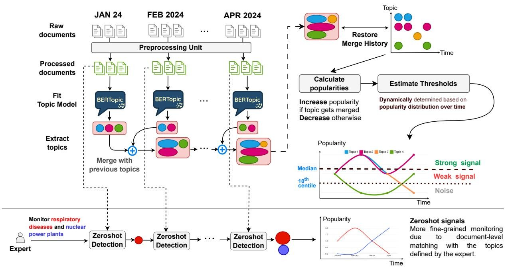
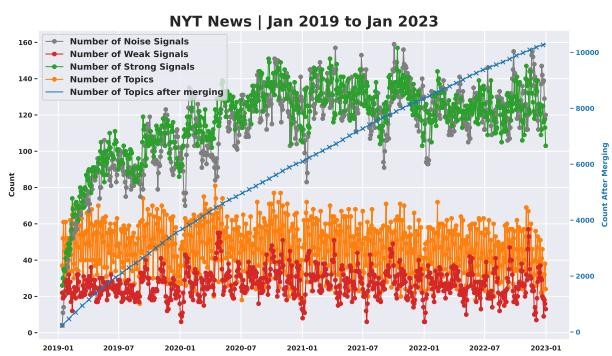
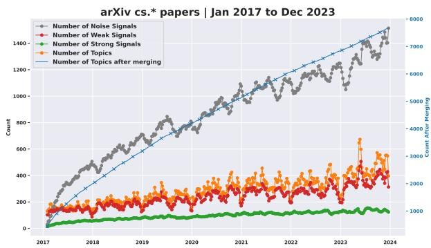
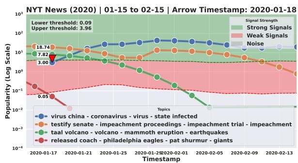
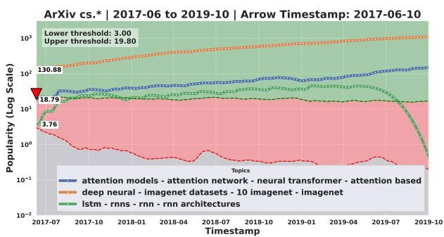
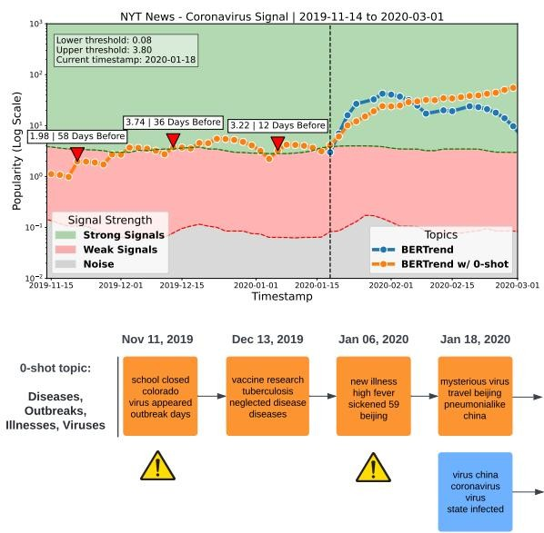
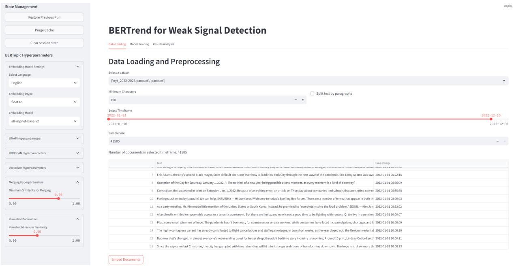
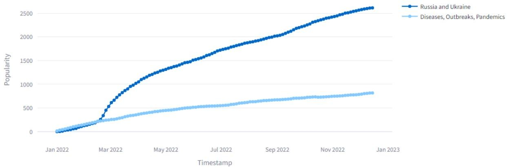
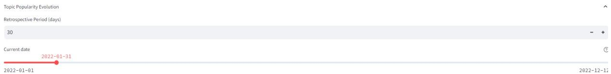
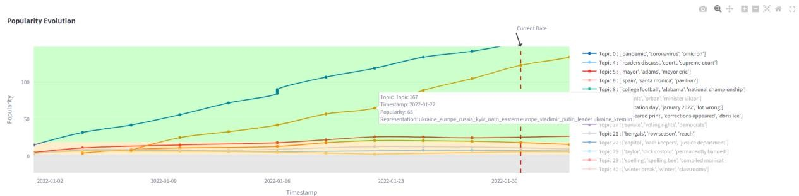

#

[page 1]

BERTrend: Neural Topic Modeling for Emerging Trends Detection

Allaa Boutaleb

Sorbonne University | RTE France

mohamed\_allaa\_eddine.boutaleb@etu.sorbonne-universite.fr

Jérôme Picault

RTE France

jerome.picault@rte-france.com

Guillaume Grosjean

RTE France

guillaume.grosjean@rte-france.com

# Abstract

Detecting and tracking emerging trends and weak signals in large, evolving text corpora is vital for applications such as monitoring scientific literature, managing brand reputation, surveilling critical infrastructure and more generally to any kind of text-based event detection. Existing solutions often fail to capture the nuanced context or dynamically track evolving patterns over time. BERTrend, a novel method, addresses these limitations using neural topic modeling in an online setting. It introduces a new metric to quantify topic popularity over time by considering both the number of documents and update frequency. This metric classifies topics as noise, weak, or strong signals, flagging emerging, rapidly growing topics for further investigation. Experimentation on two large real-world datasets demonstrates BERTrend's ability to accurately detect and track meaningful weak signals while filtering out noise, offering a comprehensive solution for monitoring emerging trends in large-scale, evolving text corpora. The method can also be used for retrospective analysis of past events. In addition, the use of Large Language Models together with BERTrend offers efficient means for the interpretability of trends of events.

# 1 Introduction

The concept of weak signals, introduced by Ansoff (1975), refers to early indicators of emerging trends that can have significant implications across various domains. These include events like shifts in public opinion in social trends, early disruptive technologies in innovation, changes in activist groups and public sentiment in politics, and potential disease outbreaks in healthcare. Monitoring and analyzing weak signals offers valuable insights for organizations, researchers, and decision-makers, aiding in informed decision-making.

Key data sources for identifying these trends include large text corpora such as news, social media,

research and technology journals or reports. The challenges are: distinguishing meaningful weak signals from irrelevant noise, dealing with context ambiguity, and tracking the extended period over which weak signals may gain significance.

With advances in NLP and AI, researchers have developed various techniques to detect weak signals across different fields, including statistics-based methods, graph theory, machine learning, semantic-based approaches, and expert knowledge. However, most solutions fall short in fully addressing the challenge of detecting emerging trends (Rousseau et al., 2021), either by relying solely on keyword-based analysis, which misses contextual nuances, or by being static and unable to dynamically track evolving weak signals.

In this work, we introduce BERTrend, a novel framework for detecting and monitoring emerging trends and weak signals in large, evolving text corpora. BERTrend leverages neural topic modeling, specifically BERTopic, in an online learning setting to identify and track topic evolution over time. Its key contribution lies in dynamically classifying topics as noise, weak signals, or strong signals based on their popularity trends. The proposed metric quantifies topic popularity over time by considering both the number of documents within the topic and its update frequency, incorporating an exponentially growing decay if no updates occur for an extended period. By combining neural topic modeling with a dynamic popularity metric and adaptive classification thresholds, BERTrend provides a comprehensive solution for detecting and monitoring emerging trends in large-scale, evolving text corpora. We discuss the qualitative results on two comprehensive datasets, including the overall evolution of trends and specific case studies. Combined with Large Language Models (LLMs), the method an efficient way of interpreting the detected trends of events through various dimensions indicating how they evolve over time.

#

[page 2]

2 Background

Among past works about weak signals detection, many are keyword-based. Thus, portfolio maps, pioneered by Yoon (2012), involves constructing keyword emergence maps (KEM) and keyword issue maps (KIM) based on two key metrics: degree of visibility (DoV) that quantifies the frequency of a keyword within a document set; and degree of diffusion (DoD) that measures the document frequency of each keyword. Weak signals are identified as keywords with low frequency but high growth potential. Numerous studies, such as Park and Cho (2017), Donnelly et al. (2019), Lee and Park (2018), Roh and Choi (2020), Yoo and Won (2018), Griol-Barres et al. (2020), have extended and refined this approach with multi-word analysis, signal transformation analysis, and domain-specific applications. However KEMs and KIMs present two major drawbacks: by focusing on keywords only, they can miss the context surrounding a weak signal; and the output is a single snapshot, which does not give clear clues of evolution over time.

Topic modeling has emerged as a promising approach for weak signal detection, particularly in large textual datasets. Unlike general topic evolution or drift analysis, which focus on tracking changes in established topics over time, our task aims to identify early indicators of emerging trends. It emphasizes the temporal behavior and growth of small, nascent topics rather than specific content changes within established ones. Thus, Krigsholm and Riekkinen (2019) and Kim et al. (2019) apply text mining and Latent Dirichlet Allocation (LDA) (Blei et al., 2003), to identify future signals in the domain of land administration and policy research databases. Maitre et al. (2019) integrates LDA and Word2Vec to detect weak signals in weakly structured data. El Akrouchi et al. (2021) introduce furthermore two functions for deep filtering: Weakness, which measures the significance, similarity, and evolution of topics using coherence, closeness centrality, and autocorrelation metrics; and Potential Warning, which further filters the terms of the previously filtered topics to identify potential weak signals.

While traditional topic modeling methods like LDA have been useful for weak signal detection, they have notable limitations: it heavily relies on pre-set topic numbers and fails to benefit from the sophisticated, contextual embeddings provided by modern pre-trained models, resulting in less nuanced analysis. Additionally, it operates on a static basis, overlooking the crucial temporal dynamics of weak signals. RollingLDA (Rieger et al., 2021, 2022) uses a rolling window for the identification of gradual topic shifts comparing topic distributions across consecutive windows, RollingLDA can detect changes in the prominence of topics over time. The fixed number of topics is a drawback. It is rather used for long-term evolution monitoring rather than detecting weak signals; interpretability of shifts is limited to keyword comparison.

In contrast, our approach leverages dynamic, high-quality contextual embeddings from pretrained models. Our embedding-based technique provides a richer, more adaptive analysis that does not require preset topic counts. This shift from static, keyword-based methods to dynamic, embedding-based analysis allows for a more granular and accurate tracking of the evolution and significance of weak signals over time.

# 3 BERTrend

In this section, we describe BERTrend (Figure 1), a method for identifying and tracking weak signals in large, evolving text corpora. It focuses on identifying emerging signals at a given moment, rather than tracking long-term topic evolution. It leverages the power of BERTopic (Grootendorst, 2022), a state-of-the-art topic model, and wraps it in an online learning framework. In this setting, new data arrives on a regular basis, allowing BERTrend to capture the dynamic evolution of topics over time. The method employs a set of metrics to characterize these topics as noise, weak signals, or strong signals based on their popularity trends. By combining the strengths of neural topic modeling with a dynamic, incremental learning approach, BERTrend enables the real-time monitoring and analysis of emerging trends and weak signals in vast, continuously growing text datasets.

BERTopic leverages pre-trained large embedding models to generate high-quality contextual embeddings of documents, enabling the discovery of meaningful and coherent topics. It utilizes HDBSCAN (McInnes et al., 2017), a hierarchical density-based clustering algorithm, which is robust to outliers and does not require the number of topics to be specified in advance, allowing the model to automatically determine the optimal number of topics based on the inherent structure of the data.

One of the key advantages of BERTopic is its

flowchart

This flowchart illustrates a research methodology for Zeroshot detection and its impact on topic modeling and expert monitoring. It details the progression from raw document data through preprocessing, topic modeling, and extract topics to final detection and analysis.

Figure 1: The BERTrend Framework processes data in time-sliced batches, undergoing preprocessing that includes unicode normalization and paragraph segmentation for very long documents. It applies a BERTopic model to extract topics for each batch, which are merged with prior batches using a similarity threshold to form a cumulative topic set. This data helps track topic popularity over time, identifying strong and weak signals based on dynamically chosen thresholds. Additionally, the framework includes a zero-shot detection feature for targeted topic monitoring, providing more fine-grained results due to document-level matching with topics defined by the expert.

[page 3]

ability to simulate online learning through model merging. Different BERTopic models can be fitted on documents from non-overlapping time periods and then merged together based on the pairwise cosine similarity between topics of consecutive models, enabling a form of dynamic topic modeling in an online learning setting.

# 3.1 Data Preprocessing and Time-based Document Slicing

To accommodate the maximum token lengths recommended by pretrained embedding models and avoid input truncation, lengthy documents are segmented into paragraphs. Each paragraph is treated as an individual document, with a mapping to its original long document source. This ensures accurate calculation of a topic's popularity over time by considering the original number of documents rather than the inflated number of paragraphs. We filter out documents that don't contain at least 100 Latin characters. This threshold was determined by analyzing the corpus of NYT and arXiv after splitting by paragraphs. Documents below this threshold often represent noise (e.g., article endings, incomplete sentences, social media references).

After preprocessing, the entire text corpus D, consisting of N documents, is divided into document slices based on a selected time granularity (e.g., daily, weekly, monthly). A document slice $D_{t}$ is defined as a subset of documents from D that fall within a specific time interval $[t, t + \Delta t)$ , where $t \in \{t_{1}, t_{2}, \ldots, t_{M}\}$ , $\Delta t$ is the chosen time granularity, and M is the total number of document slices. This slicing is crucial for analyzing the temporal dynamics of topics within the corpus.

# 3.2 Topic Extraction using BERTopic

For each document slice $D_{t}$ , BERTopic extracts a set of topics $T_{t}=\{\tau_{t}^{1},\tau_{t}^{2},\ldots,\tau_{t}^{K_{t}}\}$ , where $K_{t}$ is the number of topics in $D_{t}$ . The process involves:

1. Document Embedding: Each document $d \in D_{t}$ is transformed into a dense vector $e_{d} \in R^{h}$ using a pre-trained sentence transformer model (Reimers and Gurevych, 2019), where h is the embedding dimension. A topic $\tau_{t}^{j}$ is described as a set of words $W_{\tau_{t}^{j}} = \{w_{t}^{j,1}, w_{t}^{j,2}, \ldots, w_{t}^{j,M_{j}}\}$ , where $M_{j}$ is the number of words representing the topic.
2. Dimensionality Reduction: The embeddings are reduced to a lower-dimensional space using UMAP (McInnes et al., 2018), resulting in reduced embeddings $e_{d}^{\prime} \in R^{r}$ , where r < h.
3. Document Clustering: The reduced embed-

[page 4]

dings are clustered using HDBSCAN (McInnes et al., 2017), to group semantically similar documents into clusters. Each cluster $C_{t}^{j} \in C_{t}$ is associated with a centroid embedding $c_{t}^{j} \in R^{r}$ . These clusters represent preliminary groupings of documents that will later be labeled as topics.

4. Cluster Labeling: BERTopic assigns labels to clusters to form topics using class-based TF-IDF (c-TF-IDF), considering the frequency and specificity of words within each cluster. Various methods, including LLMs, KeyBERT, and Maximal Marginal Relevance (MMR), can be used to refine the representation of topics. In our work, we maintained the default c-TF-IDF representation without employing additional refinement methods. After labeling, each cluster $(\mathcal{C}_{t}^{j})$ becomes a topic $(\tau_{t}^{j})$ .

Algorithm 1: BERTrend Algorithm
Input: Text corpus $D$ , retrospective window size $W$ , time granularity $G$ , similarity threshold $\tau$ , decay factor $\lambda$ Output: Topics $\mathcal{T}$ , popularity $p$ , signal categories $S$ Initialize $\mathcal{T} = \emptyset$ , $p = \emptyset$ , $S = \emptyset$ ; $t_{\text{now}} = \text{current time}$ ; $t_{\text{start}} = t_{\text{now}} - W$ ;
time slices = slice data( $D$ , $t_{\text{start}}$ , $t_{\text{now}}$ , $G$ );
for $D_t \in \text{time slices do}$ $\mathcal{T}_t = \text{BERTopic}(D_t)$ ;
    for $\tau_t^j \in \mathcal{T}_t$ do $\text{sim}_{\text{max}} = \text{max}_{\tau_t^k \in \mathcal{T}} \text{Similarity}_{\text{cos}}(\mathbf{c}_t^j, \mathbf{c}_t^k)$ ;
        if $\text{sim}_{\text{max}} \geq \tau$ then $k^* = \arg \text{max}_k \text{Similarity}_{\text{cos}}(\mathbf{c}_t^j, \mathbf{c}_t^k)$ ; $D_t^{k^*} = D_t^{k^*} \cup D_t^j$ ; $p_t^{k^*} = p_{t-1}^{k^*} + |D_t^j|$ ;
        else $\mathcal{T} = \mathcal{T} \cup \{\tau_t^j\}$ ; $p_t^j = |D_t^j|$ ;
    for $\tau_t^k \in \mathcal{T}$ do
        if $\tau_t^k \notin \mathcal{T}_t$ then $p_t^k = p_{t-1}^k \cdot e^{-\lambda \Delta t^2}$ ; $\mathbf{P}_{\text{all}} = \bigcup_{\tau^k \in \mathcal{T}} \{p_j^k \mid j \in [t - W + 1, t]\}$ ; $\mathbf{P}_{\text{all}} = \text{sort}(\mathbf{P}_{\text{all}})$ ; $P_{10} = \mathbf{P}_{\text{all}}[[0.1 \cdot |\mathbf{P}_{\text{all}}|]]$ ; $P_{50} = \mathbf{P}_{\text{all}}[[0.5 \cdot |\mathbf{P}_{\text{all}}|]]$ ;
    for $\tau_t^k \in \mathcal{T}$ do
        if $p_t^k < P_{10}$ then $S_t^k = \text{"noise"}$ ;
        else
            if $P_{10} \leq p_t^k \leq P_{50}$ then
                if $\text{slope}(\{p_j^k \mid j \in [t - W + 1, t]\}) > 0$ then $S_t^k = \text{"weak"}$ ;
                else $S_t^k = \text{"noise"}$ ;
            else $S_t^k = \text{"strong"}$ ;

# 3.3 Topic Merging

BERTrend merges topics across document slices to capture their evolution. The topic merging process is formalized in Algorithm 1 (lines 10-12). For each time-based document slice $D_{t+1}$ , the extracted topics $T_{t+1}$ are compared with the topics from the previous slice $T_{t}$ as follows:

1. Similarity Calculation: Compute the cosine similarity between each topic embedding $\mathbf{c}_{(t + 1)}^j\in$ $\mathcal{T}_{t + 1}$ and all topic embeddings $\mathbf{c}_t^k\in \mathcal{T}_t$
2. Topic Matching: If the maximum similarity between $\mathbf{c}_{(t + 1)}^j$ and any $\mathbf{c}_t^k$ exceeds a threshold $\alpha$ (e.g., $\alpha = 0.7$ ), merge the topics and add the documents associated with $\tau_{(t + 1)}^j$ to $\tau_t^k$ .
3. New Topic Creation: If the maximum similarity is below $\alpha$ , consider $\tau_{(t+1)}^{j}$ as a new topic and add it to $\mathcal{T}_{t}$ .

To maintain topic embedding stability, the embedding of the first occurrence of a topic is retained, preventing drift and over-generalization.

# 3.4 Popularity Estimation

BERTrend estimates topic popularity over time and classifies them into signal categories based on popularity dynamics. The popularity of topic $\tau_{t}^{k}$ for document slice $D_{t}$ is denoted as $p_{t}^{k}$ and calculated as follows:

1. Initial Popularity: For a new topic $\tau_t^k$ of document slice $D_{t}$ , its initial popularity is set to the number of associated documents: $p_t^k = |D_t^k|$ , where $D_{t}^{k}$ is the set of documents associated with $\tau_t^k$ at time $t$ .

2. Popularity Update: For subsequent document slices $D_{t'}$ ( $t' > t$ ):

- If $\tau_t^k$ is merged with a topic in $\mathcal{T}_{t'}$ , its popularity is incremented by the number of new documents: $p_{t'}^k = p_{t' - 1}^k + |D_{t'}^k|$ .
- If $\tau_t^k$ is not merged with any topic in $\mathcal{T}_{t'}$ , its popularity decays exponentially: $p_{t'}^k = p_{t' - 1}^k \cdot e^{-\lambda \Delta t^2}$ , where $\lambda$ is a constant decay factor (e.g., $\lambda = 0.01$ ) and $\Delta t$ is the number of days since $\tau^k$ last received an update.

# 3.5 Trend Classification

To classify topics into signal categories, BERTrend calculates percentiles of popularity values over a rolling window of size W. For each document slice $D_{t}$ , two empirical thresholds - the 10th percentile ( $P_{10}$ ) and the 50th percentile ( $P_{50}$ ) of popularity values within the window $[t - W, t]$ - are computed. Trend classification is performed based on

[page 5]

the topic's popularity $p_t^k$ and its recent popularity trend:

- If $p_t^k < P_{10}$ , $\tau_t^k$ is classified as a "noise" signal.
- If $P_{10} \leq p_t^k \leq P_{50}$ :

\- If the topic's popularity has been increasing over the past few days, as determined by a positive slope of the linear regression line fitted to the topic's popularity values within the window $[t - W, t]$ , $\tau_t^k$ is classified as a "weak" signal.

\- If the topic's popularity has been decreasing, as determined by a negative slope of the linear regression line, $\tau_t^k$ is classified as a "noise" signal, as it likely represents a previously popular topic that is losing relevance.

\- If $p_t^k > P_{50}$ , $\tau_t^k$ is classified as a "strong" signal.

BERTrend combines popularity trends with thresholds to identify emerging trends, distinguishing them from declining popular topics. This helps filter out fading "weak signals" that are actually strong but declining trends.

Using percentiles calculated dynamically over a sliding window offers several advantages:

1. Adaptability to datasets: The retrospective parameter allows the method to adapt to the input data's velocity and production frequency.
2. Forget gate mechanism: The sliding window avoids the influence of outdated signals on current threshold calculations.
3. Robustness to outliers: Calculating thresholds based on the popularity distribution reduces sensitivity to outlier popularities and prevents thresholds from approaching zero when many signals have faded away.

# 3.6 Targeted Zero-shot Topic Monitoring

BERTrend includes an optional zero-shot detection feature that allows domain experts to define a set of topics $\mathcal{Z} = \{z_1, z_2, \ldots, z_L\}$ , each represented by a textual description. The embeddings of these topics and the documents in each slice $D_t$ are calculated using the same embedding model. For each document $d \in D_t$ , the cosine similarity between its embedding $\mathbf{e}_d$ and the embedding of each defined topic $z_l$ is computed. Documents with a similarity score above a predefined low threshold $\beta$ (typically 0.4-0.6) for any of the defined topics are considered relevant and included in the corresponding topic's document set $D_t^{z_l}$ . The low threshold accounts for the presumed vagueness and generality of the expert-defined topics, as they have incomplete knowledge that would be supplemented by new emerging information. Finally, the popularity and trend classification for the zero-shot topics are performed in the same manner as for the automatically extracted topics, using the document sets $D_{t}^{z_{l}}$ instead of $D_{t}^{k}$ .

# 4 Experimental Setup

# 4.1 Datasets

We selected two diverse datasets for our evaluation: the arXiv dataset, comprising scientific paper abstracts from the computer science category (cs.\*) (Cornell-University, 2023), and the New York Times (NYT) news dataset (Singh, 2023). Our choice aligns with recommendations from Rousseau et al. (2021) and Yoon (2012), who advocate for the use of scientific articles and news sources in weak signal detection due to their rich, evolving content. The arXiv dataset spans from January 2017 to December 2023, encompassing 367,248 abstracts, while the NYT dataset covers the period from January 2019 to January 2023, including 184,811 articles. These corpora offer a wealth of interpretable topics, facilitating qualitative analysis and interpretation. Moreover, the NYT dataset has been previously employed in weak signal detection research (El Akrouchi et al., 2021), further substantiating its relevance to our study. These datasets were chosen for their diverse content and potential to contain topics that could be considered weak signals, such as early warnings about the COVID-19 pandemic.

# 4.2 Algorithm parameters

In our experiments, we used the BERTopic framework with carefully selected hyperparameters to optimize weak signal detection performance. We chose the "all-mpnet-base-v2" $^{1}$ sentence transformer for document embedding because of its strong performance on various natural language understanding tasks (Reimers and Gurevych, 2019).

In the UMAP dimensionality reduction step, the number of components is set to 5 (default value), and the number of neighbors to 15, which allows UMAP to balance local and global structure in the data, as lower values focus more on local structure while higher values emphasize broader patterns (McInnes et al., 2018). In the HDBSCAN clustering step, we set the minimum cluster size to 2, the smallest possible value, to detect fine-grained

[page 6]

clusters. The minimum sample size was set to 1, the smallest possible value, to reduce the likelihood of points being declared as noise, as the high number of clusters obtained reduces the need for conservative clustering (McInnes et al., 2017).

Topics were represented by top unigrams and bigrams based on their c-TF-IDF scores. To determine the optimal minimum similarity threshold for merging topics across time slices, we conducted an ablation study varying the threshold from 0.5 to 0.95. We observed that lower thresholds (0.5-0.6) led to overly broad signals and unstable behavior, characterized by a phenomenon we term "threshold collapse." In this scenario, the disproportionate merging of topics results in a few dominant signals that skew the distribution of popularity values. Consequently, the dynamically determined classification thresholds (Q1 and Q3) become volatile, potentially shifting dramatically between consecutive timestamps. This instability compromises the reliability of signal categorization.

Conversely, higher thresholds (0.8-0.95) resulted in an overabundance of micro-signals, hindering the detection of meaningful trends. A threshold of 0.7 was found to provide a balanced approach, ensuring coherence and consistency of detected topics while allowing for semantic evolution without inducing threshold instability.

We also investigated the effect of the retrospective window size, varying it from 2 to 30 days. We found that its impact on BERTrend's performance was minimal when using an appropriate merge similarity threshold. The choice of window size primarily depends on the desired amount of historical data to incorporate in threshold calculations, with larger windows providing more stable, but potentially less responsive, threshold determinations.

For the granularity of the time slices, we chose 2 and 7 days for the NYT News and arXiv datasets respectively, based on our analysis of topic evolution rates in these datasets. This selection accommodates the rapidly evolving nature of news compared to the slower pace of research papers, while maintaining a balance between signal detection sensitivity and computational efficiency.

It is important to note that these parameter choices have been fine-tuned based on the characteristics of the datasets used in this study. For datasets with significantly different topic evolution dynamics and update frequencies, these parameters may require adjustment to achieve optimal performance.

In the zero-shot example (subsection 5.4), we used a lower similarity threshold of 0.45 for merging topics to accommodate the vague and incomplete nature of the user-defined topics, allowing for a more flexible merging process. This approach maximizes the recall in detecting potentially relevant documents of weak signals.

# 5 Results

Quantitative results about weak signal analysis are very challenging to obtain due to the lack of established metrics and methodology as detailed in section 9.3. Therefore, as in many past works in this research area (e.g. (El Akrouchi et al., 2021), we focus on a qualitative analysis, including retrospective analysis of known outcomes, to highlight its effectiveness and potential applications.

# 5.1 Overall results

Figure 2 illustrates the evolution of signal type counts and topic counts in the NYT News dataset and the arXiv cs.\* papers dataset We observe striking differences in the signal type distributions between these datasets, which can be attributed to the very nature of their respective domains.

In the NYT News dataset, the number of weak signals remains relatively stable over time, with a manageable quantity of 10 to 20 signals every 2 days. This is well-suited for real-time monitoring and trend detection in fast-paced news cycles, where emerging signals quickly evolve into hot topics of discussion. The occasional spikes in strong signals likely correspond to major events or trending news stories that capture significant attention.

Conversely, the arXiv cs.\* papers dataset exhibits a consistently higher number of weak signals, reflecting the diverse range of emerging research topics in the computer science domain. The number of strong signals is comparatively lower, as only a subset of novel ideas and approaches eventually gain traction and become widely adopted. This aligns with the nature of scientific research, where numerous proposals emerge, but only a few ultimately make a significant impact.

Interestingly, while the number of topics per time slice in the NYT News dataset fluctuates but remains overall stable, the arXiv cs.\* papers dataset shows an increasing trend in the number of topics detected per 7-day interval. This can be attributed to the exponential growth of research papers in recent years, leading to a more diverse and rapidly

line

| Date | Number of Noise Signals | Number of Weak Signals | Number of Topics | Number of Topics after merging |
| --- | --- | --- | --- | --- |
| 2019-01 | ~10 | ~20 | ~40 | ~500 |
| 2019-07 | ~80 | ~25 | ~60 | ~2500 |
| 2020-01 | ~100 | ~25 | ~60 | ~4000 |
| 2020-07 | ~120 | ~25 | ~60 | ~5500 |
| 2021-01 | ~130 | ~25 | ~60 | ~7000 |
| 2021-07 | ~130 | ~25 | ~60 | ~8500 |
| 2022-01 | ~130 | ~25 | ~60 | ~9500 |
| 2022-07 | ~130 | ~25 | ~60 | ~10500 |
| 2023-01 | ~130 | ~25 | ~60 | ~11000 |

(a) NYT News dataset

line

| Year | Number of Noise Signals | Number of Weak Signals | Number of Topics | Number of Topics after merging |
| --- | --- | --- | --- | --- |
| 2017 | ~150 | ~100 | ~100 | ~500 |
| 2018 | ~450 | ~150 | ~150 | ~2000 |
| 2019 | ~650 | ~200 | ~200 | ~3500 |
| 2020 | ~800 | ~250 | ~250 | ~4500 |
| 2021 | ~1000 | ~300 | ~300 | ~5500 |
| 2022 | ~1100 | ~300 | ~300 | ~6500 |
| 2023 | ~1200 | ~350 | ~350 | ~7500 |
| 2024 | ~1400 | ~400 | ~400 | ~8000 |

(b) arXiv cs.\* dataset
Figure 2: Evolution of Signal Types and Topic Counts in the NYT News and arXiv cs.\* Datasets

[page 7]

evolving research landscape. The total number of topics after merging (blue line) steadily increases over time in both datasets, reflecting the accumulation of new topics as the datasets grow.

# 5.2 Case study

In this section, we conduct a qualitative analysis of the results. We focus on a subset of illustrative topics and zoom into key periods to observe their behavior more closely. The examples are selected for their ease for interpretation.

Figure 3a focuses on the period from 01/2020 to 02/2020, when news media began reporting on the COVID-19 outbreak. We observe the appearance of a new topic (blue signal), due to its dissimilarity with pre-existing topics. Initially, the blue signal is classified as weak because of the low number of articles discussing it. Shortly after, it gains traction, transitioning from a weak to a strong signal within a matter of days, as evidenced by its exponential rise in popularity on the log-scaled y-axis. Concurrently, other strong signals during this period include topics related to the impeachment trial of President Trump (orange signal) and the Taal Volcano eruption (Philippines) in Jan 2020 (green signal), while a topic discussing American football teams (red signal) is classified as noise.

In Figure 3b, we showcase the evolution of three selected topics from the arXiv cs.\* papers dataset from 06/2017 to 10/2019. The blue signal, representing attention models, was initially a weak signal before June 2017, as attention methods were being used in conjunction with recurrent networks. However, the introduction of the transformer architecture (Vaswani et al., 2017) in June 2017 marked a turning point, after which the topic quickly gained traction, transitioning into a strong signal and eventually becoming a mega-trend. This rise of transformers largely replaced RNNs (Rumelhart et al., 1986) and LSTMs (Hochreiter and Schmidhuber, 1997) (green signal) in NLP tasks, leading to a decline in the popularity of the green signal. In contrast, papers related to computer vision, especially those mentioning ImageNet (Deng et al., 2009), a widely-used dataset in computer vision, were classified as strong signals in June 2017 and continued to exhibit growth. This analysis demonstrates our method's ability to identify potentially impactful research topics early on, track their evolution, and capture the dynamics between related topics.

# 5.3 Impact of zero-shot Topic Modeling

Figure 4 illustrates the impact of incorporating zero-shot topic modeling in the BERTrend algorithm. In this approach, an expert defines a general topic of interest, and each document from a slice is compared against this topic using embedding similarity. Documents that surpass a certain similarity threshold are captured, allowing for targeted weak signal detection. This method enables experts to focus on specific topics of interest while offering higher precision and sensitivity in weak signal detection. By performing document-level comparisons using embeddings, the zero-shot approach minimizes the risk of missing relevant documents during the topic modeling pipeline.

In the provided example, we chose the generic zero-shot topic "Diseases, Outbreaks, Illnesses, Viruses," to detect the COVID-19 signal, simulating a scenario where an expert has a general idea of what to monitor but lacks precise knowledge of an impending outbreak. Remarkably, the zero-shot method identified the earliest article in the dataset mentioning the coronavirus pandemic on January 6th, 2020, referring to it as a "pneumonia-like mysterious virus" along-

line

| Timestamp | virus china - coronavirus - virus - state infected | testify senate - impeachment proceedings - impeachment trial - impeachment | taal volcano - volcano - mammoth eruption - earthquakes | released coach - philadelphia eagles - pat shurmur - giants |
| --- | --- | --- | --- | --- |
| 2020-01-17 | 3.00 | 18.74 | 7.82 | 0.05 |
| 2020-01-21 | ~15 | ~15 | ~6 | ~0.05 |
| 2020-01-25 | ~30 | ~8 | ~4 | — |
| 2020-01-29 | ~35 | ~6 | ~2 | — |
| 2020-02-01 | ~40 | ~12 | ~0.5 | — |
| 2020-02-05 | ~35 | ~10 | ~0.05 | — |
| 2020-02-09 | ~30 | ~8 | — | — |
| 2020-02-13 | ~20 | ~3 | — | — |

(a) NYT News dataset

area

| Timestamp | attention models - attention network - neural transformer - attention based | deep neural - imagenet datasets - 10 imagenet - imagenet | lstm - rnn - rnn architectures |
| --- | --- | --- | --- |
| 2017-07 | 3.76 | 130.88 | 18.79 |

(b) arXiv cs.\* papers

Figure 3: Log-scaled popularity of selected topics from (a) the NYT News dataset and (b) arXiv cs.\* papers.

Figure 4: Comparison of COVID-19 Signal Detection with and without zero-shot Topic Modeling

[page 8]

side "coronavirus". This detection occurred 12 days before the automatic BERTrend usage without zero-shot. Furthermore, the zero-shot approach captured potential weak signals even earlier, such as a November 2019 article reporting school closures in Colorado due to a virus outbreak. While these signals may or may not be directly related to the pandemic, they demonstrate the method's ability to identify potentially relevant events. The consistency of the signal's growth is also notable. The automatically detected signal (blue) by BERTrend starts to decrease and becomes less stable around March 2020, not due to a loss in popularity, but because other signals discussing slightly different aspects of the pandemic begin to emerge.

# 6 Interpretation of trends with LLMs

Topic modeling methods often output topics as sets of keywords, which can be difficult to interpret and may not fully capture the semantic meaning of the topic (Rijcken et al., 2023; Rüdiger et al., 2022).

LLMs can be leveraged to enhance the interpretation of signals detected by BERTrend and of their evolution over time. Although this field of topic analysis through LLMs is new, it is quite promising (Kirilenko and Stepchenkova, 2024).

In this work, we go several steps further by using LLMs not only for having human-readable descriptions of topics, but also useful insights about their evolution between two timestamps, such a summary of the key developments of the event signal since previous timestamp, as well as novelty about the signal w.r.t. previous time period. In addition, we use the LLM to obtain an in-depth analysis of the signal, including: (1) impact, i.e. potential effects of this signal on various sectors, industries, and societal aspects, with both short-term and long-term implications; (2) evolution scenarios - both optimistic and pessimistic scenarios; (3) potential interactions /conflicts with other current trends; (4) drivers and inhibitors (factors/barriers related to the development of the signal. The associated prompt templates are provided in section A.2.

In the example of Figure 5, we use the GPT-4o model $^{2}$ with a temperature of 0.1 to generate insightful summaries and highlight new information at each timestamp for a weak signal related to the new Bluetongue viral disease (Catarrhal fever) affecting ruminants that appeared in France in July 2024. This example was selected for its recency to ensure it lies beyond the LLM's training data, minimizing the risk of analysis bias from the model's

#

[page 9]

BERTrend Output

Evolving Topic : Bluetongue disease in France

Weak Signal at July 31 2024, Aug 1 2024 and Aug 2 2024

Please provide a summary for the evolution of the following topic based on the information provided:

\- Representation at timestamp 2024-07-31: farmers, serotype, already, ruminant, infected, recent, FCO, defense groups, midges, indifferent

\- Context: [Document 1], [Document 2]

• // Repeat for 2024-08-01 and 2024-08-02

For each timestamp:

\- Generate a concise title based on the topic representation and the context documents

\- Provide a brief summary of key developments

\- For each timestamp except the first, include a "What's New?" section highlighting changes and new information compared to the previous timestamp

Format the output as follows:

[Generated title] | [Timestamp]

• [Bullet point of key development]

What's New? (except for the first timestamp): [Bullet point of new information]

France Prepares for New Bluetongue Virus Serotype | 2024-07-31

\- France prepares for a new serotype of ovine bluetongue virus (FCO) causing sheep deaths.

\- Ministry of Agriculture creates a regulated zone from Pas de Calais to Moselle, restricting ruminant movement.

FCO Serotype 3 Spreads Across Europe | 2024-08-01

\- Ministry focuses on slowing the spread of FCO serotype 3, transmitted by biting insects.
- Spain only accepts vaccinated animals for import.

What's New?

\- FCO serotype 3 emerged in Europe in late 2023, now spreading across several countries.
- Confédération Paysanne reports severe impacts of serotype 8 on high-altitude summer pastures in the Pyrénées.

FCO Outbreak Escalates, Affecting Nearly 100 Farms | 2024-08-02

\- FCO confirmed as a viral disease affecting ruminants, primarily sheep, not transmissible to humans.

\- Movement restrictions in place for animals in regulated zones to prevent FCO spread.

What's New?

\- Detailed description of FCO symptoms: fever, respiratory issues, and facial edema.
- Nearly a hundred farms affected in the Pyrénées, indicating escalation.

As an elite strategic foresight analyst, evaluate this potential signal: [Insert evolving topic summary here]

Provide a comprehensive analysis of the signal's impact and evolution:

1. Potential Impact Analysis:

a) Short-term implications (e.g., immediate economic effects, sector disruptions).

b) Long-term consequences (e.g., policy changes, industry transformations).

c) Ripple effects and second-order impacts across various domains.

2. Evolution Scenarios:

a) Describe optimistic and pessimistic future developments. b) Consider influencing factors on the signal's trajectory.

3. Interconnections and Synergies:

a) Interactions with current trends or emerging phenomena.
b) Potential synergies or conflicts with existing systems.

4. Drivers and Inhibitors:

a) Factors that could accelerate or amplify the signal. b) Potential barriers or resistances to its development.

As an elite strategic foresight analyst, I've evaluated the potential signal of the Bluetongue Virus Outbreak in France. Here's a comprehensive analysis of its impact and evolution:

1. Potential Impact Analysis:

a) Short-term implications: Economic losses in agricultural sector (sheep deaths, movement restrictions, treatment costs); trade disruptions with Spain; increased government spending on vaccines and enforcement; strain on veterinary services.

b) Long-term consequences: Potential farm closures and rural unemployment; shift to stricter biosecurity and livestock management; increased R&D investment in FCO vaccines; new livestock movement and vaccination protocols; possible meat and dairy shortages.

c) Ripple effects: Supply chain disruptions (feed, transport, processing); increased consumer prices for sheep products; cross-border containment disputes; altered grazing patterns affecting ecosystems; rural unrest and urban migration.

2. Evolution Scenarios:

a) Optimistic: Swift containment measures limit spread; rapid development of affordable vaccines for all serotypes; government and international aid mitigate farmer losses; improved biosecurity enhances future resilience.

b) Pessimistic: Uncontrolled spread causes significant economic losses; vaccine shortages and logistical issues hinder efforts; widespread farm closures; public misinformation leads to non-compliance; inadequate cross-border cooperation causes international conflicts.

3. Interconnections and Synergies:

a) Interactions with trends: Climate change affects midge distribution and virus spread; increased global trade facilitates cross-border transmission; technological innovations improve disease detection and prevention.

b) Synergies/conflicts: Enhanced biosecurity protocols benefit overall animal health; potential conflicts between farmer support and containment measures; integrated approaches to zoonotic disease management.

4. Drivers and Inhibitors:

a) Accelerators: Proactive government measures and financial support; innovations in vaccine development and distribution; international cooperation; public awareness and education.

b) Barriers: Economic constraints hindering vaccination efforts; logistical challenges in vaccine distribution and restriction enforcement; public resistance and mistrust; lack of harmonized cross-border policies impeding regional control.

Figure 5: Enhancing Signal Interpretation and Analysis using LLMs

pre-existing knowledge..

By emphasizing new information at each timestamp through a multi-faceted description, the LLM helps to pinpoint key developments and changes within the topic. It provides a comprehensive summary of the signal's evolution, which can then be reintroduced to the LLM for further analysis, assessing its potential impact and possible outcomes.

# 7 Conclusion

In this paper, we introduced BERTrend, a novel framework for detecting and monitoring weak signals in large, evolving text corpora. BERTrend models the trends of topics over time and classifies them as weak signals, strong signals, or noise based on their popularity metric. The classification is performed using empirically chosen thresholds based on the distribution of topic popularities over a sliding window. The other contributions of this work include: (1) an extensive evaluation on two realworld datasets that demonstrate the effectiveness of our approach; (2) proposals to leverage LLMs to enhance the interpretation of topic evolution.

We are currently exploring LLM-generated evolving knowledge graphs as a structured method for interpreting signals. These graphs monitor topic evolution by tracking the appearance and disappearance of entities and relationships. Future work will involve exploring new datasets, integrating live data, and developing metrics to compare weak signal detection methods.

# 8 Software availability

In order to foster collaboration and advancement in weak signal detection, the code of BERTrend (and associated tools for visualization and LLM-based interpretation) has been open-sourced. It is available at the following URL:

https://github.com/rte-france/BERTrend.

#

[page 10]

9 Limitations

# 9.1 Hyperparameter Sensitivity

BERTrend's performance is sensitive to various hyperparameters, including BERTopic parameters, merge threshold, granularity, and retrospective period. We chose BERTopic hyperparameters to produce the most fine-grained topics since larger topics will hinder the early detection process, and weak signals will get lost as the documents that should form them are assigned either to noise topics or other large, more generalized topics. To mitigate the variability of topic embeddings due to the small number of documents per topic, we selected a low merge threshold (0.6-0.7). Granularity depends on the amount of data available per time unit and the frequency of new documents. The retrospective period affects the influence of past signals on current thresholds; we found that a period of a week to a month doesn't change thresholds significantly, but bigger changes can affect classification results. Empirically fixed thresholds (10th percentile and median) balance precision and recall.

# 9.2 Distinguishing Between Weak Signals and Noise

There remains the challenge of distinguishing between what's considered a weak signal and what's considered noise. Relying on temporal popularity fluctuations alone isn't ideal, as both weak and noise signals behave very similarly. There's also the issue of characterizing what would be a "weak signal," since that changes from one person to another, one domain to another, etc. This is why we added the zero-shot detection to help an expert guide the detection process. We envision exploring the effect of using named entity recognition for better filtering in future work.

# 9.3 Evaluation Challenges

Evaluating the effectiveness of our weak signal detection method is challenging due to many factors:

- the subjective nature of what constitutes a weak signal, since it depends on the context, the domain, and the specific goals of the analysis, making it difficult to raise a consensus even among domain experts.
- the lack of ground truth data: unlike many other natural language processing tasks, there are no widely accepted benchmark datasets or ground truth annotations specifically designed for evaluating weak signal detection. This lack of stan-

dardized benchmarks hinders the ability to objectively compare different approaches and quantify their performance.

\- dynamics over time: weak signals are often transient and can grow or dissipate over time. This dynamic nature complicates the evaluation process, as the ground truth itself may change, requiring continuous monitoring and updating of the evaluation data.

To the best of our knowledge, there are currently no established metrics for comparing weak signal detection performance within large volumes of data. Traditional metrics used in evaluating topic models, such as topic coherence topic diversity, and perplexity, are not suitable for assessing weak signal detection. These metrics measure the quality and interpretability of topics over time, but they cannot determine whether a detected signal is truly a weak signal of emerging importance. Given this context, comparing BERTrend with dynamic topic models or other embedding techniques (as described in Balepur et al. (2023), Churchill and Singh (2022), Rudolph and Blei (2018), Yao et al. (2018), Meng et al. (2020), or Xu et al. (2023)) using these metrics would not provide meaningful insights into the nature of the weak signals detected. These methods and their evaluation metrics are designed for different objectives, primarily assessing topic quality and evolution over extended periods of time.

Comparing BERTrend with existing keyword-based approaches (e.g., Park and Cho (2017); Donnelly et al. (2019); Griol-Barres et al. (2020)) is not feasible due to fundamental differences in methodology and output: (1) These methods primarily use Degree of Visibility and Degree of Diffusion metrics on keyword emergence maps and keyword issue maps. Their output is a set of words indicating the presence of a weak signal, whereas BERTrend produces topic sequences over time. (2) BERTrend's dynamic, embedding-based approach captures contextual nuances that keyword-based methods often miss. As noted by Rousseau et al. (2021), "the use of a single keyword may lead to a loss of objectivity" and "the lack of relations and context over the keywords limit the information."

To address the evaluation challenge, our future work will center on a large-scale user study involving domain experts. These experts will review BERTrend's outputs at specific time instants, identifying potential weak signals in their fields.

#

[page 11]

References

H Igor Ansoff. 1975. Managing strategic surprise by response to weak signals. California management review, 18(2):21–33.
Nishant Balepur, Shivam Agarwal, Karthik Venkat Ramanan, Susik Yoon, Diyi Yang, and Jiawei Han. 2023. DynaMiTE: Discovering explosive topic evolutions with user guidance. In Findings of the Association for Computational Linguistics: ACL 2023, pages 194–217, Toronto, Canada. Association for Computational Linguistics.
David M. Blei, Andrew Y. Ng, and Michael I. Jordan. 2003. Latent dirichlet allocation. Journal of Machine Learning Research, 3:993–1022.
Rob Churchill and Lisa Singh. 2022. Dynamic topic-noise models for social media. In Advances in Knowledge Discovery and Data Mining: 26th Pacific-Asia Conference, PAKDD 2022, Chengdu, China, May 16–19, 2022, Proceedings, Part II, page 429–443, Berlin, Heidelberg. Springer-Verlag.
Cornell-University. 2023. arxiv dataset. Accessed: 2024-06-14.
Jia Deng, Wei Dong, Richard Socher, Li-Jia Li, Kai Li, and Li Fei-Fei. 2009. Imagenet: A large-scale hierarchical image database. In 2009 IEEE conference on computer vision and pattern recognition, pages 248–255. Ieee.
Hayoung Kim Donnelly, Yoonsun Han, Juyoung Song, and Tae Min Song. 2019. Application of social big data to identify trends of school bullying forms in south korea. International journal of environmental research and public health, 16(14):2596.
Manal El Akrouchi, Houda Benbrahim, and Ismail Kassou. 2021. End-to-end lda-based automatic weak signal detection in web news. Knowledge-Based Systems, 212:106650.
Israel Griol-Barres, Sergio Milla, Antonio Cebrián, Huaan Fan, and Jose Millet. 2020. Detecting weak signals of the future: A system implementation based on text mining and natural language processing. Sustainability, 12(19):7848.
Maarten Grootendorst. 2022. Bertopic: Neural topic modeling with a class-based tf-idf procedure. arXiv preprint arXiv:2203.05794.
Sepp Hochreiter and Jürgen Schmidhuber. 1997. Long short-term memory. Neural computation, 9(8):1735–1780.
Hyunuk Kim, Sang-Jin Ahn, and Woo-Sung Jung. 2019. Horizon scanning in policy research database with a probabilistic topic model. Technological Forecasting and Social Change, 146:588–594.
Andrei Kirilenko and Svetlana Stepchenkova. 2024. Automated topic analysis with large language models. In Information and Communication Technologies in
Tourism 2024, pages 29–34, Cham. Springer Nature Switzerland.
Pauliina Krigsholm and Kirsikka Riekkinen. 2019. Applying text mining for identifying future signals of land administration.
Young-Joo Lee and Ji-Young Park. 2018. Identification of future signal based on the quantitative and qualitative text mining: a case study on ethical issues in artificial intelligence. Quality & Quantity, 52(2):653–667.
Julien Maitre, Michel Menard, Guillaume Chiron, and Alain Bouju. 2019. Détection de signaux faibles dans des masses de données faiblement structurées. Recherche d'Information, Document et Web Séman-tique, 3(1).
Leland McInnes, John Healy, Steve Astels, et al. 2017. hdbscan: Hierarchical density based clustering. J. Open Source Softw., 2(11):205.
Leland McInnes, John Healy, and James Melville. 2018. Umap: Uniform manifold approximation and projection for dimension reduction. arXiv preprint arXiv:1802.03426.
Yu Meng, Jiaxin Huang, Guangyuan Wang, Zihan Wang, Chao Zhang, Yu Zhang, and Jiawei Han. 2020. Discriminative topic mining via category-name guided text embedding. In Proceedings of The Web Conference 2020, WWW '20, page 2121–2132, New York, NY, USA. Association for Computing Machinery.
Chankook Park and Seunghyun Cho. 2017. Future sign detection in smart grids through text mining. Energy Procedia, 128:79–85.
Nils Reimers and Iryna Gurevych. 2019. Sentence-bert: Sentence embeddings using siamese bert-networks. arXiv preprint arXiv:1908.10084.
Jonas Rieger, Carsten Jentsch, and Jörg Rahnenführer. 2021. RollingLDA: An update algorithm of Latent Dirichlet Allocation to construct consistent time series from textual data. In Findings of the Association for Computational Linguistics: EMNLP 2021, pages 2337–2347, Punta Cana, Dominican Republic. Association for Computational Linguistics.
Jonas Rieger, Kai-Robin Lange, Jonathan Flossdorf, and Carsten Jentsch. 2022. Dynamic change detection in topics based on rolling ldas. In Proceedings of Text2Story - Fifth Workshop on Narrative Extraction From Texts held in conjunction with the 44th European Conference on Information Retrieval (ECIR 2022), Stavanger, Norway, April 10, 2022, volume 3117 of CEUR Workshop Proceedings, pages 5–13. CEUR-WS.org.
Emil Rijcken, Floortje Scheepers, Kalliopi Zervanou, Marco Spruit, Pablo Mosteiro, and Uzay Kaymak. 2023. Towards interpreting topic models with chatgpt. In The 20th World Congress of the International Fuzzy Systems Association.

[page 12]

Seungkook Roh and Jae Young Choi. 2020. Exploring signals for a nuclear future using social big data. Sustainability, 12(14):5563.

Pauline Rousseau, Daniel Camara, and Dimitris Kotzinos. 2021. Weak signal detection and identification in large data sets: a review of methods and applications.

Matthias Rüdiger, David Antons, Amol M Joshi, and Torsten-Oliver Salge. 2022. Topic modeling revisited: New evidence on algorithm performance and quality metrics. Plos one, 17(4):e0266325.

Maja Rudolph and David Blei. 2018. Dynamic embeddings for language evolution. In Proceedings of the 2018 World Wide Web Conference, WWW '18, page 1003–1011, Republic and Canton of Geneva, CHE. International World Wide Web Conferences Steering Committee.

David E Rumelhart, Geoffrey E Hinton, and Ronald J Williams. 1986. Learning internal representations by error propagation, parallel distributed processing, explorations in the microstructure of cognition, ed. de rumelhart and j. mcclelland. vol. 1. 1986. Biometrika, 71:599–607.

Aryan Singh. 2023. Nyt articles (21m+) 2000-present. Accessed: 2024-06-14.

Ashish Vaswani, Noam Shazeer, Niki Parmar, Jakob Uszkoreit, Llion Jones, Aidan N Gomez, Łukasz Kaiser, and Illia Polosukhin. 2017. Attention is all you need. Advances in neural information processing systems, 30.

Weijie Xu, Wenxiang Hu, Fanyou Wu, and Srinivasan H. Sengamedu. 2023. Detime: Diffusion-enhanced topic modeling using encoder-decoder based llm. ArXiv, abs/2310.15296.

Zijun Yao, Yifan Sun, Weicong Ding, Nikhil Rao, and Hui Xiong. 2018. Dynamic word embeddings for evolving semantic discovery. In Proceedings of the Eleventh ACM International Conference on Web Search and Data Mining, WSDM '18, page 673–681, New York, NY, USA. Association for Computing Machinery.

Sun Hi Yoo and DongKyu Won. 2018. Simulation of weak signals of nanotechnology innovation in complex system. Sustainability, 10(2):486.

Janghyeok Yoon. 2012. Detecting weak signals for long-term business opportunities using text mining of web news. Expert Systems with Applications, 39(16):12543–12550.

# A Software

# A.1 Some screenshots

We present in this section some screenshots (Figures 6–12) of our prototype which utilizes BERTrend to explore trends and categorize them into different types of signals, as well as using a LLM to interpret and analyze certain signals. The UI is built using Streamlit $^{3}$ , and all the visualizations are done using the Plotly library $^{4}$ .

# A.2 Prompt examples for topic evolution analysis

This section gives some examples of the prompts we are using with a LLM (GPT-4o) to obtain detailed insights of topic evolution between two time-stamps.

# A.2.1 Prompt for evolving topic summary at a given timestamp

As an expert analyst specializing in trend analysis and strategic foresight, your task is to provide a comprehensive evolution summary of Topic {topic\_number}. Use only the information provided below:

{content\_summary}

Structure your analysis as follows:

For the first timestamp:

\## [Concise yet impactful title capturing the essence of the topic at this point]

\### Date: [Relevant date or time frame]

\### Key Developments

\- [Bullet point summarizing a major development or trend]

\- [Additional bullet points as needed]

\### Analysis

[2-3 sentences providing deeper insights into the developments, their potential implications, and their significance in the broader context of the topic's evolution]

For all subsequent timestamps:

\## [Concise yet impactful title capturing the essence of the topic at this point]

\### Date: [Relevant date or time frame]

\### Key Developments

\- [Bullet point summarizing a major development or trend]

\- [Additional bullet points as needed]

\### Analysis

[2-3 sentences providing deeper insights into the developments, their potential implications, and their significance in the broader context of the topic's evolution]

\### What's New

[1-2 sentences highlighting how this period differs from the previous one, focusing on new elements or significant changes]

Provide your analysis using only this format, based solely on the information given. Do not include any

#

[page 13]

BERTrend for Weak Signal Detection

Figure 6: The BERTrend main interface allows users to configure various hyperparameters, including those for BERTopic components and merging thresholds. Users can load and filter data, split text into paragraphs, select specific timeframes, and randomly sample the data. The interface also facilitates the embedding of documents for further analysis.

additional summary or overview sections beyond what is specified in this structure.

# A.2.2 Prompt for signal analysis

As an elite strategic foresight analyst with extensive expertise across multiple domains and industries, your task is to conduct a comprehensive evaluation of a potential signal derived from the following topic summary:

{summary\_from\_first\_prompt}

Leverage your knowledge and analytical skills to provide an in-depth analysis of this signal's potential impact and evolution:

1. Potential Impact Analysis:

\- Examine the potential effects of this signal on various sectors, industries, and societal aspects.

- Consider both short-term and long-term implications.
- Analyze possible ripple effects and second-order consequences.

2. Evolution Scenarios:

- Describe potential ways this signal could develop or manifest in the future.
- Consider various factors that could influence its trajectory.
- Explore both optimistic and pessimistic scenarios.

3. Interconnections and Synergies:

- Identify how this signal might interact with other current trends or emerging phenomena.
- Discuss potential synergies or conflicts with

existing systems or paradigms.

4. Drivers and Inhibitors:

- Analyze factors that could accelerate or amplify this signal.
- Examine potential barriers or resistances that might hinder its development.

Your analysis should be thorough and nuanced, going beyond surface-level observations. Draw upon your expertise to provide insights that capture the complexity and potential significance of this signal. Don't hesitate to make well-reasoned predictions about its potential trajectory and impact.

Focus on providing a clear, insightful, and actionable analysis that can inform strategic decision-making and future planning.

#

[page 14]

Model Training

Select Granularity

3

Documents per Timestamp

Select Timestamp

2022-01-01 00:00:00

2022-01-01 00:00:00

2022-12-15 00:00:00

<table><tr><td></td><td>timestamp</td><td>text</td><td>document_id</td><td>source</td><td>url</td></tr><tr><td>14</td><td>2022-01-01 10:00:10</td><td>The highly contagious variant has already contributed to flight cancellations and staff</td><td>14</td><td>None</td><td>None</td></tr><tr><td>15</td><td>2022-01-01 10:00:11</td><td>But now that&#x27;s changed. In almost everyone&#x27;s never-ending quest for better sleep, the</td><td>15</td><td>None</td><td>None</td></tr><tr><td>16</td><td>2022-01-01 10:00:13</td><td>Since the explosion last Christmas, the city has grappled with how rebuilding will fit it</td><td>16</td><td>None</td><td>None</td></tr><tr><td>17</td><td>2022-01-01 10:00:15</td><td>The suicide bomber who killed nearly 200 people, including 13 U.S. troops, had been</td><td>17</td><td>None</td><td>None</td></tr><tr><td>18</td><td>2022-01-01 10:00:15</td><td>After slow gains in women&#x27;s rights, the country is facing a type of political correctness</td><td>18</td><td>None</td><td>None</td></tr><tr><td>19</td><td>2022-01-01 10:00:16</td><td>Let their stories be your inspiration as you set resolutions for 2022. The arrival of a new</td><td>20</td><td>None</td><td>None</td></tr></table>

Enter zero-shot topics (separated by /)

Russia and Ukraine / Diseases, Outbreaks, Pandemics

Train Models

Training models...

Training BERTopic model for 2022-01-16 00:00:00 (6/117)

<table><tr><td>2024-08-11 10:50:14.369</td><td>DEBUG</td><td>topic_modeling:train_topic_models:317 - Number of documents: 254</td></tr><tr><td>2024-08-11 10:50:14.369</td><td>DEBUG</td><td>topic_modeling:train_topic_models:327 - Creating topic model...</td></tr><tr><td>2024-08-11 10:50:14.369</td><td>DEBUG</td><td>topic_modeling:create_topic_model:47 - Creating topic model with zeroshot_topic_list: [&#x27;Russia and Ukraine&#x27;, &#x27;Diseases, Outbreaks, Pandemics&#x27;]</td></tr><tr><td>2024-08-11 10:50:14.370</td><td>DEBUG</td><td>topic_modeling:create_topic_model:54 - Initializing BERTopic model</td></tr><tr><td>2024-08-11 10:50:14.370</td><td>SUCCESS</td><td>topic_modeling:create_topic_model:66 - BERTopic model instance created successfully</td></tr><tr><td>2024-08-11 10:50:14.370</td><td>DEBUG</td><td>topic_modeling:create_topic_model:68 - Fitting BERTopic model</td></tr><tr><td>2024-08-11 10:50:17.077</td><td>SUCCESS</td><td>topic_modeling:create_topic_model:84 - BERTopic model fitted successfully</td></tr><tr><td>2024-08-11 10:50:17.078</td><td>DEBUG</td><td>topic_modeling:train_topic_models:339 - Topic model created successfully</td></tr><tr><td>2024-08-11 10:50:17.087</td><td>DEBUG</td><td>topic_modeling:train_topic_models:364 - Successfully processed period: 2022-03-05 00:00:00</td></tr><tr><td>2024-08-11 10:50:17.089</td><td>DEBUG</td><td>topic_modeling:train_topic_models:316 - Processing period: 2022-03-08 00:00:00</td></tr><tr><td>2024-08-11 10:50:17.089</td><td>DEBUG</td><td>topic_modeling:train_topic_models:317 - Number of documents: 439</td></tr><tr><td>2024-08-11 10:50:17.089</td><td>DEBUG</td><td>topic_modeling:train_topic_models:327 - Creating topic model...</td></tr><tr><td>2024-08-11 10:50:17.090</td><td>DEBUG</td><td>topic_modeling:create_topic_model:47 - Creating topic model with zeroshot_topic_list: [&#x27;Russia and Ukraine&#x27;, &#x27;Diseases, Outbreaks, Pandemics&#x27;]</td></tr><tr><td>2024-08-11 10:50:17.090</td><td>DEBUG</td><td>topic_modeling:create_topic_model:54 - Initializing BERTopic model</td></tr><tr><td>2024-08-11 10:50:17.090</td><td>SUCCESS</td><td>topic_modeling:create_topic_model:66 - BERTopic model instance created successfully</td></tr><tr><td>2024-08-11 10:50:17.090</td><td>DEBUG</td><td>topic_modeling:create_topic_model:68 - Fitting BERTopic model</td></tr><tr><td>2024-08-11 10:50:21.486</td><td>SUCCESS</td><td>topic_modeling:create_topic_model:84 - BERTopic model fitted successfully</td></tr><tr><td>2024-08-11 10:50:21.487</td><td>DEBUG</td><td>topic_modeling:train_topic_models:339 - Topic model created successfully</td></tr><tr><td>2024-08-11 10:50:21.504</td><td>DEBUG</td><td>topic_modeling:train_topic_models:364 - Successfully processed period: 2022-03-08 00:00:00</td></tr><tr><td>2024-08-11 10:50:21.505</td><td>DEBUG</td><td>topic_modeling:train_topic_models:316 - Processing period: 2022-03-11 00:00:00</td></tr><tr><td>2024-08-11 10:50:21.506</td><td>DEBUG</td><td>topic_modeling:train_topic_models:317 - Number of documents: 329</td></tr><tr><td>2024-08-11 10:50:21.506</td><td>DEBUG</td><td>topic_modeling:train_topic_models:327 - Creating topic model...</td></tr><tr><td>2024-08-11 10:50:21.507</td><td>DEBUG</td><td>topic_modeling:create_topic_model:47 - Creating topic model with zeroshot_topic_list: [&#x27;Russia and Ukraine&#x27;, &#x27;Diseases, Outbreaks, Pandemics&#x27;]</td></tr><tr><td>2024-08-11 10:50:21.507</td><td>DEBUG</td><td>topic_modeling:create_topic_model:54 - Initializing BERTopic model</td></tr><tr><td>2024-08-11 10:50:21.507</td><td>SUCCESS</td><td>topic modeling:create toopic model:66 - BERTopic model instance created successfully</td></tr></table>

Figure 7: The model training interface enables the creation and merging of multiple BERTopic models based on the selected granularity and merging thresholds. Users can also define zero-shot topics for detection at each timestamp, providing a flexible approach to model training.

Popularity of Zero-Shot Topics

line

| Timestamp | Russia and Ukraine | Diseases, Outbreaks, Pandemics |
| --- | --- | --- |
| Jan 2022 | ~0 | ~0 |
| Mar 2022 | ~300 | ~250 |
| May 2022 | ~1300 | ~450 |
| Jul 2022 | ~1750 | ~550 |
| Sep 2022 | ~2000 | ~650 |
| Nov 2022 | ~2400 | ~750 |
| Jan 2023 | ~2600 | ~800 |

↓  √  [::]

<table><tr><td></td><td>Topic</td><td>Timestamp</td><td colspan="6">Representation</td><td>Representative_Docs</td></tr><tr><td>111</td><td>Russia and Ukraine</td><td>2022-11-30</td><td>ukraine</td><td>russia</td><td>vladimir</td><td>vladimir</td><td>putin</td><td>putin</td><td>The complaints not only are misguided but also</td></tr><tr><td>112</td><td>Russia and Ukraine</td><td>2022-12-03</td><td>ukraine</td><td>russia</td><td>moscow</td><td>ukrainian</td><td>kyiv</td><td>war</td><td>Ukraine&#x27;s president called for legislation to prev</td></tr><tr><td>113</td><td>Russia and Ukraine</td><td>2022-12-06</td><td>ukraine</td><td>russia</td><td>drones</td><td>war</td><td>ukraine</td><td>military b</td><td>The cat-and-mouse experience of Proton, a Swi</td></tr><tr><td>114</td><td>Russia and Ukraine</td><td>2022-12-09</td><td>ukraine</td><td>russia</td><td>country</td><td>iran</td><td>war</td><td>ukraine</td><td>n</td></tr><tr><td>115</td><td>Russia and Ukraine</td><td>2022-12-12</td><td>ukraine</td><td>russia</td><td>kyiv</td><td>drones</td><td>war</td><td>air defense</td><td>U.S. officials say Moscow had been pushing for</td></tr><tr><td>116</td><td>Russia and Ukraine</td><td>2022-12-15</td><td>ukraine</td><td>russia</td><td>war</td><td>putin</td><td>strategy</td><td>russian</td><td>Moscow said that Washington&#x27;s plans to supply</td></tr><tr><td>117</td><td>Diseases, Outbreaks, Pandemics</td><td>2022-01-01</td><td>pandemic</td><td>coronavirus</td><td>omicron</td><td colspan="3">cancellations</td><td>Leaked emails detail how Russia&#x27;s biggest state</td></tr><tr><td>118</td><td>Diseases, Outbreaks, Pandemics</td><td>2022-01-04</td><td>new</td><td>coronavirus</td><td>omicron</td><td>covid</td><td colspan="2">pandemic</td><td>The highly contagious variant has already contr</td></tr></table>

Figure 8: The results page showcases zero-shot topics, allowing experts to visually inspect them with ease. A searchable dataframe accompanies the visualization, enabling users to explore documents related to defined zero-shot topics across various timestamps.

text_image

Topic Popularity Evolution
Retrospective Period (days)
30
- +
Current date
2022-01-31
2022-01-01
2022-12-17

Noise Threshold : 2.308

Strong Signal Threshold : 18.990

line

| Timestamp | Topic 0 | Topic 4 | Topic 5 | Topic 6 | Topic 8 | Topic 21 | Topic 22 | Topic 26 | Topic 29 | Topic 40 |
| --- | --- | --- | --- | --- | --- | --- | --- | --- | --- | --- |
| 2022-01-02 | ~15 | ~5 | ~5 | ~5 | ~5 | ~5 | ~5 | ~5 | ~5 | ~5 |
| 2022-01-09 | ~45 | ~10 | ~10 | ~10 | ~25 | ~10 | ~10 | ~10 | ~10 | ~10 |
| 2022-01-16 | ~85 | ~15 | ~15 | ~15 | ~45 | ~15 | ~15 | ~15 | ~15 | ~15 |
| 2022-01-23 | ~120 | ~25 | ~25 | ~25 | ~65 | ~25 | ~25 | ~25 | ~25 | ~25 |
| 2022-01-30 | ~140 | ~25 | ~25 | ~25 | ~120 | ~25 | ~25 | ~25 | ~25 | ~25 |

Figure 9: The core functionality of BERTrend: users can define a retrospective period and select specific dates to investigate historical data, determining what was classified as noise, weak signals, or strong signals during that timeframe.

Noise

<table><tr><td></td><td>Topic</td><td>Sources</td><td>Source_Diversity</td><td>Representation</td><td>Latest_Popularity</td><td>Docs_Count</td><td>Paragraphs_Count</td><td>Latest_Timestamp</td><td>Documents</td></tr><tr><td>14</td><td>88</td><td>{None}</td><td>1</td><td>omicron_new_data_towns_exhausted americans_omicron_variant_doctors</td><td>13.334727972270922</td><td>18</td><td>18</td><td>2022-02-03</td><td>[^Doctors are telling our reporters: This Covid wave is not the same as the last time]</td></tr><tr><td>46</td><td>876</td><td>{None}</td><td>1</td><td>jessie diggins_line pyeongchang_silver medal_midway race_pyeongchang</td><td>2.0</td><td>2</td><td>2</td><td>2022-02-03</td><td>[^When Jessie Diggins crossed the finish line first in Pyeongchang, she shows a new report]</td></tr><tr><td>13</td><td>76</td><td>{None}</td><td>1</td><td>nikolai kapustin_marin alsop_life classical_kapustin swing_kapustin dupre</td><td>8.624380282198075</td><td>10</td><td>10</td><td>2022-02-03</td><td>[^Elton John&#x27;s song from 1975 resonates with me more than ever&#x27;,nWhen me more]</td></tr><tr><td>12</td><td>72</td><td>{None}</td><td>1</td><td>1851_work museums_picasso muse_picasso_personal style_painter writer</td><td>4.038648672663407</td><td>7</td><td>7</td><td>2022-02-03</td><td>[^Like Robert Doisneau and Brassai, she shot life in postwar Paris as it really more]</td></tr><tr><td>11</td><td>70</td><td>{None}</td><td>1</td><td>tested positive_positive coronavirus_olympic sports_german olympic_post</td><td>18.25652294337492</td><td>21</td><td>21</td><td>2022-02-03</td><td>[^King Carl XVI Gustaf of Sweden and Queen Silvia, his wife, tested positive]</td></tr><tr><td>10</td><td>66</td><td>{None}</td><td>1</td><td>firefighters_wheatley_ontario_hours_punted_gas_leak_ontario_similily_ne</td><td>4.438745350948917</td><td>18</td><td>18</td><td>2022-02-03</td><td>[^Investigators are looking at the possibility that a fire that destroyed more]</td></tr></table>

Weak Signals

<table><tr><td></td><td>↓ Topic</td><td>Sources</td><td>Source_Diversity</td><td>Representation</td><td>Latest_Popularity</td><td>Docs_Count</td><td>Paragraphs_Count</td><td>Latest_Timestamp</td><td>Documents</td></tr><tr><td>0</td><td>16</td><td>{None}</td><td>1</td><td>mele_corrections_native mascot_tongan_tongan community_misspellec</td><td>5.759782788839104</td><td>10</td><td>10</td><td>2022-02-03</td><td>[&#x27;Corrections that appeared in print on Saturday, Jan. 1, 2022.\nBecause</td></tr><tr><td>11</td><td>140</td><td>{None}</td><td>1</td><td>brunsberg_grandfather_roeder_oliver_oliver_roeder_ellen_brunsberg_crc</td><td>6.0855076477916406</td><td>7</td><td>7</td><td>2022-02-03</td><td>[&#x27;David Bukszpan debuts with an introspective puzzle.\nTUESDAY PUZZU</td></tr><tr><td>10</td><td>131</td><td>{None}</td><td>1</td><td>district attorney_bragg_campaigned_episodes_manhattan district_campa</td><td>3.4774329415952234</td><td>4</td><td>4</td><td>2022-02-03</td><td>[&#x27;The revelation, which the juror said figured in the deliberations at Ghisl</td></tr><tr><td>9</td><td>112</td><td>{None}</td><td>1</td><td>ski_mountain_slopes_skiing_alta_run_morning_resorts_skier_sport_orth</td><td>10.0</td><td>10</td><td>10</td><td>2022-02-03</td><td>[&#x27;Travis Bell and Joe Sisson were close friends and rising stars in bobsled</td></tr><tr><td>8</td><td></td><td>{None}</td><td>1</td><td>hospitalization death_doses_immunity_covid_vaccinated_covid_vaccine</td><td>7.0126211201681805</td><td>10</td><td>10</td><td>2022-02-03</td><td>[&#x27;The agency did not change the definition of what qualifies as full vaccin</td></tr></table>

Strong Signals

<table><tr><td></td><td>Topic</td><td>Sources</td><td>Source_Diversity</td><td>Representation</td><td>Latest_Popularity</td><td>Docs_Count</td><td>Paragraphs_Count</td><td>Latest_Timestamp</td><td>Documents</td></tr><tr><td>5</td><td>84</td><td>{None}</td><td>1</td><td>rate_central bank_meetings_situation changeed_held policy_reserve chai</td><td>38.95024916874584</td><td>39</td><td>39</td><td>2022-02-03</td><td>[&#x27;A survey shows a vast majority of Americans across party lines are conc</td></tr><tr><td>4</td><td>73</td><td>{None}</td><td>1</td><td>best late_rundown previous_sleep lets_comedy 50_jimmy kimmel_paid v</td><td>27.0</td><td>27</td><td>27</td><td>2022-02-03</td><td>[&#x27;Seth Meyers said that living in a world with the Republican congresswo</td></tr><tr><td>1</td><td>5</td><td>{None}</td><td>1</td><td>mayor_mayor eric_growing crisis_lashawn mcneil_public_safety_gun viol</td><td>24.73196503701856</td><td>26</td><td>26</td><td>2022-01-28</td><td>[&#x27;Eric Adams, the city&#x27;s second Black mayor, faces difficult decisions over</td></tr><tr><td>10</td><td>326</td><td>{None}</td><td>1</td><td>kameron sunday puzzle_stephen mccarthy_eaton salners_crossword_au</td><td>22.0</td><td>22</td><td>22</td><td>2022-02-03</td><td>[&#x27;Karen Lurie makes her New York Times Crossword debut by giving it all</td></tr><tr><td>9</td><td>251</td><td>{None}</td><td>1</td><td>prime minister_britain prime_boris johnson_crisis_sense scandal_jobs m</td><td>36.0</td><td>36</td><td>36</td><td>2022-02-03</td><td>[&#x27;A raft of repressive legislation shows the prime minister&#x27;s true colors.\n]</td></tr></table>

Figure 10: For each selected date, corresponding dataframes classify topics based on their popularity, categorizing them as noise, weak signals, or strong signals. Users can easily retrieve and further analyze a topic by its identifier, as demonstrated with topic number 108.

#

[page 16]

Signal Analysis

Enter a topic number to take a closer look:

108

Analyze signal

# Defining Full Vaccination and Addressing Supply and Demand

Date: 2022-01-04

# Key Developments

- The CDC maintained its definition of "full vaccination" but adjusted its emphasis on the appropriate regimen.
- Variations in Covid vaccination rates across countries are influenced by both supply issues (e.g., dose availability, cold storage) and demand issues (e.g., religious hesitancies, government mistrust).
• Scientists argue that while booster shots are necessary, frequent doses are not a sustainable public health strategy.

# Analysis

The CDC's decision to keep the definition of "full vaccination" unchanged while tweaking the regimen highlights the evolving understanding of vaccine efficacy. Supply and demand factors continue to play a critical role in vaccination rates, with logistical challenges and public skepticism being significant barriers. The debate over the sustainability of frequent booster shots underscores the need for long-term strategies in managing Covid-19.

# The Viability of Continuous Boosting

Date: 2022-01-07

# Key Developments

- The concept of "forever boosting" is questioned, with initial vaccine doses once thought to be sufficient now deemed inadequate.
- A retired postman, Brahmdeo Mandal, manipulated the offline vaccination drive to receive multiple doses, highlighting a flip side to vaccine hesitancy.

# 1. Potential Impact Analysis

# Short-term Impacts:

- Healthcare Sector: The emphasis on booster shots and the debate over "forever boosting" could lead to increased demand for vaccines, impacting production and distribution logistics. Healthcare providers may face challenges in managing booster campaigns alongside regular vaccination drives.
- Public Health Policy: Countries may adopt varying definitions of "full vaccination," leading to inconsistencies in travel and public health policies. Austria's mandate could inspire similar policies in other nations, potentially leading to public resistance or compliance issues.
- Pharmaceutical Industry: Increased focus on booster shots could drive pharmaceutical companies to innovate more effective and longer-lasting vaccines. This could also lead to a surge in R&D investments and collaborations.
- Public Perception and Behavior: The mixed messages about booster shots and the actions of individuals like Brahmdeo Mandal could influence public trust in vaccination campaigns. This might result in either increased vaccine uptake or heightened skepticism.

# Long-term Impacts:

- Global Health Equity: Persistent global disparities in vaccination rates could exacerbate health inequities, affecting international relations and economic stability. Countries with lower vaccination rates may face prolonged pandemic impacts.
- Economic Sectors: Industries reliant on global travel and trade, such as tourism and manufacturing, may experience prolonged disruptions due to inconsistent vaccination policies and ongoing pandemic waves.
- Technological Advancements: Innovations in diagnostics and vaccine technology spurred by the pandemic could have lasting benefits for managing other diseases, potentially transforming healthcare delivery and disease prevention strategies.
- Societal Norms: The debate over vaccine mandates and booster shots could influence societal norms around public health compliance and individual freedoms, potentially leading to shifts in public policy and governance.

# 2. Evolution Scenarios

Figure 11: Upon selecting a topic identifier, an LLM generates a comprehensive analysis of the topic's evolution and its various aspects, presented in a detailed report for further examination.

[page 17]

Topic Merging Process

Search topics by keyword:

Max number of topic pairs to display

30

1

Press Enter to apply

1000

# Topic Merging Process

jan capitol, attack anniversary, capitol attack, wave violence, violence left

capitol, oath keepers, justice department, trump, militia members

coronavirus retired, boosting regularly, vaccination drive, brahmdeo mandal, booster shots

doses, vaccination, doses covid, governments skepticism, health strategy

percent december, federal reserve, jobless rate, raising rates, prices rose

federal reserve, december meeting, inflation, economy, policymakers previously

school district, teachers union, canceled, school day, students classrooms

standoff, chicago, signs abating, teachers union, largest school

tennis, tennis star, novak djokovic, competitions, djokovic visa

djokovic, tennis star, melbourne, novak, novak djokovic

tennis, novak djokovic, men tennis, tennis player, australian open

marking shift, antigen, rapid antigen, levels virus, abbott binaxnow,

silicon valley, coronavirus landing, amritsar, flights tested, positive coronavirus

negative virus, infected coronavirus, detect omicron, virus test, coronavirus

coronavirus, pandemic, covid, vaccine, covid 19

Figure 12: The topic merging process is visualized using a Sankey Diagram, providing a clear and intuitive representation of how topics were combined over time.
