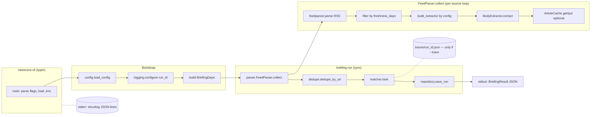

# NewsCore AI — Архитектура Step 0

> Архитектурный документ под Step 0 (CLI-ядро).
> Входы: `step0-spec.md`, `mvp-brief.md` (v3), `sources-research.md`, `roadmap.md`.
> Аудитория: архитектор, tech lead команды, разработчики Step 0.
> Дата: 2026-05-20.

---

## 0. Tl;dr

Step 0 — это CLI-утилита на Python 3.11+. Один процесс, один запуск, JSON в stdout. Один embedding-матчер (`intfloat/multilingual-e5-base`), 5 RSS-источников, источник-специфичные body-экстракторы (`rbc_native` без сети + `trafilatura` для остальных), in-memory корпус и опциональный файловый кэш статей. Никаких HTTP-сервисов, БД, очередей, фронта. Архитектура подготовлена к Step 1 (фоновый мониторинг) через тонкую границу `Repository`-интерфейса и формат trace, но без преждевременных абстракций.

---

## 1. Tech stack (ADR-стиль, компактно)

### ADR-01. Язык и runtime — Python 3.11+
- **Контекст.** ML-стек (sentence-transformers, transformers, torch) родной для Python. Команда умеет Python. Целевые ОС — macOS / Linux. Production-deploy в Step 0 не нужен.
- **Решение.** Python 3.11+ (минимум 3.11 ради нативного `tomllib`, более точных `TypeAlias`/`Self` и быстрее ~10% старта против 3.10).
- **Альтернативы.** Go (не родной для ML inference, придётся выносить матчер в subprocess); Node.js (нет вменяемого embedding-runtime для multilingual-e5).
- **Последствия.** Привязка к torch/CPU; cold start модели ~5–10 сек на M1; команда работает в одной экосистеме.

### ADR-02. Менеджер пакетов — `uv`
- **Контекст.** Нужно: воспроизводимая установка одной командой, lock-файл, быстрая инсталляция на разных машинах (включая ноут Димы).
- **Решение.** `uv` (Astral) с `pyproject.toml` + `uv.lock`. README предписывает `uv sync`.
- **Альтернативы.** `pip + requirements.txt` (нет полноценного lock); `poetry` (медленнее, тяжелее); `pdm` (нишевый).
- **Последствия.** Дима ставит `uv` (один curl). Резервный путь — `pip install -e .` тоже работает (`pyproject.toml` совместим). Lock воспроизводим.

### ADR-03. HTTP-клиент — `httpx` (sync API) с опцией async
- **Контекст.** Нужно скачивать HTML статей (для `trafilatura`) для 4 из 5 источников. На один прогон ~30×4 = 120 HTTP-запросов в худшем случае. Параллельный fetch — Could (см. MoSCoW).
- **Решение.** `httpx` в синхронном режиме (`httpx.Client`) с timeouts, retries (через `tenacity`) и кастомным `User-Agent`. Архитектура оставляет крючок для async-версии (`AsyncClient`) без переписывания доменного кода — точка входа в fetcher изолирована.
- **Альтернативы.** `requests` (нет async-пути на будущее, нет HTTP/2); `aiohttp` (избыточно для Step 0, async будет Could).
- **Последствия.** В Must — sync, простой код. Когда добавим `asyncio.gather` для параллельного fetch — меняем только `RssFetcher`/`BodyExtractor`, не пайплайн.

### ADR-04. RSS-парсинг — `feedparser`
- **Контекст.** 5 источников, 4 разных формата (RSS 2.0 / Atom варианты), CDATA-обёртки, namespace `rbc_news:full-text` у РБК. Свой XML-парсер = пустая трата времени.
- **Решение.** `feedparser` для парсинга. Namespace `rbc_news:` достаётся через `entry.get('rbc_news_full-text')` (feedparser нормализует префиксы).
- **Альтернативы.** `xml.etree.ElementTree` (низкоуровнево, придётся самим обрабатывать namespaces и CDATA); `lxml` (быстрее, но нет нормализации feed-форматов).
- **Последствия.** Зависимость на `feedparser` ~150 КБ, проверена временем. РБК-namespace работает «из коробки».

### ADR-05. Извлечение тела HTML — `trafilatura`
- **Контекст.** Коммерсантъ / Ведомости / Интерфакс / Forbes отдают в RSS только title + короткий description. Embedding-матчер по 200 символам — заведомо хуже, чем по полному телу.
- **Решение.** `trafilatura.extract(html, include_comments=False, favor_precision=True)`. Передаём фавор precision — лучше потерять часть текста, чем подцепить меню/футер. Известно, что у Ведомостей и Forbes часть статьи под пейволлом — фиксируем в `body_extracted` флаге.
- **Альтернативы.** `newspaper3k` (не поддерживается, баги на русском); `readability-lxml` (хуже precision); самописные CSS-селекторы под каждый источник (хрупко, дорого).
- **Последствия.** Trafilatura — стабильный пакет. На пейволльных статьях получаем огрызок; это — known limitation Step 0, см. spec edge case #9.

### ADR-06. Embedding runtime — `sentence-transformers`
- **Контекст.** Нужно: эмбеддинг короткого NL-запроса + эмбеддинги корпуса статей, cosine similarity, детерминированный inference на CPU.
- **Решение.** `sentence-transformers` (v3+). Один вызов `SentenceTransformer("intfloat/multilingual-e5-base").encode(...)`. Pooling, normalization, batch — внутри библиотеки.
- **Альтернативы.** Прямой `transformers` + ручной pooling (больше boilerplate, проще ошибиться в pooling-стратегии для e5); `txtai` / `chromadb` (даёт vector store, на Step 0 это overkill — нам нужен только argmax по 100–200 векторам); ONNX через `optimum` (быстрее inference, но усложняет setup для Димы).
- **Последствия.** Размер зависимостей: torch (~700 МБ) + transformers. Первое скачивание модели ~280 МБ — фиксируется в README как «cold start, ~3 минуты на средней сети». Кэш модели идёт в `~/.cache/huggingface`.

### ADR-07. Embedding-модель — `intfloat/multilingual-e5-base`
- **Контекст.** Зафиксировано в `mvp-brief.md`: нужен мультиязычный (русский + латиница в M&A-запросах), детерминированный, CPU-friendly, без API.
- **Решение.** `intfloat/multilingual-e5-base`. 278M параметров, 768-dim векторы, top-tier на MTEB для русского, требует префиксов: `query: ...` для запроса, `passage: ...` для документа.
- **Альтернативы.** `intfloat/multilingual-e5-large` (560M — в 2× тяжелее, выигрыш в качестве на нашем сценарии не оправдан до qual-теста); `cointegrated/rubert-tiny2` (быстрее, но хуже на NL-запросах); `paraphrase-multilingual-MiniLM-L12-v2` (старая, хуже на ru). Если на qual-тесте `base` не вытянет precision@10 ≥ 0.5 — это сигнал апгрейдиться до `large`, не до другой модели.
- **Последствия.** ВАЖНО: разработчики обязаны строго ставить префиксы `query: ` / `passage: `. Это — частая ошибка использования e5, поэтому инкапсулируется внутри `EmbeddingMatcher`, наружу не торчит.

### ADR-08. Формат конфига источников — YAML
- **Контекст.** Конфиг читается человеком (Дима + команда), редактируется руками, содержит вложенные структуры (per-source extractor config). 5–10 источников максимум.
- **Решение.** YAML (`PyYAML` через `yaml.safe_load`). Валидация через Pydantic v2.
- **Альтернативы.** TOML (родной `tomllib` в 3.11 — плюс; минус — вложенные таблицы громоздки, less человекочитаемы для списков объектов); JSON (нет комментариев — Дима не сможет оставить заметку «это резерв»); Python-конфиг (overkill, проблемы безопасности при загрузке).
- **Последствия.** Зависимость на `PyYAML`. Конфиг получается короткий и читаемый. Pydantic-схема даёт строгую валидацию и понятные ошибки.

### ADR-09. Логирование — `structlog`
- **Контекст.** Story 5 требует структурированные JSON-логи каждого шага. Trace-режим — отдельный JSON-файл. Нужно: процессоры для добавления `run_id` ко всем записям, понятный человекочитаемый dev-output, машинно-читаемый JSON-output.
- **Решение.** `structlog` поверх stdlib `logging`. Dev-формат — `ConsoleRenderer` в stderr, prod-формат — `JSONRenderer`. Управляется флагом `--log-format=console|json` (по умолчанию `console`).
- **Альтернативы.** Голый `logging` (придётся писать свой JSON-форматтер и контекст-процессор для `run_id`); `loguru` (проще, но менее гибок для контекстных процессоров); `python-json-logger` (даёт только формат, не контекст).
- **Последствия.** Один-разовая конфигурация при старте. Все модули делают `log = structlog.get_logger(__name__)` — единый стиль. К каждой записи автоматом подмешивается `run_id`.

### ADR-10. CLI-фреймворк — `typer`
- **Контекст.** Одна CLI-команда (`briefing`) с несколькими флагами (`--matcher`, `--top-n`, `--days`, `--trace`, `--log-format`, `--config`). Нужно: type hints на аргументах, help-сообщения, валидация enum-флагов.
- **Решение.** `typer`. Декоратор `@app.command()`, поддержка `Enum` для `--matcher`.
- **Альтернативы.** `click` (более низкоуровневый, больше boilerplate); `argparse` (нет автогенерации help из типов, ручная валидация); собственный парсер (мимо).
- **Последствия.** `typer` тянет `click` под капотом. ~200 КБ. Дает `--help` качества как у популярных CLI.

### ADR-11. Тесты — pytest + responses-mock
- **Контекст.** Story 3 требует graceful degradation на падении источника. Это тестируется только через mock сетевых вызовов. Embedding-модель в тестах поднимать дорого (cold start).
- **Решение.** `pytest` + `respx` (mock для `httpx`) + `pytest-cov`. Embedding-матчер в unit-тестах мокается на уровне интерфейса `Matcher`. В отдельной директории `tests/qualitative/` — eval-сценарий с реальной моделью и фиксированным кэшем фидов (запускается флагом `pytest -m qual`).
- **Альтернативы.** `unittest` (boilerplate); `responses` (только для `requests`, не для `httpx`); поднимать живую модель — медленно, флаки.
- **Последствия.** Тесты быстрые (<5 сек, без модели). Qual-eval — отдельный процесс, запускается осознанно.

---

## 2. Декомпозиция (модули)

Один пакет `newscore`, плоская структура. Модули — не сервисы, не bounded contexts «по-крупному»; это слои ответственности внутри одного процесса.

```
newscore.config       — загрузка/валидация sources.yaml + runtime settings
newscore.models       — доменные модели (RawArticle, EnrichedArticle, Match, ...)
newscore.sources      — абстракция Source + конкретные body-extractors
newscore.parser       — RSS-fetch, очистка тел, окно свежести
newscore.dedupe       — дедупликация по URL (+ опц. title+link hash)
newscore.matcher      — интерфейс Matcher + EmbeddingMatcher (+ BM25 в Should)
newscore.cache        — файловый кэш статей (опциональный)
newscore.repository   — тонкий in-memory repo (контракт под SQLite Step 1)
newscore.briefing     — оркестратор пайплайна
newscore.cli          — typer-приложение, entry point
newscore.logging      — конфигурация structlog + trace-writer
```

### 2.1 `newscore.config`
**Что делает.** Загружает `sources.yaml`, валидирует через Pydantic, возвращает `AppConfig`. Загружает `.env` через `python-dotenv`.
**Публично:**
```python
class SourceConfig(BaseModel):
    name: str
    rss_url: HttpUrl
    body_extractor: Literal["rbc_native", "trafilatura"]
    optional: bool = False  # Forbes/Ведомости можно пометить — не валит partial

class AppConfig(BaseModel):
    sources: list[SourceConfig]
    freshness_days: int = 7
    top_n: int = 10
    user_agent: str = "NewsCoreAI/0.1 (+briefing)"
    request_timeout_s: float = 15.0
    cache_dir: Path | None = None

def load_config(path: Path) -> AppConfig: ...
```
**Не делает.** Не загружает источники по сети, не строит pipeline, не знает про матчеры.

### 2.2 `newscore.models`
**Что делает.** Pure data — Pydantic-модели всего домена. Никакой логики кроме сериализации.
**Публично:** `RawArticle`, `EnrichedArticle`, `Match`, `BriefingResult`, `RunMeta` (см. секцию 3).
**Не делает.** Ничего не парсит, не fetches, не считает scores.

### 2.3 `newscore.sources`
**Что делает.** Определяет интерфейс `BodyExtractor` и его реализации.
**Публично:**
```python
class BodyExtractor(Protocol):
    name: str  # "rbc_native" | "trafilatura"
    def extract(self, raw: RawArticle, http: httpx.Client) -> str | None: ...

class RbcNativeExtractor:
    """Берёт <rbc_news:full-text> из RSS, без сетевых вызовов."""

class TrafilaturaExtractor:
    """HTTP GET по URL → trafilatura.extract."""

def build_extractor(name: str) -> BodyExtractor: ...
```
**Не делает.** Сам RSS не парсит — получает уже `RawArticle` от `parser`. Не дедуплицирует.

### 2.4 `newscore.parser`
**Что делает.** На вход — `list[SourceConfig]`, на выход — `list[EnrichedArticle]`. Внутри: fetch RSS (feedparser), фильтр по freshness, выбор экстрактора по конфигу, обогащение телом, сбор ошибок по источникам.
**Публично:**
```python
@dataclass
class ParseReport:
    articles: list[EnrichedArticle]
    failed_sources: list[FailedSource]  # name + reason
    partial: bool  # len(failed_sources) > 0 and len(failed_sources) < len(sources)

class FeedParser:
    def __init__(self, cfg: AppConfig, http: httpx.Client, cache: ArticleCache | None): ...
    def collect(self, sources: list[SourceConfig], freshness_days: int) -> ParseReport: ...
```
**Не делает.** Не матчит. Не дедуплицирует. Не строит trace (только пишет в логи; trace собирает оркестратор).

### 2.5 `newscore.dedupe`
**Что делает.** Удаляет дубли по URL. Опционально (Should) — поверх по hash(title.lower().strip() + canonical(url)).
**Публично:**
```python
def dedupe_by_url(articles: list[EnrichedArticle]) -> tuple[list[EnrichedArticle], int]:
    """returns (unique_articles, removed_count)"""

def dedupe_by_title_url_hash(articles: list[EnrichedArticle]) -> tuple[list[EnrichedArticle], int]: ...
```
**Не делает.** Семантическая дедупликация (одно событие из разных источников) — out of scope, Step 3.

### 2.6 `newscore.matcher`
**Что делает.** Принимает query + корпус статей, возвращает топ-N матчей.
**Публично:**
```python
class Matcher(Protocol):
    name: str
    version: str
    def rank(self, query: str, articles: list[EnrichedArticle], top_n: int) -> list[Match]: ...

class EmbeddingMatcher:
    """sentence-transformers; intfloat/multilingual-e5-base; cosine; e5-префиксы внутри."""
    def __init__(self, model_name: str = "intfloat/multilingual-e5-base", min_score: float = 0.0): ...

class Bm25Matcher:
    """rank_bm25; токенизатор — простой нижний регистр + split по \W+; русские стопслова."""
```
**Не делает.** Не дедуплицирует, не валидирует запрос (пустой/токсичный — это слой выше), не лезет за телом — работает с тем, что дали.

### 2.7 `newscore.cache`
**Что делает.** Файловый кэш скачанных HTML/тел. Опциональный (Should). Ключ — sha256(url). Значение — JSON `{url, fetched_at, html_or_body, status}`. TTL по умолчанию 6 часов.
**Публично:**
```python
class ArticleCache(Protocol):
    def get(self, url: str) -> CachedArticle | None: ...
    def put(self, url: str, payload: CachedArticle) -> None: ...

class NullCache:    # no-op, дефолт
class FileCache:    # пишет в cache_dir
```
**Не делает.** Не кэширует RSS-фиды целиком (Step 1, когда появится ETag/Last-Modified). Не кэширует embeddings (Step 1+).

### 2.8 `newscore.repository`
**Что делает.** Тонкий интерфейс для сохранения результатов одного прогона. В Step 0 — единственная in-memory реализация, возвращающая ровно тот объект, который пришёл. Существует **исключительно** ради контракта под Step 1.
**Публично:**
```python
class BriefingRepository(Protocol):
    def save_run(self, result: BriefingResult) -> None: ...
    def latest_for_query(self, query: str) -> BriefingResult | None: ...  # Step 1+

class InMemoryRepository: ...   # дефолт; Step 0 живёт на нём
```
**Не делает.** Никакой персистентности на Step 0. Это голый интерфейс — затраты копеечные, выигрыш — нулевая миграция при добавлении SQLite в Step 1.

### 2.9 `newscore.briefing`
**Что делает.** Оркестратор. Принимает query + AppConfig + флаги, дирижирует `FeedParser → dedupe → Matcher`, собирает `BriefingResult`, инициирует trace.
**Публично:**
```python
@dataclass
class BriefingRequest:
    query: str
    top_n: int
    freshness_days: int
    matcher_name: Literal["embedding", "bm25"]
    trace: bool

class BriefingOrchestrator:
    def __init__(self, cfg: AppConfig, deps: BriefingDeps): ...
    def run(self, req: BriefingRequest) -> BriefingResult: ...

class BriefingDeps:  # явный DI-контейнер, ручной, без фреймворка
    parser: FeedParser
    matcher_factory: Callable[[str], Matcher]
    repository: BriefingRepository
    trace_writer: TraceWriter | None
```
**Не делает.** Не парсит CLI-флаги (это `cli`), не загружает конфиг (это `config`), не лезет в логирование сверх вызова `log.info(...)`.

### 2.10 `newscore.cli`
**Что делает.** `typer`-приложение. Парсит флаги, валидирует `query`, конструирует `AppConfig` + `BriefingDeps`, вызывает оркестратор, печатает JSON в stdout, exit code.
**Публично:** `main()` — entry point. Внутри одна команда `briefing`.
**Не делает.** Никакой бизнес-логики. Никаких сетевых вызовов. Преобразование между CLI и доменом — только.

### 2.11 `newscore.logging`
**Что делает.** Один раз настраивает `structlog`. Подмешивает `run_id` контекст. Пишет в stderr. По флагу `--trace` — параллельно собирает trace-объект и сохраняет в `traces/<run_id>.json`.
**Публично:**
```python
def configure(level: str, fmt: Literal["console", "json"], run_id: str) -> None: ...

class TraceWriter:
    def __init__(self, run_id: str, dir: Path): ...
    def step(self, name: str, **kwargs) -> None: ...
    def finalize(self, result: BriefingResult) -> Path: ...
```
**Не делает.** Не дублирует логи в N мест. Не имеет уровня DEBUG для модели/torch (это отдельный logger handler, выключенный по умолчанию).

---

## 3. Контракты (Python-сигнатуры)

### 3.1 Доменные модели

```python
# newscore/models.py
from datetime import datetime
from typing import Literal
from pydantic import BaseModel, HttpUrl, Field

class RawArticle(BaseModel):
    """Сырая запись из RSS-фида до обогащения телом."""
    source: str
    title: str
    url: HttpUrl
    published_at: datetime
    snippet: str = ""              # description из RSS
    rss_full_text: str | None = None  # только если источник отдал полный текст (РБК)

class EnrichedArticle(BaseModel):
    """RawArticle + извлечённое тело."""
    source: str
    title: str
    url: HttpUrl
    published_at: datetime
    snippet: str
    body: str | None
    body_extracted: bool           # True если экстрактор вернул не-None body
    body_extractor: str            # rbc_native | trafilatura

class Match(BaseModel):
    article: EnrichedArticle
    score: float                   # 0..1 для embedding (cosine), любой float для bm25

class FailedSource(BaseModel):
    name: str
    reason: str                    # "http_5xx" | "timeout" | "xml_invalid" | "no_items"
    error: str                     # raw exception text, обрезанный до 500 chars

class RunMeta(BaseModel):
    run_id: str                    # uuid4 hex
    started_at: datetime
    finished_at: datetime
    matcher_name: str
    matcher_version: str
    sources_snapshot_at: datetime  # min(published_at) корпуса
    freshness_days: int
    partial: bool
    failed_sources: list[FailedSource]
    reason: Literal["ok", "no_relevant_matches", "all_sources_failed"] | None = None

class BriefingResult(BaseModel):
    """Финальный объект, сериализуется в stdout JSON."""
    query: str
    items: list[Match]
    meta: RunMeta
```

### 3.2 Интерфейсы расширения

```python
# newscore/sources.py
from typing import Protocol
import httpx

class BodyExtractor(Protocol):
    name: str
    def extract(self, raw: RawArticle, http: httpx.Client) -> str | None: ...

# newscore/matcher.py
class Matcher(Protocol):
    name: str
    version: str
    def rank(
        self,
        query: str,
        articles: list[EnrichedArticle],
        top_n: int,
    ) -> list[Match]: ...

# newscore/cache.py
class ArticleCache(Protocol):
    def get(self, url: str) -> "CachedArticle | None": ...
    def put(self, url: str, payload: "CachedArticle") -> None: ...
```

### 3.3 Подключаемость extractor'а из конфига

```yaml
# configs/sources.yaml — фрагмент
sources:
  - name: rbc_main
    rss_url: https://rssexport.rbc.ru/rbcnews/news/30/full.rss
    body_extractor: rbc_native     # ключ в реестре экстракторов
  - name: kommersant
    rss_url: https://www.kommersant.ru/RSS/news.xml
    body_extractor: trafilatura
```

```python
# newscore/sources.py
_REGISTRY: dict[str, type[BodyExtractor]] = {
    "rbc_native": RbcNativeExtractor,
    "trafilatura": TrafilaturaExtractor,
}

def build_extractor(name: str) -> BodyExtractor:
    cls = _REGISTRY.get(name)
    if not cls:
        raise ValueError(f"unknown body_extractor: {name}")
    return cls()
```

### 3.4 Формат output JSON (stdout)

```json
{
  "query": "курс валют",
  "items": [
    {
      "article": {
        "source": "rbc_main",
        "title": "ЦБ установил курс доллара на завтра",
        "url": "https://www.rbc.ru/.../...",
        "published_at": "2026-05-19T14:32:00+03:00",
        "snippet": "...",
        "body": "...",
        "body_extracted": true,
        "body_extractor": "rbc_native"
      },
      "score": 0.871
    }
  ],
  "meta": {
    "run_id": "a1b2c3...",
    "started_at": "2026-05-20T10:00:00+03:00",
    "finished_at": "2026-05-20T10:00:42+03:00",
    "matcher_name": "embedding",
    "matcher_version": "intfloat/multilingual-e5-base@1.0",
    "sources_snapshot_at": "2026-05-13T08:00:00+03:00",
    "freshness_days": 7,
    "partial": false,
    "failed_sources": [],
    "reason": "ok"
  }
}
```

Контракты в edge cases:
- 0 релевантных → `items: []`, `meta.reason: "no_relevant_matches"`, exit 0.
- Все источники упали → `items: []`, `meta.reason: "all_sources_failed"`, `partial: true`, exit 1.
- Часть источников упала → `items` нормальные, `partial: true`, exit 0.

### 3.5 Формат trace JSON (`traces/<run_id>.json`)

```json
{
  "run_id": "a1b2c3...",
  "query": "курс валют",
  "config": { "matcher": "embedding", "top_n": 10, "freshness_days": 7 },
  "steps": [
    {
      "name": "fetch_rss",
      "started_at": "...", "duration_ms": 1342,
      "per_source": [
        {"source": "rbc_main", "status": "ok", "items_in_feed": 30, "items_after_freshness": 28},
        {"source": "kommersant", "status": "ok", "items_in_feed": 423, "items_after_freshness": 412}
      ]
    },
    {
      "name": "extract_bodies",
      "started_at": "...", "duration_ms": 18540,
      "extractor_breakdown": {
        "rbc_native": {"attempts": 28, "succeeded": 28, "avg_ms": 0.2},
        "trafilatura": {"attempts": 187, "succeeded": 172, "avg_ms": 95.0, "paywall_or_empty": 15}
      }
    },
    {
      "name": "dedupe_url",
      "items_in": 200, "items_out": 196, "removed": 4
    },
    {
      "name": "match",
      "matcher": "embedding",
      "items_in": 196, "items_out": 10,
      "top_scores": [0.871, 0.842, 0.819, "..."],
      "dropped_examples": [
        {"url": "...", "title": "...", "score": 0.213, "reason": "below_top_n"}
      ]
    }
  ],
  "result_meta": { ... }
}
```

В Step 0 trace — однократный файл. В Step 1+ из него вырастает audit log на каждый прогон темы.

---

## 4. Pipeline (компонентная диаграмма)



**Где синхронно / асинхронно:**
- Весь пайплайн в Step 0 — **синхронный**. Один process, один thread.
- Внутри `FeedParser.collect` — по источникам последовательно (RSS-fetch + body-extraction). Это укладывается в потолок 2 минуты на 5 источников × ~30 статей в окне.
- Параллельный fetch (`asyncio.gather`) помечен как **Could** (MoSCoW). Если эталонный прогон вышел за 60–90 секунд — включаем; иначе не трогаем. Архитектурный задел: `FeedParser` — единственная точка изменения; контракт `collect()` остаётся sync, внутри будет `asyncio.run(...)`.

---

## 5. Конфигурация

### 5.1 `configs/sources.yaml`

```yaml
# NewsCore AI — sources for Step 0
# 5 источников зафиксированы в sources-research.md (2026-05-20).
# Все проверены на доступность из РФ без VPN.

freshness_days: 7
top_n: 10
user_agent: "NewsCoreAI/0.1 (+briefing; contact: dev@fontankadigital.com)"
request_timeout_s: 15.0

sources:
  - name: rbc_main
    rss_url: https://rssexport.rbc.ru/rbcnews/news/30/full.rss
    body_extractor: rbc_native        # полный текст в RSS, сеть не нужна

  - name: kommersant
    rss_url: https://www.kommersant.ru/RSS/news.xml
    body_extractor: trafilatura

  - name: vedomosti_business
    rss_url: https://www.vedomosti.ru/rss/rubric/business
    body_extractor: trafilatura
    optional: true                    # пейволл: body может быть огрызком

  - name: interfax
    rss_url: https://www.interfax.ru/rss.asp
    body_extractor: trafilatura

  - name: forbes_ru
    rss_url: https://www.forbes.ru/newrss.xml
    body_extractor: trafilatura
    optional: true                    # пейволл: body может быть огрызком
```

Поле `optional: true` влияет только на тон отчётности: упавший optional-источник пишется в `failed_sources`, но не зажигает `partial: true`. Это решение пограничное — оставляю на ревью PM-а; по умолчанию интерпретируем optional == «не упрекаем за пейволл-огрызки».

### 5.2 `.env.example`

```dotenv
# NewsCore AI — runtime config (optional overrides)

# Уровень логов: DEBUG | INFO | WARNING | ERROR
LOG_LEVEL=INFO

# Формат логов: console (dev) | json
LOG_FORMAT=console

# Директория файлового кэша статей. Оставить пустым = NullCache (без кэша).
CACHE_DIR=./.cache/articles

# Куда писать trace-файлы при --trace
TRACE_DIR=./traces

# Путь к конфигу источников. Можно переопределить флагом --config.
SOURCES_CONFIG=./configs/sources.yaml

# HuggingFace cache (где лежит скачанная embedding-модель)
# HF_HOME=~/.cache/huggingface
```

LLM-ключей в `.env.example` **нет**. На Step 0 ни один обязательный матчер не ходит во внешние API.

---

## 6. Layout репозитория

### 6.1 Решение по существующему scaffold'у

В репозитории есть `backend/`, `frontend/`, `infra/` от первичного scaffold'а. Для Step 0 фронт и инфра не нужны, остаётся вопрос — переиспользовать `backend/` или начать с чистого корня.

**Решение.** Поместить весь код Step 0 в `backend/`, переименовав его внутреннюю структуру под `src/newscore/`. `frontend/` и `infra/` сохраняются как пустые директории с README-заглушками («появится в Step 5» / «появится в Step 5»). Не удаляем — чтобы потом не делать `git mv` через всю историю.

Обоснование:
- Уважение к существующему монорепо-замыслу (`backend / frontend / infra` — стандарт, Дима так задумал).
- Не плодим путаницы «где Step 0 живёт».
- В Step 2 (доставка) рядом с `backend/newscore/` появится `backend/api/` (HTTP-фасад), а `frontend/` оживёт в Step 5. Структура для этого уже готова.

### 6.2 Дерево

```
newscore-ai/
├── README.md
├── pyproject.toml
├── uv.lock
├── .env.example
├── configs/
│   └── sources.yaml
├── backend/
│   ├── pyproject.toml          # workspace-член (uv workspaces)
│   ├── src/
│   │   └── newscore/
│   │       ├── __init__.py
│   │       ├── __main__.py     # делегирует в cli.main
│   │       ├── cli.py
│   │       ├── briefing.py
│   │       ├── config.py
│   │       ├── models.py
│   │       ├── sources.py
│   │       ├── parser.py
│   │       ├── dedupe.py
│   │       ├── matcher.py
│   │       ├── cache.py
│   │       ├── repository.py
│   │       └── logging.py
│   └── tests/
│       ├── unit/
│       │   ├── test_dedupe.py
│       │   ├── test_parser_freshness.py
│       │   ├── test_rbc_extractor.py
│       │   ├── test_trafilatura_extractor.py
│       │   ├── test_embedding_matcher.py
│       │   ├── test_bm25_matcher.py
│       │   └── test_config_validation.py
│       ├── integration/
│       │   ├── test_end_to_end_mock_sources.py
│       │   └── fixtures/
│       │       ├── rbc_full.rss
│       │       ├── kommersant.xml
│       │       ├── interfax.xml
│       │       ├── article_kommersant_paywall.html
│       │       └── ...
│       └── qualitative/
│           ├── eval.py
│           ├── queries.yaml
│           ├── expected/
│           │   ├── q01_kurs_valut.yaml
│           │   ├── q02_stavka_cb.yaml
│           │   └── ...
│           └── reports/
│               └── .gitkeep
├── frontend/                   # пусто, заглушка для Step 5
│   └── README.md
├── infra/                      # пусто, заглушка для Step 5
│   └── README.md
└── docs/                       # KB
```

CLI запускается так:
```
uv run python -m newscore "курс валют"
# или
uv run newscore "курс валют"     # entry point из pyproject.toml [project.scripts]
```

---

## 7. Pipeline качества (тесты)

### 7.1 Unit-тесты

| Модуль | Что проверяем |
|---|---|
| `dedupe` | URL-канонизация (trailing slash, query-stripping), сохранение порядка, удаление точных дублей, hash-дедуп |
| `parser` (freshness) | Граница `published_at` строго / не строго меньше cutoff, TZ-aware сравнение |
| `RbcNativeExtractor` | Реальный fixture RSS РБК → body не пустое, без HTML-тегов |
| `TrafilaturaExtractor` | Fixture HTML Коммерсанта → body содержит первый абзац статьи; пейволл-fixture → возвращает None или огрызок, флаг `body_extracted=False` |
| `EmbeddingMatcher` | На синтетическом корпусе из 5 статей с известным similarity-порядком → ранжирование стабильно, e5-префиксы применены (проверяется через mock encoder) |
| `Bm25Matcher` | Корпус из 3 статей с одинаковым ключевым словом в title → возвращает все 3 в правильном порядке |
| `config` | Pydantic-валидация: невалидный URL, неизвестный extractor, пустой `sources` → понятные ошибки |
| `logging` | `run_id` инжектится во все записи; trace-файл — валидный JSON |

**Что мокаем:**
- `httpx.Client` — через `respx` (RSS-фиды и article HTML).
- `SentenceTransformer` — только в unit-тестах, через factory-функцию `matcher_factory`. В тесте `test_embedding_matcher` подменяется на fake-encoder, возвращающий векторы по словарю.
- `feedparser.parse` — не мокаем, кормим реальным XML из `tests/integration/fixtures/`.

### 7.2 Integration

`tests/integration/test_end_to_end_mock_sources.py`:
- Поднимает `BriefingOrchestrator` с настоящими модулями, кроме `httpx.Client` (мок через `respx` отдаёт фикстуры).
- Для матчера — либо мок (быстрый), либо реальная модель (помечается `@pytest.mark.slow`, не запускается по умолчанию).
- Проверяет: end-to-end happy path, end-to-end с упавшим источником (`partial: true`), end-to-end с пустым корпусом (`reason: no_relevant_matches`).

### 7.3 Qualitative-тест (Story 6)

`tests/qualitative/` — отдельная директория. **Не запускается** в обычном `pytest` (помечена маркером `qual`, конфиг в `pyproject.toml`: `markers = ["qual: qualitative evaluation, slow"]`).

Структура:
```
tests/qualitative/
├── eval.py                          # точка входа
├── queries.yaml                     # 7 эталонных запросов
├── expected/
│   ├── q01_kurs_valut.yaml          # список URL-ов / title-ов, которые ожидаем в топ-10
│   ├── q02_stavka_cb.yaml
│   └── ...
├── snapshots/                       # закэшированные RSS+статьи на момент создания эталонов
│   ├── 2026-05-20T08-00-00/
│   │   ├── rbc_main.rss
│   │   ├── kommersant.xml
│   │   └── ...
└── reports/                         # output прогонов
    └── 2026-05-20T10-30-00.md
```

`queries.yaml`:
```yaml
queries:
  - id: q01
    text: "курс валют"
    notes: "короткий, общий"
  - id: q02
    text: "ставка ЦБ"
  - id: q03
    text: "санкции против РФ"
  - id: q04
    text: "IT-импортозамещение"
  - id: q05
    text: "сделки M&A в финтехе"
  - id: q06
    text: "новости про автоваз"
    notes: "узкая, проверка против false positives"
  - id: q07
    text: "дай мне всё что было за неделю про сделки M&A в финтехе с участием Сбера и ВТБ"
    notes: "длинный сложный запрос"
```

`expected/q01_kurs_valut.yaml`:
```yaml
query_id: q01
prepared_by: "<имя>"
prepared_at: "2026-05-20"
corpus_snapshot: "2026-05-20T08-00-00"
expected_top10_urls:
  - https://www.rbc.ru/finances/.../...
  - https://www.kommersant.ru/doc/...
  # ...
notes: "минимум 5 из этих 10 должны попасть в top-10 матчера для precision@10 ≥ 0.5"
```

`eval.py`:
- Запускает `BriefingOrchestrator` на каждом запросе.
- Фиксирует `BriefingResult` в `reports/<timestamp>/<query_id>.json`.
- Сравнивает с `expected/<query_id>.yaml`, считает precision@10 = `|expected ∩ returned_top_10| / 10`.
- Печатает markdown-таблицу с `query | expected_count | returned_count | overlap | precision@10 | qualitative_verdict (manual)`.
- DoD: ≥ 4 из 7 запросов имеют precision@10 ≥ 0.5.

Запуск: `uv run python -m tests.qualitative.eval --corpus snapshots/2026-05-20T08-00-00`.

---

## 8. Evolution path (что готовит почву для Step 1)

Архитектура **не делает** ни одну из вещей ниже сейчас, но **не закрывает к ним дверь**:

| Step 1 фича | Подготовлено в Step 0 |
|---|---|
| **SQLite persistence** | `BriefingRepository` — Protocol с `InMemoryRepository`. Step 1 добавит `SqliteRepository`, оркестратор не меняется. |
| **Концепт «темы» (= сохранённый запрос с расписанием)** | `BriefingResult` уже содержит `query` и `run_id`. Тема в Step 1 = `{theme_id, query, created_at, last_run_id}`. Никаких столкновений с текущим контрактом. |
| **Дельта «новое со вчера»** | Trace-файл уже содержит `top_scores` и список URL'ов в `items`. Step 1 поверх — диф двух `BriefingResult` по `(article.url)`. |
| **Планировщик (APScheduler / cron)** | Оркестратор не знает, кто его вызвал — CLI или scheduler. `BriefingOrchestrator.run(req)` — чистая функция от входов. |
| **Кэш embeddings** | `EmbeddingMatcher` сейчас считает векторы корпуса на каждом прогоне. Когда добавится тема — между прогонами 80% URL'ов те же; вынесем `EmbeddingCache` рядом с `ArticleCache`. Контракт `Matcher.rank` не меняется. |
| **Полноценный audit log** | Trace JSON растёт «вширь», структура шагов уже отделена от `BriefingResult`. |
| **Параллельный fetch RSS** | `FeedParser.collect` — единственная точка, `httpx.Client → httpx.AsyncClient`, наружный контракт sync (`asyncio.run` внутри). |
| **HTTP API (Step 2)** | `BriefingOrchestrator` уже отделён от `cli`. В Step 2 рядом с `cli.py` появится `api/main.py` (FastAPI) — оркестратор переиспользуется 1:1. |

Что **не делаем** заранее:
- Не вводим Event Bus / Outbox / Saga.
- Не вводим vector store (chromadb / qdrant) — на 200 векторах numpy достаточно.
- Не вводим Pydantic Settings management через классы — `.env` + явная `AppConfig` хватает.
- Не вводим DI-фреймворк (`dependency-injector`, etc.) — ручной `BriefingDeps`-dataclass хватает на 11 модулей.

---

## 9. Что НЕ строим в Step 0 (явно отбросили)

| Соблазн | Почему отбросили |
|---|---|
| **FastAPI / HTTP-сервис** | CLI-only зафиксировано в spec (Story 1, scope decision). HTTP появляется в Step 2 (доставка), не раньше. |
| **PostgreSQL** | Persistent state нужен только в Step 1+. SQLite уже там — overkill. Step 0 живёт на in-memory. |
| **SQLite** | Step 0 — один прогон, один результат, никакой персистентности между прогонами. Файловый кэш статей — да. БД — нет. |
| **Docker (prod) / docker-compose** | Зависимости ставятся через `uv sync` на macOS/Linux. Docker — Step 5 (деплой). |
| **OpenTelemetry / Prometheus / Grafana** | Структурированных JSON-логов в stderr и trace-файла на один прогон достаточно. Distributed tracing нечего трассировать — у нас один процесс. |
| **Celery / RQ / APScheduler** | Нет фоновых задач. Планировщик — Step 1 (фоновый мониторинг тем). |
| **Kubernetes / Helm / Terraform** | Запуск локально на ноуте. Step 5. |
| **Vector store (Chroma / Qdrant)** | 200 векторов × 768-dim = 0.6 МБ. numpy + `argpartition` решает за миллисекунды. Vector store оправдан от ~10к векторов. |
| **LLM-провайдер (OpenAI / Anthropic / YandexGPT)** | Embedding-матчер локальный. LLM-judge в Could; включается, если qual-тест провалил порог. |
| **Authentication / RBAC / multi-tenant** | Нет пользователей в Step 0. Step 5. |
| **Rate limiting / API gateway** | Нет API. Step 5. |
| **CI/CD (GitHub Actions)** | Можно опционально (`agent-ci` локально), но не блокирует DoD. Конфиг workflow добавляется одним PR, когда дойдём до Step 2. |
| **Полноценные миграции (Alembic)** | Нет БД. |
| **Распределённый кэш (Redis)** | Один процесс. Файловый кэш на диске достаточен. |

---

## 10. Risk register

| ID | Риск | Likelihood | Impact | Mitigation |
|---|---|---|---|---|
| R1 | Cold start embedding-модели (~280 МБ скачка + ~5–10 сек загрузка) портит первый прогон у Димы | High | Med | README прописывает «первый запуск ~3 минуты». В `cli.briefing` отдельный этап `warmup`, лог `embedding_model_loaded duration_ms=…`. |
| R2 | Ведомости/Forbes пейволл → пустые body → embedding-матчер хуже на этих источниках | High | Med | Помечаем `optional: true`. На пейволл-статьях работаем по `title + snippet`. Логируем `body_extracted=false`. Не зажигаем partial. |
| R3 | Параллельный fetch не нужен в Must, но без него прогон 5×30 статей × 100мс trafilatura = ~15 сек только на body. Сложение по всем источникам может превысить 60 сек | Med | Med | Замеряем на первом прогоне. Если >60 сек — включаем asyncio (Could). Архитектурно готово (см. Evolution path). |
| R4 | E5-префиксы (`query:` / `passage:`) забыты разработчиком при использовании матчера → ранжирование рандомное | Med | High | Префиксы запекаются внутрь `EmbeddingMatcher.rank`, наружу не торчат. Unit-тест проверяет наличие префиксов в вызове encoder. |
| R5 | URL-дедупликация не ловит «одну новость на 5 источниках» | Certain | Low (известный limit) | Явно зафиксировано как known limitation в README. Семантическая дедупликация — Step 3. |
| R6 | Forbes/Ведомости могут поменять структуру HTML, `trafilatura` сломается частично | Low | Low | `body_extracted=false` фиксируется, статья остаётся в корпусе с title+snippet. Не блокер. |
| R7 | `feedparser` не справится с экзотическими CDATA в RSS | Low | Low | Fixtures из реальных фидов — в integration-тестах. Сломается — увидим до прогона у Димы. |
| R8 | Эталонные множества (Story 6) не подготовлены до прогона | Med | High (DoD не закрывается) | Не задача архитектора, но фиксируем в Open Questions. Назначается ответственный (Open Q №6). |

---

## 11. Open questions (для PM / заказчика)

1. **Семантика `optional: true` у источника.** Текущее решение: упавший optional-источник пишется в `failed_sources`, но `partial: false`. Альтернатива: всё одинаково, разница только в weight на etalons. Кто решает?
2. **Окно свежести по умолчанию — 7 дней.** Spec фиксирует, но в Story 6 длинный запрос про M&A может потребовать большего окна. Допустимо ли в README писать «для широких запросов — `--days 14`»?
3. **Trace в stdout vs файл.** Текущее решение: stdout = только `BriefingResult` JSON; trace = отдельный файл. Альтернатива: при `--trace --stdout` trace инлайнится в `meta.trace`. Полезно ли это Диме?
4. **Кто из команды владеет `tests/qualitative/expected/`.** Не блокирует архитектора, блокирует Story 6.

---

## 12. Updates v2 (2026-05-20) — Async fetch

После замеров sync-версии (BM25 138s / embedding 236s — оба превысили потолок 2 мин из NFR) параллельный fetch переведён из **Could** в **Must**. Внешние контракты не менялись.

**Замеры на 5 живых RSS:**

| Матчер | Sync | Async | Speedup |
|---|---|---|---|
| BM25 | 138s | **22s** | 6.3× |
| Embedding (e5-base) | 236s | **36s** | 6.5× |

### ADR-12. Hybrid Protocol: sync `BodyExtractor` + async `AsyncBodyExtractor`

- **Контекст.** Sync `BodyExtractor` уже используется в тестах. Полный переход на async ломает тесты + потребовал бы `pytest-asyncio`.
- **Решение.** Сохраняем sync. Добавляем параллельный `AsyncBodyExtractor`. Каждый extractor реализует оба интерфейса.
- **Альтернативы.** Только async (ломает тесты); только sync + threads (overhead, нет cancellation).
- **Последствия.** +~15 строк в каждом extractor. Test infrastructure не меняется.

### ADR-13. Граница async внутри `FeedParser.collect`

- **Контекст.** Контракт `collect(...) -> ParseReport` — sync. Внешние слои (CLI, orchestrator) не должны меняться.
- **Решение.** `FeedParser.collect` остаётся sync, внутри `asyncio.run(self._acollect(...))`. Один event loop на прогон.
- **Альтернативы.** Async всю цепочку (ломает orchestrator/CLI); `anyio` (лишняя dep).
- **Последствия.** +~5 мс на event loop setup, негусто для CLI. Не подходит для FastAPI handler (Step 2) — там переключим контракт на async.

### ADR-14. Двойной лимит concurrency: httpx Limits + per-source Semaphore

- **Контекст.** На Kommersant ~30 фрешных статей. Без лимита — thundering herd, 429/IP-block.
- **Решение.** `httpx.Limits(max_connections=N_total, max_keepalive_connections=N_total)` + per-source `asyncio.Semaphore(N_per_host)`. Дефолты: 20 / 5.
- **Альтернативы.** Только глобальный semaphore (один медленный хост заберёт все слоты); только httpx Limits (неявное поведение).
- **Последствия.** ~10 строк bookkeeping. Параметризуется через `AppConfig.fetch_concurrency_total / fetch_concurrency_per_host`.

### ADR-15. `tenacity.AsyncRetrying` на transient HTTP

- **Контекст.** `tenacity` уже в deps. На параллельной нагрузке транзиенты более вероятны.
- **Решение.** Обернуть RSS-fetch (не статьи) в `AsyncRetrying` со `stop_after_attempt` + `wait_exponential_jitter`. Retry on: timeout, `ConnectError`, `RemoteProtocolError`, 5xx. **Не retry on 4xx** (включая 429 — это «прекрати», не транзиент).
- **Альтернативы.** Свой цикл (boilerplate); retry статей (удваивает нагрузку — не оправдано для Step 0).
- **Последствия.** На 1 transient — ~0.5–4 сек overhead. На 4xx — fail fast.

### ADR-16. AsyncClient lifecycle: `async with` внутри `_acollect`

- **Контекст.** `AsyncClient` — async context manager, требует явного закрытия.
- **Решение.** `async with httpx.AsyncClient(limits=..., headers=..., timeout=...)` внутри `_acollect`. Закрытие гарантировано на любом exit (включая `CancelledError` на Ctrl+C).
- **Альтернативы.** Module-level singleton (anti-pattern, проблемы в тестах); создание в CLI (ломает контракт).
- **Последствия.** Sync `httpx.Client` из CLI больше не используется в hot-path. Аргумент `http=None` в `FeedParser.__init__` оставлен опциональным для обратной совместимости тестов.

### ADR-17. Graceful degradation через `asyncio.gather(return_exceptions=True)`

- **Контекст.** В sync-версии `for src in sources: try/except` — падение источника не валит остальные.
- **Решение.** Два уровня `gather(*tasks, return_exceptions=True)`: на источниках и на статьях внутри источника. Падение источника → `FailedSource`. Падение статьи → `body=None`, статья остаётся в корпусе.
- **Альтернативы.** `TaskGroup` (отменяет всех при первом exception); `wait(FIRST_EXCEPTION)` (не подходит).
- **Последствия.** Совпадает с поведением sync-версии. `CancelledError` пробрасывается через gather и unwinds стек корректно.

### R3 (Risk Register) — статус: ЗАКРЫТ

Изначально: «sequential fetch может превысить 60 сек». После замеров и реализации — async fetch в Must, измеренный потолок 36 сек (embedding) и 22 сек (BM25) — оба в пределах NFR.

---

## Next Steps

- **RECOMMEND: dba** — не требуется на Step 0. Возвращаемся к нему на Step 1, когда вводим SQLite-репозиторий и схему «темы».
- **RECOMMEND: security** — не требуется на Step 0 (нет секретов, нет пользователей, нет HTTP).
- **RECOMMEND: devops** — не требуется на Step 0. README покрывает «git clone → uv sync → запуск». CI можно добавить опционально (`agent-ci` локально), но не блокирует DoD.
- **ADRs WRITTEN:** 17 (ADR-01..11 в секции 1 — базовый стек; ADR-12..17 в секции 12 — async fetch).
- **OPEN QUESTIONS:** 4 (см. секцию 11). Все — не блокеры архитектуры, но требуют ответа до старта Story 6.
